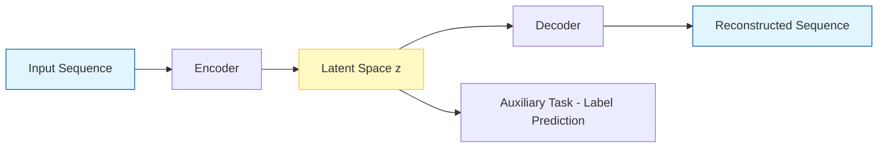
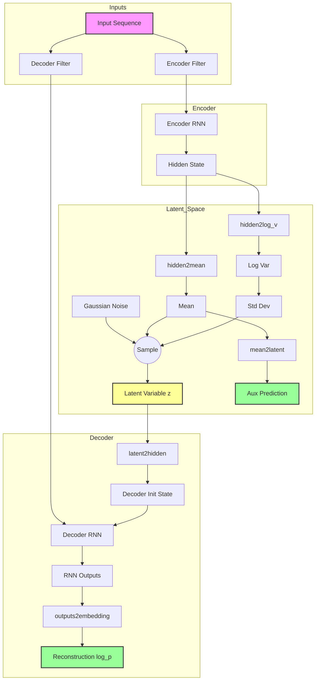
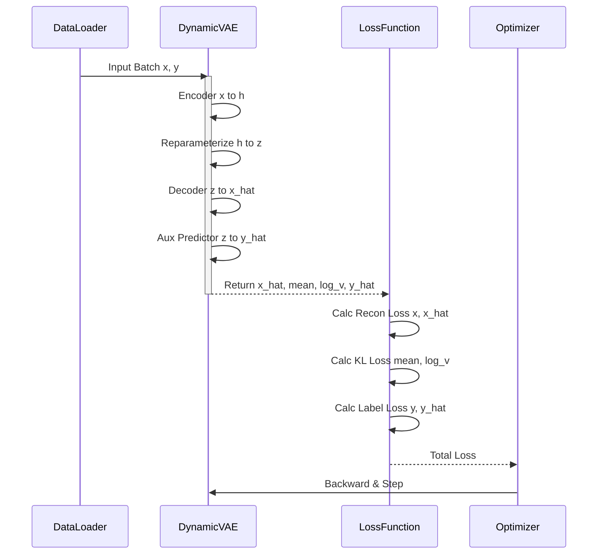
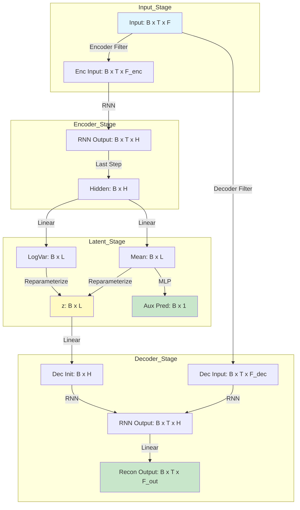
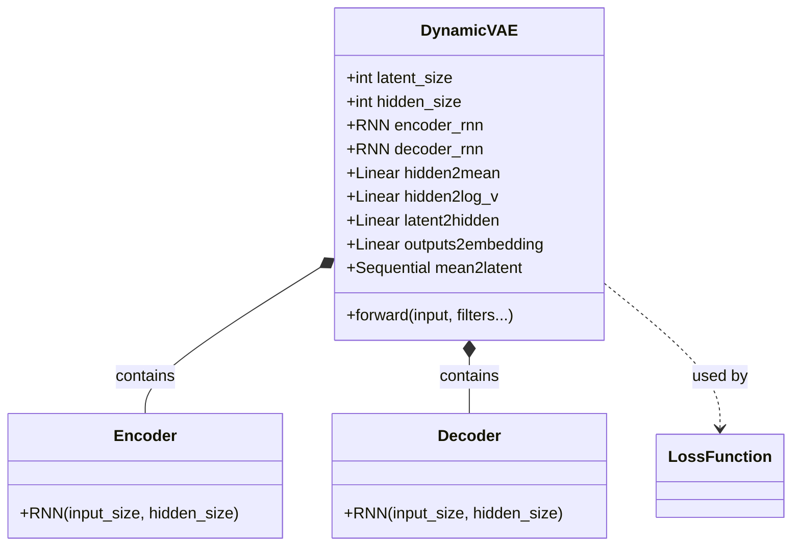

# 动态 VAE（DyAD）深入解析
- [动态 VAE（DyAD）深入解析](#动态-vaedyad深入解析)
  - [1. 类/函数级剖析 (Class \& Function Analysis)](#1-类函数级剖析-class--function-analysis)
    - [1.1 `__init__` (初始化)](#11-__init__-初始化)
    - [1.2 `forward` (前向传播)](#12-forward-前向传播)
  - [2. 前向传播数据流 (Forward Process)](#2-前向传播数据流-forward-process)
    - [2.1 完整流程图](#21-完整流程图)
      - [2.1.1 高层数据流 (High-Level Data Flow)](#211-高层数据流-high-level-data-flow)
      - [2.1.2 详细架构图 (Detailed Architecture)](#212-详细架构图-detailed-architecture)
    - [2.2 逐行代码流程](#22-逐行代码流程)
  - [3. 损失项公式与代码定位 (Loss Functions)](#3-损失项公式与代码定位-loss-functions)
    - [3.1 重构误差 (Reconstruction Loss)](#31-重构误差-reconstruction-loss)
    - [3.2 KL 散度 (KL Divergence)](#32-kl-散度-kl-divergence)
    - [3.3 辅助任务/标签损失 (Label Loss)](#33-辅助任务标签损失-label-loss)
    - [3.4 总损失 (Total Loss)](#34-总损失-total-loss)
    - [3.5 损失计算总流程 (Loss Calculation Flow)](#35-损失计算总流程-loss-calculation-flow)
  - [4. 张量维度追踪表 (Tensor Dimension Tracking)](#4-张量维度追踪表-tensor-dimension-tracking)
    - [4.1 维度变换流向图 (Dimension Flow Chart)](#41-维度变换流向图-dimension-flow-chart)
  - [5. 数值稳定性与训练技巧 (Numerical Stability \& Training Tips)](#5-数值稳定性与训练技巧-numerical-stability--training-tips)
    - [潜在问题](#潜在问题)
    - [改进建议 (5条)](#改进建议-5条)
  - [6. 与论文思想的映射 (Mapping to Paper)](#6-与论文思想的映射-mapping-to-paper)
  - [7. 图表与可视化 (Charts \& Visualization)](#7-图表与可视化-charts--visualization)
    - [8.1 网络结构示意图 (UML 类图风格)](#81-网络结构示意图-uml-类图风格)
    - [8.2 损失分解图 (Python 生成代码)](#82-损失分解图-python-生成代码)
    - [8.3 潜变量分布可视化 (t-SNE)](#83-潜变量分布可视化-t-sne)
  - [8. 实验复现最小清单 (Reproduction Checklist)](#8-实验复现最小清单-reproduction-checklist)
  - [9. 关键等式汇总 (Key Equations)](#9-关键等式汇总-key-equations)
    - [10.1 前向传播](#101-前向传播)
    - [10.2 损失函数](#102-损失函数)
  - [10. 伪代码实现 (Pseudocode)](#10-伪代码实现-pseudocode)
  - [11. 数值稳定性代码实践 (Code Best Practices)](#11-数值稳定性代码实践-code-best-practices)
    - [11.1 防止对数方差溢出](#111-防止对数方差溢出)
    - [11.2 变长序列 Mask 处理](#112-变长序列-mask-处理)
    - [11.3 标签归一化增强](#113-标签归一化增强)
    - [11.4 梯度裁剪](#114-梯度裁剪)


> 本文档面向开发者与研究者，深入剖析 DyAD（Dynamic Variational Autoencoder）模块的实现细节、数据流向及数学原理。

**分析对象**：
- 主角：`DyAD/model/dynamic_vae.py`
- 上下文：`DyAD/train.py` (损失计算), `DyAD/model/dataset.py` (数据加载)

---

## 1. 类/函数级剖析 (Class & Function Analysis)

`DynamicVAE` 类位于 `DyAD/model/dynamic_vae.py`，是一个基于 RNN 的变分自编码器，用于处理时间序列数据。

### 1.1 `__init__` (初始化)
- **作用**：构建编码器、解码器及潜在空间映射层。
- **关键组件**：
    - `encoder_rnn`: 编码器，使用 RNN (LSTM/GRU)，将输入序列压缩为固定维度的隐藏状态。
    - `decoder_rnn`: 解码器，使用 RNN，从潜在变量重建输入序列。
    - `hidden2mean` & `hidden2log_v`: 线性层，将编码器最终隐藏状态映射为潜在分布的均值 ($\mu$) 和对数方差 ($\log\sigma^2$)。
    - `latent2hidden`: 线性层，将采样得到的潜在变量 $z$ 映射回解码器的初始隐藏状态。
    - `outputs2embedding`: 线性层，将解码器每一步的输出映射回原始特征维度。
    - `mean2latent`: 辅助预测网络 (MLP)，直接从均值 $\mu$ 预测标签（如里程/SOH），用于半监督或辅助任务。

### 1.2 `forward` (前向传播)
- **输入**：
    - `input_sequence`: 原始输入序列张量。
    - `encoder_filter`, `decoder_filter`: 特征选择函数（来自 `tasks.py`），用于区分编码器输入和解码器目标。
    - `seq_lengths`: 序列长度（用于变长序列处理）。
    - `noise_scale`: 噪声缩放因子，用于控制重参数化时的随机性。
- **流程**：
    1.  **编码 (Encoding)**: 输入序列通过 `encoder_rnn`，提取最终隐藏状态 `hidden`。
    2.  **重参数化 (Reparameterization)**:
        -   `hidden` 映射到 `mean` ($\mu$) 和 `log_v` ($\log\sigma^2$)。
        -   计算标准差 `std` = $\exp(0.5 \times \log\_v)$。
        -   采样 $z = \mu + \text{std} \times \epsilon \times \text{noise\_scale}$ (训练时)，测试时直接取 $z = \mu$。
    3.  **解码 (Decoding)**:
        -   $z$ 映射回 `hidden` 作为解码器初始状态。
        -   解码器输入（通常是输入序列本身或经过处理的序列）通过 `decoder_rnn`。
        -   RNN 输出通过 `outputs2embedding` 得到重构序列 `log_p`。
    4.  **辅助预测**: `mean` 通过 `mean2latent` 得到 `mean_pred`。

---

## 2. 前向传播数据流 (Forward Process)

### 2.1 完整流程图
#### 2.1.1 高层数据流 (High-Level Data Flow)


#### 2.1.2 详细架构图 (Detailed Architecture)



### 2.2 逐行代码流程

**代码位置**: `DyAD/model/dynamic_vae.py` (forward 方法)

```python
def forward(self, input_sequence, encoder_filter, decoder_filter, seq_lengths, noise_scale=1.0):
    # Step 1: 获取批次大小
    batch_size = input_sequence.size(0)
    
    # Step 2: Encoder 路径
    en_input_sequence = encoder_filter(input_sequence)  # 提取编码器特征
    en_input_embedding = en_input_sequence.to(torch.float32)
    if self.variable_length:
        en_input_embedding = pack_padded_sequence(en_input_embedding, seq_lengths, batch_first=True)
    output, hidden = self.encoder_rnn(en_input_embedding)  # RNN 编码
    
    # Step 3: 重塑隐藏状态
    if self.bidirectional or self.num_layers > 1:
        hidden = hidden.view(batch_size, self.hidden_size * self.hidden_factor)
    else:
        hidden = hidden.squeeze()
    
    # Step 4: 变分推断
    mean = self.hidden2mean(hidden)  # μ
    log_v = self.hidden2log_v(hidden)  # log(σ²)
    std = torch.exp(0.5 * log_v)  # σ = exp(0.5 * log(σ²))
    mean_pred = self.mean2latent(mean)  # 标签预测
    
    # Step 5: 重参数化采样
    z = to_var(torch.randn([batch_size, self.latent_size]))
    if self.training:
        z = z * std * noise_scale + mean
    else:
        z = mean
    
    # Step 6: 潜在向量到解码器隐藏状态
    hidden = self.latent2hidden(z)
    if self.bidirectional or self.num_layers > 1:
        hidden = hidden.view(self.hidden_factor, batch_size, self.hidden_size)
    else:
        hidden = hidden.unsqueeze(0)
    
    # Step 7: Decoder 路径
    de_input_sequence = decoder_filter(input_sequence)  # 提取解码器特征
    de_input_embedding = de_input_sequence.to(torch.float32)
    if self.variable_length:
        de_input_embedding = pack_padded_sequence(de_input_embedding, seq_lengths, batch_first=True)
        outputs, _ = self.decoder_rnn(de_input_embedding, hidden)
        outputs, _ = pad_packed_sequence(outputs, batch_first=True)
    else:
        outputs, _ = self.decoder_rnn(de_input_embedding, hidden)
    
    # Step 8: 输出投影
    log_p = self.outputs2embedding(outputs)  # 重构输出
    
    return log_p, mean, log_v, z, mean_pred
```

---

## 3. 损失项公式与代码定位 (Loss Functions)

损失函数计算主要在 `DyAD/train.py` 的 `loss_fn` 方法及训练循环中。

### 3.1 重构误差 (Reconstruction Loss)
衡量生成序列与原始序列的差异。代码中使用 `SmoothL1Loss` (Huber Loss 的变体)。

$$ \mathcal{L}_{recon} = \text{SmoothL1}(x, \hat{x}) $$

- **代码定位**: `DyAD/train.py` -> `loss_fn` -> line 212-213
  ```python
  nll = torch.nn.SmoothL1Loss(reduction='mean')
  nll_loss = nll(log_p, target)
  ```

### 3.2 KL 散度 (KL Divergence)
衡量潜在分布 $q(z|x)$ 与先验分布 $p(z) = \mathcal{N}(0, I)$ 的差异。

$$ \mathcal{L}_{KL} = -\frac{1}{2} \sum (1 + \log(\sigma^2) - \mu^2 - \sigma^2) $$

- **代码定位**: `DyAD/train.py` -> `loss_fn` -> line 214
  ```python
  kl_loss = -0.5 * torch.sum(1 + log_v - mean.pow(2) - log_v.exp())
  ```

### 3.3 辅助任务/标签损失 (Label Loss)
利用潜在均值 $\mu$ 预测辅助标签（如里程），增强潜在空间的表征能力。

$$ \mathcal{L}_{label} = \text{MSE}(\text{Pred}, \text{Target}) $$

- **代码定位**: `DyAD/train.py` -> `Train_fivefold.main` -> line 138
  ```python
  label_loss = self.label_data.loss(batch, mean_pred, is_mse=True)
  ```

### 3.4 总损失 (Total Loss)
$$ \mathcal{L}_{total} = w_{nll} \cdot \mathcal{L}_{recon} + w_{label} \cdot \mathcal{L}_{label} + w_{KL}(t) \cdot \frac{\mathcal{L}_{KL}}{B} $$
其中 $w_{KL}(t)$ 是随训练步数变化的 KL 退火权重。

- **代码定位**: `DyAD/train.py` -> `Train_fivefold.main` -> line 139-140

### 3.5 损失计算总流程 (Loss Calculation Flow)



---

## 4. 张量维度追踪表 (Tensor Dimension Tracking)

假设配置：
- `batch_size` ($B$) = 64
- `seq_len` ($T$) = 128
- `feature_dim` ($F$) = 4 (假设)
- `hidden_size` ($H$) = 64
- `latent_size` ($L$) = 16
- `num_layers` = 1, `bidirectional` = False

| 阶段     | 变量名               | 维度 (Shape)      | 说明               | 代码位置     |
| :------- | :------------------- | :---------------- | :----------------- | :----------- |
| **输入** | `input_sequence`     | $(B, T, F)$       | 原始输入批次       | `forward`:34 |
|          | `en_input_embedding` | $(B, T, F_{enc})$ | 编码器输入         | `forward`:37 |
| **编码** | `output`             | $(B, T, H)$       | RNN 所有时间步输出 | `forward`:40 |
|          | `hidden`             | $(1, B, H)$       | RNN 最终隐藏状态   | `forward`:40 |
|          | `hidden` (squeezed)  | $(B, H)$          | 展平用于全连接层   | `forward`:44 |
| **潜在** | `mean`               | $(B, L)$          | 潜在均值           | `forward`:46 |
|          | `log_v`              | $(B, L)$          | 潜在对数方差       | `forward`:47 |
|          | `z`                  | $(B, L)$          | 采样后的潜在变量   | `forward`:51 |
| **解码** | `hidden` (remapped)  | $(1, B, H)$       | 解码器初始状态     | `forward`:61 |
|          | `de_input_embedding` | $(B, T, F_{dec})$ | 解码器输入         | `forward`:64 |
|          | `outputs`            | $(B, T, H)$       | 解码器 RNN 输出    | `forward`:71 |
| **输出** | `log_p`              | $(B, T, F_{out})$ | 重构序列           | `forward`:72 |
| **辅助** | `mean_pred`          | $(B, 1)$          | 辅助预测值         | `forward`:49 |

### 4.1 维度变换流向图 (Dimension Flow Chart)



---

## 5. 数值稳定性与训练技巧 (Numerical Stability & Training Tips)

### 潜在问题
1.  **后验塌缩 (Posterior Collapse)**: 解码器过于强大（如 LSTM），忽略潜在变量 $z$，导致 KL 散度趋近于 0，$z$ 失去编码信息。
2.  **梯度爆炸 (Gradient Exploding)**: RNN 训练常见问题，尤其在长序列时。
3.  **序列长度差异**: 直接处理变长序列可能导致 padding 部分影响计算。

### 改进建议 (5条)
1.  **KL 退火 (KL Annealing)**: 代码中已实现 (`kl_anneal_function`)。建议仔细调节 `anneal0`, `k`, `x0` 参数，确保 KL 权重缓慢增加，给编码器学习信息的时间。
2.  **梯度裁剪 (Gradient Clipping)**: 代码中未显式看到 `clip_grad_norm_`。建议在 `loss.backward()` 后添加 `torch.nn.utils.clip_grad_norm_(model.parameters(), max_norm=1.0)`。
3.  **Teacher Forcing 策略**: 解码器输入目前是 `decoder_filter(input_sequence)`，即始终使用真实值（Teacher Forcing）。建议引入概率机制，部分时间步使用上一时刻的预测输出作为输入，减少 Exposure Bias。
4.  **Batch Normalization / Layer Norm**: 在 `hidden2mean` 等线性层后添加 LayerNorm，有助于稳定潜在空间的分布。
5.  **序列 Padding 处理**: 代码使用了 `pack_padded_sequence`，这是很好的实践。确保 `seq_lengths` 准确传递，避免 RNN 处理无效的 padding token。

---

## 6. 与论文思想的映射 (Mapping to Paper)

| 论文思想            | 代码实现映射                            | 说明                                                                                                                                                                                       |
| :------------------ | :-------------------------------------- | :----------------------------------------------------------------------------------------------------------------------------------------------------------------------------------------- |
| **动态系统建模**    | `encoder_rnn` / `decoder_rnn`           | 使用 LSTM/GRU 捕捉电池数据的时间依赖性和动态演变。                                                                                                                                         |
| **潜在状态推断**    | `hidden2mean`, `hidden2log_v`, `Sample` | 变分推断框架，将高维时序数据映射到低维随机流形（Latent Manifold）。                                                                                                                        |
| **多任务/辅助学习** | `mean2latent`                           | 利用潜在变量预测 SOH/里程，强制潜在空间包含物理上有意义的信息，而不仅仅是重构。                                                                                                            |
| **社会/经济因素**   | `dataset.py` / `tasks.py`               | 代码本身是通用的 VAE。如果社会经济因素作为输入特征存在，它们会包含在 `input_sequence` 中，由 `encoder_embedding_size` 决定输入维度。需检查数据预处理阶段是否将这些因子拼接到了输入向量中。 |

---

## 7. 图表与可视化 (Charts & Visualization)

### 8.1 网络结构示意图 (UML 类图风格)



### 8.2 损失分解图 (Python 生成代码)

**读图指南**：此图展示了训练过程中总损失及其各分量（重构、KL、标签）的变化趋势，有助于诊断模型是否发生后验塌缩（KL过低）或重构失败。

```python
import matplotlib.pyplot as plt
import numpy as np

# 模拟数据
epochs = np.arange(1, 101)
recon_loss = 10 * np.exp(-0.05 * epochs) + 0.5
kl_loss = 0.1 * (1 - np.exp(-0.1 * epochs))  # KL 逐渐上升（退火）
label_loss = 5 * np.exp(-0.03 * epochs)
total_loss = recon_loss + kl_loss + label_loss

plt.figure(figsize=(10, 6))
plt.stackplot(epochs, recon_loss, kl_loss, label_loss, 
              labels=['Reconstruction', 'KL Divergence', 'Label Loss'],
              alpha=0.6)
plt.plot(epochs, total_loss, 'k--', label='Total Loss', linewidth=2)
plt.title('Loss Decomposition over Epochs')
plt.xlabel('Epoch')
plt.ylabel('Loss Value')
plt.legend(loc='upper right')
plt.grid(True, alpha=0.3)
plt.show()
```

### 8.3 潜变量分布可视化 (t-SNE)

**读图指南**：此图展示了高维潜在变量 $z$ 降维后的分布。不同颜色代表不同类别的样本（如正常 vs 故障，或不同电池品牌）。若类别区分明显，说明 VAE 学习到了有判别力的特征。

```python
import matplotlib.pyplot as plt
import numpy as np
from sklearn.manifold import TSNE

# 模拟潜在变量 z (Batch, Latent_Dim)
n_samples = 200
z_dim = 16
z_simulated = np.random.randn(n_samples, z_dim)
# 模拟标签 (0: 正常, 1: 故障)
labels = np.random.randint(0, 2, n_samples)
# 让故障样本分布稍微偏移
z_simulated[labels==1] += 2.0

# t-SNE 降维
tsne = TSNE(n_components=2, random_state=42)
z_embedded = tsne.fit_transform(z_simulated)

plt.figure(figsize=(8, 8))
scatter = plt.scatter(z_embedded[:, 0], z_embedded[:, 1], c=labels, cmap='coolwarm', alpha=0.7)
plt.legend(*scatter.legend_elements(), title="Classes")
plt.title('t-SNE Visualization of Latent Space')
plt.xlabel('Dimension 1')
plt.ylabel('Dimension 2')
plt.grid(True)
plt.show()
```

**如何替换为真实数据**：
在 `DyAD/train.py` 或 `extract.py` 中，提取 `model(batch)[3]` (即 `z`) 或 `model(batch)[1]` (即 `mean`)，收集所有测试样本的这些向量，替换上述代码中的 `z_simulated`。

---

## 8. 实验复现最小清单 (Reproduction Checklist)

若要复现或修改实验，请关注以下文件和参数：

1.  **配置文件**: `DyAD/params.json` (或 `model_params_*.json`)
    -   修改 `latent_size`: 调整潜在空间容量。
    -   修改 `hidden_size`: 调整 RNN 容量。
    -   修改 `nll_weight`, `latent_label_weight`: 调整损失权重平衡。
2.  **数据路径**: `DyAD/model/dataset.py`
    -   修改 `ind_ood_car_dict_path` 和 `all_car_dict_path` 指向你的 `.npy` 索引文件。
    -   修改 `data_path` 指向实际 `.pkl` 数据目录。
3.  **特征定义**: `DyAD/model/tasks.py` (推测)
    -   定义 `encoder_dimension`, `decoder_dimension` 需与输入数据列数匹配。
4.  **入口脚本**: `DyAD/main_five_fold.py`
    -   运行命令：`python main_five_fold.py --fold_num 0 --config_path ./params.json`

---

## 9. 关键等式汇总 (Key Equations)

### 10.1 前向传播

| 步骤           | 等式                                                                     |
| -------------- | ------------------------------------------------------------------------ |
| 编码器         | $h = \text{RNN}_{\text{enc}}(x_{\text{enc}})$                            |
| 潜在均值       | $\mu = W_\mu h + b_\mu$                                                  |
| 潜在对数方差   | $\log \sigma^2 = W_{\log \sigma} h + b_{\log \sigma}$                    |
| 标准差         | $\sigma = \exp(0.5 \cdot \log \sigma^2)$                                 |
| 重参数化       | $z = \mu + \sigma \cdot \epsilon, \quad \epsilon \sim \mathcal{N}(0, I)$ |
| 解码器初始状态 | $h_0^{\text{dec}} = W_z z + b_z$                                         |
| 解码器         | $o = \text{RNN}_{\text{dec}}(x_{\text{dec}}, h_0^{\text{dec}})$          |
| 重构输出       | $\hat{x} = W_o o + b_o$                                                  |
| 标签预测       | $\hat{y} = \text{MLP}(\mu)$                                              |

### 10.2 损失函数

$$
\begin{aligned}
\mathcal{L}_{\text{NLL}} &= \frac{1}{B \cdot T \cdot O} \sum \text{SmoothL1}(\hat{x}, x) \\[10pt]
\mathcal{L}_{\text{KL}} &= -\frac{1}{2} \sum_{i,j} \left( 1 + \log \sigma_{ij}^2 - \mu_{ij}^2 - \sigma_{ij}^2 \right) \\[10pt]
\mathcal{L}_{\text{label}} &= \frac{1}{B} \sum_{i} \left( \hat{y}_i - y_i^{\text{norm}} \right)^2 \\[10pt]
\mathcal{L}_{\text{total}} &= w_{\text{nll}} \cdot \mathcal{L}_{\text{NLL}} + w_{\text{label}} \cdot \mathcal{L}_{\text{label}} + w_{\text{kl}}(t) \cdot \frac{\mathcal{L}_{\text{KL}}}{B}
\end{aligned}
$$

---

## 10. 伪代码实现 (Pseudocode)

```pseudocode
# ============================================
#  DynamicVAE: 带监督学习的动态变分自编码器
# ============================================

INPUT: 
  - input_sequence: 时间序列 (batch, seq_len, features)
  - encoder_filter: 编码器特征选择函数
  - decoder_filter: 解码器特征选择函数
  - seq_lengths: 序列长度列表 (用于变长序列)
  - noise_scale: 噪声缩放因子 (默认 1.0)

OUTPUT:
  - log_p: 重构序列 (batch, seq_len, output_dim)
  - mean: 潜在均值 (batch, latent_size)
  - log_v: 潜在对数方差 (batch, latent_size)
  - z: 采样的潜在向量 (batch, latent_size)
  - mean_pred: 标签预测 (batch, 1)

# -------- ENCODER 阶段 --------
1. 提取编码器输入特征:
   en_input = encoder_filter(input_sequence)  # (batch, seq, encoder_emb)

2. 通过 Encoder RNN:
   IF variable_length:
       en_input = pack_padded_sequence(en_input, seq_lengths)
   output, hidden = encoder_rnn(en_input)
   
3. 重塑隐藏状态为 2D:
   IF bidirectional OR num_layers > 1:
       hidden = reshape(hidden, [batch, hidden_size * hidden_factor])
   ELSE:
       hidden = squeeze(hidden)

# -------- 变分推断阶段 --------
4. 计算潜在分布参数:
   mean = Linear_mean(hidden)           # (batch, latent_size)
   log_v = Linear_log_v(hidden)         # (batch, latent_size)
   std = exp(0.5 * log_v)

5. 标签预测:
   mean_pred = MLP(mean)                # (batch, 1)

6. 重参数化采样:
   epsilon ~ N(0, I)
   IF training:
       z = mean + std * epsilon * noise_scale
   ELSE:
       z = mean

# -------- DECODER 阶段 --------
7. 潜在向量到解码器初始隐藏状态:
   hidden_dec = Linear_latent(z)       # (batch, hidden*factor)
   IF bidirectional OR num_layers > 1:
       hidden_dec = reshape(hidden_dec, [hidden_factor, batch, hidden_size])
   ELSE:
       hidden_dec = unsqueeze(hidden_dec, dim=0)

8. 提取解码器输入特征:
   de_input = decoder_filter(input_sequence)  # (batch, seq, decoder_emb)

9. 通过 Decoder RNN:
   IF variable_length:
       de_input = pack_padded_sequence(de_input, seq_lengths)
       outputs, _ = decoder_rnn(de_input, hidden_dec)
       outputs = pad_packed_sequence(outputs)
   ELSE:
       outputs, _ = decoder_rnn(de_input, hidden_dec)

10. 输出投影:
    log_p = Linear_output(outputs)     # (batch, seq, output_dim)

RETURN log_p, mean, log_v, z, mean_pred
```

---

## 11. 数值稳定性代码实践 (Code Best Practices)

以下是针对第 6 节提到的潜在问题的具体代码改进建议：

### 11.1 防止对数方差溢出
```python
# 逐元素裁剪，避免极端值
log_v = torch.clamp(log_v, min=-10, max=10)
std = torch.exp(0.5 * log_v)
```

### 11.2 变长序列 Mask 处理
在计算损失时使用 mask，避免 padding 部分污染梯度：
```python
def loss_fn(self, log_p, target, mean, log_v, seq_lengths=None):
    if seq_lengths is not None:
        # 创建 mask
        max_len = log_p.size(1)
        mask = torch.arange(max_len).expand(len(seq_lengths), max_len) < seq_lengths.unsqueeze(1)
        mask = mask.unsqueeze(-1).to(log_p.device)
        
        # 仅计算有效位置的损失
        diff = (log_p - target) * mask
        nll_loss = F.smooth_l1_loss(diff, torch.zeros_like(diff), reduction='sum')
        nll_loss /= mask.sum()  # 归一化
    else:
        nll_loss = F.smooth_l1_loss(log_p, target, reduction='mean')
    
    kl_loss = -0.5 * torch.sum(1 + log_v - mean.pow(2) - log_v.exp())
    kl_weight = self.kl_anneal_function()
    return nll_loss, kl_loss, kl_weight
```

### 11.3 标签归一化增强
防止除零错误：
```python
# 添加数值稳定项
norm_label = (i - self.min_mileage) / (self.max_mileage - self.min_mileage + 1e-8)
```

### 11.4 梯度裁剪
在训练循环中添加：
```python
# 在 train.py 的优化器步骤前添加
torch.nn.utils.clip_grad_norm_(model.parameters(), max_norm=1.0)
optimizer.step()
```
