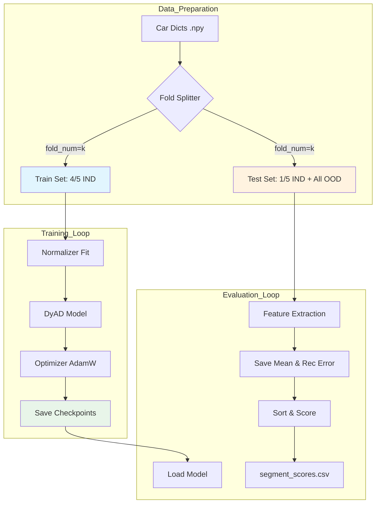

# DyAD 五折训练与评估说明文档

本文档详细说明 DyAD 模型的五折交叉验证训练流程、评估指标计算逻辑及结果可视化方法，并提供 CPU 环境下的轻量复现指南。

**涉及文件**：
- 核心脚本：`DyAD/main_five_fold.py`, `DyAD/evaluate.py`, `DyAD/train.py`
- 数据工具：`DyAD/model/dataset.py`, `five_fold_utils/*.npy`

---

## 1. 五折训练流程 (Five-Fold Training Process)

DyAD 利用五折交叉验证来评估模型的鲁棒性，确保所有正常样本都曾作为测试集的一部分被评估过。

### 1.1 数据拆分逻辑
数据拆分由 `DyAD/model/dataset.py` 中的逻辑控制，依赖 `fold_num` (0-4) 参数。

- **输入字典**：
    - `ind_ood_car_dict`: 包含 `ind_sorted` (正常车号列表) 和 `ood_sorted` (异常/OOD车号列表)。
    - `all_car_dict`: 映射车号到具体的 `.pkl` 数据文件路径列表。
- **拆分策略**：
    - **正常样本 (In-Distribution, IND)**: 被切分为 5 份。
        - **训练集**: 取 4/5 的 IND 车辆。
        - **测试集**: 取剩余 1/5 的 IND 车辆。
    - **异常样本 (Out-of-Distribution, OOD)**: **全部**放入测试集。
    - **结果**: 每一折训练时，模型只见过正常数据；测试时，模型面对的是未见过的正常数据 + 所有异常数据。

### 1.2 流程图 (Mermaid)



---

## 2. 训练循环详解 (Training Loop Breakdown)

训练逻辑主要在 `DyAD/train.py` 的 `Train_fivefold` 类中实现。

### 2.1 核心配置
- **优化器**: `torch.optim.AdamW`，权重衰减 `1e-6`。
- **学习率调度**: `CosineAnnealingLR`，学习率随 Epoch 按余弦曲线下降。
- **早停 (Early Stopping)**: 代码中未显式包含早停逻辑，而是运行固定的 `args.epochs`。

### 2.2 结果落盘结构
训练过程中，所有结果保存在 `dyad_vae_save/` 下的时间戳目录中：

```text
dyad_vae_save/YYYY-MM-DD-HH-MM-SS_fold0/
├── model/          # 模型权重 (model.torch) 和参数 (model_params.json)
├── feature/        # 训练集提取的特征 (用于调试或阈值设定)
├── mean/           # 测试集提取的特征 (用于评估)
├── loss/           # 训练过程损失曲线图 (loss.png)
└── result/         # 最终评估结果 CSV (train/test_segment_scores.csv)
```

---

## 3. 评估指标与打分 (Evaluation & Scoring)

评估逻辑位于 `DyAD/evaluate.py`。

### 3.1 异常评分逻辑
DyAD 主要使用 **重构误差 (Reconstruction Error)** 作为异常分数。
- **计算**: `Evaluate.calculate_rec_error` 读取保存的 `rec_error`。
- **来源**: 在 `train.py` 的 `save_features_info` 函数中，计算输入 `log_p` 与目标 `target` 之间的 MSE。
  ```python
  mse = torch.nn.MSELoss(reduction='mean')
  rec_error = mse(log_p[i], target[i])
  ```
- **判定**: 误差越大，越可能是异常。

### 3.2 阈值与汇总
- **当前逻辑**: 代码直接输出包含 `rec_error` 的 CSV 文件，未在 Python 代码中硬编码阈值判定逻辑。通常在后续分析中，通过计算 ROC 曲线下的面积 (AUC) 或设定分位数阈值（如 99% 分位）来判定异常。
- **汇总级别**: 输出的是 **片段级 (Segment-level)** 分数。若需车级评分，通常取该车所有片段分数的最大值或平均值。

---

## 4. 可视化指标 (Visualizations)

以下 Python 代码可用于生成关键评估图表。

### 4.1 训练/验证损失曲线
```python
import matplotlib.pyplot as plt
import pandas as pd
import numpy as np

# 模拟数据：读取 model_params.json 中的 loss_dict
epochs = range(1, 51)
train_loss = 5 * np.exp(-0.1 * np.array(epochs)) + 0.5 + np.random.normal(0, 0.05, 50)
# 假设有验证集 loss (若代码中未记录，可用训练 loss 代替演示)
val_loss = 5 * np.exp(-0.08 * np.array(epochs)) + 0.8 + np.random.normal(0, 0.05, 50)

plt.figure(figsize=(10, 6))
plt.plot(epochs, train_loss, label='Train Loss', linewidth=2)
plt.plot(epochs, val_loss, label='Validation Loss', linestyle='--', linewidth=2)
plt.title('Training and Validation Loss per Epoch')
plt.xlabel('Epoch')
plt.ylabel('Loss (NLL + KL + Label)')
plt.legend()
plt.grid(True, alpha=0.3)
plt.show()
```

### 4.2 混淆矩阵与 ROC 曲线
```python
import matplotlib.pyplot as plt
from sklearn.metrics import roc_curve, auc, confusion_matrix, ConfusionMatrixDisplay
import numpy as np

# 模拟真实标签 (0: 正常, 1: 异常) 和 预测分数 (重构误差)
y_true = np.concatenate([np.zeros(800), np.ones(200)])
y_scores = np.concatenate([np.random.exponential(1, 800), np.random.normal(5, 2, 200)])

# ROC 曲线
fpr, tpr, thresholds = roc_curve(y_true, y_scores)
roc_auc = auc(fpr, tpr)

plt.figure(figsize=(12, 5))

# Plot ROC
plt.subplot(1, 2, 1)
plt.plot(fpr, tpr, color='darkorange', lw=2, label=f'ROC curve (area = {roc_auc:.2f})')
plt.plot([0, 1], [0, 1], color='navy', lw=2, linestyle='--')
plt.xlim([0.0, 1.0])
plt.ylim([0.0, 1.05])
plt.xlabel('False Positive Rate')
plt.ylabel('True Positive Rate')
plt.title('Receiver Operating Characteristic (ROC)')
plt.legend(loc="lower right")

# Plot Confusion Matrix (基于最佳阈值)
optimal_idx = np.argmax(tpr - fpr)
optimal_threshold = thresholds[optimal_idx]
y_pred = (y_scores > optimal_threshold).astype(int)
cm = confusion_matrix(y_true, y_pred)

ax = plt.subplot(1, 2, 2)
disp = ConfusionMatrixDisplay(confusion_matrix=cm, display_labels=['Normal', 'Anomaly'])
disp.plot(cmap='Blues', ax=ax)
plt.title(f'Confusion Matrix (Thresh={optimal_threshold:.2f})')

plt.tight_layout()
plt.show()
```

### 4.3 片段评分分布直方图
```python
import matplotlib.pyplot as plt
import numpy as np

# 模拟数据
normal_scores = np.random.exponential(1.0, 1000)
anomaly_scores = np.random.normal(6.0, 2.0, 200)

plt.figure(figsize=(10, 6))
plt.hist(normal_scores, bins=50, alpha=0.6, label='Normal Segments', color='green', density=True)
plt.hist(anomaly_scores, bins=50, alpha=0.6, label='Anomaly Segments', color='red', density=True)
plt.title('Distribution of Reconstruction Errors (Anomaly Scores)')
plt.xlabel('Reconstruction Error')
plt.ylabel('Density')
plt.legend()
plt.show()
```

---

## 5. CPU 轻量复现指南 (CPU Lightweight Reproduction)

若无 GPU 或仅需快速验证代码逻辑，请按以下步骤操作：

1.  **环境配置**:
    -   设置环境变量禁用 CUDA：`export CUDA_VISIBLE_DEVICES=""`
    -   或者在 Python 脚本开头添加：`import os; os.environ["CUDA_VISIBLE_DEVICES"] = ""`

2.  **修改参数 (`params.json` 或 `model_params_*.json`)**:
    -   `batch_size`: 降至 **16** 或 **32** (原可能为 64/128)。
    -   `hidden_size`: 降至 **32** 或 **64**。
    -   `num_layers`: 设为 **1**。
    -   `epochs`: 设为 **1** 或 **2** 用于测试流程。
    -   `jobs` (num_workers): 设为 **0** (避免多进程在某些 CPU 环境下的开销或报错)。

3.  **数据截取 (可选)**:
    -   若数据量过大，修改 `dataset.py`，在 `__init__` 中限制加载的文件数量：
        ```python
        # 仅加载前 10 个样本用于测试
        self.battery_dataset = self.battery_dataset[:10]
        ```

4.  **运行命令**:
    ```bash
    python DyAD/main_five_fold.py --config_path DyAD/params.json --fold_num 0
    ```

---

## 6. 常见报错与修复

| 错误现象 | 可能原因 | 修复方案 |
| :--- | :--- | :--- |
| `RuntimeError: CUDA error: out of memory` | 显存不足 | 减小 `batch_size`；检查是否有其他进程占用显存。 |
| `FileNotFoundError: .../ind_odd_dict1.npz.npy` | 路径错误或文件缺失 | 检查 `five_fold_utils` 目录；确认 `dataset.py` 中的路径配置是否正确指向该目录。 |
| `KeyError: 'mileage'` | 数据缺失 | 检查输入 `.pkl` 文件中的 `metadata` 字典是否包含 `mileage` 键；若无，需修改 `dataset.py` 或 `train.py` 中的标签获取逻辑。 |
| `AttributeError: 'list' object has no attribute 'to'` | 数据类型错误 | 检查 `collate` 函数，确保返回的是 Tensor 而非 list；`train.py` 中 `batch[0]` 应为 Tensor。 |
