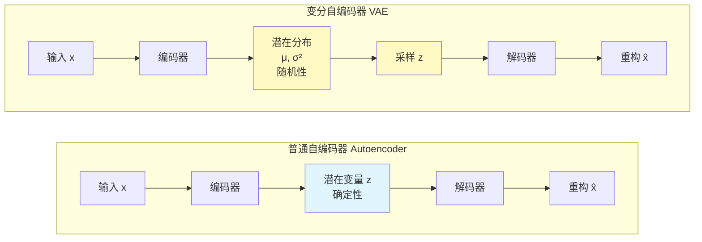
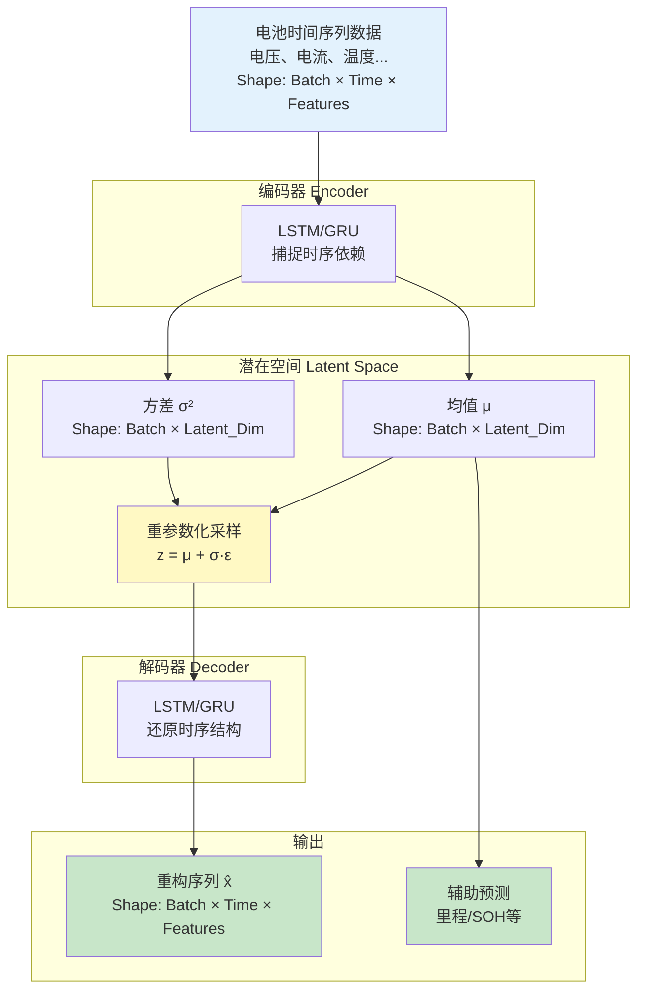
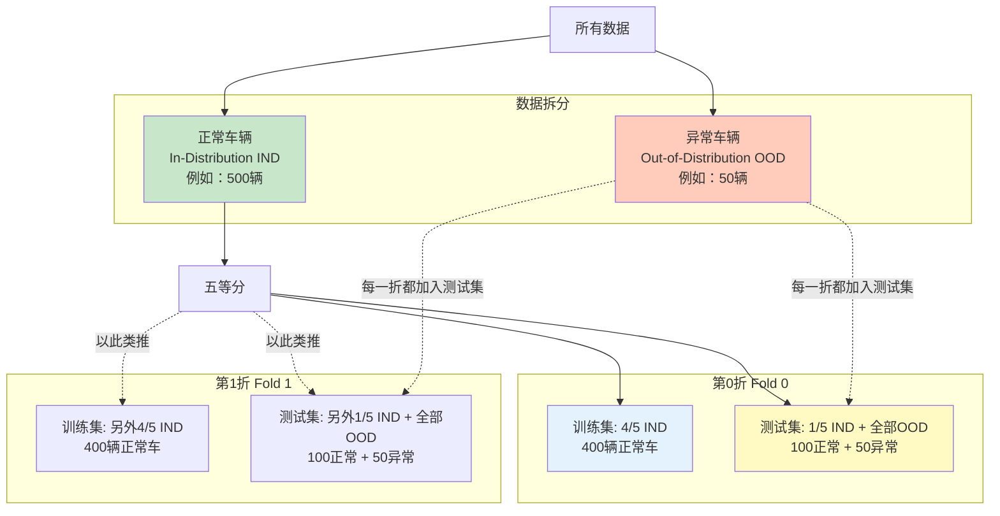
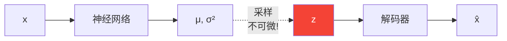
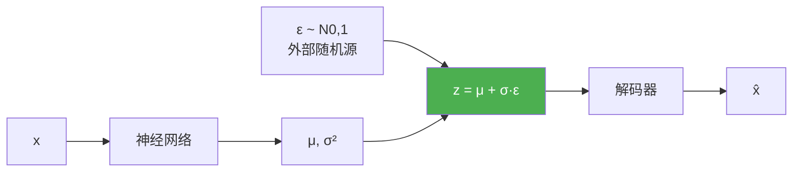
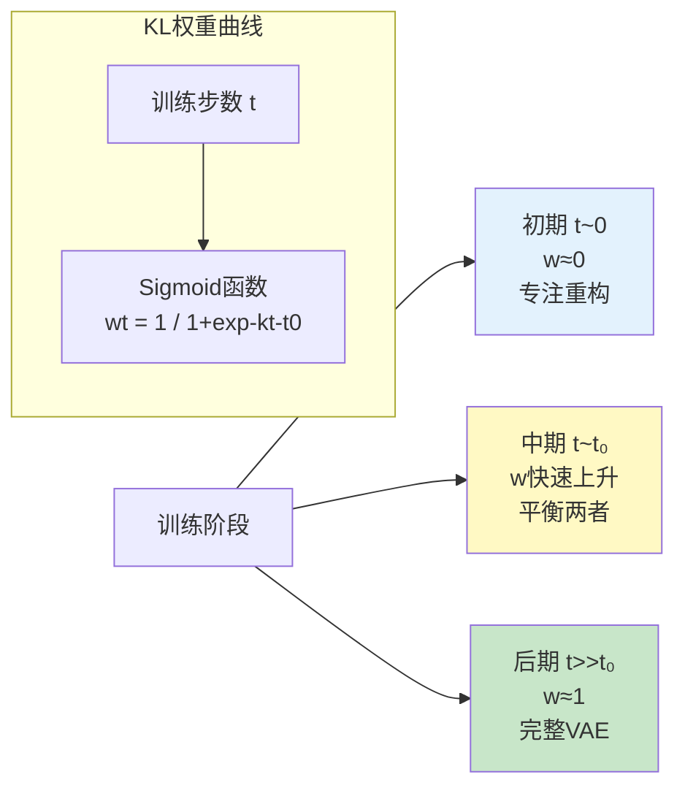
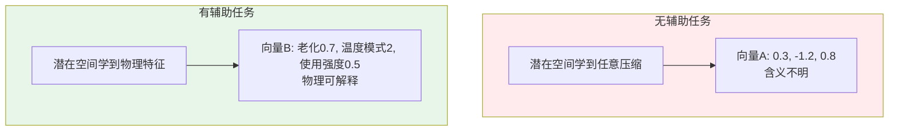
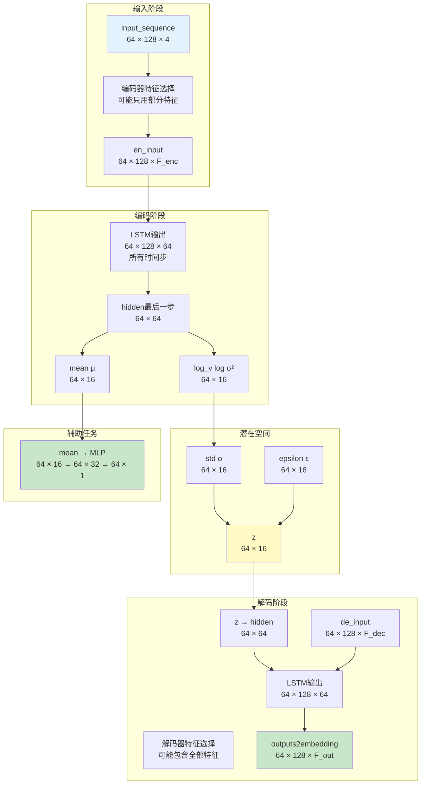
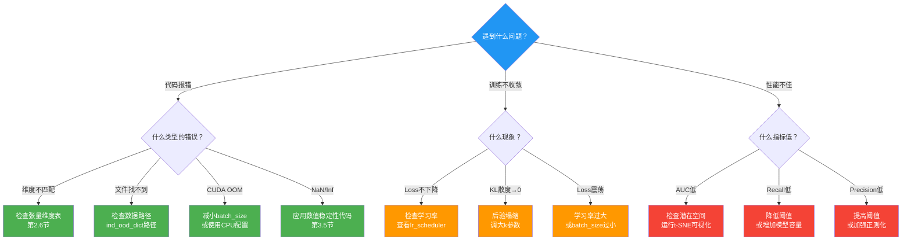
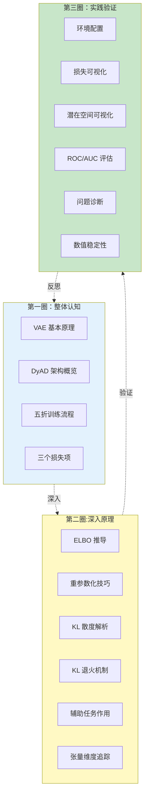

# DyAD 完整教程：从原理到实践

> **文档定位**：自包含的渐进式教程，帮助您全面理解 DyAD（Dynamic Variational Autoencoder）模型的原理、实现和应用  
> **适用对象**：机器学习研究者、数据科学家、算法工程师  
> **预计学习时间**：3-6 小时

---

## 📚 教程概览

本教程采用"**螺旋式上升**"的教学方法，分为三个循环：

1. **第一圈（基础环）**：理解"是什么" - 建立整体认知
2. **第二圈（深入环）**：理解"为什么" - 掌握数学原理和设计思想
3. **第三圈（实践环）**：理解"怎么做" - 运行代码、评估模型、解决问题

每个知识点都会在三圈中以不同深度重复出现，确保螺旋式加深理解。

---

## 第一部分：建立整体认知（第一圈）

### 1.1 DyAD 解决什么问题？

**业务场景**：电池故障检测
- **输入**：电池使用过程中的时间序列数据（电压、电流、温度等）
- **输出**：判断电池是否存在潜在故障风险
- **挑战**：
  - ✗ 故障样本稀少（标注困难）
  - ✗ 正常模式多样（不同使用习惯）
  - ✗ 时序依赖复杂（状态转换）

**技术方案核心思想**：
> "训练时只用正常数据，让模型学会重构正常模式；  
> 测试时，异常数据会导致重构误差大幅增加。"

这就是**无监督异常检测**的思路，而 DyAD 是基于 **VAE（变分自编码器）** 的一种实现。

---

### 1.2 什么是 VAE？（5分钟快速理解）

#### 普通自编码器 vs 变分自编码器



**关键区别**：
- **普通 AE**：编码器输出固定的 z（一个点）
- **VAE**：编码器输出一个分布（μ 和 σ），然后从分布中采样 z

**为什么需要随机性？**
1. **正则化作用**：防止过拟合，迫使潜在空间平滑
2. **生成能力**：可以随机采样生成新样本
3. **不确定性建模**：捕捉数据的内在随机性

---

### 1.3 DyAD 的整体架构

#### 高层数据流



#### 核心组件说明

| 组件            | 作用                           | 输入      | 输出      |
| :-------------- | :----------------------------- | :-------- | :-------- |
| **Encoder RNN** | 将时间序列压缩为固定维度的表示 | (B, T, F) | (B, H)    |
| **μ 映射层**    | 将隐藏状态映射为潜在均值       | (B, H)    | (B, L)    |
| **σ² 映射层**   | 将隐藏状态映射为潜在方差       | (B, H)    | (B, L)    |
| **重参数化**    | 从分布中采样（可微分）         | μ, σ²     | z         |
| **Decoder RNN** | 从潜在变量还原时间序列         | z         | (B, T, H) |
| **输出投影层**  | 映射回原始特征维度             | (B, T, H) | (B, T, F) |
| **辅助预测器**  | 从潜在空间预测标签             | μ         | (B, 1)    |

> **注释**：B=Batch, T=Time, F=Features, H=Hidden, L=Latent

---

### 1.4 DyAD 如何训练？（五折交叉验证）

#### 为什么需要五折交叉验证？

在故障检测场景中：
- 正常样本数量有限
- 需要确保模型的**泛化能力**
- 避免"恰好测试集简单"的假象

#### 数据划分策略



**关键原则**：
1. ✅ **训练时**：只用正常数据（IND），让模型学习"什么是正常"
2. ✅ **测试时**：同时包含正常和异常数据，评估区分能力
3. ✅ **每一折**：异常数据（OOD）都会被测试，确保全面评估

---

### 1.5 模型如何学习？（损失函数）

DyAD 通过优化**三个目标**同时学习：

```mermaid
sequenceDiagram
    participant Data as 训练数据批次
    participant Model as DyAD模型
    participant Loss as 损失计算
    participant Opt as 优化器
    
    Data->>Model: 输入序列 x
    activate Model
    
    Model->>Model: 1️⃣ 编码 → μ, σ²
    Note over Model: Encoder RNN
    
    Model->>Model: 2️⃣ 采样 z
    Note over Model: z = μ + σ·ε
    
    Model->>Model: 3️⃣ 解码 → x̂
    Note over Model: Decoder RNN
    
    Model->>Model: 4️⃣ 辅助预测 → ŷ
    Note over Model: MLP(μ)
    
    Model-->>Loss: x̂, μ, σ², ŷ
    deactivate Model
    
    activate Loss
    Loss->>Loss: 计算重构误差<br/>L_recon = MSE(x, x̂)
    Loss->>Loss: 计算KL散度<br/>L_KL = KL(q(z|x) || p(z))
    Loss->>Loss: 计算标签误差<br/>L_label = MSE(y, ŷ)
    Loss->>Loss: 总损失<br/>L = w1*L_recon + w2*L_KL + w3*L_label
    Loss->>Opt: 总损失L
    deactivate Loss
    
    Opt->>Model: 反向传播，更新参数
```

#### 三个损失项的作用

| 损失项       | 符号    | 作用                     | 为什么需要？                     |
| :----------- | :------ | :----------------------- | :------------------------------- |
| **重构误差** | L_recon | 让重构尽可能准确         | 核心目标：学会重构正常模式       |
| **KL散度**   | L_KL    | 约束潜在空间分布         | 防止编码塌缩，保持生成能力       |
| **标签损失** | L_label | 预测辅助标签（里程/SOH） | 引导潜在空间学习有意义的物理特征 |

**直观理解**：
- **只有重构误差**：模型可能"死记硬背"每个样本
- **加上 KL 散度**：强制潜在空间平滑、连续
- **加上标签损失**：让潜在空间编码物理意义（如老化程度），而不仅仅是任意压缩

---

### 💡 第一圈检查点

在继续之前，请确认您理解了以下概念：

- [ ] DyAD 用于无监督异常检测，训练时只用正常数据
- [ ] VAE 通过编码为分布（而非点）来实现正则化
- [ ] 五折交叉验证确保每个异常样本都被测试
- [ ] 三个损失项协同工作：重构+正则化+物理约束

**如果有任何疑问，请停留在此，重新阅读对应章节。**

---

## 第二部分：深入数学原理（第二圈）

### 2.1 变分推断的数学基础

#### 贝叶斯视角下的 VAE

**目标**：给定观测数据 x，推断潜在变量 z

根据贝叶斯公式：
$$
p(z|x) = \frac{p(x|z) \cdot p(z)}{p(x)}
$$

**问题**：后验分布 $p(z|x)$ 通常无法直接计算（因为 $p(x) = \int p(x|z)p(z)dz$ 需要积分所有可能的 z）

**解决方案**：变分推断 - 用一个简单分布 $q_\phi(z|x)$ 来近似真实后验 $p(z|x)$

#### ELBO（证据下界）推导

VAE 最小化的目标函数：

$$
\begin{aligned}
\log p(x) &\geq \mathbb{E}_{z \sim q_\phi(z|x)} [\log p(x|z)] - D_{KL}(q_\phi(z|x) || p(z)) \\
&= \text{ELBO}(x)
\end{aligned}
$$

**分解为两项**：

1. **重构项**：$\mathbb{E}_{z \sim q_\phi(z|x)} [\log p(x|z)]$
   - 意义：从近似后验采样的 z，能多大概率重构回 x
   - 实现：解码器的重构损失（负对数似然）

2. **正则化项**：$D_{KL}(q_\phi(z|x) || p(z))$
   - 意义：近似后验与先验的差距
   - 实现：KL 散度（有解析解）

**为什么最大化 ELBO 等价于最小化损失？**
- ELBO 是 $\log p(x)$ 的下界
- 最大化 ELBO → 最大化数据似然 → 最小化负对数似然

---

### 2.2 重参数化技巧（Reparameterization Trick）

#### 为什么需要重参数化？

**问题**：如果直接从 $z \sim q_\phi(z|x) = \mathcal{N}(\mu_\phi(x), \sigma_\phi^2(x))$ 采样，采样操作不可微，无法反向传播！



**解决方案**：重参数化

$$
\begin{aligned}
z &\sim \mathcal{N}(\mu, \sigma^2) \\
&\Downarrow \text{等价变换} \\
z &= \mu + \sigma \cdot \epsilon, \quad \epsilon \sim \mathcal{N}(0, 1)
\end{aligned}
$$



**关键优势**：
- 随机性来源外部（ε），不参与梯度计算
- μ 和 σ 的计算可微
- 梯度可以从 z 反向传播到 μ 和 σ

#### DyAD 中的实现

```python
# 编码器输出
mean = self.hidden2mean(hidden)      # μ: (B, L)
log_v = self.hidden2log_v(hidden)    # log(σ²): (B, L)

# 计算标准差（数值稳定）
std = torch.exp(0.5 * log_v)         # σ = exp(0.5 * log(σ²))

# 重参数化采样
epsilon = torch.randn_like(std)      # ε ~ N(0,1)
z = mean + std * epsilon * noise_scale  # z = μ + σ·ε
```

**为什么用 log(σ²) 而非 σ？**
1. 数值稳定：σ² 总是正数，log(σ²) 可以取负值，网络更容易学习
2. 解析 KL 公式需要 log(σ²)

---

### 2.3 KL 散度的解析解

#### 两个高斯分布的 KL 散度

给定：
- 近似后验：$q(z|x) = \mathcal{N}(\mu, \sigma^2)$
- 先验：$p(z) = \mathcal{N}(0, 1)$

KL 散度的解析解：

$$
D_{KL}(q || p) = \frac{1}{2} \sum_{j=1}^{L} \left( \mu_j^2 + \sigma_j^2 - \log(\sigma_j^2) - 1 \right)
$$

**物理意义**：
- $\mu_j^2$ 项：惩罚均值偏离0
- $\sigma_j^2$ 项：惩罚方差偏离1
- $-\log(\sigma_j^2)$ 项：惩罚方差过小（防止确定性编码）
- $-1$ 项：归一化常数

#### DyAD 中的实现

```python
# KL 散度计算（分析公式）
kl_loss = -0.5 * torch.sum(1 + log_v - mean.pow(2) - log_v.exp())
# 对应公式：-0.5 * Σ(1 + log(σ²) - μ² - σ²)
```

**为什么是负号？**
- 公式求的是散度（越小越好）
- 但 ELBO 是下界（越大越好）
- ELBO = 重构项 - KL散度
- 优化时最小化损失：Loss = -ELBO = -重构项 + KL散度

---

### 2.4 KL 退火（KL Annealing）机制

#### 后验塌缩问题

**现象**：训练初期，KL 散度迅速降为 0，潜在变量 z 失去作用

**原因**：
- 解码器（LSTM）表达能力强，可以不依赖 z 直接生成序列
- KL 项惩罚，模型选择让 $q(z|x) \approx p(z) = \mathcal{N}(0, 1)$，即 z 与 x 无关

**后果**：模型退化为普通 RNN，失去 VAE 的优势

#### 解决方案：KL 退火

逐步增加 KL 项的权重：

$$
L_{total} = L_{recon} + \textcolor{red}{w_{KL}(t)} \cdot L_{KL} + L_{label}
$$

其中 $w_{KL}(t)$ 从 0 逐渐增加到 1：



**典型参数**：
- `k`（斜率）：控制过渡速度
- `t₀`（中心点）：退火开始的时间
- `anneal0`（起始值）：初始权重（通常为 0）

---

### 2.5 辅助任务学习的作用

#### 为什么需要辅助任务？

**问题**：VAE 的潜在空间可能学到"无意义"的压缩表示

**示例**：
- 模型可能将时序数据编码为任意的低维向量
- 这些向量能重构，但不包含物理意义（如电池老化程度）

**解决方案**：引入辅助监督信号

$$
L_{label} = \text{MSE}(\text{MLP}(\mu), y_{true})
$$

其中：
- $y_{true}$ 可以是：里程、SOH（健康状态）、使用时长等
- MLP 是轻量级预测器



**好处**：
1. **可解释性**：潜在维度对应物理意义
2. **泛化能力**：学到的特征更鲁棒
3. **多任务学习**：辅助任务作为正则化

---

### 2.6 张量维度完整追踪

理解每一步的张量形状是调试的关键。假设配置：
- `batch_size` = 64
- `seq_len` = 128
- `feature_dim` = 4（电压、电流、温度、SOC）
- `hidden_size` = 64
- `latent_size` = 16



**关键变换点**：
1. **RNN 压缩**：(B,T,F) → 提取最后隐藏状态 → (B,H)
2. **潜在映射**：(B,H) → 线性层 → (B,L)
3. **z 回到隐藏**：(B,L) → 线性层 → (B,H)
4. **RNN 扩展**：(B,H) 作为初始状态 → 解码器输出 → (B,T,H)
5. **特征投影**：(B,T,H) → 线性层 → (B,T,F)

---

### 💡 第二圈检查点

请确认您理解了以下数学概念：

- [ ] ELBO = 重构项 - KL 散度，是数据似然的下界
- [ ] 重参数化技巧通过 z=μ+σ·ε 实现可微分采样
- [ ] KL 散度有解析解，惩罚 μ 和 σ 偏离标准正态分布
- [ ] KL 退火防止后验塌缩
- [ ] 辅助任务引导潜在空间学习物理特征
- [ ] 张量维度在 RNN、线性层间有明确的变换规律

**如果公式看起来困难，建议先运行代码（第三圈），结合实际输出再回来理解。**

---

## 第三部分：实践与验证（第三圈）

### 3.1 环境准备与快速测试

#### 最小化复现配置（CPU 环境）

如果没有 GPU，可以使用以下配置快速测试流程：

**1. 环境设置**

```bash
# 禁用 CUDA
export CUDA_VISIBLE_DEVICES=""
```

**2. 修改配置文件**

创建 `params_cpu_test.json`：

```json
{
  "batch_size": 16,          // 原来可能是 64
  "hidden_size": 32,         // 原来可能是 64
  "latent_size": 8,          // 原来可能是 16
  "num_layers": 1,
  "epochs": 2,               // 仅用于测试流程
  "jobs": 0,                 // DataLoader workers
  "nll_weight": 1.0,
  "latent_label_weight": 0.5,
  "anneal0": 0.0,
  "k": 0.0025,
  "x0": 2500
}
```

**3. 数据子集测试**

修改 `DyAD/model/dataset.py`：

```python
def __init__(self, ...):
    # ... 原有代码 ...
    # 添加数据截断（仅用于测试）
    self.battery_dataset = self.battery_dataset[:20]  # 只加载20个样本
```

**4. 运行单折测试**

```bash
cd DyAD
python main_five_fold.py --config_path params_cpu_test.json --fold_num 0
```

**预期输出**：
```
Fold 0 training started...
Epoch 1/2, Loss: 15.234
Epoch 2/2, Loss: 12.567
Feature extraction started...
Evaluation completed.
Results saved to: dyad_vae_save/2025-11-24-14-35-00_fold0/
```

---

### 3.2 训练过程可视化

#### 3.2.1 损失分解图

**作用**：诊断训练是否正常，是否发生后验塌缩

```python
import matplotlib.pyplot as plt
import numpy as np
import json

# 读取保存的损失记录（假设在 model_params.json 中）
with open('dyad_vae_save/xxx_fold0/model/model_params.json', 'r') as f:
    params = json.load(f)
    loss_dict = params.get('loss_dict', {})

epochs = list(range(1, len(loss_dict['nll_loss']) + 1))
nll_loss = loss_dict['nll_loss']
kl_loss = loss_dict['kl_loss']
label_loss = loss_dict['label_loss']
total_loss = [n + k + l for n, k, l in zip(nll_loss, kl_loss, label_loss)]

plt.figure(figsize=(14, 6))

# 左图：堆叠面积图
plt.subplot(1, 2, 1)
plt.stackplot(epochs, nll_loss, kl_loss, label_loss,
              labels=['Reconstruction (NLL)', 'KL Divergence', 'Label Loss'],
              alpha=0.7,
              colors=['#1f77b4', '#ff7f0e', '#2ca02c'])
plt.plot(epochs, total_loss, 'k--', linewidth=2, label='Total Loss')
plt.xlabel('Epoch', fontsize=12)
plt.ylabel('Loss Value', fontsize=12)
plt.title('Loss Decomposition (Stacked)', fontsize=14, fontweight='bold')
plt.legend(loc='upper right')
plt.grid(True, alpha=0.3)

# 右图：分项趋势
plt.subplot(1, 2, 2)
plt.plot(epochs, nll_loss, marker='o', label='NLL', linewidth=2)
plt.plot(epochs, kl_loss, marker='s', label='KL', linewidth=2)
plt.plot(epochs, label_loss, marker='^', label='Label', linewidth=2)
plt.xlabel('Epoch', fontsize=12)
plt.ylabel('Loss Value', fontsize=12)
plt.title('Individual Loss Trends', fontsize=14, fontweight='bold')
plt.legend()
plt.grid(True, alpha=0.3)

plt.tight_layout()
plt.savefig('loss_analysis.png', dpi=300, bbox_inches='tight')
plt.show()
```

**诊断标准**：

| 现象              | 原因                    | 解决方案                   |
| :---------------- | :---------------------- | :------------------------- |
| KL 散度快速降为 0 | 后验塌缩                | 调大 `k` 参数，延缓退火    |
| NLL 不下降        | 学习率过小/数据未归一化 | 检查归一化，调大学习率     |
| Label Loss 不收敛 | 辅助任务权重过小        | 增大 `latent_label_weight` |
| 总损失震荡        | 学习率过大              | 使用学习率调度器           |

---

#### 3.2.2 潜在空间可视化（t-SNE）

**作用**：观察潜在空间是否能区分正常/异常样本

```python
import matplotlib.pyplot as plt
import numpy as np
from sklearn.manifold import TSNE
import pickle

# 1. 加载测试集提取的特征
# 假设 extract.py 保存了 mean 向量
with open('dyad_vae_save/xxx_fold0/mean/test_mean.pkl', 'rb') as f:
    data = pickle.load(f)
    z_means = data['mean']        # (N_samples, latent_size)
    labels = data['is_anomaly']   # (N_samples,) 0=正常, 1=异常

# 2. t-SNE 降维
tsne = TSNE(n_components=2, random_state=42, perplexity=30)
z_embedded = tsne.fit_transform(z_means)

# 3. 可视化
plt.figure(figsize=(10, 8))
scatter = plt.scatter(z_embedded[:, 0], z_embedded[:, 1],
                      c=labels, cmap='RdYlGn_r',
                      s=50, alpha=0.6, edgecolors='k', linewidth=0.5)
plt.colorbar(scatter, label='0=Normal, 1=Anomaly')
plt.xlabel('t-SNE Dimension 1', fontsize=12)
plt.ylabel('t-SNE Dimension 2', fontsize=12)
plt.title('Latent Space Visualization (t-SNE)', fontsize=14, fontweight='bold')
plt.grid(True, alpha=0.3)
plt.tight_layout()
plt.savefig('tsne_latent_space.png', dpi=300, bbox_inches='tight')
plt.show()
```

**理想结果**：
- ✅ 正常样本（绿色）聚集成团
- ✅ 异常样本（红色）偏离正常团簇
- ❌ 如果混在一起，说明潜在空间区分性不足

---

### 3.3 模型评估

#### 3.3.1 异常评分计算

DyAD 使用**重构误差**作为异常分数：

$$
\text{Anomaly Score}(x) = \| x - \hat{x} \|^2 = \text{MSE}(x, \hat{x})
$$

**逻辑**：
- 训练时模型学会重构正常模式
- 异常样本的模式未见过 → 重构误差大

**代码实现**（在 `train.py` 中）：

```python
def save_features_info(self, log_p, target, mean, ...):
    mse = torch.nn.MSELoss(reduction='mean')
    for i in range(log_p.size(0)):
        rec_error = mse(log_p[i], target[i]).item()
        # 保存 rec_error 到文件
```

#### 3.3.2 ROC 曲线与 AUC

**问题**：如何设定阈值判定异常？

**答案**：不设固定阈值，用 ROC 曲线评估所有可能阈值下的性能

```python
import matplotlib.pyplot as plt
from sklearn.metrics import roc_curve, auc, confusion_matrix, ConfusionMatrixDisplay
import numpy as np
import pandas as pd

# 1. 读取评估结果
df = pd.read_csv('dyad_vae_save/xxx_fold0/result/test_segment_scores.csv')
y_true = df['is_anomaly'].values    # 真实标签
y_scores = df['rec_error'].values   # 重构误差（异常分数）

# 2. 计算 ROC 曲线
fpr, tpr, thresholds = roc_curve(y_true, y_scores)
roc_auc = auc(fpr, tpr)

# 3. 找最优阈值（最大化 TPR - FPR）
optimal_idx = np.argmax(tpr - fpr)
optimal_threshold = thresholds[optimal_idx]
optimal_tpr = tpr[optimal_idx]
optimal_fpr = fpr[optimal_idx]

# 4. 可视化
fig, axes = plt.subplots(1, 2, figsize=(14, 6))

# 左图：ROC 曲线
axes[0].plot(fpr, tpr, color='darkorange', lw=2,
             label=f'ROC curve (AUC = {roc_auc:.3f})')
axes[0].plot([0, 1], [0, 1], color='navy', lw=2, linestyle='--', label='Random')
axes[0].scatter(optimal_fpr, optimal_tpr, color='red', s=100, zorder=5,
                label=f'Optimal (thresh={optimal_threshold:.3f})')
axes[0].set_xlim([0.0, 1.0])
axes[0].set_ylim([0.0, 1.05])
axes[0].set_xlabel('False Positive Rate', fontsize=12)
axes[0].set_ylabel('True Positive Rate', fontsize=12)
axes[0].set_title('ROC Curve', fontsize=14, fontweight='bold')
axes[0].legend(loc="lower right")
axes[0].grid(True, alpha=0.3)

# 右图：混淆矩阵
y_pred = (y_scores > optimal_threshold).astype(int)
cm = confusion_matrix(y_true, y_pred)
disp = ConfusionMatrixDisplay(confusion_matrix=cm,
                               display_labels=['Normal', 'Anomaly'])
disp.plot(cmap='Blues', ax=axes[1], colorbar=False)
axes[1].set_title('Confusion Matrix', fontsize=14, fontweight='bold')

plt.tight_layout()
plt.savefig('roc_and_confusion_matrix.png', dpi=300, bbox_inches='tight')
plt.show()

# 5. 打印性能指标
tn, fp, fn, tp = cm.ravel()
precision = tp / (tp + fp) if (tp + fp) > 0 else 0
recall = tp / (tp + fn) if (tp + fn) > 0 else 0
f1 = 2 * precision * recall / (precision + recall) if (precision + recall) > 0 else 0

print(f"AUC: {roc_auc:.4f}")
print(f"Optimal Threshold: {optimal_threshold:.4f}")
print(f"Precision: {precision:.4f}")
print(f"Recall: {recall:.4f}")
print(f"F1-Score: {f1:.4f}")
```

**指标解读**：
- **AUC**：越接近 1 越好（0.5 为随机猜测）
- **Precision**：预测为异常的样本中，真正异常的比例
- **Recall**：真实异常样本中，被正确识别的比例
- **F1-Score**：Precision 和 Recall 的调和平均

---

#### 3.3.3 重构误差分布

**直观理解**：正常样本的误差应该明显小于异常样本

```python
import matplotlib.pyplot as plt
import pandas as pd
import numpy as np

# 读取数据
df = pd.read_csv('dyad_vae_save/xxx_fold0/result/test_segment_scores.csv')
normal_scores = df[df['is_anomaly'] == 0]['rec_error'].values
anomaly_scores = df[df['is_anomaly'] == 1]['rec_error'].values

# 可视化
plt.figure(figsize=(12, 5))

# 左图：直方图
plt.subplot(1, 2, 1)
plt.hist(normal_scores, bins=50, alpha=0.7, label='Normal', color='green',
         density=True, edgecolor='black')
plt.hist(anomaly_scores, bins=50, alpha=0.7, label='Anomaly', color='red',
         density=True, edgecolor='black')
plt.axvline(optimal_threshold, color='blue', linestyle='--', linewidth=2,
            label=f'Threshold={optimal_threshold:.3f}')
plt.xlabel('Reconstruction Error', fontsize=12)
plt.ylabel('Density', fontsize=12)
plt.title('Distribution of Reconstruction Errors', fontsize=14, fontweight='bold')
plt.legend()
plt.grid(True, alpha=0.3)

# 右图：箱线图
plt.subplot(1, 2, 2)
plt.boxplot([normal_scores, anomaly_scores],
            labels=['Normal', 'Anomaly'],
            patch_artist=True,
            boxprops=dict(facecolor='lightblue'),
            medianprops=dict(color='red', linewidth=2))
plt.ylabel('Reconstruction Error', fontsize=12)
plt.title('Error Distribution (Box Plot)', fontsize=14, fontweight='bold')
plt.grid(True, axis='y', alpha=0.3)

plt.tight_layout()
plt.savefig('error_distribution.png', dpi=300, bbox_inches='tight')
plt.show()

# 统计量
print("Normal samples:")
print(f"  Mean: {np.mean(normal_scores):.4f}")
print(f"  Std: {np.std(normal_scores):.4f}")
print(f"  95%ile: {np.percentile(normal_scores, 95):.4f}")
print("\nAnomaly samples:")
print(f"  Mean: {np.mean(anomaly_scores):.4f}")
print(f"  Std: {np.std(anomaly_scores):.4f}")
print(f"  5%ile: {np.percentile(anomaly_scores, 5):.4f}")
```

---

### 3.4 常见问题排查

#### 问题诊断决策树



---

### 3.5 数值稳定性最佳实践

#### 问题1：对数方差溢出

```python
# ❌ 不稳定的实现
log_v = self.hidden2log_v(hidden)  # 可能产生极大/极小值
std = torch.exp(0.5 * log_v)       # exp(大数) → Inf

# ✅ 稳定的实现
log_v = self.hidden2log_v(hidden)
log_v = torch.clamp(log_v, min=-10, max=10)  # 限制范围
std = torch.exp(0.5 * log_v)
```

#### 问题2：变长序列的 mask 处理

```python
def masked_loss(log_p, target, seq_lengths):
    """
    仅计算有效时间步的损失，忽略padding
    """
    batch_size, max_len, feature_dim = log_p.shape
    
    # 创建 mask: (batch, max_len, 1)
    mask = torch.arange(max_len).expand(batch_size, max_len) < seq_lengths.unsqueeze(1)
    mask = mask.unsqueeze(-1).float().to(log_p.device)
    
    # 逐元素误差
    diff = (log_p - target) ** 2  # (batch, max_len, feature_dim)
    
    # 仅计算有效位置
    masked_diff = diff * mask
    
    # 归一化
    loss = masked_diff.sum() / mask.sum()
    return loss
```

#### 问题3：梯度裁剪

```python
# 在训练循环中，backward 之后，step 之前
optimizer.zero_grad()
loss.backward()

# 裁剪梯度范数
torch.nn.utils.clip_grad_norm_(model.parameters(), max_norm=1.0)

optimizer.step()
```

#### 问题4：标签归一化

```python
# ❌ 可能除零
norm_label = (label - min_val) / (max_val - min_val)

# ✅ 加入安全项
norm_label = (label - min_val) / (max_val - min_val + 1e-8)
```

---

### 💡 第三圈检查点

实践验证清单：

- [ ] 成功运行了单折训练（至少 2 个 epoch）
- [ ] 生成了损失分解图，确认各损失项趋势合理
- [ ] 运行了 t-SNE 可视化，观察到正常/异常样本的区分
- [ ] 计算了 ROC 曲线和 AUC，理解了性能指标
- [ ] 尝试了至少一个数值稳定性改进

---

## 第四部分：高级主题与扩展

### 4.1 五折结果汇总

运行完五折后，需要汇总结果：

```python
import pandas as pd
import numpy as np
import matplotlib.pyplot as plt

# 读取五折结果
fold_results = []
for fold in range(5):
    df = pd.read_csv(f'dyad_vae_save/xxx_fold{fold}/result/test_segment_scores.csv')
    y_true = df['is_anomaly'].values
    y_scores = df['rec_error'].values
    
    # 计算该折的 AUC
    from sklearn.metrics import roc_auc_score
    auc_score = roc_auc_score(y_true, y_scores)
    fold_results.append({
        'fold': fold,
        'auc': auc_score,
        'n_normal': (y_true == 0).sum(),
        'n_anomaly': (y_true == 1).sum()
    })

results_df = pd.DataFrame(fold_results)
print(results_df)

# 汇总统计
print(f"\nMean AUC: {results_df['auc'].mean():.4f} ± {results_df['auc'].std():.4f}")

# 可视化
plt.figure(figsize=(10, 6))
plt.bar(results_df['fold'], results_df['auc'], alpha=0.7, edgecolor='black')
plt.axhline(results_df['auc'].mean(), color='red', linestyle='--',
            linewidth=2, label=f'Mean AUC = {results_df["auc"].mean():.3f}')
plt.xlabel('Fold', fontsize=12)
plt.ylabel('AUC', fontsize=12)
plt.title('Cross-Validation AUC Scores', fontsize=14, fontweight='bold')
plt.ylim([0, 1])
plt.legend()
plt.grid(True, axis='y', alpha=0.3)
plt.tight_layout()
plt.savefig('cv_auc_scores.png', dpi=300)
plt.show()
```

---

### 4.2 超参数调优建议

| 超参数                | 典型值 | 调优方向                          | 影响                 |
| :-------------------- | :----- | :-------------------------------- | :------------------- |
| `latent_size`         | 16     | 模型容量不足→增大<br/>过拟合→减小 | 潜在空间表达能力     |
| `hidden_size`         | 64     | 同上                              | RNN 表达能力         |
| `nll_weight`          | 1.0    | 重构效果差→增大                   | 重构精度             |
| `latent_label_weight` | 0.5    | 辅助任务不收敛→增大               | 潜在空间物理意义     |
| `k` (KL退火斜率)      | 0.0025 | 后验塌缩→减小（延缓退火）         | KL 散度上升速度      |
| `x0` (退火中心)       | 2500   | 总步数的一半为宜                  | 何时开始增加 KL 权重 |
| `learning_rate`       | 1e-3   | 不收敛→减小<br/>收敛慢→增大       | 优化速度             |
| `batch_size`          | 64     | 内存允许下尽量大                  | 训练稳定性           |

**调优策略**：
1. **先固定架构**（latent_size, hidden_size），调优训练参数
2. **观察损失曲线**，确定是否需要调整正则化权重
3. **若性能瓶颈**，再考虑增大模型容量

---

### 4.3 与论文对应关系

如果您阅读了 Nature Communications 论文，以下是代码与论文概念的映射：

| 论文概念                    | 代码实现                       | 位置                          |
| :-------------------------- | :----------------------------- | :---------------------------- |
| **Dynamic System Modeling** | Encoder/Decoder RNN (LSTM/GRU) | `dynamic_vae.py`              |
| **Latent Representation**   | μ, σ², z                       | `hidden2mean`, `hidden2log_v` |
| **Probabilistic Inference** | 重参数化采样                   | forward 方法 line ~51         |
| **Socio-Economic Factors**  | 作为输入特征之一               | `dataset.py` 加载的特征列     |
| **Multi-Task Learning**     | 辅助任务（里程/SOH 预测）      | `mean2latent` MLP             |
| **Anomaly Detection**       | 重构误差作为分数               | `evaluate.py`                 |
| **Robust Evaluation**       | 五折交叉验证                   | `main_five_fold.py`           |

---

### 4.4 代码扩展方向

#### 扩展1：添加注意力机制

```python
class DynamicVAE_Attention(nn.Module):
    def __init__(self, ...):
        super().__init__()
        # ... 原有组件 ...
        self.attention = nn.MultiheadAttention(embed_dim=hidden_size, num_heads=4)
    
    def forward(self, ...):
        # ... 编码器部分 ...
        output, hidden = self.encoder_rnn(en_input_embedding)
        
        # 添加注意力层
        attn_output, attn_weights = self.attention(output, output, output)
        # 使用注意力加权的表示
        hidden = attn_output[:, -1, :]  # 取最后时间步
        
        # ... 后续步骤不变 ...
```

#### 扩展2：添加条件 VAE（CVAE）

```python
# 将标签作为条件输入编码器和解码器
def forward(self, input_sequence, condition_label, ...):
    # Encoder
    en_input = torch.cat([input_sequence, condition_label.unsqueeze(1).repeat(1, T, 1)], dim=-1)
    # ... 后续与原始 VAE 类似 ...
```

#### 扩展3：集成深度集成（Deep Ensemble）

```python
# 训练多个模型，集成预测
models = [DynamicVAE(...) for _ in range(5)]
for model in models:
    train(model, ...)

# 预测时取平均
scores_list = [model.reconstruct(x) for model in models]
avg_score = np.mean(scores_list, axis=0)
```

---

## 总结与学习路径

### 三圈螺旋回顾



### 推荐学习路径

#### 路径 A：理论优先（研究者）
1. 完整阅读第二部分（数学原理）
2. 快速浏览第一部分和第三部分
3. 运行代码验证理论
4. 深入第三部分的可视化分析

#### 路径 B：实践优先（工程师）
1. 第一部分 → 第三部分 §3.1-3.2
2. 运行代码，观察输出
3. 遇到问题时查阅第二部分对应章节
4. 最后系统阅读第二部分

#### 路径 C：问题驱动（调试者）
1. 直接跳转第三部分 §3.4（问题排查）
2. 根据决策树定位问题
3. 查阅对应的数学原理（第二部分）
4. 应用数值稳定性最佳实践（第三部分 §3.5）

---

### 延伸阅读

1. **VAE 原始论文**：
   - Kingma & Welling (2013). "Auto-Encoding Variational Bayes"
   
2. **后验塌缩问题**：
   - Bowman et al. (2016). "Generating Sentences from a Continuous Space"
   
3. **时序 VAE**：
   - Chung et al. (2015). "A Recurrent Latent Variable Model for Sequential Data"

4. **异常检测综述**：
   - Chalapathy & Chawla (2019). "Deep Learning for Anomaly Detection: A Survey"

---

### 最后的话

DyAD 是一个精心设计的系统，融合了：
- **变分推断**（概率建模）
- **循环神经网络**（时序依赖）
- **多任务学习**（物理约束）
- **稳健评估**（交叉验证）

掌握它需要时间和实践。建议您：
1. ✅ **动手运行**每一段代码
2. ✅ **可视化**每一个中间结果
3. ✅ **尝试修改**超参数，观察影响
4. ✅ **记录问题**和解决方案，构建自己的知识库

**祝学习顺利！如有疑问，请参考源文档或提出 Issue。**

---

**文档版本**：2.0  
**最后更新**：2025-11-24  
**作者**：Antigravity (基于 DyAD 项目文档整合)
