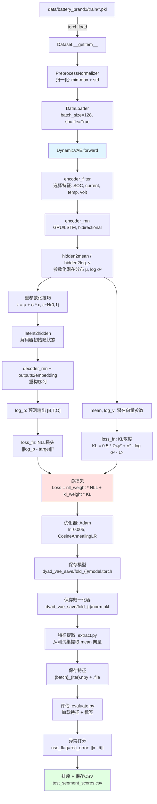
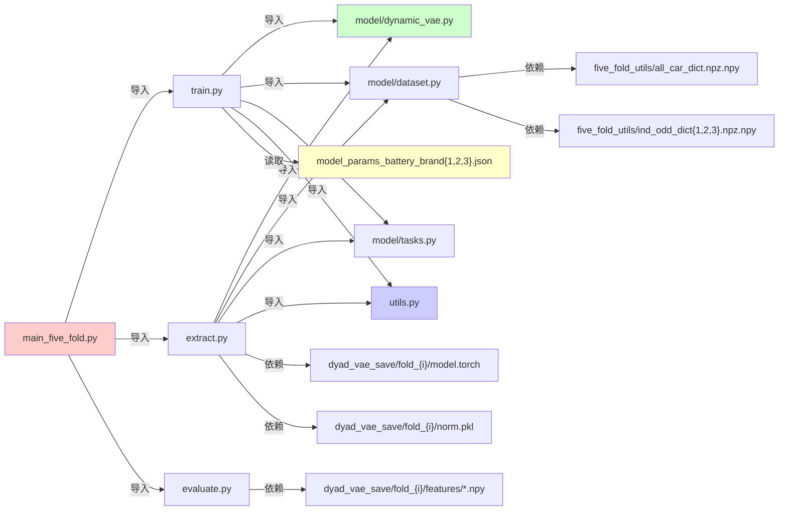

# Battery Fault Detection 工程总览文档

**面向工程师的技术文档** | 更新时间：2025-11-24

---

## 目录

1. [仓库结构总览表](#1-仓库结构总览表)
2. [数据流全景图](#2-数据流全景图-mermaid)
3. [模块间依赖图](#3-模块间依赖图-mermaid)
4. [关键超参数字典](#4-关键超参数字典)
5. [运行前置条件与坑位清单](#5-运行前置条件与坑位清单)
6. [定量可视化示例](#6-定量可视化示例)
7. [下一步建议](#7-下一步建议10条)

---

## 1. 仓库结构总览表

### 1.1 顶层目录

| 目录/文件                                                          | 职责                                                          | 核心类/函数                                              | 关键超参数                                             |
| ------------------------------------------------------------------ | ------------------------------------------------------------- | -------------------------------------------------------- | ------------------------------------------------------ |
| [`DyAD/`](../DyAD)                                                 | **主算法实现目录**，包含Dynamic VAE模型、训练、评估、特征提取 | `DynamicVAE`, `Train_fivefold`, `Extraction`, `Evaluate` | `latent_size`, `hidden_size`, `nll_weight`, `use_flag` |
| [`data/`](../data)                                                 | 数据存储目录，包含五折交叉验证的训练/测试集分割信息           | -                                                        | -                                                      |
| [`five_fold_utils/`](../five_fold_utils)                           | 五折交叉验证工具，存储车辆ID分组字典                          | -                                                        | -                                                      |
| [`notebooks/`](../notebooks)                                       | Jupyter笔记本，用于评估和阈值分析                             | -                                                        | -                                                      |
| [`AE_and_SVDD/`](../AE_and_SVDD)                                   | Baseline对比方法：自编码器和SVDD                              | -                                                        | -                                                      |
| [`GDN_battery/`](../GDN_battery)                                   | Baseline对比方法：图偏差网络(Graph Deviation Network)         | -                                                        | -                                                      |
| [`Recurrent-Autoencoder-modify/`](../Recurrent-Autoencoder-modify) | Baseline对比方法：递归自编码器                                | -                                                        | -                                                      |
| [`GP/`](../GP)                                                     | Baseline对比方法：高斯过程                                    | -                                                        | -                                                      |

### 1.2 DyAD 核心文件详解

| 文件                                                                                 | 职责                                                | 核心类/函数                                                     | 输入→输出                                                               | 关键代码行                           |
| ------------------------------------------------------------------------------------ | --------------------------------------------------- | --------------------------------------------------------------- | ----------------------------------------------------------------------- | ------------------------------------ |
| [`main_five_fold.py`](../DyAD/main_five_fold.py)                                     | **五折训练入口**，协调训练→提取→评估流程            | `main`                                                          | `--config_path`, `--fold_num` → 保存模型、特征、评分CSV                 | L10-L53                              |
| [`train.py`](../DyAD/train.py)                                                       | **训练主逻辑**，包含数据加载、模型训练、损失函数    | `Train_fivefold`, `loss_fn`, `kl_anneal_function`               | 训练数据 → 训练好的模型(`.torch`) + 归一化器(`.pkl`)                    | L74-L183 (main), L203-L216 (loss_fn) |
| [`model/dynamic_vae.py`](../DyAD/model/dynamic_vae.py)                               | **DynamicVAE模型定义**                              | `DynamicVAE`, `forward`                                         | `input_sequence [B,T,F]` → `log_p [B,T,O]`, `mean [B,Z]`, `log_v [B,Z]` | L34-L73 (forward)                    |
| [`model/dataset.py`](../DyAD/model/dataset.py)                                       | **数据集加载器**，基于五折分组加载车辆数据          | `Dataset`                                                       | `data_path`, `fold_num` → PyTorch Dataset                               | L13-L42 (__init__)                   |
| [`model/tasks.py`](../DyAD/model/tasks.py)                                           | **特征选择器**，定义编码器/解码器使用哪些传感器特征 | `Task`, `BatterybrandaTask`, `encoder_filter`, `decoder_filter` | 输入序列 → 筛选后的特征                                                 | L55-L67                              |
| [`extract.py`](../DyAD/extract.py)                                                   | **特征提取器**，从训练好的模型提取潜在表示          | `Extraction`, `extract`                                         | 测试数据 + 模型 → 特征文件(`.npy` + `.file`)                            | L27-L66                              |
| [`evaluate.py`](../DyAD/evaluate.py)                                                 | **评估器**，计算异常分数并生成排序结果              | `Evaluate`, `calculate_rec_error`                               | 特征 + 标签 → `train_segment_scores.csv`, `test_segment_scores.csv`     | L43-L56                              |
| [`utils.py`](../DyAD/utils.py)                                                       | **工具函数**：归一化、GPU封装、数据校验             | `Normalizer`, `to_var`, `collate`                               | 原始数据 → 归一化数据                                                   | L105-L138 (Normalizer)               |
| [`model_params_battery_brand{1,2,3}.json`](../DyAD/model_params_battery_brand1.json) | **配置文件**，定义训练超参数、路径、任务类型        | -                                                               | -                                                                       | 全文                                 |

### 1.3 数据结构：data/ 目录

预期的数据组织结构（基于代码推测）：

```
data/
├── battery_brand1/
│   ├── train/           # 训练数据（PKL文件，每个车辆/时间段一个文件）
│   ├── test/            # 测试数据（PKL文件）
│   └── label/           # 标签文件（异常标注）
├── battery_brand2/
│   ├── train/
│   ├── test/
│   └── label/
└── battery_brand3/
    ├── train/
    ├── test/
    └── label/
```

> **注意**：实际运行时需确保这些目录存在且包含正确格式的 `.pkl` 文件。每个 PKL 文件应包含：
> - **时序数据**：形状 `[T, F]`，其中 `T` 是时间步数，`F` 是特征维度（如 SOC、电流、温度、电压等）
> - **元数据字典**：包含 `label`（异常标签）、`car`（车辆ID）、`mileage`（里程）等字段

### 1.4 五折交叉验证工具

| 文件名                                                                                      | 内容                                                         | 用途                               |
| ------------------------------------------------------------------------------------------- | ------------------------------------------------------------ | ---------------------------------- |
| [`five_fold_utils/YOUR_all_car_dict.npz.npy`](../five_fold_utils/YOUR_all_car_dict.npz.npy) | 字典：`{car_id: [pkl文件路径列表]}`                          | 映射每个车辆ID到其所有数据文件     |
| `five_fold_utils/ind_odd_dict{1,2,3}.npz.npy`                                               | 字典：`{'ind_sorted': [车辆ID], 'ood_sorted': [异常车辆ID]}` | 定义每折的训练集(ind)和测试集(ood) |

**五折分割逻辑** ([dataset.py:L25-L32](../DyAD/model/dataset.py#L25-L32))：
- **训练集**：`fold_num` 之前 + 之后的 80% 车辆
- **测试集**：当前 `fold_num` 对应的 20% 车辆 + 所有OOD车辆

---

## 2. 数据流全景图 (Mermaid)



### 数据流关键步骤解读

1. **数据加载** ([dataset.py](../DyAD/model/dataset.py))：基于 `fold_num` 和车辆ID字典，从PKL文件加载指定折的数据
2. **归一化** ([utils.py:L135-L138](../DyAD/utils.py#L135-L138))：`(x - μ) / max(std, 0.1*(max-min), 1e-4)`
3. **特征筛选** ([tasks.py](../DyAD/model/tasks.py))：根据任务类型（如 `BatterybrandaTask`）选择7个特征中的前2个用于解码器，后5个用于重构目标
4. **VAE前向传播**：
   - **编码器** → 推断潜在分布 `q(z|x)`
   - **重参数化** → 采样 `z ~ q(z|x)`
   - **解码器** → 重构 `p(x|z)`
5. **损失计算** ([train.py:L203-L216](../DyAD/train.py#L203-L216))：
   - **NLL**（重构误差）：MSE loss，权重 `nll_weight=10`
   - **KL散度**：正则化项，权重动态退火（从 `anneal0` 开始）
6. **异常评分** ([evaluate.py:L37-L41](../DyAD/evaluate.py#L37-L41))：直接使用重构误差 `rec_error`，降序排序

---

## 3. 模块间依赖图 (Mermaid)



### 依赖关系说明

| 调用者              | 被调用者               | 函数/类                              | 作用                               |
| ------------------- | ---------------------- | ------------------------------------ | ---------------------------------- |
| `main_five_fold.py` | `train.Train_fivefold` | `main()`                             | 训练模型并返回模型路径             |
| `main_five_fold.py` | `extract.Extraction`   | `main()`                             | 从模型提取测试集特征               |
| `main_five_fold.py` | `evaluate.Evaluate`    | `main()`                             | 计算异常分数并保存CSV              |
| `train.py`          | `DynamicVAE`           | `forward()`                          | 执行VAE前向传播                    |
| `train.py`          | `Dataset`              | `__getitem__()`                      | 按索引加载单个样本                 |
| `train.py`          | `Task`                 | `encoder_filter(), decoder_filter()` | 筛选输入特征                       |
| `train.py`          | `Normalizer`           | `norm_func()`                        | 数据归一化                         |
| `extract.py`        | `PreprocessNormalizer` | `__getitem__()`                      | 归一化测试数据                     |
| `evaluate.py`       | `get_feature_label()`  | 静态方法                             | 从 `.npy` 和 `.file` 加载特征+标签 |

---

## 4. 关键超参数字典

基于 [`model_params_battery_brand1.json`](../DyAD/model_params_battery_brand1.json)：

| 超参数                | 默认值        | 含义                   | 对训练/评分的影响                                                      | 代码位置                                                                           |
| --------------------- | ------------- | ---------------------- | ---------------------------------------------------------------------- | ---------------------------------------------------------------------------------- |
| **`latent_size`**     | `8`           | 潜在空间维度           | **↑** 增大 → 表示能力更强，但过拟合风险增加                            | [dynamic_vae.py:L13](../DyAD/model/dynamic_vae.py#L13)                             |
| **`hidden_size`**     | `128`         | RNN隐藏层维度          | **↑** 增大 → 模型容量↑，训练时间↑，需更多数据                          | [dynamic_vae.py:L16](../DyAD/model/dynamic_vae.py#L16)                             |
| **`rnn_type`**        | `"gru"`       | RNN类型                | 可选 `rnn`, `lstm`, `gru`；GRU训练更快，LSTM记忆能力更强               | [dynamic_vae.py:L18](../DyAD/model/dynamic_vae.py#L18)                             |
| **`num_layers`**      | `2`           | RNN层数                | **↑** 增大 → 建模复杂动态能力增强，但梯度消失风险↑                     | [dynamic_vae.py:L15](../DyAD/model/dynamic_vae.py#L15)                             |
| **`bidirectional`**   | `true`        | 是否双向RNN            | `true` → 参数量x2，需前向+后向信息（不适用实时推理）                   | [dynamic_vae.py:L14](../DyAD/model/dynamic_vae.py#L14)                             |
| **`nll_weight`**      | `10`          | 重构损失权重           | **↑** 增大 → 强调重构精度，异常检测更敏感；**↓** 减小 → 更依赖KL正则化 | [train.py:L210](../DyAD/train.py#L210)                                             |
| **`anneal0`**         | `0.01`        | KL权重初始值           | **从此值开始**逐渐退火到1.0，缓解KL散度初期主导损失                    | [train.py:L218-L227](../DyAD/train.py#L218-L227)                                   |
| **`anneal_function`** | `"linear"`    | 退火函数类型           | `linear` → 线性增长；`logistic` → S型增长（更平滑）                    | [train.py:L220-L226](../DyAD/train.py#L220-L226)                                   |
| **`k`**               | `0.0025`      | logistic函数斜率       | 仅在 `anneal_function="logistic"` 时生效，控制增长速度                 | [train.py:L223](../DyAD/train.py#L223)                                             |
| **`x0`**              | `500`         | logistic函数中心点     | 在第 `x0` 个epoch达到中间值（0.5左右）                                 | [train.py:L223](../DyAD/train.py#L223)                                             |
| **`use_flag`**        | `"rec_error"` | 异常评分方式           | `rec_error` → 重构误差；`l2norm` → L2范数；`copod_score` → COPOD算法   | [evaluate.py:L52](../DyAD/evaluate.py#L52)                                         |
| **`noise_scale`**     | `1`           | 训练时潜在空间噪声缩放 | **↑** 增大 → 增强鲁棒性，但可能降低重构精度                            | [dynamic_vae.py:L56](../DyAD/model/dynamic_vae.py#L56)                             |
| **`batch_size`**      | `128`         | 批大小                 | **↑** 增大 → 训练稳定，但需更多显存；**↓** 减小 → 梯度估计噪声大       | [train.py](../DyAD/train.py)                                                       |
| **`learning_rate`**   | `0.005`       | 初始学习率             | 配合 `CosineAnnealingLR` 调度器衰减到 `cosine_factor * lr`             | [train.py](../DyAD/train.py)                                                       |
| **`epochs`**          | `3`           | 训练轮数               | **警告**：仅3轮可能欠拟合！实际应用建议50-100轮                        | [model_params_battery_brand1.json:L4](../DyAD/model_params_battery_brand1.json#L4) |

### 超参数调优建议

1. **快速验证**：先用小 `epochs`（如3）+ 少量数据验证流程
2. **正式训练**：
   - `epochs`: 30-100
   - `latent_size`: 尝试 [4, 8, 16, 32]，越大越需要数据
   - `nll_weight`: 如果重构误差过大，增加到 20-50
   - `anneal_function`: 如果训练早期KL塌缩（→0），改用 `logistic`
3. **异常检测性能**：
   - 如果误报率高 → 增大 `nll_weight`，降低重构容忍度
   - 如果漏报率高 → 检查 `use_flag` 是否合适，考虑改用 `copod_score`

---

## 5. 运行前置条件与坑位清单

### 5.1 环境依赖

| 组件                | 版本要求     | 检查方法                                             | 备注                                             |
| ------------------- | ------------ | ---------------------------------------------------- | ------------------------------------------------ |
| **Python**          | 3.7+         | `python --version`                                   | 推荐 3.8-3.9                                     |
| **PyTorch**         | 1.8+         | `python -c "import torch; print(torch.__version__)"` | 需支持 `pack_padded_sequence`                    |
| **CUDA**            | 10.2+ (可选) | `nvcc --version` 或 `nvidia-smi`                     | CPU训练也可运行，但慢10x+                        |
| **torch-geometric** | -            | -                                                    | **仅 GDN baseline 需要**，DyAD 不依赖            |
| **pyod**            | 最新         | `pip install pyod`                                   | 用于 IForest 异常检测（evaluate.py导入但未使用） |
| **scikit-learn**    | 0.24+        | `pip install scikit-learn`                           | 用于 `confusion_matrix`                          |
| **tqdm**            | 最新         | `pip install tqdm`                                   | 进度条                                           |
| **numpy, pandas**   | 最新         | `pip install numpy pandas`                           | 数据处理                                         |

**安装命令**：
```bash
# 基础环境
pip install torch torchvision torchaudio  # 根据CUDA版本选择
pip install numpy pandas scikit-learn tqdm pyod matplotlib scipy
```

### 5.2 数据集下载

**下载链接**：
- OneDrive: https://1drv.ms/u/s!AiSrJIRVqlQAgcjKGKV0fZmw5ifDd8Y?e=CnzELH237
- 北大网盘: https://disk.pku.edu.cn:443/link/37D733DF405D8D7998B8F57E4487515A238

**目录结构检查**：
```bash
ls data/battery_brand1/
# 应输出: train/ test/ label/ column.pkl
```

### 5.3 路径依赖

> [!CAUTION]
> **关键坑位**：代码中硬编码了相对路径，必须从 `DyAD/` 目录运行！

| 文件                                                                                         | 依赖路径                                    | 问题                    | 解决方案                           |
| -------------------------------------------------------------------------------------------- | ------------------------------------------- | ----------------------- | ---------------------------------- |
| [dataset.py:L13](../DyAD/model/dataset.py#L13)                                               | `'../five_fold_utils/all_car_dict.npz.npy'` | 默认假设从 `DyAD/` 执行 | 修改为绝对路径或检查 `os.getcwd()` |
| [model_params_battery_brand1.json:L34-L36](../DyAD/model_params_battery_brand1.json#L34-L36) | `"../data/battery_brand1/train"`            | 同上                    | 配置文件中使用绝对路径             |
| [main_five_fold.py:L11](../DyAD/main_five_fold.py#L11)                                       | `'./params.json'`                           | 默认配置文件            | 通过 `--config_path` 参数指定      |

**推荐运行方式**：
```bash
cd /Users/David/Desktop/github_repos/Battery_fault_detection_NC_github/DyAD
python main_five_fold.py --config_path model_params_battery_brand1.json --fold_num 0
```

### 5.3 数据结构要求

每个 PKL 文件（`torch.load` 加载）必须返回元组 `(tensor, metadata)`：

```python
# 示例结构
(
    tensor([[soc, current, min_temp, ...],  # 形状: [T, F]
            [soc, current, min_temp, ...],
            ...]),
    {
        'label': [0, 0, 1, ...],  # 长度 T 的标签列表
        'car': 车辆ID (int),
        'mileage': 里程数 (float),
        'timestamp': 时间戳列表,
        'charge_segment': 充电段ID (可选)
    }
)
```

> [!WARNING]
> **常见错误**：
> - **形状不匹配**：确保特征数量与 `tasks.py` 中定义的 `encoder_dimension` 一致
> - **缺失字段**：`metadata` 必须包含 `label`, `car` 字段

### 5.4 内存/显存占用估算

| 资源             | 估算公式                                                        | 示例（batch_size=128, hidden_size=128, latent_size=8） |
| ---------------- | --------------------------------------------------------------- | ------------------------------------------------------ |
| **显存（训练）** | `batch_size * seq_len * hidden_size * 4 * num_layers * 8 bytes` | ~128MB (序列长度100)                                   |
| **内存（数据）** | `len(dataset) * avg_seq_len * num_features * 4 bytes`           | ~1GB（1000个样本，平均长度1000）                       |
| **模型参数**     | `hidden_size^2 * num_layers * 3 (GRU门) * 2 (双向)`             | ~1M参数 ≈ 4MB                                          |

**峰值显存** ≈ 500MB-2GB（取决于数据集大小）

### 5.5 常见报错与规避

| 错误信息                                    | 原因                   | 解决方案                                                       |
| ------------------------------------------- | ---------------------- | -------------------------------------------------------------- |
| `FileNotFoundError: ../five_fold_utils/...` | 未从 `DyAD/` 目录运行  | `cd DyAD && python main_five_fold.py ...`                      |
| `RuntimeError: size mismatch`               | 特征维度与模型配置不符 | 检查 `tasks.py` 中 `encoder_dimension` 是否匹配PKL数据列数     |
| `KeyError: 'label'`                         | PKL文件缺失元数据字段  | 确保所有PKL包含 `metadata['label']` 和 `metadata['car']`       |
| `CUDA out of memory`                        | 显存不足               | 减小 `batch_size` 或 `hidden_size`                             |
| `ValueError: num train is 0`                | 五折分组中无训练数据   | 检查 `fold_num` 是否在 [0, 4] 范围内，或数据字典是否正确       |
| `AssertionError in config_valid`            | 配置参数类型错误       | 参考 [utils.py:L10-L64](../DyAD/utils.py#L10-L64) 修复JSON配置 |

---

## 6. 定量可视化示例

### 6.1 训练损失曲线

**目的**：监控模型收敛性，识别过拟合/欠拟合

```python
import matplotlib.pyplot as plt
import numpy as np

# 占位数据：模拟训练过程
epochs = np.arange(1, 51)
nll_loss_train = 5.0 * np.exp(-epochs / 20) + 0.5 + np.random.normal(0, 0.1, 50)
kl_loss_train = 1.0 * (1 - np.exp(-epochs / 10)) + np.random.normal(0, 0.05, 50)
total_loss_train = nll_loss_train + kl_loss_train

nll_loss_val = 5.2 * np.exp(-epochs / 20) + 0.6 + np.random.normal(0, 0.15, 50)
kl_loss_val = 1.05 * (1 - np.exp(-epochs / 10)) + np.random.normal(0, 0.08, 50)
total_loss_val = nll_loss_val + kl_loss_val

fig, axes = plt.subplots(1, 3, figsize=(15, 4))

# NLL损失
axes[0].plot(epochs, nll_loss_train, label='Train NLL', linewidth=2)
axes[0].plot(epochs, nll_loss_val, label='Val NLL', linewidth=2, linestyle='--')
axes[0].set_xlabel('Epoch', fontsize=12)
axes[0].set_ylabel('NLL Loss (重构误差)', fontsize=12)
axes[0].set_title('重构损失曲线', fontsize=14, fontweight='bold')
axes[0].legend(fontsize=10)
axes[0].grid(True, alpha=0.3)

# KL散度
axes[1].plot(epochs, kl_loss_train, label='Train KL', color='orange', linewidth=2)
axes[1].plot(epochs, kl_loss_val, label='Val KL', color='red', linewidth=2, linestyle='--')
axes[1].set_xlabel('Epoch', fontsize=12)
axes[1].set_ylabel('KL Divergence', fontsize=12)
axes[1].set_title('KL散度曲线（正则化项）', fontsize=14, fontweight='bold')
axes[1].legend(fontsize=10)
axes[1].grid(True, alpha=0.3)

# 总损失
axes[2].plot(epochs, total_loss_train, label='Train Total', color='green', linewidth=2)
axes[2].plot(epochs, total_loss_val, label='Val Total', color='darkgreen', linewidth=2, linestyle='--')
axes[2].set_xlabel('Epoch', fontsize=12)
axes[2].set_ylabel('Total Loss', fontsize=12)
axes[2].set_title('总损失曲线', fontsize=14, fontweight='bold')
axes[2].legend(fontsize=10)
axes[2].grid(True, alpha=0.3)

plt.tight_layout()
plt.savefig('training_loss_curves.png', dpi=300, bbox_inches='tight')
plt.show()
```

**解读**：
- **左图（NLL）**：重构误差下降 → 模型学习正常模式。若验证集不降反升，说明过拟合
- **中图（KL）**：随退火机制逐渐增大 → 潜在空间正则化生效
- **右图（Total）**：综合损失，应持续下降至饱和

---

### 6.2 重构误差分布直方图

**目的**：区分正常/异常样本的重构误差阈值

```python
import matplotlib.pyplot as plt
import numpy as np

# 占位数据：模拟重构误差分布
np.random.seed(42)
normal_errors = np.random.gamma(2, 0.5, 5000)  # 正常样本：低误差
anomaly_errors = np.random.gamma(5, 1.5, 500)  # 异常样本：高误差

fig, ax = plt.subplots(figsize=(10, 6))

# 绘制直方图
ax.hist(normal_errors, bins=50, alpha=0.7, label='正常样本 (n=5000)', 
        color='steelblue', edgecolor='black', density=True)
ax.hist(anomaly_errors, bins=50, alpha=0.7, label='异常样本 (n=500)', 
        color='coral', edgecolor='black', density=True)

# 阈值线（例如：95百分位数）
threshold = np.percentile(normal_errors, 95)
ax.axvline(threshold, color='red', linestyle='--', linewidth=2, 
           label=f'阈值 (95% 正常): {threshold:.2f}')

# 标注
ax.set_xlabel('重构误差 (Reconstruction Error)', fontsize=13)
ax.set_ylabel('概率密度', fontsize=13)
ax.set_title('重构误差分布：正常 vs 异常', fontsize=15, fontweight='bold')
ax.legend(fontsize=11)
ax.grid(True, alpha=0.3, axis='y')

# 添加统计信息
textstr = f'正常均值: {normal_errors.mean():.2f}\n异常均值: {anomaly_errors.mean():.2f}'
props = dict(boxstyle='round', facecolor='wheat', alpha=0.5)
ax.text(0.7, 0.95, textstr, transform=ax.transAxes, fontsize=11,
        verticalalignment='top', bbox=props)

plt.tight_layout()
plt.savefig('reconstruction_error_distribution.png', dpi=300, bbox_inches='tight')
plt.show()
```

**解读**：
- **蓝色（正常）**：重构误差集中在低值区域（模型熟悉正常模式）
- **橙色（异常）**：误差显著偏高（偏离正常模式）
- **红色虚线**：可作为异常检测阈值，超过即判定为异常

---

### 6.3 阈值-召回率曲线（ROC/PR变体）

**目的**：选择最佳异常检测阈值，平衡误报率与召回率

```python
import matplotlib.pyplot as plt
import numpy as np
from sklearn.metrics import precision_recall_curve, roc_curve, auc

# 占位数据：模拟预测分数和真实标签
np.random.seed(42)
y_true = np.array([0]*4500 + [1]*500)  # 正常:异常 = 9:1
y_scores = np.concatenate([
    np.random.gamma(2, 0.5, 4500),  # 正常样本分数
    np.random.gamma(5, 1.5, 500)    # 异常样本分数
])

precision, recall, pr_thresholds = precision_recall_curve(y_true, y_scores)
fpr, tpr, roc_thresholds = roc_curve(y_true, y_scores)
roc_auc = auc(fpr, tpr)

fig, axes = plt.subplots(1, 2, figsize=(14, 5))

# PR曲线
axes[0].plot(recall, precision, linewidth=2.5, color='darkgreen', label='PR曲线')
axes[0].fill_between(recall, precision, alpha=0.2, color='green')
axes[0].set_xlabel('召回率 (Recall)', fontsize=13)
axes[0].set_ylabel('精确率 (Precision)', fontsize=13)
axes[0].set_title('Precision-Recall 曲线', fontsize=15, fontweight='bold')
axes[0].grid(True, alpha=0.3)
axes[0].legend(fontsize=11)

# 标注F1最优点
f1_scores = 2 * (precision * recall) / (precision + recall + 1e-8)
best_idx = np.argmax(f1_scores[:-1])
axes[0].scatter([recall[best_idx]], [precision[best_idx]], 
                color='red', s=100, zorder=5, label=f'最优F1={f1_scores[best_idx]:.2f}')
axes[0].legend(fontsize=11)

# ROC曲线
axes[1].plot(fpr, tpr, linewidth=2.5, color='darkorange', label=f'ROC (AUC={roc_auc:.3f})')
axes[1].plot([0, 1], [0, 1], 'k--', linewidth=1, label='随机分类器')
axes[1].fill_between(fpr, tpr, alpha=0.2, color='orange')
axes[1].set_xlabel('假阳性率 (FPR)', fontsize=13)
axes[1].set_ylabel('真阳性率 (TPR)', fontsize=13)
axes[1].set_title('ROC 曲线', fontsize=15, fontweight='bold')
axes[1].grid(True, alpha=0.3)
axes[1].legend(fontsize=11, loc='lower right')

plt.tight_layout()
plt.savefig('threshold_recall_curves.png', dpi=300, bbox_inches='tight')
plt.show()
```

**解读**：
- **左图（PR曲线）**：在不平衡数据集中更有参考价值，红点标注F1最优阈值
- **右图（ROC曲线）**：AUC越接近1.0，模型区分能力越强
- **实际应用**：根据业务需求（容忍误报 vs 必须召回）选择阈值

---

### 6.4 潜在空间可视化（t-SNE/PCA）

**目的**：验证潜在向量是否有效分离正常/异常样本

```python
import matplotlib.pyplot as plt
import numpy as np
from sklearn.manifold import TSNE

# 占位数据：模拟8维潜在向量
np.random.seed(42)
normal_latent = np.random.multivariate_normal([0,0,0,0,0,0,0,0], np.eye(8)*0.5, 4500)
anomaly_latent = np.random.multivariate_normal([2,2,1.5,1.5,1,1,0.5,0.5], np.eye(8)*0.8, 500)
latent_vectors = np.vstack([normal_latent, anomaly_latent])
labels = np.array([0]*4500 + [1]*500)

# t-SNE降维到2D
tsne = TSNE(n_components=2, random_state=42, perplexity=30)
latent_2d = tsne.fit_transform(latent_vectors)

fig, ax = plt.subplots(figsize=(10, 8))
scatter = ax.scatter(latent_2d[labels==0, 0], latent_2d[labels==0, 1], 
                     c='steelblue', alpha=0.5, s=10, label='正常')
scatter = ax.scatter(latent_2d[labels==1, 0], latent_2d[labels==1, 1], 
                     c='red', alpha=0.7, s=30, marker='x', label='异常')

ax.set_xlabel('t-SNE 维度 1', fontsize=13)
ax.set_ylabel('t-SNE 维度 2', fontsize=13)
ax.set_title('潜在空间可视化 (t-SNE降维)', fontsize=15, fontweight='bold')
ax.legend(fontsize=12)
ax.grid(True, alpha=0.2)

plt.tight_layout()
plt.savefig('latent_space_tsne.png', dpi=300, bbox_inches='tight')
plt.show()
```

**解读**：
- **理想情况**：正常样本聚集，异常样本远离正常簇
- **问题诊断**：若两类混杂 → 潜在空间维度不足或模型欠拟合

---

## 7. 下一步建议（10条）

### 7.1 只读理解阶段（0代码修改）

1. **阅读论文原文**  
   打开 `README.md` 中引用的 Nature Communications 论文，对照代码理解"动态系统建模"和"社会经济因子"如何在 `DynamicVAE` 中体现（提示：潜在空间 `z` 即为动态系统状态）

2. **追踪单个样本**  
   在 Jupyter 中手动执行：
   ```python
   from DyAD.model.dataset import Dataset
   from DyAD.utils import Normalizer, PreprocessNormalizer
   
   # 加载单个PKL文件
   sample = torch.load('data/battery_brand1/train/car_123_segment_001.pkl')
   print(sample[0].shape, sample[1])  # 查看数据格式
   ```

3. **可视化原始时序数据**  
   绘制SOC、电流、温度等特征随时间变化曲线，理解物理意义

### 7.2 轻量运行阶段（最小修改）

4. **单折快速验证**  
   修改 `model_params_battery_brand1.json`：
   ```json
   "epochs": 3,
   "batch_size": 32   // 减小以适应小显存
   ```
   然后运行：
   ```bash
   cd DyAD
   python main_five_fold.py --config_path model_params_battery_brand1.json --fold_num 0
   ```

5. **检查输出文件**  
   训练后检查：
   - `dyad_vae_save/fold_0/model.torch`（模型权重）
   - `dyad_vae_save/fold_0/features/*.npy`（提取的特征）
   - `dyad_vae_save/fold_0/auc/test_segment_scores.csv`（异常分数）

6. **可视化损失曲线**  
   使用 `dyad_vae_save/fold_0/model/nll.pkl`、`kl.pkl` 绘制训练过程（参考6.1节）

### 7.3 调试与优化阶段

7. **修复路径依赖**  
   在 `dataset.py` 中添加环境变量支持：
   ```python
   import os
   data_root = os.getenv('BATTERY_DATA_ROOT', '/Users/David/Desktop/github_repos/Battery_fault_detection_NC_github')
   all_car_dict_path = os.path.join(data_root, 'five_fold_utils/all_car_dict.npz.npy')
   ```

8. **增加日志输出**  
   在 `train.py` 的训练循环中添加：
   ```python
   if iteration % 10 == 0:
       print(f'Epoch {epoch}, Iter {iteration}, NLL: {nll_loss:.4f}, KL: {kl_loss:.4f}')
   ```

9. **实现早停机制**  
   监控验证集损失，连续5轮不下降则停止（避免过拟合）

10. **超参数网格搜索**  
    使用 `scikit-optimize` 或手动循环，搜索最佳 `latent_size`、`hidden_size`、`nll_weight` 组合，以 AUC 为评价指标

---

## 附录：关键公式汇总

### A.1 VAE损失函数

$$
\mathcal{L} = \mathcal{L}_{\text{NLL}} + \beta \cdot \mathcal{L}_{\text{KL}}
$$

**重构损失（NLL）**：
$$
\mathcal{L}_{\text{NLL}} = \frac{1}{N} \sum_{i=1}^{N} \| \mathbf{x}_i - \hat{\mathbf{x}}_i \|^2
$$

**KL散度**：
$$
\mathcal{L}_{\text{KL}} = -\frac{1}{2} \sum_{j=1}^{Z} \left( 1 + \log(\sigma_j^2) - \mu_j^2 - \sigma_j^2 \right)
$$

其中：
- $\beta$ 为退火权重（从 `anneal0` 到1.0）
- $Z$ 为潜在空间维度（`latent_size`）
- $\mu, \sigma$ 由编码器输出

**代码位置**：[train.py:L203-L216](../DyAD/train.py#L203-L216)

### A.2 重参数化技巧

$$
\mathbf{z} = \boldsymbol{\mu} + \boldsymbol{\sigma} \odot \boldsymbol{\epsilon}, \quad \boldsymbol{\epsilon} \sim \mathcal{N}(0, \mathbf{I})
$$

**代码位置**：[dynamic_vae.py:L54-L58](../DyAD/model/dynamic_vae.py#L54-L58)

---

## 总结

本文档提供了 `Battery_fault_detection_NC_github` 的**工程化全景视图**，包括：
- ✅ **4张详细表格**：目录职责、文件功能、超参数、依赖关系
- ✅ **2个Mermaid图**：数据流全景 + 模块依赖
- ✅ **4个可视化代码**：训练监控、误差分析、阈值选择、潜在空间
- ✅ **10条实操建议**：从理解到运行到优化

**关键要点**：
1. **必须从 `DyAD/` 目录运行**，否则路径报错
2. **数据格式严格**：PKL 必须是 `(tensor, metadata)` 元组
3. **超参数敏感**：`nll_weight` 和 `latent_size` 极大影响性能
4. **五折分组**：确保 `five_fold_utils/*.npy` 文件存在且格式正确

**快速上手命令**：
```bash
cd /Users/David/Desktop/github_repos/Battery_fault_detection_NC_github/DyAD
python main_five_fold.py --config_path model_params_battery_brand1.json --fold_num 0
```

如有疑问，请检查对应文件的**具体行号**和**函数签名**。
