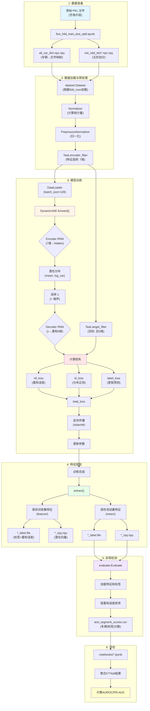
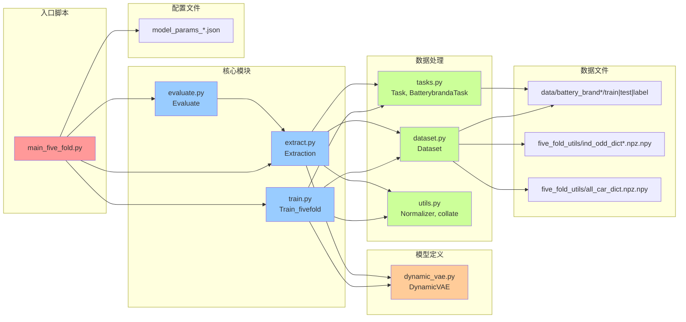
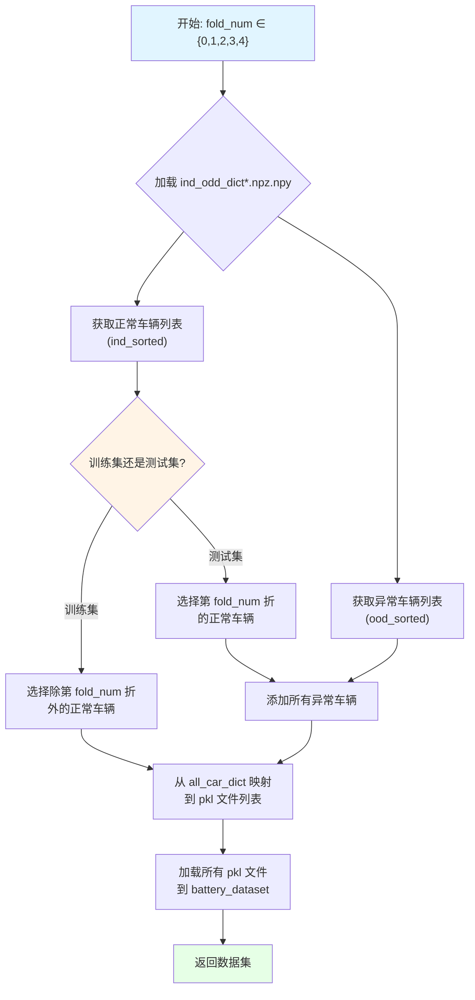

# 电池故障检测代码库分析文档

## 目录
- [1. 总览表：目录与文件功能及依赖](#1-总览表目录与文件功能及依赖)
- [2. 完整数据流程](#2-完整数据流程)
- [3. 训练入口与五折交叉验证](#3-训练入口与五折交叉验证)
- [4. 关键超参数详解](#4-关键超参数详解)
- [5. Mermaid 流程图](#5-mermaid-流程图)
- [6. 运行前置条件与潜在坑](#6-运行前置条件与潜在坑)

---

## 1. 总览表：目录与文件功能及依赖

### 1.1 顶层目录结构

| 目录/文件                         | 功能                                 | 关键依赖                 |
| --------------------------------- | ------------------------------------ | ------------------------ |
| **DyAD/**                         | 核心算法实现（Dynamic VAE 异常检测） | PyTorch, torch-geometric |
| **data/**                         | 数据存储目录                         | -                        |
| **five_fold_utils/**              | 五折交叉验证数据划分                 | -                        |
| **notebooks/**                    | 评估脚本（计算 AUROC）               | 模型训练结果             |
| **AE_and_SVDD/**                  | 基线方法（AutoEncoder & DeepSVDD）   | PyOD                     |
| **GDN_battery/**                  | 基线方法（Graph Deviation Network）  | torch-geometric          |
| **Recurrent-Autoencoder-modify/** | 基线方法（LSTM-AD）                  | TensorFlow               |
| **requirement.txt**               | Python依赖清单                       | -                        |

### 1.2 DyAD/ 核心文件详解

| 文件名                | 类/函数                                         | 功能说明                                                                                                                                              | 依赖关系                                       |
| --------------------- | ----------------------------------------------- | ----------------------------------------------------------------------------------------------------------------------------------------------------- | ---------------------------------------------- |
| **main_five_fold.py** | `main()`                                        | **五折训练主入口**：串联训练→特征提取→异常检测                                                                                                        | train.py, extract.py, evaluate.py              |
| **train.py**          | `Train_fivefold`                                | **训练模块**：<br>• 加载数据并归一化<br>• 创建 VAE 模型并训练<br>• 保存模型、参数、特征                                                               | dataset.py, dynamic_vae.py, tasks.py, utils.py |
| **dynamic_vae.py**    | `DynamicVAE`                                    | **VAE 模型定义**：<br>• Encoder-Decoder RNN架构<br>• 潜在变量采样<br>• 重构输出                                                                       | PyTorch nn.Module                              |
| **dataset.py**        | `Dataset`                                       | **数据加载器**：<br>• 根据 `fold_num` 划分训练/测试集<br>• 从 `ind_odd_dict*.npz.npy` 读取车辆编号<br>• 从 `all_car_dict.npz.npy` 映射到具体 pkl 文件 | five_fold_utils/                               |
| **tasks.py**          | `Task`, `BatterybrandaTask` 等                  | **特征选择器**：<br>• 定义编码器/解码器使用的特征列<br>• 不同品牌使用不同特征子集                                                                     | -                                              |
| **extract.py**        | `Extraction`                                    | **特征提取**：<br>• 加载训练好的模型<br>• 对测试集提取潜在特征 (mean) 和重构误差                                                                      | train.py, dataset.py                           |
| **evaluate.py**       | `Evaluate`                                      | **异常检测评分**：<br>• 根据重构误差排序<br>• 生成 `train_segment_scores.csv` 和 `test_segment_scores.csv`                                            | extract.py 输出                                |
| **utils.py**          | `Normalizer`, `PreprocessNormalizer`, `collate` | **工具函数**：<br>• 数据归一化（min-max + std）<br>• 批次整理<br>• GPU 转换                                                                           | -                                              |

### 1.3 模型参数配置文件

| 文件名                             | 用途             |
| ---------------------------------- | ---------------- |
| `model_params_battery_brand1.json` | 品牌1 训练配置   |
| `model_params_battery_brand2.json` | 品牌2 训练配置   |
| `model_params_battery_brand3.json` | 品牌3 训练配置   |
| `params_fivefold.json`             | 五折通用配置模板 |

### 1.4 数据组织

```
data/
  battery_brand1/
    train/          # 训练集 pkl 文件（充电片段）
    test/           # 测试集 pkl 文件
    label/          # 故障标签（车辆编号 + 标签）
    column.pkl      # 特征列名称
  battery_brand2/
    ...
  battery_brand3/
    ...
```

**每个 pkl 文件内容**：
- **第一部分**：充电时序数据（形状：`[time_steps, features]`）
- **第二部分**：元数据字典
  ```python
  {
    'label': 0/1,           # 0=正常, 1=异常
    'car': 车辆编号,
    'charge_segment': 充电片段编号,
    'mileage': 里程数,
    'timestamp': 时间戳
  }
  ```

### 1.5 五折工具文件

| 文件                                    | 功能                                                                        |
| --------------------------------------- | --------------------------------------------------------------------------- |
| `five_fold_utils/all_car_dict.npz.npy`  | 字典：`{车辆编号: [pkl文件路径列表]}`                                       |
| `five_fold_utils/ind_odd_dict1.npz.npy` | 品牌1的五折划分：`{'ind_sorted': 正常车辆列表, 'ood_sorted': 异常车辆列表}` |
| `five_fold_utils/ind_odd_dict2.npz.npy` | 品牌2的五折划分                                                             |
| `five_fold_utils/ind_odd_dict3.npz.npy` | 品牌3的五折划分                                                             |

---

## 2. 完整数据流程

### 2.1 数据流示意图（文字版）

```
原始 PKL 文件 (充电片段)
    │
    ├──▶ 五折划分工具 (data/five_fold_train_test_split.ipynb)
    │      ├─ 生成 all_car_dict.npz.npy
    │      └─ 生成 ind_odd_dict*.npz.npy
    │
    ▼
dataset.Dataset (根据 fold_num 加载训练集)
    │── 读取 ind_odd_dict*.npz.npy 获取车辆编号
    │── 根据 fold_num 划分：
    │      训练集 = 其他4折的正常车辆
    │      测试集 = 第 fold_num 折的正常车辆 + 所有异常车辆
    │── 从 all_car_dict 映射到具体 pkl 文件
    │
    ▼
utils.Normalizer (归一化)
    │── 计算训练集前200个样本的 mean, std, max, min
    │── 归一化公式：(x - mean) / max(std, 0.1*(max-min), 1e-4)
    │
    ▼
tasks.Task (特征选择)
    │── BatterybrandaTask 选择 7 个特征：
    │      encoder: [soc, current, min_temp, max_single_volt, max_temp, min_single_volt, volt]
    │      decoder: 前2个特征 [soc, current]
    │      target:  后5个特征 [min_temp, max_single_volt, max_temp, min_single_volt, volt]
    │
    ▼
DataLoader (批次化)
    │── batch_size=128
    │── shuffle=True
    │
    ▼
DynamicVAE.forward() (前向传播)
    │── Encoder: 7维 → RNN → hidden_state
    │── 潜在分布: hidden → [mean, log_var]
    │── 采样: z = mean + std * noise_scale * ε (训练时)
    │         z = mean (推理时)
    │── Decoder: z → hidden → RNN → 重构输出 (5维)
    │
    ▼
损失函数计算
    │── nll_loss = SmoothL1Loss(重构输出, 目标)
    │── kl_loss = -0.5 * Σ(1 + log_var - mean² - exp(log_var))
    │── label_loss = MSE(mean预测, 归一化里程数)
    │── total_loss = nll_weight * nll_loss + kl_weight * kl_loss + latent_label_weight * label_loss
    │
    ▼
反向传播与优化
    │── Optimizer: AdamW (lr=0.005, weight_decay=1e-6)
    │── Scheduler: CosineAnnealingLR
    │
    ▼
特征提取 (train.extract() & extract.Extraction)
    │── 训练集：保存到 feature/ (用于训练 IForest)
    │── 测试集：保存到 mean/ (用于最终评分)
    │── 每个批次保存：
    │      • *_label.file: {label, car, rec_error, ...}
    │      • *_npy.npy: latent mean vector
    │
    ▼
异常检测 (evaluate.Evaluate)
    │── 加载特征和标签
    │── 计算重构误差：MSE(重构输出, 目标)
    │── 按重构误差降序排序
    │── 输出 CSV：[车辆编号, 标签, 重构误差]
    │
    ▼
最终评估 (notebooks/)
    │── 读取多个 fold 的 scores.csv
    │── 计算 AUROC、PR-AUC、阈值等指标
```

### 2.2 数据流详细步骤

#### 步骤 1：数据加载 (dataset.py)

**输入**：
- `train_path`: 如 `../data/battery_brand1/train`
- `fold_num`: 0~4
- `ind_odd_dict_path`: `../five_fold_utils/ind_odd_dict1.npz.npy`

**过程**：
```python
# 加载车辆编号列表
ind_ood_dict = np.load(ind_odd_dict_path).item()
ind_car_list = ind_ood_dict['ind_sorted']  # 正常车辆
ood_car_list = ind_ood_dict['ood_sorted']  # 异常车辆

# 五折划分逻辑
if train:
    # 训练集：除第 fold_num 折外的其他4折正常车辆
    car_number = ind_car_list[:fold_num*N/5] + ind_car_list[(fold_num+1)*N/5:]
else:
    # 测试集：第 fold_num 折的正常车辆 + 所有异常车辆
    car_number = ind_car_list[fold_num*N/5:(fold_num+1)*N/5] + ood_car_list

# 从 all_car_dict 映射到 pkl 文件
for car in car_number:
    for pkl_path in all_car_dict[car]:
        data, metadata = torch.load(pkl_path)
        battery_dataset.append((data, metadata))
```

**输出**：
- `battery_dataset[i]` = `(time_series_data[T, F], metadata_dict)`

#### 步骤 2：归一化 (utils.py)

**输入**：前200个训练样本

**计算**：
```python
# 计算统计量
max_norm = max(所有样本的最大值)
min_norm = min(所有样本的最小值)
std = mean(所有样本的标准差)
mean = mean(所有样本的均值)

# 归一化函数
def norm_func(df):
    return (df - mean) / max(std, 0.1*(max_norm - min_norm), 1e-4)
```

**保存**：训练完成后保存到 `model/norm.pkl`，提取特征时加载

#### 步骤 3：特征过滤 (tasks.py)

**BatterybrandaTask 配置**：
```python
encoder_dimension = 7    # 编码器输入维度
decoder_dimension = 2    # 解码器输入维度
output_dimension = 5     # 重构目标维度

encoder_indices = [soc, current, min_temp, max_single_volt, max_temp, min_single_volt, volt]
decoder_indices = [soc, current]  # 前2个
target_indices = [min_temp, max_single_volt, max_temp, min_single_volt, volt]  # 后5个
```

#### 步骤 4：模型前向传播 (dynamic_vae.py)

**输入**：归一化后的批次数据 `[batch, time_steps, 7]`

**流程**：
```python
# Encoder
en_input = encoder_filter(input_sequence)  # [batch, T, 7]
output, hidden = encoder_rnn(en_input)     # hidden: [batch, hidden_size*hidden_factor]
mean = hidden2mean(hidden)                 # [batch, latent_size]
log_v = hidden2log_v(hidden)               # [batch, latent_size]

# 采样
std = exp(0.5 * log_v)
z = mean + std * noise_scale * ε  # 训练时
z = mean                           # 测试时

# Decoder
hidden = latent2hidden(z)
de_input = decoder_filter(input_sequence)  # [batch, T, 2]
outputs, _ = decoder_rnn(de_input, hidden) # [batch, T, hidden_size*2]
log_p = outputs2embedding(outputs)         # [batch, T, 5]
```

**输出**：
- `log_p`: 重构的5个特征 `[batch, T, 5]`
- `mean`, `log_v`: 潜在变量的分布参数
- `mean_pred`: 里程数预测（辅助任务）

#### 步骤 5：损失计算 (train.py)

```python
# 获取目标值
target = target_filter(batch_)  # 后5个特征 [batch, T, 5]

# 三个损失项
nll_loss = SmoothL1Loss(log_p, target)
kl_loss = -0.5 * Σ(1 + log_v - mean² - exp(log_v))
label_loss = MSE(mean_pred, normalized_mileage)

# KL散度退火权重
if anneal_function == 'linear':
    kl_weight = anneal0 * min(1, step / x0)  # x0=500
elif anneal_function == 'logistic':
    kl_weight = anneal0 / (1 + exp(-k*(step - x0)))

# 总损失
loss = nll_weight * nll_loss + kl_weight * kl_loss + latent_label_weight * label_loss
```

#### 步骤 6：特征保存 (train.py & extract.py)

**训练集特征** (feature/):
```python
for iteration, batch in enumerate(data_loader):
    log_p, mean, log_v, z, mean_pred = model(batch)
    target = target_filter(batch)
    
    # 计算重构误差
    rec_error = [MSE(log_p[i], target[i]) for i in range(batch_size)]
    
    # 保存标签和误差
    torch.save({
        'label': batch['label'],
        'car': batch['car'],
        'rec_error': rec_error,
        ...
    }, f"{iteration}_label.file")
    
    # 保存潜在向量
    np.save(f"{iteration}_npy.npy", mean.cpu().numpy())
```

**测试集特征** (mean/): 同上，但使用测试数据

#### 步骤 7：异常检测评分 (evaluate.py)

```python
# 加载特征
features = []  # 从 *_npy.npy 加载
labels = []    # 从 *_label.file 加载

# 使用重构误差作为异常分数
for label_file in sorted(feature_path):
    data = torch.load(label_file)
    labels.append([data['label'], data['car'], data['rec_error']])

# 按重构误差降序排序
sorted_indices = np.argsort(-labels[:, 2])
results = labels[sorted_indices]

# 保存结果
pd.DataFrame(results, columns=['car', 'label', 'rec_error']).to_csv('test_segment_scores.csv')
```

---

## 3. 训练入口与五折交叉验证

### 3.1 主入口：main_five_fold.py

**命令行示例**：
```bash
cd DyAD
python main_five_fold.py --config_path model_params_battery_brand1.json --fold_num 0
```

**执行流程**：
```python
# 1. 训练阶段
tr = train.Train_fivefold(args, fold_num=args.fold_num)
tr.main()
modelparams_path = tr.getmodelparams()
del tr

# 2. 特征提取阶段（测试集）
ext = extract.Extraction(args, fold_num=args.fold_num)
ext.main()
del ext

# 3. 异常检测评分
ev = evaluate.Evaluate(args)
ev.main()
del ev
```

### 3.2 五折交叉验证机制

#### fold_num 的作用

| fold_num | 训练集（正常车辆） | 测试集（正常车辆） | 测试集（异常车辆） |
| -------- | ------------------ | ------------------ | ------------------ |
| 0        | 第1~4折            | 第0折              | 全部异常车辆       |
| 1        | 第0,2~4折          | 第1折              | 全部异常车辆       |
| 2        | 第0~1,3~4折        | 第2折              | 全部异常车辆       |
| 3        | 第0~2,4折          | 第3折              | 全部异常车辆       |
| 4        | 第0~3折            | 第4折              | 全部异常车辆       |

**关键代码** (dataset.py):
```python
if train:
    car_number = self.ind_car_num_list[:int(fold_num*N/5)] + \
                 self.ind_car_num_list[int((fold_num+1)*N/5):]
else:
    car_number = self.ind_car_num_list[int(fold_num*N/5):int((fold_num+1)*N/5)] + \
                 self.ood_car_num_list
```

#### ind_odd_dict*.npz.npy 文件结构

**生成方式**：运行 `data/five_fold_train_test_split.ipynb`

**内容**：
```python
{
    'ind_sorted': [2, 193, 45, ...],  # 随机打乱的正常车辆编号列表
    'ood_sorted': [186, 204, 349, ...]  # 随机打乱的异常车辆编号列表
}
```

**不同品牌的文件**：
- `ind_odd_dict1.npz.npy`: 品牌1
- `ind_odd_dict2.npz.npy`: 品牌2
- `ind_odd_dict3.npz.npy`: 品牌3

> ⚠️ **切换品牌时需修改**：`dataset.py` 中的 `ind_ood_car_dict_path` 参数

### 3.3 完整五折实验流程

```bash
# 对每个 fold 执行
for fold in {0..4}; do
    python main_five_fold.py --config_path model_params_battery_brand1.json --fold_num $fold
done

# 之后在 notebooks/ 中聚合5个 fold 的结果计算平均 AUROC
```

---

## 4. 关键超参数详解

### 4.1 模型架构参数

| 参数名            | 默认值 | 含义                              | 影响                                                                                 |
| ----------------- | ------ | --------------------------------- | ------------------------------------------------------------------------------------ |
| `latent_size`     | 8      | 潜在空间维度                      | • 越大模型容量越强，但可能过拟合<br>• 越小训练快但表达能力弱                         |
| `hidden_size`     | 128    | RNN隐藏层维度                     | • 决定模型记忆能力<br>• 太大会导致训练慢、显存占用高                                 |
| `num_layers`      | 2      | RNN层数                           | • 更深的网络可以捕捉更复杂的时序依赖<br>• 过深容易梯度消失                           |
| `bidirectional`   | true   | 是否双向RNN                       | • 双向可以同时利用前后文信息<br>• 显存和计算量翻倍                                   |
| `rnn_type`        | "gru"  | RNN类型                           | • `gru`: 训练快，性能好<br>• `lstm`: 长序列记忆更好<br>• `rnn`: 最简单但容易梯度问题 |
| `kernel_size`     | 3      | 卷积核大小（未使用）              | -                                                                                    |
| `nhead`           | 2      | Transformer注意力头数（未使用）   | -                                                                                    |
| `dim_feedforward` | 2048   | Transformer前馈网络维度（未使用） | -                                                                                    |

### 4.2 训练超参数

| 参数名          | 默认值 | 含义                         | 调参建议                                                   |
| --------------- | ------ | ---------------------------- | ---------------------------------------------------------- |
| `epochs`        | 3      | 训练轮数                     | • 3轮适合快速实验<br>• 生产环境建议10-20轮并观察 loss 曲线 |
| `batch_size`    | 128    | 批次大小                     | • 越大训练稳定但显存占用高<br>• 32-256 之间根据显存调整    |
| `learning_rate` | 0.005  | 初始学习率                   | • AdamW 推荐 1e-3 ~ 1e-2<br>• 配合 CosineAnnealingLR 衰减  |
| `cosine_factor` | 0.1    | 学习率最低点相对初始LR的比例 | • 决定学习率衰减程度<br>• 0.1 表示最低降至初始的10%        |
| `noise_scale`   | 1.0    | 潜在变量采样时的噪声强度     | • 训练时加噪声防止过拟合<br>• 推理时固定为0（使用 mean）   |

### 4.3 损失函数权重

| 参数名                | 默认值 | 含义                 | 调参建议                                                                        |
| --------------------- | ------ | -------------------- | ------------------------------------------------------------------------------- |
| `nll_weight`          | 10     | 重构损失权重         | • **最重要**：主任务是重构<br>• 增大使模型更专注于重构精度                      |
| `anneal0`             | 0.01   | KL散度损失的最大权重 | • 起始权重，通过退火函数逐步增大<br>• 太大会导致 posterior collapse（后验坍塌） |
| `latent_label_weight` | 0.001  | 里程数预测损失权重   | • 辅助任务，帮助潜在空间学习有意义的表示<br>• 太大会影响主任务                  |

**损失函数公式**：
```
loss = nll_weight × nll_loss + kl_weight(step) × kl_loss + latent_label_weight × label_loss
```

### 4.4 KL退火参数

| 参数名            | 默认值   | 含义             | 影响                                                             |
| ----------------- | -------- | ---------------- | ---------------------------------------------------------------- |
| `anneal_function` | "linear" | 退火函数类型     | • `linear`: 线性增长<br>• `logistic`: S型曲线增长                |
| `x0`              | 500      | 退火中点步数     | • linear: 第500步达到最大权重<br>• logistic: 第500步达到一半权重 |
| `k`               | 0.0025   | logistic函数斜率 | • 仅用于 logistic 模式<br>• 越大曲线越陡                         |

**退火函数可视化**：
```
Linear:   kl_weight = anneal0 * min(1, step / x0)
Logistic: kl_weight = anneal0 / (1 + exp(-k * (step - x0)))
```

**为什么需要退火**：
- VAE 训练初期，如果 KL loss 权重过大，会导致后验分布过早收敛到先验分布（标准正态分布），潜在变量失去意义
- 通过退火，先让模型学习重构，再逐步引入 KL 约束

### 4.5 数据处理参数

| 参数名            | 默认值 | 含义                   | 影响                                                                 |
| ----------------- | ------ | ---------------------- | -------------------------------------------------------------------- |
| `variable_length` | false  | 是否支持变长序列       | • true: 需要用 `pack_padded_sequence`<br>• false: 固定长度，训练更快 |
| `min_length`      | 30     | 最小序列长度（未使用） | -                                                                    |
| `jobs`            | 32     | DataLoader进程数       | • 根据CPU核心数调整<br>• 过多会导致内存占用高                        |

### 4.6 评估参数

| 参数名                | 默认值      | 含义                   | 影响                                                                                             |
| --------------------- | ----------- | ---------------------- | ------------------------------------------------------------------------------------------------ |
| `use_flag`            | "rec_error" | 异常分数类型           | • `rec_error`: 重构误差（MSE）<br>• `l2norm`: L2范数<br>• `copod_score`: COPOD算法分数（未实现） |
| `granularity_all`     | 1000        | 全局粒度（未使用）     | -                                                                                                |
| `num_granularity_all` | 100         | 全局粒度数量（未使用） | -                                                                                                |
| `granularity_car`     | 1000        | 单车粒度（未使用）     | -                                                                                                |
| `num_granularity_car` | 200         | 单车粒度数量（未使用） | -                                                                                                |

### 4.7 路径参数

| 参数名            | 示例值                         | 说明           |
| ----------------- | ------------------------------ | -------------- |
| `train_path`      | `../data/battery_brand1/train` | 训练数据目录   |
| `test_path`       | `../data/battery_brand1/test`  | 测试数据目录   |
| `evaluation_path` | `../data/battery_brand1/label` | 标签目录       |
| `save_model_path` | `./dyad_vae_save`              | 模型保存根目录 |

**训练后自动创建的子目录**：
```
dyad_vae_save/
  2024-01-01-12-00-00_fold0/
    model/
      model.torch           # PyTorch模型
      model_params.json     # 超参数和训练记录
      norm.pkl              # 归一化器
    feature/                # 训练集特征
      0_label.file, 0_npy.npy, ...
    mean/                   # 测试集特征
      0_label.file, 0_npy.npy, ...
    loss/                   # 损失曲线图
      loss.png, 1_epoch.jpg, ...
    result/                 # 评分结果
      train_segment_scores.csv
      test_segment_scores.csv
```

---

## 5. Mermaid 流程图

### 5.1 完整数据流程图



### 5.2 模块依赖图



### 5.3 五折交叉验证流程图



---

## 6. 运行前置条件与潜在坑

### 6.1 环境要求

#### 必需依赖

| 组件        | 版本要求 | 原因                                                                                                          |
| ----------- | -------- | ------------------------------------------------------------------------------------------------------------- |
| **CUDA**    | **10.2** | • 必须精确版本，PyTorch-Geometric 编译依赖<br>• 下载：https://developer.nvidia.com/cuda-10.2-download-archive |
| **Python**  | 3.6      | • 代码使用 f-string 等 3.6+ 特性                                                                              |
| **PyTorch** | 1.5.1    | • 与 CUDA 10.2 匹配<br>• 安装：`pip install torch==1.5.1+cu102`                                               |
| **cuDNN**   | 7.x      | • CUDA 10.2 配套版本<br>• 从 NVIDIA 官网下载                                                                  |

#### PyTorch-Geometric 依赖

> ⚠️ **关键**：必须先安装 PyTorch，再安装 PyG 组件

```bash
# 按顺序执行
pip install --no-index torch-scatter -f https://pytorch-geometric.com/whl/torch-1.5.0+cu102.html
pip install --no-index torch-sparse -f https://pytorch-geometric.com/whl/torch-1.5.0+cu102.html
pip install --no-index torch-cluster -f https://pytorch-geometric.com/whl/torch-1.5.0+cu102.html
pip install --no-index torch-spline-conv -f https://pytorch-geometric.com/whl/torch-1.5.0+cu102.html
pip install torch-geometric==1.5.0
```

**常见失败原因**：
- CUDA版本不匹配（如安装了11.0）
- PyTorch版本不对应
- 网络问题（使用清华镜像源：`-i https://pypi.tuna.tsinghua.edu.cn/simple`）

#### 其他依赖

```bash
pip install -r requirement.txt
pip install tensorflow==2.6.2  # 仅用于 LSTM-AD 基线
```

### 6.2 数据准备

#### 下载数据集

**链接**：
- OneDrive: https://1drv.ms/u/s!AiSrJIRVqlQAgcjKGKV0fZmw5ifDd8Y?e=CnzELH237
- 北大网盘: https://disk.pku.edu.cn:443/link/37D733DF405D8D7998B8F57E4487515A238

**目录结构检查**：
```bash
ls data/battery_brand1/
# 应输出: train/ test/ label/ column.pkl
```

#### 生成五折划分文件

```bash
cd data
jupyter notebook five_fold_train_test_split.ipynb
# 运行所有单元格，等待几分钟
```

**生成文件位置**：
```
five_fold_utils/
  all_car_dict.npz.npy
  ind_odd_dict1.npz.npy
  ind_odd_dict2.npz.npy
  ind_odd_dict3.npz.npy
```

**验证**：
```python
import numpy as np
d = np.load('five_fold_utils/ind_odd_dict1.npz.npy', allow_pickle=True).item()
print(d.keys())  # 应输出: dict_keys(['ind_sorted', 'ood_sorted'])
print(len(d['ind_sorted']))  # 正常车辆数量
print(len(d['ood_sorted']))  # 异常车辆数量
```

### 6.3 运行前检查清单

- [ ] 确认 CUDA 10.2 已安装（`nvcc --version`）
- [ ] 确认 GPU 可用（`nvidia-smi`）
- [ ] 确认 PyTorch 可用 CUDA（`python -c "import torch; print(torch.cuda.is_available())"`）
- [ ] 确认数据集已下载并解压到 `data/`
- [ ] 确认 `five_fold_utils/*.npz.npy` 已生成
- [ ] 确认要使用的品牌已在 `dataset.py` 中配置（默认品牌1）

### 6.4 常见坑与解决方案

#### 坑1：CUDA 版本不匹配

**现象**：
```
RuntimeError: CUDA error: no kernel image is available for execution on the device
```

**原因**：PyTorch 编译的 CUDA 版本与系统 CUDA 不一致

**解决**：
```bash
# 卸载当前 PyTorch
pip uninstall torch torch-scatter torch-sparse torch-cluster torch-spline-conv torch-geometric

# 重新安装匹配版本
# 如果系统 CUDA 是 11.x，改用 cu110 或 cu111
pip install torch==1.7.1+cu110 -f https://download.pytorch.org/whl/torch_stable.html
# 然后对应安装 PyG
```

#### 坑2：内存溢出（OOM）

**现象**：
```
RuntimeError: CUDA out of memory
```

**原因**：
- `batch_size=128` 对于显存 < 8GB 的GPU太大
- `jobs=32` 导致CPU内存占用过高

**解决**：
修改 `model_params_battery_brand*.json`:
```json
{
    "batch_size": 64,   // 减小批次
    "jobs": 8,          // 减少进程数
    ...
}
```

#### 坑3：路径依赖问题

**现象**：
```
FileNotFoundError: [Errno 2] No such file or directory: '../data/battery_brand1/train'
```

**原因**：必须在 `DyAD/` 目录下运行

**解决**：
```bash
cd DyAD  # 确保在此目录
python main_five_fold.py ...
```

#### 坑4：品牌切换失败

**现象**：训练品牌2/3的数据但报错

**原因**：`dataset.py` 中硬编码了品牌1的路径

**解决**：
```python
# 编辑 DyAD/model/dataset.py
# 找到第14行
ind_ood_car_dict_path='../five_fold_utils/ind_odd_dict1.npz.npy',
# 改为
ind_ood_car_dict_path='../five_fold_utils/ind_odd_dict2.npz.npy',  # 品牌2
# 或
ind_ood_car_dict_path='../five_fold_utils/ind_odd_dict3.npz.npy',  # 品牌3
```

#### 坑5：后验坍塌（Posterior Collapse）

**现象**：`kl_loss` 在训练初期迅速降至0

**原因**：KL权重过大，潜在变量失去意义

**解决**：
```json
{
    "anneal0": 0.001,        // 降低初始KL权重
    "x0": 1000,              // 延长退火步数
    "anneal_function": "linear"  // 使用线性退火
}
```

#### 坑6：DataLoader 卡住

**现象**：训练时进度条不动

**原因**：
- `jobs=32` 过多导致死锁
- Windows 系统的多进程问题

**解决**：
```python
# 临时测试：设置 jobs=0 (主进程加载)
DataLoader(dataset=train, batch_size=128, num_workers=0, ...)

# 或减少进程数
"jobs": 4  # 在 config.json 中
```

### 6.5 资源需求估算

#### 显存需求

| 配置                            | 显存占用 | 推荐GPU               |
| ------------------------------- | -------- | --------------------- |
| batch_size=128, hidden_size=128 | ~6GB     | RTX 2060 (6GB) 或以上 |
| batch_size=64, hidden_size=128  | ~3GB     | GTX 1060 (6GB)        |
| batch_size=32, hidden_size=64   | ~1.5GB   | GTX 1050 Ti (4GB)     |

#### 内存需求

- **数据加载**：~2-4GB（取决于 `jobs` 数量）
- **特征保存**：每个 fold 约 500MB-2GB

#### 训练时间估算

| 硬件     | 单个 fold (3 epochs) | 完整五折 |
| -------- | -------------------- | -------- |
| RTX 3090 | ~10分钟              | ~50分钟  |
| RTX 2060 | ~20分钟              | ~100分钟 |
| GTX 1060 | ~40分钟              | ~200分钟 |

### 6.6 调试建议

#### 快速验证环境

```python
# test_env.py
import torch
import torch_geometric
import numpy as np

print(f"PyTorch: {torch.__version__}")
print(f"CUDA available: {torch.cuda.is_available()}")
print(f"CUDA version: {torch.version.cuda}")
print(f"PyG: {torch_geometric.__version__}")

# 测试小模型
from DyAD.model.dynamic_vae import DynamicVAE
model = DynamicVAE(
    rnn_type='gru',
    hidden_size=32,
    latent_size=4,
    encoder_embedding_size=7,
    decoder_embedding_size=2,
    output_embedding_size=5
)
x = torch.randn(2, 10, 7)
out = model(x, 
            encoder_filter=lambda x: x,
            decoder_filter=lambda x: x[:, :, :2],
            seq_lengths=None)
print("Model test passed!")
```

#### 小数据集调试

```python
# 在 dataset.py 中临时修改
self.ind_car_num_list = [2, 193, 45, 73, 354]  # 仅5辆车
self.ood_car_num_list = [186, 204, 349, 236, 136]
```

#### 开启详细日志

```python
# 在 train.py 开头添加
import logging
logging.basicConfig(level=logging.DEBUG)
```

---

## 附录：文件清单

### DyAD/ 目录

```
DyAD/
├── main_five_fold.py          # 五折训练主入口
├── train.py                   # 训练模块
├── extract.py                 # 特征提取模块
├── evaluate.py                # 异常检测评分模块
├── utils.py                   # 工具函数
├── model/
│   ├── dynamic_vae.py         # VAE 模型定义
│   ├── dataset.py             # 数据加载器
│   └── tasks.py               # 特征选择器
├── model_params_battery_brand1.json   # 品牌1配置
├── model_params_battery_brand2.json   # 品牌2配置
├── model_params_battery_brand3.json   # 品牌3配置
├── params_fivefold.json       # 五折通用配置
├── dyad_vae_save/             # 模型保存目录（训练后生成）
└── auc/                       # AUC计算脚本目录
```

### 关键类与方法总结

**Train_fivefold 类**：
- `__init__(args, fold_num)`: 初始化路径和参数
- `main()`: 训练主流程
- `loss_fn(log_p, target, mean, log_v)`: 计算三项损失
- `kl_anneal_function()`: KL退火权重
- `model_result_save(model)`: 保存模型和参数

**DynamicVAE 类**：
- `__init__(...)`: 构建编码器和解码器RNN
- `forward(input_sequence, encoder_filter, decoder_filter, seq_lengths, noise_scale)`: 前向传播

**Dataset 类**：
- `__init__(data_path, all_car_dict_path, ind_ood_car_dict_path, train, fold_num)`: 加载五折数据
- `__getitem__(idx)`: 返回单个样本

**Extraction 类**：
- `main()`: 提取测试集特征

**Evaluate 类**：
- `main()`: 计算异常分数并保存CSV

---

**文档版本**：v1.0  
**最后更新**：2025-11-24
