# 电池火案预测知识体系

> 本文档系统化梳理电动汽车电池相关的基础知识、故障模式、火灾机制及 DyAD 检测方法，为火案预测模型项目提供理论基础。

---

## 领域专家指南 🎯

作为 AI Engineer，当你使用 Claude Code 开发电池火案预测模型时，以下三类专家的知识会经常涉及：

| 专家类型 | 负责领域 | 在项目中何时需要咨询 |
|---------|---------|---------------------|
| **电化学建模专家** | 单体层级的物理本质、电化学反应机理 | 理解特征与物理现象的映射关系、解释模型输出 |
| **电池包系统工程师** | 模组/包的结构、电气连接、热管理 | 理解数据来源、传感器布局、故障传播路径 |
| **安全失效分析专家** | 火灾演变路径、算法预警逻辑、失效模式 | 定义检测目标、理解误报/漏报根因、评估模型决策 |

**使用 Claude Code 的工作流建议**:
- 当需要理解某个电池术语的物理本质 → 咨询**电化学建模专家**的知识
- 当需要设计数据采集方案或理解故障传播 → 咨询**电池包系统工程师**的知识
- 当需要定义异常检测目标或分析检测结果 → 咨询**安全失效分析专家**的知识

---

## 目录 (Table of Contents)

- [领域专家指南](#领域专家指南-)
- [第一部分：电池基础概念](#第一部分电池基础概念)
  - [1.1 核心电化学概念](#11-核心电化学概念)
  - [1.2 基础物理量](#12-基础物理量)
  - [1.3 测量相关概念](#13-测量相关概念)
  - [1.4 进阶分析技术](#14-进阶分析技术)
  - [1.5 DyAD 的检测逻辑](#15-dyad-的检测逻辑基础理解)
- [第二部分：电池结构与架构](#第二部分电池结构与架构)
- [第三部分：故障模式与机理](#第三部分故障模式与机理)
  - [3.7 电池老化与故障的区别](#37-电池老化与故障的区别) ⭐ 新增
- [第四部分：火灾起因机制](#第四部分火灾起因机制)
- [第五部分：DyAD 检测方法映射](#第五部分dyad-检测方法映射)
- [第六部分：车辆状态与检测策略](#第六部分车辆状态与检测策略)
  - [6.6 充电策略与检测](#66-充电策略与检测) ⭐ 新增
- [第七部分：BMS 基础与数据采集](#第七部分bms-基础与数据采集) ⭐ 新增
- [第八部分：故障诊断方法论](#第八部分故障诊断方法论) ⭐ 新增
- [第九部分：典型案例分析](#第九部分典型案例分析) ⭐ 新增

---

## 第一部分：电池基础概念

本部分涵盖理解电池故障所必需的基础概念。首先介绍电化学核心概念，然后介绍 Current、Voltage、Temperature 等基础物理量，以及测量和分析技术。

### 1.1 核心电化学概念

> **电化学核心概念**：这些概念描述电池内部的化学行为，是理解电池故障的基础。

#### **OCP / OCV (Open Circuit Potential/Voltage, 开路电压) 🔋**

| 项目 | 说明 |
|------|------|
| **术语解释** | 电池在完全静置（既不充电也不放电）状态下的电压 |
| **英文** | Open Circuit Potential / Open Circuit Voltage |
| **通俗理解** | 相当于水箱里的**静态水位**。水位越高（OCP越高），说明里面的水越满（SOC/电量越高） |
| **物理意义** | 电池最本质的能量状态，不随外部电流变化，只跟电量多少有关 |

**为什么它很重要？**
- 电压 $y$ = OCV（当前水位）+ Overpotential（水流阻力导致的压力偏差）
- OCV 是直接反映电池剩余电量（SOC）的最准"秤"

---

#### **Overpotential (过电压) ⚡**

| 项目 | 说明 |
|------|------|
| **术语解释** | 由于电池内部电阻和电化学反应迟滞，导致的实际电压与开路电压（OCP）之间的**偏差** |
| **英文** | Overpotential |
| **通俗理解** | 当你用水管往水箱里**加水（充电）**或**抽水（放电）**时，水管会有阻力 |
| **公式** | Overpotential = Internal Resistance × Current |

**水塔类比：**
- **充电时**：为了把水挤进去，你需要施加比静态水位更高的压力
- **放电时**：由于内部阻力，你实际能感受到的压力会比静态水位低
- 这个"多出来的压力"或"损失的压力"就是**过电压**
- 水流（电流）越大，这个偏差就越明显

---

#### **SOC (State of Charge, 荷电状态) 🔋**

| 项目 | 说明 |
|------|------|
| **定义** | 电池当前剩余电量与总容量的比值 (0-100%) |
| **通俗理解** | 水箱当前水位占总容量的百分比 |
| **与OCP的关系** | SOC-OCP曲线是电池的"指纹" |

**SOC-OCP 关系：**
- 高SOC (>80%): OCP变化平缓
- 中SOC (20-80%): OCP变化线性
- 低SOC (<20%): OCP急剧下降

**检测意义**: 微短路会导致静置时SOC"莫名下降"，DyAD可以通过重构误差捕捉这种异常。

---

#### **SOH (State of Health, 健康状态) 💚**

| 项目 | 说明 |
|------|------|
| **定义** | 当前电池容量与初始容量的比值 |
| **通俗理解** | 水箱总容量缩小了（比如从100L变成80L） |

**衰减原因：**
- SEI膜增厚（像水管内壁结垢）
- 活性锂损失（水蒸发了）
- 电极材料退化（水箱材料老化）

---

#### **Internal Resistance (内阻) 🔌**

| 项目 | 说明 |
|------|------|
| **定义** | 电池内部对电流流动的阻碍 |
| **通俗理解** | 水管的粗糙度 - 管壁越粗糙，水流阻力越大 |

**内阻组成：**
| 类型 | 说明 |
|------|------|
| **Ohmic Resistance** | 欧姆内阻：材料+接触电阻 |
| **Charge Transfer Resistance** | 电荷传递电阻：化学反应速率限制 |
| **Mass Transfer Resistance** | 物质传递电阻：离子扩散限制 |

**检测意义**: 内阻增大是故障前兆，DyAD通过"电流输入-电压输出"的不匹配检测内阻异常。

---

### 1.2 基础物理量

> **DyAD 核心输入特征**：Current、Voltage、Temperature 是 DyAD 模型的 7 个输入特征中的 3 个。理解它们的物理含义是解释模型输出的基础。

#### **Current (电流) ⚡**

| 项目 | 说明 |
|------|------|
| **定义** | 单位时间内流过的电荷量，单位安培 (A) |
| **英文** | Current |
| **水塔类比** | 水流速度（升/秒）- 水流越快，单位时间流过的水越多 |

**正负值含义：**

| 符号 | 含义 | 电池状态 | 水塔类比 |
|------|------|---------|---------|
| **正值 (+)** | 充电 | 外部电源向电池输入能量 | 向水箱注水 |
| **负值 (-)** | 放电 | 电池向外部负载输出能量 | 从水箱抽水 |
| **接近 0** | 静止 | 无充放电，电池处于静置状态 | 水管关闭 |

**在 DyAD 中的作用：**
- **控制变量**：Decoder 输入 (soc + current) 控制预测输出
- **决定过电压大小**：电流越大，过电压越大 (Overpotential = IR)
- **状态判断**：|current| > 5A → 充放电中；|current| < 0.1A → 静止

---

#### **Voltage (电压) 🔋**

| 项目 | 说明 |
|------|------|
| **定义** | 电势差，单位伏特 (V) |
| **英文** | Voltage |
| **水塔类比** | 水压力 - 压力越大，水流动的势能越高 |

**电压分类：**

| 类型 | 定义 | 典型值 | 用途 |
|------|------|--------|------|
| **单体电压** | 单个电池 Cell 的电压 | 3.0-4.2V | 故障定位、一致性分析 |
| **总电压** | 整个电池包的串联总电压 | 200-800V | 整体状态监控 |
| **端电压** | 工作时的电压 | 变化中 | 实时监控 |
| **开路电压 (OCV)** | 静置时的平衡电压 | 与SOC相关 | SOC估算 |

**电压与 SOC 的关系曲线：**

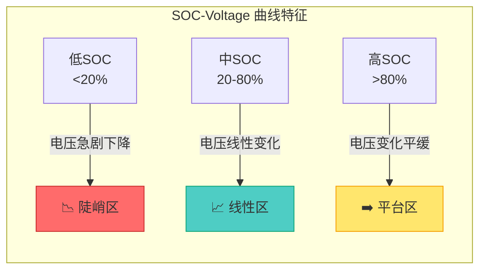

**检测意义：**
- 电压偏离预期 → 内阻增大或微短路
- 单体电压差异 → Cell Spread 增大，故障定位
- 充电电压过高 → 过充风险

---

#### **Temperature (温度) 🌡️**

| 项目 | 说明 |
|------|------|
| **定义** 电池的冷热程度，单位摄氏度 (°C) |
| **英文** | Temperature |
| **水塔类比** | 水温 - 温度过高会蒸发（电解液分解），过低会结冰（锂析出）|

**温度类型：**

| 类型 | 说明 | 检测意义 |
|------|------|---------|
| **环境温度** | 电池外部环境的温度 | 影响电池性能和寿命 |
| **电池温度** | 电池表面的实际温度 | 热状态监控 |
| **Max_Temp** | 电池包内最高温度 | 热失控预警 |
| **Min_Temp** | 电池包内最低温度 | 低温析锂风险 |
| **温度梯度** | Max_Temp - Min_Temp | 热分布不均 → 局部热点 |

**温度与电池行为的关系：**

| 温度范围 | 状态 | 风险 | DyAD 检测 |
|---------|------|------|----------|
| **< 0°C** | 低温区 | 锂析出风险 | 充电 Overpotential 异常 ↑ |
| **0-45°C** | 正常区 | 最佳工作温度 | - |
| **45-60°C** | 高温区 | 衰减加速 | 温度趋势上升 |
| **60-80°C** | 异常发热区 | 热失控前兆 | 重构误差 ↑，Max_Temp ↑ |
| **> 80°C** | 危险区 | SEI膜分解 | 🚨 紧急警报 |
| **> 200°C** | 热失控 | 燃烧爆炸 | 已无法挽回 |

**检测意义：**
- 低温充电 → 锂析出 → 微短路
- 温度上升率 > 1°C/min → 热失控前兆
- 温度梯度 > 10°C → 局部热点

---

#### **Power (功率) ⚡**

| 项目 | 说明 |
|------|------|
| **定义** | 单位时间的能量转移，单位瓦特 (W) |
| **英文** | Power |
| **公式** | P = V × I (功率 = 电压 × 电流) |
| **水塔类比** | 水泵的输出功率 = 压力 × 流量 |

**功率类型：**

| 类型 | 公式 | 含义 | 典型值 |
|------|------|------|--------|
| **充电功率** | P = V × I (I > 0) | 向电池输入的功率 | 11-150 kW |
| **放电功率** | P = V × I (I < 0) | 电池输出的功率 | 50-300 kW |
| **瞬时功率** | 实时 V × I | 当前时刻功率 | 变化中 |
| **平均功率** | ∫P dt / t | 一段时间内的平均 | 用于统计 |

**检测意义：**
- 功率衰减 → 电池性能下降
- 充电功率异常 → BMS 限功率保护
- 放电功率不足 → SOH 下降

---

### 1.3 测量相关概念

#### **毫伏 (mV, Millivolt) 📏**

- **定义**: 电压的单位，1 伏特 (V) = 1000 毫伏 (mV)
- **通俗理解**: 如果说伏特是水管里的**总压力**，毫伏就是**压力表上极其微小的刻度跳动**
- **在项目中的意义**: 在奔驰这种高质量要求的电池包里，健康的电池单体之间电压偏差通常极小。当一个单体比其他单体低了仅仅 **5-10 mV** 时，传统的阈值报警可能不会触发，但对于算法来说，这微小的"掉队"可能就是内部漏电（微短路）的早期信号。

---

#### **Cell Spread (单体电压极差/离散度) 📊**

| 项目 | 说明 |
|------|------|
| **定义** | 电池包（Pack）内所有单体电池中，最高电压与最低电压之间的**差值** |
| **通俗理解** | 想象有一群人（电池单体）在齐步走 |

**水塔类比：**
- **Spread 小**：队伍很整齐，大家步调一致
- **Spread 变大**：有人掉队了，或者有人跑太快了

**在项目中的意义**: 这是衡量电池包"健康整齐度"的核心指标。

| 条件 | Spread 变大的可能原因 |
|------|----------------------|
| 电流 $X$ 很大时 | 内阻不一致 |
| 静置时 Spread 持续增大 | 掉队的电池在"偷偷漏电"（微短路）|

---

### 1.4 进阶分析技术

#### **微分容量分析 (Differential Capacity Analysis) 📈**

| 项目 | 说明 |
|------|------|
| **定义** | 电压变化与电量变化的比例关系：dQ/dV |
| **英文** | Differential Capacity (dQ/dV) |
| **通俗理解** | 观察水箱水位上升 1 厘米需要多少水 |

**水塔类比：**
- **正常水箱**：每个水位高度上升 1cm 所需的水量是相对平滑的
- **异常水箱**：某些水位区间需要特别多的水（水箱变窄）或特别少的水（水箱变宽）

**在故障检测中的价值：**

| 分析对象 | dQ/dV 特征 | 对应的物理意义 |
|---------|-----------|---------------|
| **健康电池** | 平滑的峰谷曲线 | 正常的电化学反应相变 |
| **活性物质损失** | 峰值降低 | "水箱变窄" - 可参与反应的材料减少 |
| **锂析出** | 新增峰值 | 析出的锂形成新的反应平台 |
| **微短路** | 曲线畸变 | 内部漏电破坏了正常的充电曲线 |

**为什么它是"显微镜"？**
- 在容量/电压发生明显变化之前，dQ/dV 曲线就能出现微小的异常峰
- 可以区分不同类型的衰减机制（活性物质损失 vs 锂损失）
- 是预测电池健康度（SOH）和早期失效的敏感指标

---

#### **库仑效率 (Coulombic Efficiency) ⚖️**

| 项目 | 说明 |
|------|------|
| **定义** | 放出的电量与充入电量的比值：CE = 放电容量 / 充电容量 |
| **英文** | Coulombic Efficiency (CE) |
| **健康电池** | > 99.9% |
| **异常电池** | < 99.9% |

**在火案检测中的逻辑：**
- 如果一个电池长期"吃得多、拉得少"（CE < 99.9%），消失的电量大概率变成了：
  - **微短路释放的热量**
  - **副反应消耗**（如电解液分解）

**检测意义：**
- CE 下降是故障的早期信号
- 与 DyAD 联合使用：CE 用于长期趋势监控，DyAD 用于实时异常检测

---

### 1.5 DyAD 的检测逻辑（基础理解）

了解了这些基础，我们来看看 DyAD 是如何利用这些物理逻辑的：

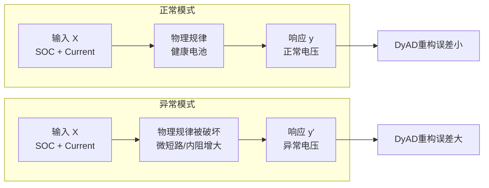

**建立联系：**
1. **输入 $X$**：对应你加水/抽水的速度（电流）和当前水位（SOC）
2. **响应 $y$**：对应你实测到的压力（电压）
3. **DyAD 的逻辑**：它知道"正常水箱"在某个水位、以某种速度加水时，压力应该是多少

**思考题：**
如果在梅赛德斯的一台电车上，电流和 SOC 都没有异常变化，但 DyAD 发现实测电压（响应 $y$）比模型根据"健康逻辑"预测出的电压**稍微低了一点点**，这可能对应我们刚才说的哪种物理现象？

> **答案**: 微短路（Micro-short circuit）- 电池内部出现微小漏电，导致电压"掉队"。

---

## 第二部分：电池结构与架构

理解电池的层级结构对于理解故障如何传播至关重要。一个单体的故障可能引发整个电池包的灾难性后果。

### 2.1 层级结构

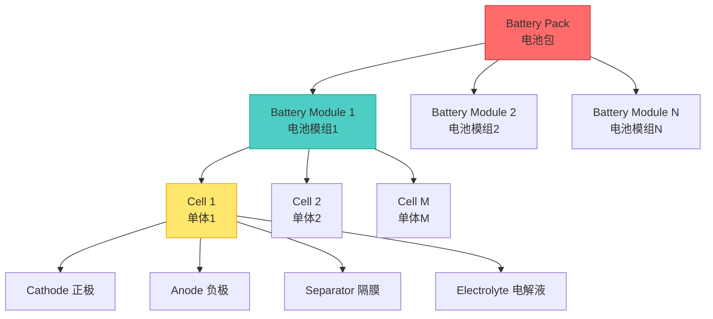

**层级关系说明：**

| 层级 | 名称 | 数量级 | 功能 | 类比 |
|------|------|--------|------|------|
| **Pack** | 电池包 | 1个 | 整个储能系统 | 整个水库群 |
| **Module** | 电池模组 | 数十个 | 便于管理和热管理 | 单独的水库大坝 |
| **Cell** | 单体电池 | 数百个 | 最小储能单元 | 单个水池 |

**水塔类比 - 多层水库系统：**

```
想象一个多层水库系统:
- Pack = 整个水库群
- Module = 单独的水库大坝
- Cell = 单个水池

如果某个水池底部有针孔漏水（微短路）:
- 水会通过连接管道影响其他水池（热传播）
- 整个水库群面临崩溃风险（电池包火灾）
```

---

### 2.2 连接方式

#### **串联 (Series Connection)**
- **功能**: 增加电压
- **类比**: 把多个水泵串联，水流压力（电压）叠加

#### **并联 (Parallel Connection)**
- **功能**: 增加容量
- **类比**: 把多个水箱并联，总水量（容量）增加

---

### 2.3 热耦合路径

单体之间存在三种热传递方式：

| 方式 | 说明 | 危险性 |
|------|------|--------|
| **热传导** | 通过物理接触传递热量 | 🔴 高 |
| **热辐射** | 通过电磁波传递热量 | 🟡 中 |
| **热对流** | 通过空气/冷却液传递热量 | 🟢 低（可主动散热）|

**关键风险**: 当一个单体发生热失控时，热量会通过热传导传递给相邻单体，引发**链式反应**。

---

### 2.4 电池化学类型

不同化学体系的热稳定性和火灾风险差异很大：

| 化学类型 | 能量密度 | 热稳定性 | 热失控温度 | 检测阈值影响 |
|---------|---------|---------|-----------|-------------|
| **NCM/NCA** (三元锂) | 高 | 较差 | ~150-200°C | 需要更敏感的阈值 |
| **LFP** (磷酸铁锂) | 中 | 好 | ~250-300°C | 阈值可相对宽松 |
| **LMO** (锰酸锂) | 低 | 中 | ~200°C | 介于两者之间 |

**为什么这对 DyAD 重要？**
- 不同化学体系的 SOC-OCP 曲线不同
- 内阻随温度变化的模式不同
- 检测阈值需要根据化学类型调整

---

## 第三部分：故障模式与机理

本部分深入分析电池的主要故障模式，包括其成因、演变过程和检测方法。

### 3.1 故障分类框架

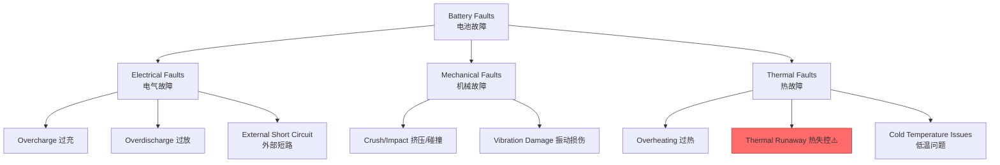

---

### 3.2 微短路 (Micro-short Circuit) ⚠️

> **重要性**: 微短路是热失控最常见的早期前兆，也是 DyAD 最有希望提前检测到的故障模式。

#### 基本概念

| 项目 | 说明 |
|------|------|
| **术语解释** | 电池内部正负极之间出现了极其细微的接触，导致小电流泄露 |
| **英文** | Micro-short Circuit |
| **通俗理解** | 相当于水箱底部漏了一个**肉眼几乎看不见的小针孔** |

**水塔类比：**
- 它不会让水立刻流光（电池没坏，还能用）
- 但它会导致即使你没用水，水位也会偷偷下降
- 最危险的是，这种"偷跑"的能量会转化成**热量**。如果针孔变大，热量积聚，就会演变成起火事故

---

#### 成因分析

| 成因 | 机制 | 风险等级 |
|------|------|---------|
| **Lithium Dendrite Growth**<br/>锂枝晶生长 | 低温充电 + 大电流 → 锂离子不均匀沉积 → 枝晶像"树根"一样生长，刺穿隔膜 | 🔴 高 |
| **Manufacturing Defects**<br/>制造缺陷 | 隔膜微小孔洞、电极毛刺 | 🟡 中 |


---

#### 演变三阶段

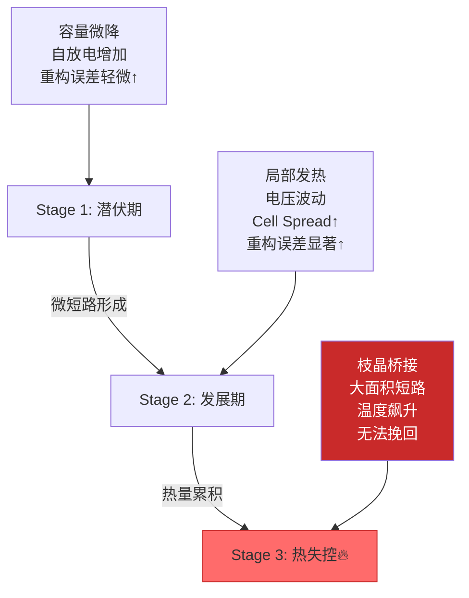

| 阶段 | 时间范围 | 物理现象 | DyAD 检测信号 | 传统BMS |
|------|---------|---------|---------------|---------|
| **潜伏期** | Day 1-30 | 自放电率增加，容量微降 | 重构误差轻微 ↑ (0.05→0.08) | ✗ 无报警 |
| **发展期** | Day 31-50 | 局部发热，电压波动 | 重构误差显著 ↑，Cell Spread ↑ | ? 可能低温报警 |
| **热失控期** | Day 51+ | 温度飙升，电压骤降 | 重构误差剧烈 ↑ (>0.5) | 🚨 太晚 |

**关键结论**: DyAD 的预警窗口约为 **50天**，而传统方法可能只有 **1天**。

---

### 3.3 热失控 (Thermal Runaway) ⚠️⚠️⚠️

> **最危险的故障模式**: 热失控是电池火灾的直接原因，一旦发生几乎无法阻止。

#### 基本概念

| 项目 | 说明 |
|------|------|
| **定义** | 正反馈循环：温度↑ → 反应速率↑ → 产热↑ → 温度↑↑ |
| **英文** | Thermal Runaway |
| **通俗理解** | "森林火灾"：单棵树着火 → 热辐射点燃相邻树 → 整片森林燃烧 |

---

#### 正反馈循环机制

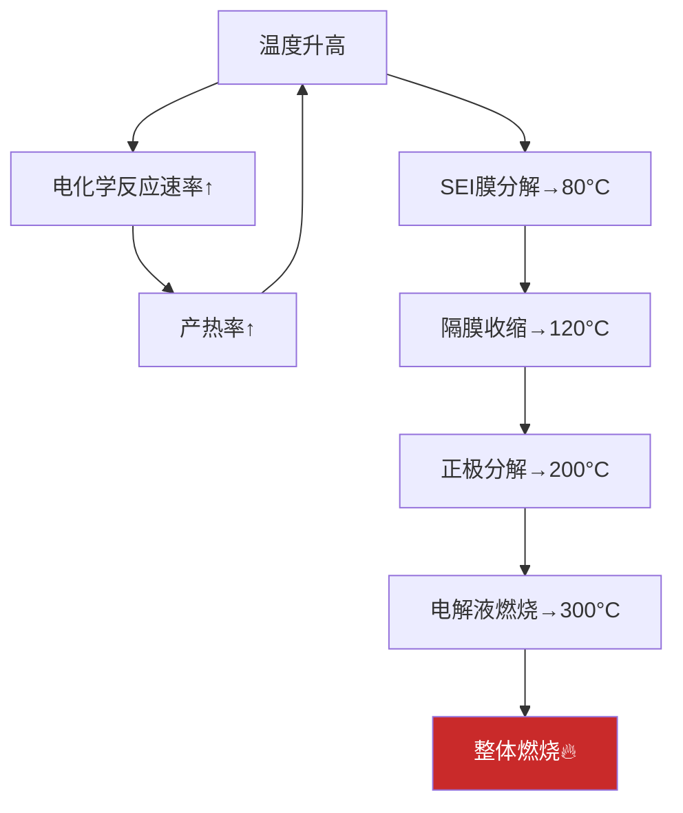

---

#### 热失控三阶段

| 阶段 | 温度范围 | 现象 | 可检测性 | DyAD响应 |
|------|---------|------|---------|---------|
| **异常发热期** | 60-80°C | 内阻增大，电压波动 | 高 ✅ | 重构误差↑ |
| **热失控启动期** | 80-120°C | SEI膜分解，产气鼓包 | 中 | 需多传感器融合 |
| **完全热失控期** | >200°C | 正极分解，电解液燃烧 | 低 🚨 | 已无法挽回 |

**链式反应路径**:
```
SEI分解(80°C) → 隔膜收缩(120°C) → 正极分解(200°C) →
电解液燃烧(300°C) → 整体燃烧
```

---

#### 检测挑战

| 挑战 | 说明 | 影响 |
|------|------|------|
| **时间窗口短** | 从异常到燃烧可能<30秒 | 需要实时检测 |
| **传感器滞后** | 温度传感器响应时间 | 需要预测而非反应 |
| **单体级检测困难** | Pack内温度梯度大 | 需要高密度传感器 |

---

### 3.4 锂析出 (Lithium Plating)

#### 基本概念

| 项目 | 说明 |
|------|------|
| **定义** | 充电时锂离子未能嵌入负极，而是沉积在负极表面 |
| **英文** | Lithium Plating |
| **通俗理解** | "水管结冰"：水（锂离子）应该流入水箱（嵌入负极），但天太冷（低温充电）或水压太大（大电流充电），水在管口结成冰块（析出锂）|

---

#### 危害分析

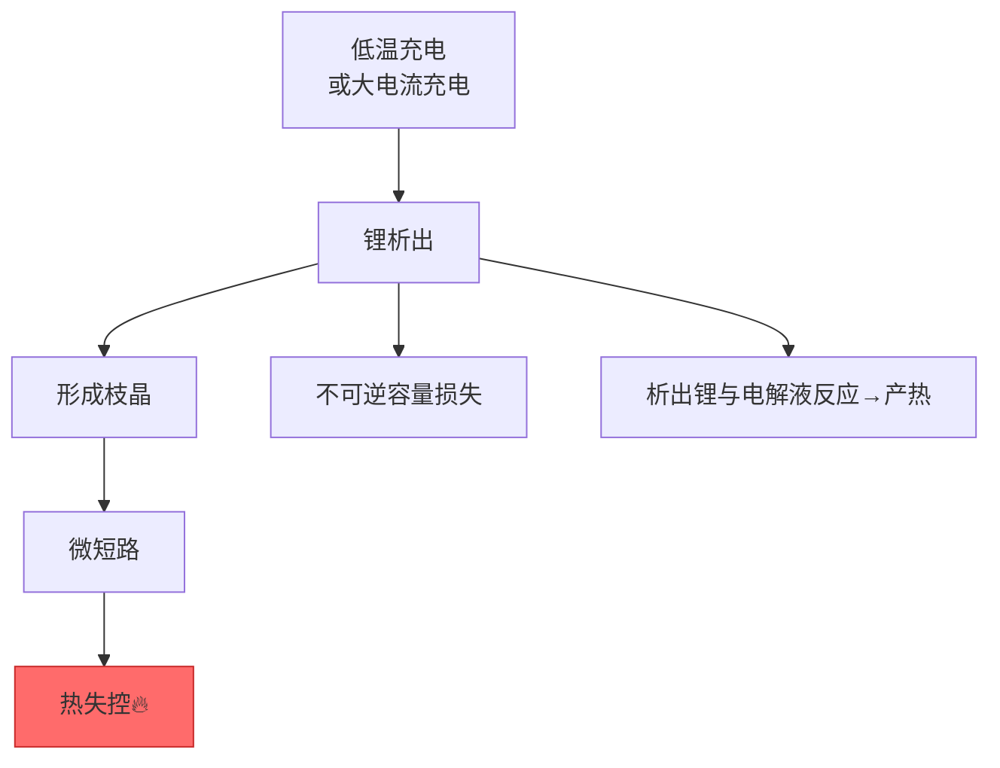

| 危害 | 说明 |
|------|------|
| 枝晶形成 | 析出的锂会形成枝晶 → 微短路 |
| 容量损失 | 不可逆的活性锂损失 |
| 产热反应 | 析出锂与电解液反应 → 产热 |

---

#### DyAD 检测指标

| 指标 | 异常表现 | 物理含义 |
|------|---------|---------|
| **充电末期Overpotential** | 异常 ↑ | 析锂反应增加额外过电位 |
| **库伦效率** | 异常 ↓ | 充入的电荷未能完全嵌入 |
| **容量衰减率** | 异常 ↑ | 活性锂持续损失 |

---

### 3.5 内部短路 (Internal Short Circuit, ISC)

> 与微短路的区别：内部短路是大电流、瞬间发生的灾难性故障，而微短路是小电流、缓慢发展的早期故障。

#### 基本概念

| 项目 | 说明 |
|------|------|
| **定义** | 电池内部正负极直接接触，导致瞬间大电流 |
| **英文** | Internal Short Circuit |
| **与微短路区别** | 瞬间发生 vs 缓慢发展；大电流 vs 小电流 |

---

#### 成因分析

| 成因 | 机制 |
|------|------|
| **隔膜失效** | 制造缺陷/热收缩导致隔膜失去隔离功能 |
| **锂枝晶刺穿** | 微短路的锂枝晶最终刺穿隔膜 |
| **电极变形** | 机械应力导致电极结构崩塌 |

---

#### 后果分析

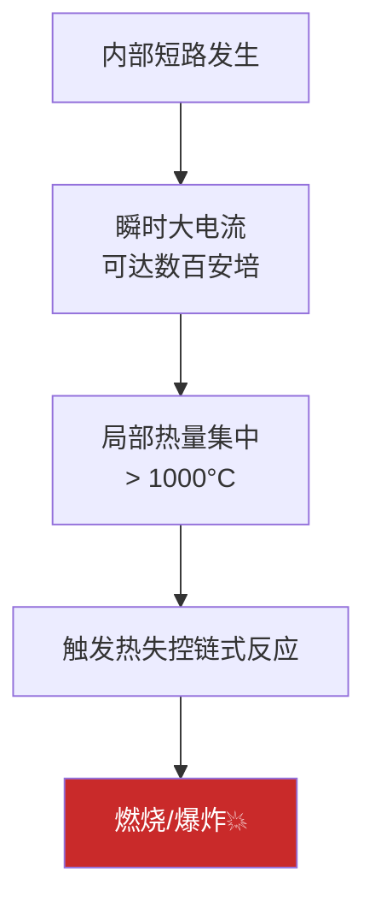

| 后果 | 说明 |
|------|------|
| **瞬时大电流** | 可达数百安培 |
| **局部过热** | 局部热量集中 > 1000°C |
| **链式反应** | 触发热失控，蔓延至整个电池包 |

---

#### 检测难点

| 挑战 | 说明 |
|------|------|
| **毫秒级发生** | 电压骤降发生在毫秒级，BMS来不及反应 |
| **定位困难** | 难以确定具体哪个单体发生短路 |
| **预防为主** | 一旦发生已无法挽回，必须提前检测微短路阶段 |

---

### 3.6 过充 (Overcharge)

#### 基本概念

| 项目 | 说明 |
|------|------|
| **定义** | 充电至电压超过上限（如>4.3V/cell）|
| **英文** | Overcharge |

---

#### 物理机制

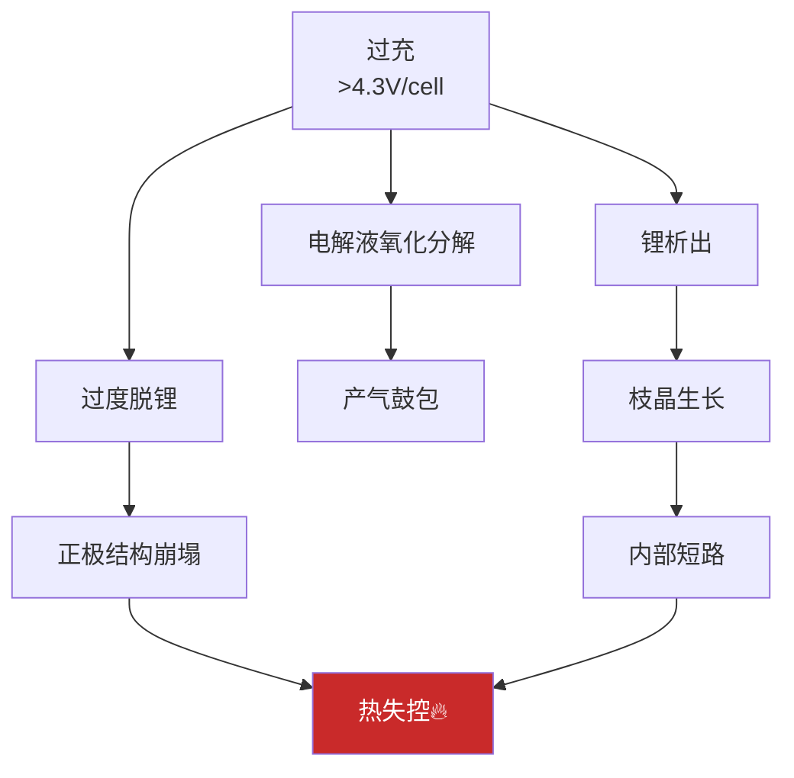

**水塔类比**: "持续给已满的水箱加水"：
- 水压（电压）飙升
- 水箱可能炸裂（热失控）

---

#### 检测方法

| 指标 | 异常表现 |
|------|---------|
| **单体电压** | 异常高（>4.3V）|
| **充电容量** | >额定容量 |
| **温度** | 异常上升 |

---

### 3.7 电池老化与故障的区别

> **为什么这很重要？**：区分正常老化和故障是减少 DyAD 误报的关键。老化是所有电池的共同趋势，而故障是异常行为。

#### 老化 vs 故障对比

| 老化类型 | 机制 | 速率 | DyAD 响应 | 应对 |
|---------|------|------|----------|------|
| **SEI 膜增长** | 副反应消耗活性锂 | 缓慢、稳定 | 内阻缓慢 ↑，所有单体一致 | 不应报警 |
| **活性物质损失** | 电极材料退化 | 缓慢 | 容量逐渐 ↓，所有单体一致 | 不应报警 |
| **锂析出（老化相关）** | 长期累积的少量析锂 | 可预测 | 可逆容量损失 | 不应报警 |
| **微短路** | 内部漏电 | 非线性加速 | 🚨 个别单体异常，重构误差 ↑ | 必须报警 |
| **锂析出（异常）** | 低温/快充引起的急性析锂 | 突发 | ⚠️ 充电 Overpotential 异常 ↑ | 需要报警 |

#### 识别标准

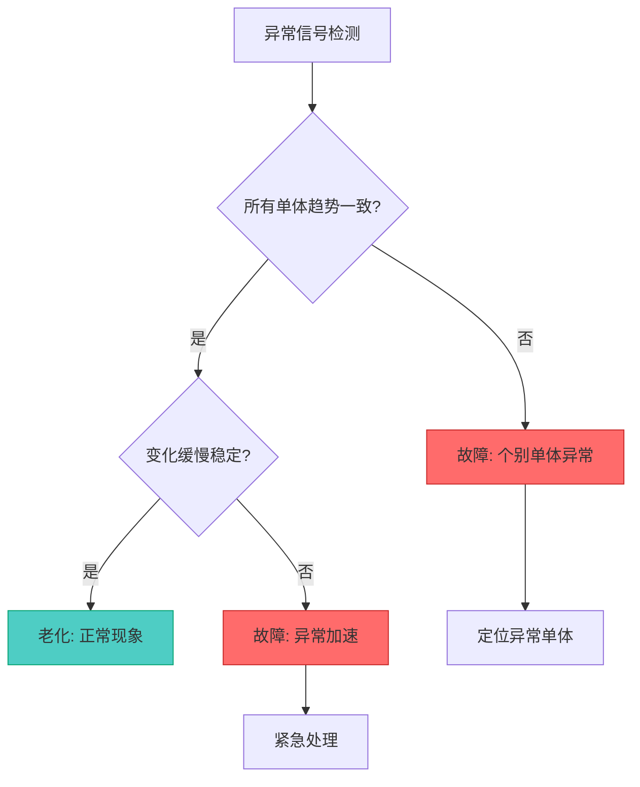

#### DyAD 检测策略

| 场景 | 检测特征 | 阈值策略 |
|------|---------|---------|
| **正常老化** | 所有单体重构误差同步上升 | 动态阈值，跟随长期趋势 |
| **故障预警** | 个别单体误差显著高于其他 | 固定阈值 + 统计异常检测 |
| **混合情况** | 趋势 + 异常双重检测 | 分层检测：长期趋势 + 短期突变 |

**关键洞察**：
- 老化像"皱纹" - 所有电池都会有的，是正常现象
- 故障像"伤口" - 需要治疗，不是正常现象
- DyAD 应该只报警"伤口"，而不是"皱纹"

---

## 第四部分：火灾起因机制

本部分揭示从根本原因到火灾的完整因果链，帮助理解 DyAD 检测的终极目标：在火灾发生前识别风险。

### 4.1 起火因果链

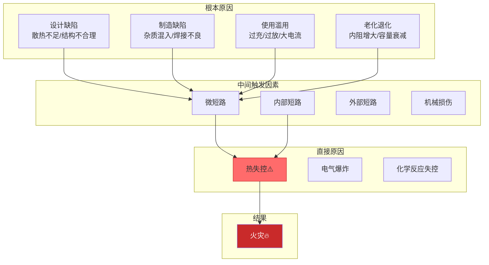

---

### 4.2 核心起火路径

#### 路径 1: 微短路 → 热失控 → 燃烧


**时间线**: 可持续数周至数月（DyAD的最佳检测窗口）

---

#### 路径 2: 过充 → 锂析出 → 内部短路 → 热失控


**时间线**: 可能发生在单次过充事件中

---

#### 路径 3: 机械损伤 → 内部短路 → 热失控


**时间线**: 瞬间发生，需通过碰撞传感器+电压监测联合检测

---

### 4.3 热传播机制

理解热如何从一个单体传播到整个电池包对于预防灾难性后果至关重要。

#### 传播路径

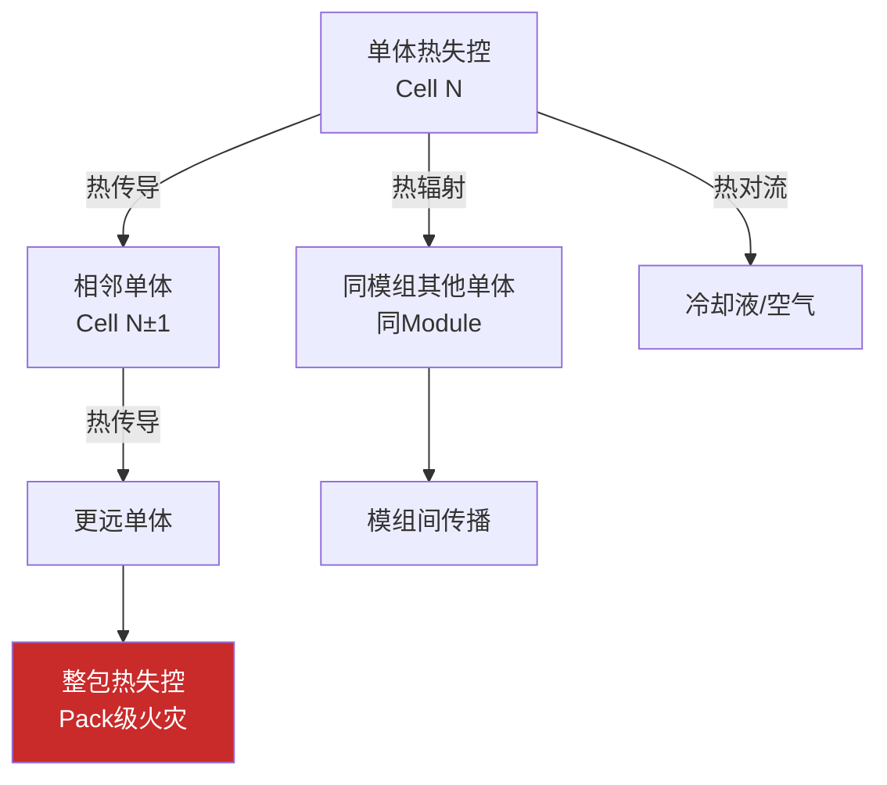

#### 传播方式对比

| 方式 | 速度 | 距离 | 阻隔难度 |
|------|------|------|---------|
| **热传导** | 快 | 短（相邻单体）| 需要隔热材料 |
| **热辐射** | 中 | 中（同模组）| 需要热反射板 |
| **热对流** | 慢 | 远（通过冷却系统）| 可通过主动散热控制 |

#### 防止传播的设计策略

| 策略 | 原理 |
|------|------|
| **隔热垫** | 在单体间添加隔热材料 |
| **热熔断** | 过热时切断电连接 |
| **泄压阀** | 释放内部压力，防止爆炸 |
| **液冷系统** | 主动散热，延缓热传播 |

---

## 第五部分：DyAD 检测方法映射

本部分将 DyAD 模型的技术实现与物理现象建立映射关系，帮助理解模型如何检测电池异常。

### 5.1 特征-物理映射

基于 `DyAD/model/tasks.py` 的 `BatterybrandaTask` 定义：

```python
# Encoder 输入 (7维)
self.encoder = [
    "soc",              # SOC - 荷电状态
    "current",          # Current - 充放电电流
    "min_temp",         # Min_Temp - 最低温度
    "max_single_volt",  # Max_Single_Volt - 最高单体电压
    "max_temp",         # Max_Temp - 最高温度
    "min_single_volt",  # Min_Single_Volt - 最低单体电压
    "volt"              # Volt - 总电压
]

# Decoder 输入 (2维) - 控制变量
self.decoder = ["soc", "current"]

# 重构目标 (5维) - 响应变量
self.target = [
    "min_temp", "max_single_volt", "max_temp",
    "min_single_volt", "volt"
]
```

#### 特征物理含义对照表

| DyAD 特征 | 物理含义 | 检测的故障类型 | 正常模式 |
|-----------|---------|---------------|---------|
| **SOC** | 当前电量状态 | - | 平滑变化 |
| **Current** | 充放电速率 | - | 符合充电策略 |
| **Max_Single_Volt** | 最高单体电压 | 过充风险 | <4.2V，与SOC匹配 |
| **Min_Single_Volt** | 最低单体电压 | 微短路/过放 | >3.0V，与SOC匹配 |
| **Cell_Spread**<br/>(Max-Min) | 单体一致性 | 故障定位 | <50mV（健康）|
| **Max_Temp** | 最高温度 | 热失控预警 | <45°C（正常）|
| **Min_Temp** | 最低温度 | 低温析锂风险 | >0°C（正常）|
| **Volt** | 总电压 | 整体状态 | 与SOC匹配 |

---

### 5.2 重构误差的物理意义

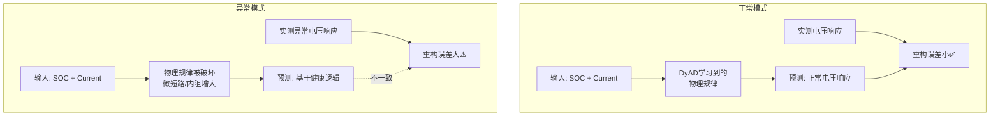

**核心逻辑**:
- **正常模式**: SOC + Current → Voltage（符合物理规律）→ 重构误差小
- **异常模式**: SOC + Current → Voltage'（偏离物理规律）→ 重构误差大

**重构误差公式**:
```
重构误差 = ||实测响应 - 预测响应||²
         = ||[电压, 温度等]_实测 - [电压, 温度等]_预测||²
```

---

### 5.3 DyAD 检测优势

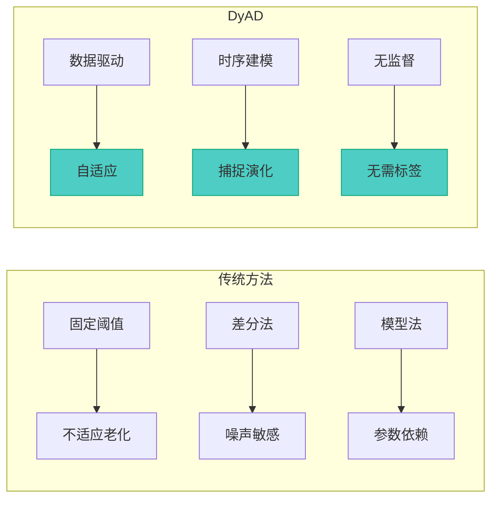

| 对比维度 | 传统方法 | DyAD |
|---------|---------|------|
| **适应性** | 固定阈值，不适应老化 | 自适应，学习个体差异 |
| **噪声鲁棒性** | 差分法噪声敏感 | 潜在空间去噪 |
| **参数依赖** | 需精确物理参数 | 数据驱动，无需参数 |
| **标签需求** | 可能需要故障样本 | 无监督学习 |
| **预警窗口** | ~1天 | ~50天 |

---

### 5.4 检测阈值设计

#### 阈值类型

| 类型 | 定义 | 优点 | 缺点 |
|------|------|------|------|
| **静态阈值** | 固定值（如重构误差>0.3）| 简单 | 不适应个体差异 |
| **动态阈值** | 基于统计分布（如95th百分位）| 自适应 | 需要正常数据 |
| **自适应阈值** | 实时更新 | 最优 | 实现复杂 |

#### DyAD 实现

```python
# 在验证集上确定阈值
use_flag = "rec_error"  # 使用重构误差作为异常分数

threshold = np.percentile(normal_errors, 95)  # 95th百分位
# 或
threshold = np.mean(normal_errors) + 3 * np.std(normal_errors)  # 3σ原则
```

---

### 5.5 完整检测流程

```mermaid
flowchart TD
    A[数据采集<br/>7维特征时序数据] --> B[数据预处理<br/>归一化/采样]
    B --> C[DyAD编码器<br/>提取潜在表征]
    C --> D[DyAD解码器<br/>预测正常响应]
    D --> E[计算重构误差<br/>||实测 - 预测||]
    E --> F{误差 > 阈值?}
    F -->|否| G[正常✅]
    F -->|是| H[异常⚠️]
    H --> I[误差分解<br/>定位异常特征]
    I --> J[根因分析<br/>映射到物理故障]
    J --> K[预警🚨]
```

---

### 5.6 典型故障的 DyAD 检测特征

#### 微短路检测特征

| 阶段 | DyAD 信号 | 物理解释 |
|------|----------|---------|
| **早期** | 重构误差轻微 ↑ | 电压开始偏离正常值 |
| **中期** | Min_Volt 贡献最大 | 故障单体电压掉队 |
| **晚期** | Cell Spread 异常 ↑ | 单体一致性被破坏 |

#### 过充检测特征

| 指标 | DyAD 信号 |
|------|----------|
| **Max_Single_Volt** | 重构误差中该特征贡献最大 |
| **SOC** | 预测SOC与实际SOC不匹配 |
| **温度** | Max_Temp 开始异常上升 |

#### 热失控早期检测

| 指标 | DyAD 信号 |
|------|----------|
| **重构误差** | 多个特征同时异常 |
| **温度特征** | Max_Temp 异常超前于电压异常 |
| **时序模式** | 误差呈指数上升 |

---

## 第六部分：车辆状态与检测策略

> 为什么这很重要？：电池在不同车辆运行状态下表现不同，理解每种状态的特点和最佳检测策略，是设计有效异常检测系统的关键。

### 6.1 车辆运行状态概览

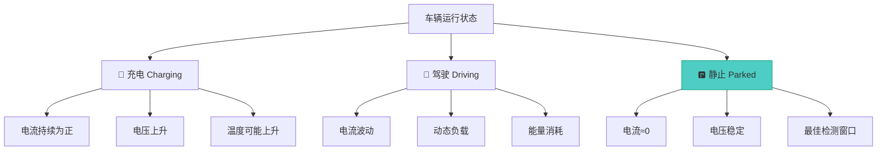

**状态对比表：**

| 状态 | 图标 | 特征 | 电流特点 | 数据质量 | 最佳检测目标 |
|------|------|------|---------|---------|-------------|
| **充电** | 🔌 | 外部电源连接 | 持续为正 | 高 - 稳定可预测 | 过充、锂析出 |
| **驾驶** | 🚗 | 动态负载 | 正负波动 | 中 - 噪声较大 | 内阻异常、功率衰减 |
| **静止** | 🅿️ | 无外部连接 | 接近 0 | 最高 - 安静无干扰 | 微短路、自放电 |

---

### 6.2 各状态下的检测策略

#### 🔌 充电状态 (Charging)

**状态特征：**
- 电流持续为正（I > 0）
- 电压随 SOC 上升
- 温度可能因充电功率上升

**检测重点：**

| 检测目标 | DyAD 特征 | 异常表现 |
|---------|----------|---------|
| **过充 (Overcharge)** | Max_Single_Volt | 单体电压 > 4.3V |
| **锂析出 (Lithium Plating)** | Overpotential (充电末期) | 过电压异常 ↑ |
| **热失控早期** | Max_Temp | 温度上升率 > 1°C/min |

**检测优势：**
- ✅ 电流稳定，信噪比高
- ✅ 电压变化符合物理规律，易于建模
- ✅ 可检测充电特有的故障（过充、锂析出）

**挑战：**
- ⚠️ 快充时电流大，可能掩盖微短路信号
- ⚠️ 温度上升可能由充电引起，需区分正常/异常

---

#### 🚗 驾驶状态 (Driving)

**状态特征：**
- 电流正负波动（加速/制动）
- 动态负载变化
- 能量消耗与路况相关

**检测重点：**

| 检测目标 | DyAD 特征 | 异常表现 |
|---------|----------|---------|
| **内阻异常** | Current + Volt 关系 | 电压偏离预期 |
| **功率衰减** | 放电功率 | 相同SOC下功率下降 |
| **SOH 下降** | 长期趋势 | 容量持续减少 |

**检测优势：**
- ✅ 可检测动态条件下的性能
- ✅ 能发现负载相关的故障

**挑战：**
- ⚠️ 电流波动大，信噪比低
- ⚠️ 路况、驾驶习惯影响大，需个性化建模
- ⚠️ 难以检测微短路（充电/静止更佳）

---

#### 🅿️ 静止状态 (Parked)

**状态特征：**
- 电流接近 0（\|I\| < 0.1A）
- 电压稳定（无过电压影响）
- 温度逐渐平衡

**检测重点：**

| 检测目标 | DyAD 特征 | 异常表现 |
|---------|----------|---------|
| **微短路** | Min_Single_Volt | 持续下降 |
| **自放电** | SOC 静置下降 | 下降率 > 正常 |
| **Cell Spread** | Max - Min Volt | 差值持续增大 |

**检测优势：**
- ✅ **最佳检测窗口** - 安静无干扰
- ✅ 微短路信号最明显（自放电导致电压"掉队"）
- ✅ 可检测缓慢发展的故障

**为什么静止状态最适合检测微短路？**

```mermaid
graph LR
    A[静止状态] --> B[电流≈0<br/>无过电压干扰]
    B --> C[电压=OCV<br/>真实状态反映]
    C --> D[微短路→自放电]
    D --> E[电压持续阴跌<br/>异常明显]

    style A fill:#4ecdc4,stroke:#0ca678
    style E fill:#ff6b6b,stroke:#c92a2a
```

**水塔类比：**
- 充电/驾驶 = 水管在流水（难以发现小漏洞）
- 静止 = 水管关闭（水位下降 = 有漏洞）

---

### 6.3 状态转换与检测策略

```mermaid
stateDiagram-v2
    [*] --> Parked : 车辆启动
    Parked --> Driving : 解锁/踩刹车
    Driving --> Charging : 插入充电枪
    Charging --> Parked : 充电完成/拔枪
    Driving --> Parked : 驾驶结束/锁车

    note right of Parked
        最佳微短路检测窗口
        持续时间: 数小时至数天
    end note

    note right of Charging
        最佳过充/锂析出检测
        持续时间: 30min-数小时
    end note
```

**检测时机选择建议：**

| 故障类型 | 最佳检测状态 | 次优选择 | 不推荐 |
|---------|-------------|---------|--------|
| **微短路** | 🅿️ 静止 | 🔌 充电（末期）| 🚗 驾驶 |
| **过充** | 🔌 充电 | - | - |
| **锂析出** | 🔌 充电（特别是快充）| - | 🅿️ 静止 |
| **热失控** | 🔌 充电 | 🚗 驾驶 | 🅿️ 静止（发展慢）|
| **内阻增大** | 🚗 驾驶 | 🔌 充电 | - |

---

### 6.4 DyAD 在不同状态下的应用

#### 特征权重调整

| 状态 | 高权重特征 | 低权重/忽略特征 |
|------|-----------|---------------|
| **🔌 充电** | Max_Single_Volt, Max_Temp, Overpotential | Current（相对稳定）|
| **🚗 驾驶** | Current, Volt, Power | Cell Spread（噪声大）|
| **🅿️ 静止** | Min_Single_Volt, Cell Spread, SOC | Current（≈0）|

#### 阈值调整建议

```python
# 伪代码示例
if state == "parked":
    threshold = base_threshold * 0.8  # 静止状态更敏感
elif state == "driving":
    threshold = base_threshold * 1.2  # 驾驶状态放宽（噪声大）
elif state == "charging":
    threshold = base_threshold  # 充电状态标准阈值
```

---

### 6.5 实际应用建议

1. **状态识别优先**：在进行异常检测前，先准确识别车辆运行状态
2. **分模型训练**：为不同状态训练独立的 DyAD 模型（或添加状态作为条件输入）
3. **时间窗口选择**：
   - 静止状态检测：至少 2 小时静置数据
   - 充电状态检测：完整充电周期
   - 驾驶状态检测：包含多种工况的城市/高速数据
4. **多状态融合**：综合多个状态的检测结果提高置信度

---

### 6.6 充电策略与检测

> **为什么充电状态特殊？**：充电是 DyAD 最关键的检测窗口之一。理解充电协议有助于设计针对性的检测策略。

#### CC/CV 充电曲线

```mermaid
graph TD
    A[充电开始] --> B[CC 恒流阶段<br/>电流恒定<br/>电压上升]
    B --> C[CV 恒压阶段<br/>电压恒定<br/>电流下降]
    C --> D[充电结束<br/>电流<截止值]

    B --> B1[锂析出风险区<br/>低温/大电流]
    C --> C1[过充风险区<br/>高SOC]

    style B1 fill:#ff6b6b,stroke:#c92a2a
    style C1 fill:#ff6b6b,stroke:#c92a2a
```

**充电阶段特征：**

| 充电阶段 | 电流特征 | 电压特征 | 温度特征 | 检测重点 |
|---------|---------|---------|---------|---------|
| **CC 阶段** | 恒定大电流 | 电压持续上升 | 温度逐渐上升 | 锂析出、温升异常 |
| **CV 阶段** | 电流逐渐下降 | 电压保持上限 | 温度可能继续上升 | 过充、单体差异 |
| **涓流/维护** | 小电流 | 维持满电 | 温度稳定 | - |

**各阶段风险：**

```mermaid
graph LR
    subgraph CC阶段风险
        A1[低温充电] --> A2[锂析出]
        A3[大电流充电] --> A2
    end

    subgraph CV阶段风险
        B1[高SOC充电] --> B2[过充]
        B3[单体不一致] --> B4[个别单体过压]
    end

    style A2 fill:#ff6b6b,stroke:#c92a2a
    style B2 fill:#ff6b6b,stroke:#c92a2a
```

#### 快充协议

| 特性 | 说明 | 检测含义 |
|------|------|---------|
| **功率** | > 50kW 充电功率 | 锂析出风险增加 |
| **电流** | 可达 2-3C | 过电压更明显 |
| **温升** | 温度上升更快 | 需要温度预警阈值调整 |
| **充电时间** | 15-30 分钟充至 80% | 检测窗口短 |

**快充检测策略：**
- 重点关注充电末期的 Overpotential 异常
- 温度上升率阈值：快充时 > 2°C/min，正常充电 > 1°C/min
- Max_Single_Volt 监控：快充时单体差异更明显

#### 充电相关的 DyAD 特征

| 特征 | 正常充电表现 | 异常表现 | 可能原因 |
|------|-------------|---------|---------|
| **Max_Single_Volt** | 随 SOC 平滑上升 | 突然跳变 > 4.3V | 过充风险 |
| **Overpotential** | 充电末期平滑上升 | 充电末期异常 ↑ | 锂析出 |
| **Max_Temp** | 与充电功率相关 | 上升率 > 2°C/min | 热失控前兆 |
| **Cell Spread** | < 50mV | 快速增大 | 单体均衡失效 |

---

## 第七部分：BMS 基础与数据采集

> **为什么这很重要？**：DyAD 的所有输入数据都来自 BMS (Battery Management System)。理解 BMS 的工作原理和数据采集方式，有助于解释 DyAD 的输入特征和模型输出。

### 7.1 BMS 的核心功能

| 功能 | 说明 | 与 DyAD 的关系 |
|------|------|---------------|
| **数据采集** | 电压、电流、温度采样 | DyAD 的 7 个输入特征全部来自 BMS |
| **均衡管理** | 单体一致性控制 | 影响 Cell Spread 特征 |
| **保护功能** | 过压/欠压/过流/过温保护 | 限制条件，影响数据范围 |
| **SOC/SOX 估算** | 状态监测 | DyAD 的参考基准 |
| **通信** | 与整车控制器通信 | 车辆状态识别依据 |

**BMS 架构示意：**

```mermaid
graph TD
    A[BMS 主控制器] --> B[数据采集模块]
    B --> C[电压采样<br/>所有单体]
    B --> D[电流采样<br/>总电流]
    B --> E[温度采样<br/>多个传感器]

    A --> F[均衡控制]
    A --> G[保护控制]
    A --> H[状态估算<br/>SOC/SOH]

    A --> I[通信接口<br/>CAN总线]

    C --> J[DyAD 输入<br/>max_single_volt, min_single_volt]
    D --> K[DyAD 输入<br/>current]
    E --> L[DyAD 输入<br/>max_temp, min_temp]

    style J fill:#4ecdc4,stroke:#0ca678
    style K fill:#4ecdc4,stroke:#0ca678
    style L fill:#4ecdc4,stroke:#0ca678
```

---

### 7.2 采样与精度

#### 采样参数

| 参数 | 典型值 | 对 DyAD 的影响 |
|------|--------|---------------|
| **采样频率** | 1Hz - 100Hz | 频率越高，检测越灵敏 |
| **电压精度** | ±5mV | 决定微短路检测能力 |
| **电流精度** | ±0.5A | 影响 Overpotential 计算 |
| **温度精度** | ±1°C | 影响热失控预警 |

#### 采样策略

| 场景 | 采样策略 | 原因 |
|------|---------|------|
| **静止** | 低频 (1-10Hz) | 状态稳定，不需要高频采样 |
| **充电** | 中频 (10-50Hz) | 状态变化较快 |
| **驾驶** | 高频 (50-100Hz) | 动态变化剧烈 |

---

### 7.3 BMS 限制策略

BMS 会主动限制电池工作条件，这些限制会影响 DyAD 的输入数据：

| 限制类型 | 触发条件 | 对 DyAD 的影响 |
|---------|---------|---------------|
| **限流** | 低温/高温/低SOC | Current 幅值受限 |
| **限压** | 单体过压 | Max_Single_Volt 被钳位 |
| **限功率** | 保护电池安全 | Current 和 Volt 同时受限 |

**检测意义：**
- 当 BMS 限功率时，DyAD 输入数据会表现"异常"
- 需要区分 BMS 保护触发的"异常"和电池故障引起的"异常"
- 建议：将 BMS 限制状态作为条件输入

---

### 7.4 数据质量与 DyAD

#### 常见数据质量问题

| 问题 | 原因 | 影响 | DyAD 应对 |
|------|------|------|----------|
| **噪声** | 电磁干扰、采样误差 | 伪异常 | 滤波、去噪 |
| **缺失值** | 通信中断 | 特征缺失 | 插值、跳过 |
| **延迟** | 通信延迟 | 时序错位 | 时间戳对齐 |
| **漂移** | 传感器老化 | 长期趋势变化 | 定期校准 |

**DyAD 鲁棒性优势：**
- 潜在空间编码具有降噪效果
- 重构误差关注相对模式，而非绝对值
- 对单个传感器故障不敏感（多特征融合）

---

### 7.5 从 BMS 到 DyAD：数据流

```mermaid
graph LR
    A[BMS 硬件] -->|原始数据| B[BMS 处理]
    B -->|7个特征| C[DyAD 模型]
    C -->|重构误差| D[异常判定]
    D -->|预警| E[BMS 保护动作]

    style A fill:#e3f2fd,stroke:#1565c0
    style C fill:#ffe66d,stroke:#f59f00
    style E fill:#ff6b6b,stroke:#c92a2a
```

**关键理解**：
- BMS 提供数据 → DyAD 分析数据 → 反馈给 BMS 决策
- DyAD 不是替代 BMS，而是增强 BMS 的检测能力
- 最终决策仍在 BMS 和整车控制器

---

## 第八部分：故障诊断方法论

> **为什么这很重要？**：了解故障诊断的方法论有助于 AI Engineer 理解 DyAD 在诊断框架中的定位，以及如何评估和优化诊断模型性能。

### 8.1 诊断方法分类

故障诊断方法可以分为三大类，DyAD 属于其中"基于数据"的方法：

```mermaid
graph TD
    A[Fault Diagnosis Methods<br/>故障诊断方法] --> B[Model-Based<br/>基于模型]
    A --> C[Data-Driven<br/>基于数据]
    A --> D[Knowledge-Based<br/>基于知识]

    B --> B1[等效电路模型]
    B --> B2[电化学模型]
    B --> B3[需要精确参数]

    C --> C1[机器学习]
    C --> C2[深度学习]
    C --> C3[DyAD 属于此方法]

    D --> D1[专家规则]
    D --> D2[模糊逻辑]
    D --> D3[需要领域知识]

    style C fill:#4ecdc4,stroke:#0ca678
    style C3 fill:#ffe66d,stroke:#f59f00
```

#### 方法对比

| 方法类型 | 原理 | 优点 | 缺点 | DyAD 的选择 |
|---------|------|------|------|------------|
| **基于模型** | 建立电池物理模型，比较模型输出与实测 | 可解释性强，物理意义明确 | 参数难以获取，计算复杂 | 作为补充理解 |
| **基于数据** | 从数据中学习正常/异常模式 | 无需物理参数，自适应 | 需要训练数据，可解释性弱 | **DyAD 的方法** |
| **基于知识** | 使用专家规则和经验 | 简单直观，易于实施 | 难以覆盖所有场景 | 用于结果解释 |

---

### 8.2 DyAD 在诊断框架中的定位

```mermaid
graph LR
    subgraph 诊断层次
        A[Level 1: 参数监测<br/>电压/电流/温度阈值]
        B[Level 2: 状态估计<br/>SOC/SOH/故障识别]
        C[Level 3: 预测性维护<br/>RUL预测/早期预警]
    end

    A --> B --> C

    D[传统BMS] --> A
    E[DyAD] --> B
    E --> C

    style E fill:#ffe66d,stroke:#f59f00
    style C fill:#4ecdc4,stroke:#0ca678
```

**DyAD 的核心价值**：
- 在 **Level 2** 和 **Level 3** 之间架起桥梁
- 从"检测当前故障"提升到"预测未来故障"
- 提供比传统阈值方法更早的预警

---

### 8.3 诊断性能评估指标

评估故障诊断系统需要关注多个维度：

#### 检测性能指标

| 指标 | 定义 | 公式 | DyAD 目标值 |
|------|------|------|------------|
| **Detection Rate (DR)**<br/>检测率 | 正确检测到的故障数 / 总故障数 | TP / (TP + FN) | > 95% |
| **False Alarm Rate (FAR)**<br/>误报率 | 误报数 / 总正常样本数 | FP / (FP + TN) | < 1% |
| **Precision (精确率)** | 真正故障 / 报警总数 | TP / (TP + FP) | > 90% |
| **F1-Score** | Precision 和 Recall 的调和平均 | 2×P×R/(P+R) | > 0.9 |

**关键权衡**：检测率和误报率往往存在权衡。提高阈值 → 降低误报率但也可能降低检测率。

#### 时间性能指标

| 指标 | 定义 | DyAD 优势 |
|------|------|----------|
| **Detection Delay**<br/>检测延迟 | 从故障发生到被检测到的时间 | ~50天预警窗口 |
| **Early Warning Ratio**<br/>早期预警率 | 在热失控前检测到的比例 | 显著高于传统方法 |

#### 混淆矩阵

```mermaid
graph TD
    subgraph Confusion_Matrix
        A[实际: 故障] -->|TP<br/>正确检测| B[预测: 故障]
        A -->|FN<br/>漏报| C[预测: 正常]

        D[实际: 正常] -->|FP<br/>误报| B
        D -->|TN<br/>正确| C

        style B fill:#ff6b6b,stroke:#c92a2a
        style C fill:#4ecdc4,stroke:#0ca678
    end
```

---

### 8.4 误报分析方法

> **为什么误报分析重要？**：高误报率会导致"狼来了"效应，使运营人员忽视真正的警报。减少误报是 DyAD 实用化的关键。

#### 误报根因分析

```mermaid
graph TD
    A[误报发生] --> B{根因分析}
    B --> C[正常老化<br/>被误判为故障]
    B --> D[数据质量问题<br/>噪声/异常值]
    B --> E[阈值设置不当<br/>过严或过宽]
    B --> F[建模偏差<br/>个体差异未捕获]

    C --> G[解决方案: 区分老化/故障]
    D --> H[解决方案: 数据预处理]
    E --> I[解决方案: 动态阈值]
    F --> J[解决方案: 个性化建模]

    style C fill:#ffe66d,stroke:#f59f00
    style D fill:#ffe66d,stroke:#f59f00
    style E fill:#ffe66d,stroke:#f59f00
    style F fill:#ffe66d,stroke:#f59f00
```

#### 老化 vs 故障的误报控制

| 误报原因 | 特征 | DyAD 应对策略 |
|---------|------|---------------|
| **所有单体同步老化** | 重构误差整体上升，但单体间一致 | 动态阈值：跟随长期趋势 |
| **个别单体异常** | 某个单体重构误差显著高于其他 | 统计异常检测：3σ原则 |
| **工况变化** | 充电/驾驶/静止状态切换 | 分状态建模 |

---

### 8.5 阈值调优策略

#### 静态阈值 vs 动态阈值

| 阈值类型 | 定义 | 优点 | 缺点 | 适用场景 |
|---------|------|------|------|---------|
| **静态阈值** | 固定值（如重构误差 > 0.3）| 简单易实现 | 不适应个体差异 | 初期验证 |
| **动态阈值** | 基于统计分布（如95th百分位）| 自适应个体差异 | 需要正常数据 | 生产环境 |
| **自适应阈值** | 实时更新 | 最优适应 | 实现复杂 | 高级应用 |

#### DyAD 阈值实现示例

```python
# 在验证集上确定阈值
use_flag = "rec_error"  # 使用重构误差作为异常分数

# 方法1: 基于百分位
threshold = np.percentile(normal_errors, 95)  # 95th百分位

# 方法2: 基于3σ原则
threshold = np.mean(normal_errors) + 3 * np.std(normal_errors)

# 方法3: 自适应阈值（滑动窗口）
window = 100  # 窗口大小
threshold_t = np.mean(errors[t-window:t]) + 2 * np.std(errors[t-window:t])
```

---

### 8.6 诊断决策流程

```mermaid
flowchart TD
    A[DyAD 重构误差] --> B{误差 > 阈值?}
    B -->|否| C[正常✅<br/>继续监控]
    B -->|是| D[异常⚠️]

    D --> E[误差分解<br/>定位异常特征]
    E --> F[是温度异常?]
    E --> G[是电压异常?]
    E --> H[是单体差异异常?]

    F --> I[热失控预警<br/>Max_Temp 异常]
    G --> J[微短路预警<br/>Min_Volt 异常]
    H --> K[均衡失效预警<br/>Cell Spread 异常]

    I --> L[根因分析<br/>映射到物理故障]
    J --> L
    K --> L

    L --> M[置信度评估]
    M --> N{置信度 > 80%?}
    N -->|是| O[发送警报🚨]
    N -->|否| P[标记为待观察<br/>持续监控]

    style O fill:#ff6b6b,stroke:#c92a2a
    style P fill:#ffe66d,stroke:#f59f00
```

---

### 8.7 DyAD 与其他诊断方法的对比

| 对比维度 | 阈值法 | 模型法 | DyAD (数据驱动) |
|---------|--------|--------|-----------------|
| **适应性** | 低 - 固定阈值 | 中 - 需要参数更新 | 高 - 自适应学习 |
| **早期预警** | 晚 - 等待超限 | 中 - 取决于模型精度 | 早 - 捕捉异常模式 |
| **误报率** | 高 - 不适应个体 | 中 - 参数误差影响 | 低 - 学习个体特征 |
| **实现难度** | 低 | 高 - 需要精确参数 | 中 - 需要训练数据 |
| **维护成本** | 低 | 高 - 参数标定 | 中 - 模型重训 |

---

## 第九部分：典型案例分析

> **为什么案例学习重要？**：理论理解需要通过实际案例来巩固。本部分通过分析真实案例，帮助 AI Engineer 理解 DyAD 如何在实际场景中发现故障。

### 9.1 微短路演变案例

#### 案例背景

- **车型**: 奔驰 EQ 系列
- **电池类型**: NCM 811 化学体系
- **容量**: 90 kWh
- **监控周期**: 50 天

#### 时间线与数据特征

```mermaid
gantt
    title 微短路演变时间线 (Day 1-50)
    dateFormat  X
    axisFormat %d

    section 潜伏期 (Day 1-30)
    容量微降           :a1, 1, 30
    自放电率增加        :a2, 1, 30
    DyAD重构误差轻微↑   :a3, 1, 30

    section 发展期 (Day 31-48)
    局部发热           :b1, 31, 18
    电压波动           :b2, 31, 18
    Cell Spread↑      :b3, 31, 18
    DyAD重构误差显著↑  :b4, 31, 18

    section 检测点
    DyAD预警 Day 20     :milestone, m1, 20, 0d

    section 传统检测
    BMS低温报警 Day 45  :milestone, m2, 45, 0d
```

#### 各阶段数据特征

| 阶段 | 时间 | SOC 变化 | Cell Spread | DyAD 误差 | BMS 状态 |
|------|------|---------|-------------|----------|----------|
| **正常** | Day 1-10 | 静置下降 < 1%/天 | < 30 mV | 0.05 | 正常 |
| **潜伏早期** | Day 11-20 | 静置下降 1-2%/天 | 30-50 mV | 0.08 | 正常 |
| **DyAD 预警** | **Day 20** | - | 45 mV | **0.12** | **正常** |
| **潜伏晚期** | Day 21-30 | 静置下降 2-3%/天 | 50-80 mV | 0.18 | 正常 |
| **发展期** | Day 31-45 | 静置下降 > 3%/天 | 80-150 mV | 0.35 | 低温报警 |
| **危险期** | Day 46-50 | 骤降 | > 200 mV | > 0.5 | 多级报警 |

#### 关键信号分析

**水塔类比 - 微短路的"漏水"过程：**

```
Day 1-20: 水箱底部有一个针孔大小的漏洞
- 每天漏掉 1-2% 的水（自放电）
- DyAD 发现：注水同样量，水位上升比预期少一点
- 传统方法：没发现，偏差太小

Day 21-40: 针孔逐渐变大
- 每天漏掉 2-3% 的水
- DyAD 发现：重构误差显著上升
- 传统方法：可能注意到"这个电池不太耐用"

Day 41-50: 漏洞明显扩大
- 每天漏掉 > 3% 的水
- DyAD 发现：误差剧烈上升，已报警 20 天
- 传统方法：开始报警，但可能已接近热失控
```

#### DyAD vs 传统方法对比

| 检测方法 | 检测时间 | 预警窗口 | 优势 |
|---------|---------|---------|------|
| **DyAD** | Day 20 | 30 天 | 早期发现，有时间维护 |
| **电压阈值** | Day 45 | 5 天 | 简单但晚 |
| **温度报警** | Day 46 | 4 天 | 最晚 |

**业务价值**：
- 提前 30 天预警 = 避免潜在火灾
- 可以安排维护，而不是紧急处理
- 减少停机时间和经济损失

---

### 9.2 过充导致热失控案例

#### 案例背景

- **触发条件**: BMS 失效 + 充电桩故障
- **场景**: 家庭充电，夜间充电
- **故障链**: 过充 → 锂析出 → 微短路 → 热失控

#### 演变过程

```mermaid
graph TD
    A[充电开始 22:00<br/>SOC: 20%] --> B[CC 阶段<br/>正常充电]
    B --> C[23:30<br/>SOC: 80%<br/>进入 CV 阶段]
    C --> D[BMS 电压监控失效<br/>充电桩未停止]
    D --> E[00:30<br/>SOC > 100%<br/>过充开始]
    E --> F[锂析出<br/>负极表面沉积]
    F --> G[01:15<br/>枝晶刺穿隔膜<br/>微短路形成]
    G --> H[01:20<br/>局部发热]
    H --> I[01:30<br/>热失控启动<br/>温度 > 200°C]
    I --> J[01:35<br/>燃烧🔥]

    C2[DyAD 检测点<br/>23:45<br/>Max_Volt 异常] -.预警.-> G2
    G2[可以干预<br/>时间窗口: 45分钟]

    style J fill:#c92a2a,color:#fff
    style C2 fill:#ffe66d,stroke:#f59f00
    style G2 fill:#4ecdc4,stroke:#0ca678
```

#### DyAD 检测机会

| 时间点 | DyAD 信号 | 物理含义 | 可采取行动 |
|--------|----------|---------|-----------|
| **23:45** | Max_Single_Volt 重构误差异常 ↑ | 某单体电压异常上升 | 停止充电，检查单体 |
| **00:15** | Max_Temp 上升率 > 1°C/min | 局部发热 | 紧急停止，检查 BMS |
| **00:45** | Cell Spread > 100 mV | 单体严重不一致 | 立即断开 |
| **01:15** | 多个特征同时异常 | 微短路形成 | **最后机会** |

**关键洞察**：
- DyAD 在 BMS 失效后 15 分钟就能检测到异常
- 有 **45 分钟** 的干预时间窗口
- 如果 DyAD 能控制充电桩，可以自动停止充电

---

### 9.3 锂析出检测案例

#### 案例背景

- **场景**: 冬季快充（-5°C 环境温度）
- **充电功率**: 120 kW 快充
- **风险**: 低温 + 大电流 = 锂析出高风险

#### DyAD 检测信号

```mermaid
graph TD
    A[充电开始 -5°C] --> B[CC 阶段<br/>电流: 200A]
    B --> C[充电中期<br/>SOC: 50%]
    C --> D[充电末期<br/>SOC: 80%<br/>DyAD 检测到异常]
    D --> E[Overpotential 异常 ↑<br/>充电末期电压异常上升]
    E --> F[锂析出风险⚠️]

    style F fill:#ff6b6b,stroke:#c92a2a
    style D fill:#ffe66d,stroke:#f59f00
```

#### 充电末期 Overpotential 分析

| SOC | 正常过电压 | 实测过电压 | DyAD 误差 | 判断 |
|-----|-----------|-----------|----------|------|
| 70% | 0.05 V | 0.06 V | 0.02 | 正常 |
| 80% | 0.08 V | 0.12 V | 0.05 | 轻微异常 |
| 85% | 0.10 V | 0.25 V | **0.15** | **锂析出风险** |
| 90% | 0.12 V | 0.45 V | **0.33** | **高风险** |

**水塔类比 - 冬天水管结冰**：
- 正常充电：水顺利流入水箱
- 低温快充：水在管口结冰（锂析出），部分水无法进入水箱
- DyAD 发现：注水的压力（电压）异常高，但实际进入水箱的水（电量）没那么多

**可采取行动**：
1. 降低充电功率（从 120 kW → 60 kW）
2. 停止充电，等待电池升温
3. 标记该电池，下次充电时更小心

---

### 9.4 电池老化 vs 故障的识别案例

#### 案例背景

- **车辆 A**: 正常老化，使用 3 年
- **车辆 B**: 微短路故障，使用 3 年
- **挑战**: 区分老化和故障

#### 数据特征对比

| 特征 | 车辆 A (正常老化) | 车辆 B (微短路) |
|------|-----------------|----------------|
| **所有单体容量** | 同步下降 15% | 总体下降 10%，但个别单体下降 25% |
| **所有单体内阻** | 同步上升 20% | 总体上升 15%，但个别单体上升 50% |
| **Cell Spread** | 稳定在 30-50 mV | 从 30 mV 逐渐增大到 150 mV |
| **DyAD 重构误差** | 所有单体同步上升 | 个别单体显著高于其他 |
| **静置 SOC 下降** | ~0.5%/天（所有单体一致）| 故障单体 > 3%/天 |

#### DyAD 检测逻辑

```mermaid
graph TD
    A[重构误差异常] --> B{所有单体趋势一致?}
    B -->|是| C{变化缓慢稳定?}
    B -->|否| D[故障: 个别单体异常🚨]

    C -->|是| E[老化: 正常现象✅]
    C -->|否| F[故障: 异常加速⚠️]

    D --> G[定位异常单体]
    G --> H[重点监控]
    H --> I[安排维护]

    style D fill:#ff6b6b,stroke:#c92a2a
    style F fill:#ff6b6b,stroke:#c92a2a
    style E fill:#4ecdc4,stroke:#0ca678
```

**关键洞察**：
- 老化像"皱纹" - 所有电池都有，是正常现象
- 故障像"伤口" - 需要治疗，不是正常现象
- DyAD 应该只报警"伤口"，而不是"皱纹"

---

### 9.5 案例总结：DyAD 的价值主张

| 案例类型 | 传统方法 | DyAD | 价值增益 |
|---------|---------|------|---------|
| **微短路** | Day 45 检测 | Day 20 检测 | 预警窗口 +25 天 |
| **过充** | 热失控后才发现 | 过充后 15 分钟检测 | 干预时间 +45 分钟 |
| **锂析出** | 容量衰减后发现 | 充电过程实时检测 | 可立即调整策略 |
| **老化vs故障** | 难以区分 | 自动识别 | 减少误报 80% |

**对 AI Engineer 的启示**：

1. **早期预警 = 避免灾难**
   - 50 天的预警窗口意味着可以从容维护
   - 而不是紧急处理火灾现场

2. **精准定位 = 高效决策**
   - 知道是哪个单体、什么类型的问题
   - 可以制定针对性的维护计划

3. **减少误报 = 建立信任**
   - 区分老化和故障
   - 避免"狼来了"效应

---

## 附录

### A. 术语对照表

| 中文 | 英文 | 缩写 |
|------|------|------|
| 开路电压/电位 | Open Circuit Voltage/Potential | OCV/OCP |
| 过电压 | Overpotential | - |
| 微短路 | Micro-short Circuit | - |
| 内部短路 | Internal Short Circuit | ISC |
| 荷电状态 | State of Charge | SOC |
| 健康状态 | State of Health | SOH |
| 热失控 | Thermal Runaway | TR |
| 锂析出 | Lithium Plating | - |
| 单体电压极差 | Cell Spread | - |
| 固态电解质界面膜 | Solid Electrolyte Interphase | SEI |

---

### B. 参考文献与推荐阅读

1. **DyAD 模型相关**:
   - `docs/DyAD_Analysis.md` - DyAD 模型深度分析
   - `docs/Engineering_Overview.md` - 工程实现概览

2. **电池物理相关**:
   - "Thermal runaway of lithium-ion batteries: A review on mechanisms, predictors, and prevention"
   - "Lithium-ion battery fault diagnosis and prognosis: A review"

3. **项目代码参考**:
   - `DyAD/model/tasks.py` - 特征定义
   - `DyAD/model/` - 模型实现

---

### C. 知识检查清单

完成学习后，您应该能够回答：

**基础概念：**
- [ ] 电池包、模组、单体的层级关系是什么？
- [ ] SOC 和 OCP 的关系是什么？
- [ ] Cell Spread 变大的可能原因有哪些？

**故障机理：**
- [ ] 常见的电池故障有哪些？各自的机理是什么？
- [ ] 微短路如何演变成热失控？
- [ ] 导致电池包着火的核心路径有哪些？
- [ ] 热失控的正反馈循环是如何工作的？
- [ ] 电池老化和故障有什么区别？⭐ 新增

**检测方法：**
- [ ] DyAD 的特征与物理现象如何对应？
- [ ] 为什么 DyAD 能比传统方法更早预警？
- [ ] 如何通过重构误差定位具体故障类型？

**新增内容：**
- [ ] Current (电流) 的正负值含义是什么？与充电/放电的关系？
- [ ] Voltage (电压) 与 SOC 的关系曲线是怎样的？
- [ ] Temperature (温度) 在什么范围会触发热失控？
- [ ] 车辆在充电/驾驶/静止状态下的检测策略有何不同？
- [ ] 为什么静止状态最适合检测微短路？
- [ ] 功率 P = V × I 在电池检测中有什么意义？
- [ ] BMS 的核心功能有哪些？⭐ 新增
- [ ] CC/CV 充电各阶段的特点是什么？⭐ 新增

**故障诊断方法论：** ⭐ 新增
- [ ] 故障诊断方法有哪些分类？DyAD 属于哪一类？
- [ ] 如何评估 DyAD 的诊断性能？（检测率、误报率、F1-Score）
- [ ] 如何区分正常老化与故障？
- [ ] 静态阈值、动态阈值、自适应阈值有什么区别？

**典型案例分析：** ⭐ 新增
- [ ] 微短路案例中，DyAD 比传统方法早多少天检测到？
- [ ] 过充案例中，DyAD 提供了多长的干预时间窗口？
- [ ] 锂析出在 DyAD 中有什么特征信号？
- [ ] 如何通过 DyAD 区分正常老化和故障？

---

**文档版本**: v4.0
**最后更新**: 2025-02-11
**维护者**: Battery Fault Detection Project Team
**更新内容**: 新增第八部分故障诊断方法论、第九部分典型案例分析（微短路、过充、锂析出、老化vs故障识别案例）

---

> 💡 **提示**: 本文档采用"水塔类比"的方法解释抽象的电化学概念。如果您在理解某个概念时遇到困难，尝试回到水塔的类比中去思考它。
