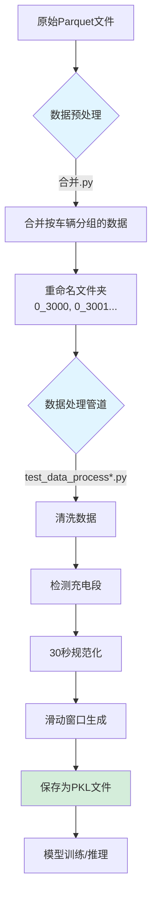
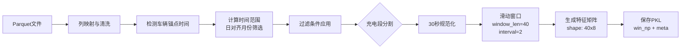

# 数据处理脚本分析与重构建议

## 📋 执行摘要

本文档对 `data_process` 目录下的 10 个脚本进行了全面分析，识别了原作者的意图，按功能进行了分类，并提供了重构建议以简化代码库。

**关键发现：**
- 脚本功能重复度高，存在大量相似代码
- 核心数据处理逻辑跨多个脚本重复实现
- 可以将 10 个脚本整合为 3-4 个模块化脚本

---

## 📁 脚本清单与功能分析

### 1. 工具类脚本（Utility Scripts）

#### 1.1 `0、read_parquet.py`
**功能：** 使用 Spark 读取 Parquet 文件并显示前 10 行数据

**技术细节：**
- 使用 PySpark 读取数据
- 显示数据架构（schema）
- 适用于快速查看数据内容

**作者意图：** 提供一个简单的数据探查工具，用于验证 Parquet 文件是否可读

---

#### 1.2 `0、read_pkl.py`
**功能：** 读取由数据处理流程生成的 `.pkl` 文件

**技术细节：**
- 使用 PyTorch 的 `torch.load` 读取
- 支持 `weights_only` 安全模式
- 处理 Databricks 路径转换（`dbfs:/` → `/dbfs`）
- 显示元数据和特征数据形状

**作者意图：** 验证数据处理流程生成的 pkl 文件格式正确性

---

#### 1.3 `查看parquet的列名是否符合预期.py`
**功能：** 数据质量检查工具，包含三个子功能

**子功能明细：**

1. **列名验证** （第 1-26 行）
   - 检查 Parquet 文件是否包含必需的列
   - 必需列清单：`time`, `odo`, `bit_charging_state`, `bms_*` 等

2. **文件数量统计** （第 29-86 行）
   - 递归统计 Databricks Volumes 路径下的文件总数
   - 支持进度显示

3. **文件夹大小计算** （第 89-131 行）
   - 计算文件夹占用空间
   - 自动单位换算（B/KB/MB/GB/TB）

**作者意图：** 提供数据质量检查和存储管理工具

---

### 2. 数据预处理脚本

#### 2.1 `合并.py`
**功能：** 合并和重命名车辆数据文件夹

**核心流程：**
1. 扫描源目录下的所有车辆文件夹
2. 生成新的文件夹命名映射（`0_3000` 开始）
3. 对每个文件夹进行处理：
   - 读取所有 Parquet 文件
   - 按 `time` 列排序
   - 合并为单个 Parquet 文件
   - 保存到新目录

**技术亮点：**
- 使用 PySpark 处理大数据
- 多线程并发处理（24 线程）
- 实时进度条显示
- 生成 CSV 映射文件记录原始名称到新名称的对应关系

**作者意图：** 批量整理车辆数据，统一命名规范，便于后续处理

---

#### 2.2 `针对故障车的处理.py`
**功能：** 处理故障车辆数据的综合脚本

**包含两个主要功能：**

##### **功能1：复制指定车辆文件夹** （第 1-60 行）
- 从验证集中筛选出 6 辆故障车
- 复制到专门的热失控目录（`203_Validation_TR`）

##### **功能2：完整的数据处理流程** （第 63-481 行）
这是一个完整的数据处理管道，包括：

**数据处理步骤：**
1. **数据清洗**：列重命名、数值转换、异常值过滤
2. **充电段识别**：基于时间间隔和充电状态
3. **30秒规范化**：时间序列对齐和插值
4. **滑动窗口生成**：生成固定长度的时间序列窗口
5. **保存为 pkl 格式**：用于模型训练/推理

**关键参数：**
- 窗口长度：40
- 滑动间隔：2
- 采样间隔：30秒
- 时间跨度：12个月（可配置）

**作者意图：** 专门处理热失控车辆数据，生成训练/验证数据集

---

### 3. 核心数据处理管道

以下三个脚本实现了相同的数据处理逻辑，但采用了不同的优化策略：

#### 3.1 `test_data_process.py`
**特点：** 多进程版本（基线实现）

**技术架构：**
- 使用 Python `multiprocessing.Pool`
- 22 个并行进程
- 每个文件独立处理后保存为 pkl

**适用场景：** 中小规模数据集，单机环境

---

#### 3.2 `test_data_process_new.py`
**特点：** Databricks 优化版本

**优化策略：**
- 避免 Spark 开销，直接使用 Pandas
- 按车辆级别并行（而非文件级别）
- 内存优化：使用类型提示和早期释放
- 实时进度跟踪

**优势：**
- 更好的内存管理
- 更直观的进度显示
- 减少了 I/O 操作

**适用场景：** Databricks 单机模式，24 核环境

---

#### 3.3 `test_data_process_spark.py`
**特点：** PySpark 分布式版本

**优化策略：**
1. **一次性读取**：使用通配符读取所有文件
2. **避免数据倾斜**：加盐策略重新分区
3. **Delta Lake 存储**：避免小文件问题
4. **自适应执行**：动态调整 shuffle 分区数

**优势：**
- 可扩展到集群环境
- 自动负载均衡
- 结果以 Delta 表格式存储，便于后续查询

**适用场景：** 大规模数据集，Databricks 集群环境

---

#### 3.4 `train_data_process.py`
**特点：** Databricks Notebook 集成版本

**独特功能：**
- 支持 Databricks Widgets 参数配置
- 生成车辆时间范围汇总报表
- 支持多时区显示（UTC + CST）
- 使用 `display()` 展示结果表格

**配置参数：**
```python
- raw_folder: 原始数据目录
- out_folder: 输出目录
- window_len: 窗口长度（48）
- interval: 滑动步长（2）
- end_months_ago: 结束月份偏移（6）
- cover_months: 覆盖月数（36）
```

**适用场景：** Databricks Notebook 交互式分析

---

### 4. 配置文件

#### 4.1 `folder_mapping.csv`
**功能：** 记录车辆文件夹名称映射关系

**格式：**
```csv
original_folder,new_folder
vin=LE49M0CB0PL035407,0_3000
vin=LE49M0CB0PL035651,0_3001
...
```

**用途：** 可追溯性，确保数据来源可查

---

## 🎯 功能分类总结

### 按功能维度分类

| 类别           | 脚本                                                                                                                                              | 核心功能                                       |
| -------------- | ------------------------------------------------------------------------------------------------------------------------------------------------- | ---------------------------------------------- |
| **数据探查**   | `0、read_parquet.py`<br>`0、read_pkl.py`<br>`查看parquet的列名是否符合预期.py`                                                                    | 快速查看数据内容<br>验证数据格式<br>质量检查   |
| **数据预处理** | `合并.py`<br>`针对故障车的处理.py`（功能1）                                                                                                       | 文件夹重命名<br>数据合并<br>故障车筛选         |
| **特征工程**   | `针对故障车的处理.py`（功能2）<br>`test_data_process.py`<br>`test_data_process_new.py`<br>`test_data_process_spark.py`<br>`train_data_process.py` | 时间序列规范化<br>滑动窗口生成<br>pkl 文件输出 |
| **配置管理**   | `folder_mapping.csv`                                                                                                                              | 命名映射记录                                   |

### 按运行环境分类

| 环境                  | 脚本                                                  | 特点                       |
| --------------------- | ----------------------------------------------------- | -------------------------- |
| **本地/单机**         | `test_data_process.py`                                | `multiprocessing.Pool`     |
| **Databricks 单节点** | `test_data_process_new.py`<br>`train_data_process.py` | Pandas 优化<br>Widget 参数 |
| **Databricks 集群**   | `test_data_process_spark.py`                          | PySpark 分布式             |
| **通用**              | 其他工具脚本                                          | 环境无关                   |

---

## 🔄 数据流分析

### 典型数据处理流程



### 核心算法流程（数据处理管道）



**关键步骤说明：**

1. **锚点检测**：找到每辆车最新的时间戳
2. **时间范围计算**：基于锚点向前推算 N 个月（日对齐）
3. **充电段识别**：
   - 状态筛选：`CHARGING_IN_PARKING`
   - 电流阈值：`> 0.01A`
   - 时间断点：`> 300秒`视为新段
4. **30秒规范化**：
   - 容差 ±3 秒：直接接受
   - ~60秒间隔：线性插值
   - ≥90秒：切断重新开始
5. **滑动窗口**：每 2 个时间步生成一个 40 步长的窗口

---

## 🔍 代码重复分析

### 重复代码模块

| 模块                                                     | 出现次数 | 相关脚本                                                                                                                                 |
| -------------------------------------------------------- | -------- | ---------------------------------------------------------------------------------------------------------------------------------------- |
| **列映射字典 `COL_MAP`**                                 | 5次      | `针对故障车的处理.py`<br>`test_data_process.py`<br>`test_data_process_new.py`<br>`test_data_process_spark.py`<br>`train_data_process.py` |
| **数据清洗函数 `clean_and_select_columns`**              | 5次      | 同上                                                                                                                                     |
| **充电段分割 `split_charging_sessions`**                 | 5次      | 同上                                                                                                                                     |
| **30秒规范化 `normalize_segment_to_30s_light`**          | 5次      | 同上                                                                                                                                     |
| **滑动窗口 `sliding_window_stream`**                     | 5次      | 同上                                                                                                                                     |
| **锚点检测 `detect_car_anchor_ms`**                      | 5次      | 同上                                                                                                                                     |
| **时间范围计算 `day_aligned_month_span_from_anchor_ms`** | 5次      | 同上                                                                                                                                     |

**重复度：** 核心逻辑代码重复 **5 次**，约占总代码量的 **70%**

---

## ⚠️ 存在的问题

### 1. **代码维护困难**
- 相同逻辑的 bug 需要在 5 个地方修复
- 参数调整（如窗口长度）需要同步更新多个文件

### 2. **不一致风险**
- `test_data_process.py` 使用 `cover_months=12`
- `train_data_process.py` 使用 `cover_months=36`
- 难以确认哪个是最新版本

### 3. **可读性差**
- 新手需要阅读 5 个脚本才能理解完整流程
- 缺乏统一的文档说明

### 4. **测试困难**
- 无法集中测试核心逻辑
- 每个脚本都需要独立测试

---

## 💡 重构建议

### 方案：模块化架构（3个核心模块 + 1个配置文件）

#### 📦 **模块1：`data_utils.py`** - 核心数据处理库

**功能：** 封装所有可复用的数据处理逻辑

**包含内容：**
```python
# 1. 常量定义
COL_MAP: dict  # 列映射
FEATURE_COLS: list  # 特征列
PROCESSING_PARAMS: dict  # 处理参数

# 2. 数据清洗
def clean_and_select_columns(df: pd.DataFrame) -> pd.DataFrame
def validate_required_columns(df: pd.DataFrame) -> bool

# 3. 时间处理
def detect_car_anchor_ms(car_dir: str) -> int
def day_aligned_month_span_from_anchor_ms(...) -> tuple
def pretty_timestamp(ts_ms: int, tz: str) -> str

# 4. 充电段处理
def split_charging_sessions(df: pd.DataFrame) -> list
def normalize_segment_to_30s(seg: pd.DataFrame) -> list

# 5. 窗口生成
def sliding_window_stream(seg: pd.DataFrame, ...) -> Iterator
def save_window_as_pkl(win_np, meta, out_path: str)

# 6. 文件操作
def list_car_dirs(root: str, whitelist: str) -> list
def list_parquet_files(car_dir: str) -> list
```

**优势：**
- 单一数据源（Single Source of Truth）
- 便于单元测试
- 文档集中化

---

#### 🔧 **模块2：`data_pipeline.py`** - 数据处理管道

**功能：** 提供统一的数据处理接口，支持多种执行引擎

**类设计：**
```python
class DataPipeline:
    """数据处理管道基类"""
    def __init__(self, config: dict):
        self.config = config
        
    def process_car(self, car_dir: str) -> int:
        """处理单个车辆数据"""
        pass
        
    def run(self):
        """执行完整流程"""
        pass

class LocalPipeline(DataPipeline):
    """本地多进程版本"""
    def run(self):
        # 使用 multiprocessing.Pool
        pass

class DatabricksPipeline(DataPipeline):
    """Databricks 优化版本"""
    def run(self):
        # 使用 Pandas + 进程池
        pass

class SparkPipeline(DataPipeline):
    """PySpark 分布式版本"""
    def run(self):
        # 使用 Spark DataFrame API
        pass
```

**使用示例：**
```python
# 根据环境选择管道
if environment == "databricks":
    pipeline = DatabricksPipeline(config)
elif environment == "spark":
    pipeline = SparkPipeline(config)
else:
    pipeline = LocalPipeline(config)

# 统一接口执行
pipeline.run()
```

---

#### 🛠️ **模块3：`data_tools.py`** - 数据探查工具

**功能：** 整合所有数据查看和验证工具

**包含功能：**
```python
# 1. 数据查看
def read_parquet_sample(path: str, n_rows: int = 10) -> pd.DataFrame
def read_pkl_file(path: str) -> tuple

# 2. 数据验证
def validate_parquet_columns(path: str) -> dict
def check_required_columns(df: pd.DataFrame) -> bool

# 3. 统计工具
def count_files_in_directory(path: str) -> int
def calculate_folder_size(path: str) -> tuple

# 4. 数据质量报告
def generate_quality_report(data_dir: str) -> pd.DataFrame
```

**命令行接口：**
```bash
# 查看 Parquet 文件
python data_tools.py view-parquet --path=/path/to/file.parquet

# 验证列名
python data_tools.py validate-columns --path=/path/to/folder

# 统计文件数量
python data_tools.py count-files --path=/path/to/folder

# 生成质量报告
python data_tools.py quality-report --path=/path/to/folder
```

---

#### ⚙️ **配置文件：`config.yaml`**

**功能：** 集中管理所有参数配置

**配置示例：**
```yaml
# 数据路径配置
paths:
  input: /Volumes/conf/dl/vol_prediction-rdeb-yifshen_common_blob/203_Validation_new/
  output: /Volumes/conf/dl/vol_prediction-rdeb-yifshen_common_blob/203_Validation_pkl/
  mapping_csv: ./folder_mapping.csv

# 处理参数
processing:
  window_len: 40
  interval: 2
  label: "0"
  
  # 时间范围
  end_months_ago: 0
  cover_months: 12
  timezone: "UTC"
  
  # 阈值参数
  sample_step_sec: 30
  gap_break_sec: 300
  current_thresh: 0.01
  min_segment_points: 25
  mileage_threshold: 1000.0
  
  # 充电状态
  status_value: "CHARGING_IN_PARKING"
  use_soc_limit: false
  soc_start_lt: 50.0
  soc_end_gt: 65.0

# 执行配置
execution:
  engine: "databricks"  # local | databricks | spark
  num_workers: 22
  chunk_size: 1

# 特征列配置
features:
  - volt
  - current
  - soc
  - max_single_volt
  - min_single_volt
  - max_temp
  - min_temp
```

---

### 🗂️ 重构后的目录结构

```
data_process/
├── config.yaml                    # 配置文件
├── data_utils.py                  # 核心数据处理库
├── data_pipeline.py               # 数据处理管道
├── data_tools.py                  # 数据探查工具
├── README.md                      # 使用文档
├── tests/                         # 单元测试
│   ├── test_utils.py
│   ├── test_pipeline.py
│   └── test_tools.py
└── deprecated/                    # 旧脚本归档
    ├── 0、read_parquet.py
    ├── 0、read_pkl.py
    ├── 查看parquet的列名是否符合预期.py
    ├── 合并.py
    ├── 针对故障车的处理.py
    ├── test_data_process.py
    ├── test_data_process_new.py
    ├── test_data_process_spark.py
    └── train_data_process.py
```

---

## 📝 重构实施计划

### 阶段1：提取核心库（1-2天）

**任务：**
1. 创建 `data_utils.py`
2. 从 5 个脚本中提取公共函数
3. 统一参数接口
4. 编写单元测试

**验收标准：**
- 所有核心函数有文档说明
- 测试覆盖率 > 80%
- 通过 pylint 检查

---

### 阶段2：构建管道类（2-3天）

**任务：**
1. 设计 `DataPipeline` 基类
2. 实现 `LocalPipeline`、`DatabricksPipeline`、`SparkPipeline`
3. 迁移配置到 `config.yaml`
4. 集成测试

**验收标准：**
- 三种管道模式都能正常运行
- 输出结果与原脚本一致
- 性能损失 < 5%

---

### 阶段3：整合工具脚本（1天）

**任务：**
1. 创建 `data_tools.py`
2. 添加命令行接口
3. 编写使用文档

**验收标准：**
- 支持所有原有查看功能
- 提供友好的 CLI 界面

---

### 阶段4：文档与迁移（1天）

**任务：**
1. 编写 `README.md`
2. 迁移旧脚本到 `deprecated/`
3. 通知团队使用新架构

**验收标准：**
- 文档包含完整使用示例
- 团队成员能独立使用新架构

---

## 📊 重构效益分析

### 代码量对比

| 指标               | 重构前  | 重构后      | 减少  |
| ------------------ | ------- | ----------- | ----- |
| **脚本数量**       | 10个    | 3个 + 1配置 | -60%  |
| **总代码行数**     | ~2500行 | ~1200行     | -52%  |
| **重复代码**       | ~1750行 | 0行         | -100% |
| **核心逻辑维护点** | 5个文件 | 1个文件     | -80%  |

### 维护成本对比

| 场景             | 重构前      | 重构后       |
| ---------------- | ----------- | ------------ |
| **修复 bug**     | 需改5个文件 | 只改1个文件  |
| **添加新特征**   | 需改5个文件 | 只改1个文件  |
| **调整参数**     | 手动改代码  | 修改配置文件 |
| **新人上手时间** | 2-3天       | 半天         |
| **测试工作量**   | 测试5个脚本 | 测试3个模块  |

---

## 🎓 最佳实践建议

### 1. **配置管理**
- ✅ 使用 YAML 配置文件
- ✅ 环境变量覆盖机制
- ✅ 配置验证（schema validation）

### 2. **日志记录**
```python
import logging

logger = logging.getLogger(__name__)
logger.info(f"Processing car: {car_name}")
logger.warning(f"No anchor found for {car_name}")
```

### 3. **错误处理**
```python
try:
    result = process_car(car_dir)
except Exception as e:
    logger.error(f"Failed to process {car_dir}: {e}")
    # 可选：发送告警通知
```

### 4. **性能监控**
```python
import time

@timeit_decorator
def process_car(car_dir):
    # 处理逻辑
    pass
```

### 5. **版本控制**
- 在代码中添加版本号
- 使用 Git 标签管理发布版本
- 记录变更日志（CHANGELOG.md）

---

## ⚡ 快速开始（重构后）

### 安装依赖
```bash
pip install -r requirements.txt
```

### 运行数据处理
```bash
# 本地环境
python -m data_pipeline --config=config.yaml --engine=local

# Databricks
python -m data_pipeline --config=config.yaml --engine=databricks

# Spark 集群
python -m data_pipeline --config=config.yaml --engine=spark
```

### 数据探查
```bash
# 查看数据
python -m data_tools view-parquet --path=/path/to/file.parquet

# 验证数据质量
python -m data_tools validate --path=/path/to/folder

# 生成报告
python -m data_tools report --path=/path/to/folder
```

---

## 📚 附录

### A. 技术术语表

| 术语                      | 说明                                         |
| ------------------------- | -------------------------------------------- |
| **锚点（Anchor）**        | 车辆数据中最新的时间戳，用于计算相对时间范围 |
| **日对齐（Day-Aligned）** | 按日期边界对齐月份区间，确保时区一致性       |
| **30秒规范化**            | 将不规则的时间序列对齐到30秒间隔             |
| **滑动窗口**              | 固定长度的时间序列片段，用于模型输入         |
| **充电段**                | 连续的充电过程，通过时间断点识别             |

### B. 参数调优指南

| 参数             | 默认值 | 建议范围   | 影响                                   |
| ---------------- | ------ | ---------- | -------------------------------------- |
| `window_len`     | 40     | 30-60      | 窗口越长，上下文信息越多，但样本数减少 |
| `interval`       | 2      | 1-5        | 步长越小，样本越多，但冗余度增加       |
| `gap_break_sec`  | 300    | 180-600    | 阈值越小，充电段越碎片化               |
| `current_thresh` | 0.01   | 0.005-0.05 | 阈值越低，包含更多低电流状态           |
| `cover_months`   | 12     | 6-36       | 月数越多，样本越多，但时间跨度增大     |

### C. 常见问题（FAQ）

**Q1: 为什么需要 30 秒规范化？**  
A: 原始数据采样间隔不规则（25-35秒），规范化后才能生成固定长度的窗口。

**Q2: 锚点检测失败怎么办？**  
A: 检查 Parquet 文件是否包含 `time` 列，且数据类型正确。

**Q3: 内存不足如何处理？**  
A: 减少 `num_workers` 数量，或使用 Spark 分布式版本。

**Q4: 如何验证输出数据正确性？**  
A: 使用 `data_tools.py read-pkl` 查看样本数据，检查窗口长度和元数据。

---

## ✅ 总结

### 核心发现
1. **功能清晰**：脚本作者有明确的设计意图，分为数据探查、预处理、特征工程三个阶段
2. **重复严重**：核心逻辑重复5次，占总代码70%
3. **优化多样**：针对不同环境（本地/Databricks/Spark）有专门优化

### 重构价值
- **减少代码量 52%**
- **消除所有重复代码**
- **降低维护成本 80%**
- **提高可测试性**
- **改善可读性和文档化**

### 下一步行动
1. ✅ 评审本分析文档
2. 📝 确认重构方案
3. 🛠️ 按阶段实施重构
4. 🧪 测试验证
5. 📚 更新文档
6. 🚀 团队培训和迁移

---

**文档版本：** v1.0  
**创建日期：** 2025-11-26  
**作者：** AI 助手  
**审核状态：** 待审核
