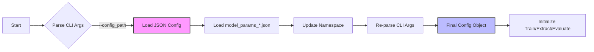
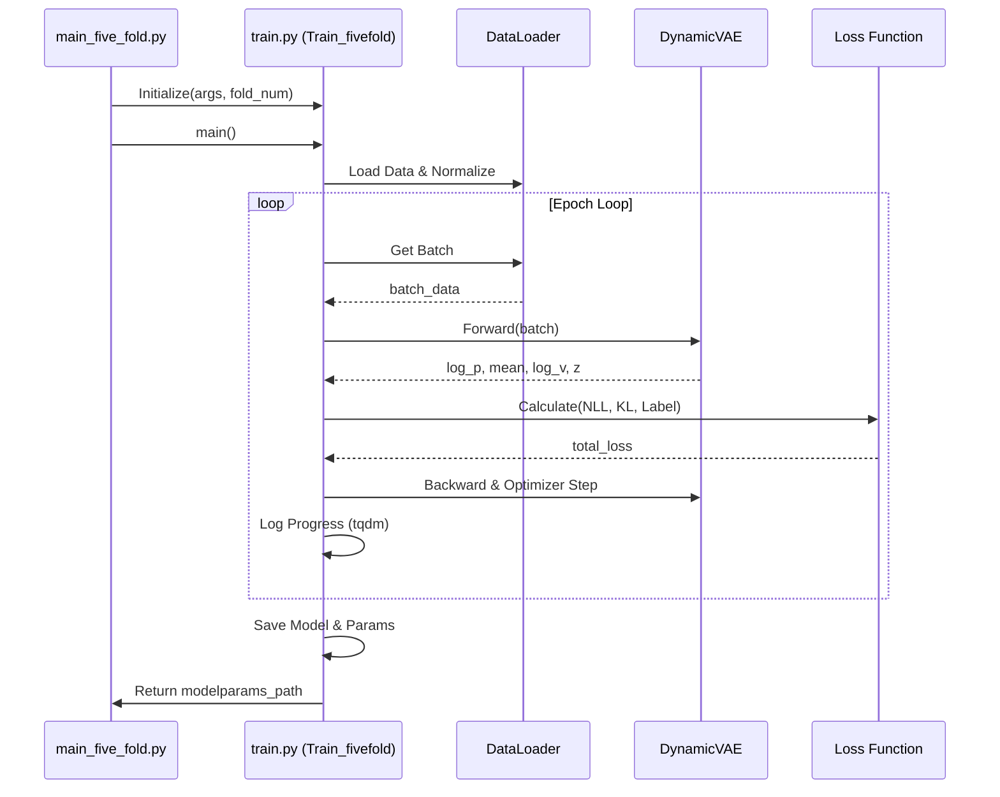
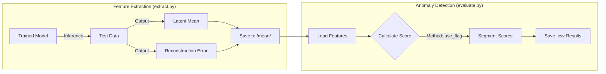

# DyAD Codebase Analysis: Five-Fold Training & Evaluation

This document provides a comprehensive analysis of the `DyAD` module, specifically focusing on the `main_five_fold.py` entry point, the five-fold cross-validation mechanism, and the training/evaluation pipeline.

## 1. Configuration & Hyperparameter Management

The system uses a hierarchical configuration strategy, merging default parameters, JSON configuration files, and command-line arguments.

### Configuration Loading Flow



### Key Hyperparameters
Parameters are defined in `model_params_*.json` (e.g., `model_params_battery_brand1.json`):

| Category | Parameter | Description |
| :--- | :--- | :--- |
| **Model Architecture** | `latent_size` | Dimension of the latent variable $z$. |
| | `hidden_size` | Hidden state dimension for RNN (GRU/LSTM). |
| | `rnn_type` | Type of RNN cell (`gru` or `lstm`). |
| **Training** | `epochs` | Number of training epochs. |
| | `learning_rate` | Initial learning rate for AdamW optimizer. |
| | `batch_size` | Batch size for training. |
| **Optimization** | `anneal0` | Initial value for KL divergence annealing. |
| | `anneal_function` | Annealing strategy (`linear` or `logistic`). |
| | `cosine_factor` | Factor for CosineAnnealingLR scheduler. |
| **Evaluation** | `use_flag` | Metric used for anomaly scoring (e.g., `rec_error`). |

---

## 2. Five-Fold Cross-Validation Strategy

The data splitting logic is encapsulated in `DyAD/model/dataset.py`. It ensures that the model is trained on a subset of "In-Distribution" (normal) data and tested on a mix of unseen normal data and "Out-Of-Distribution" (anomaly) data.

### Data Splitting Logic

```mermaid
graph TD
    subgraph Data Sources
        IND[Ind-Distribution Cars<br/>(Normal)]
        OOD[Out-Of-Distribution Cars<br/>(Abnormal)]
    end

    IND --> Split{Split into 5 Folds};
    Split --> F1[Fold 1];
    Split --> F2[Fold 2];
    Split --> F3[Fold 3];
    Split --> F4[Fold 4];
    Split --> F5[Fold 5];

    subgraph "Current Fold (e.g., fold_num=0)"
        F2 & F3 & F4 & F5 --> TrainSet[Training Set<br/>(80% Normal)];
        F1 --> TestNormal[Test Normal<br/>(20% Normal)];
        OOD --> TestAbnormal[Test Abnormal<br/>(All Abnormal)];
        TestNormal & TestAbnormal --> TestSet[Validation/Test Set];
    end

    style TrainSet fill:#dfd,stroke:#333
    style TestSet fill:#fdd,stroke:#333
```

*   **`ind_odd_dict*.npz.npy`**: Contains the lists of car IDs for normal (`ind_sorted`) and abnormal (`ood_sorted`) vehicles.
*   **`all_car_dict.npz.npy`**: Maps car IDs to their corresponding `.pkl` data files.

---

## 3. Training Loop Architecture

The training process is managed by `DyAD/train.py`.

### Training Pipeline



### Key Steps in `train.py`

1.  **Data Loading**: `dataset.Dataset` loads `.pkl` files based on the fold. `Normalizer` computes statistics from the first 200 samples.
2.  **Model Initialization**: `DynamicVAE` is initialized with parameters like `encoder_embedding_size` derived from the task columns.
3.  **Loss Calculation**:
    *   **NLL Loss**: Reconstruction loss (`SmoothL1Loss`).
    *   **KL Loss**: Divergence between latent distribution and prior.
    *   **Label Loss**: Auxiliary loss for regression tasks (e.g., mileage prediction).
    *   **Total Loss**: Weighted sum: `nll_weight * NLL + latent_label_weight * Label + kl_weight * KL`.
4.  **Artifact Preservation**:
    *   Models are saved to `dyad_vae_save/<timestamp>_fold<N>/model/`.
    *   Loss curves are plotted and saved to `dyad_vae_save/<timestamp>_fold<N>/loss/`.

---

## 4. Evaluation & Artifacts

Evaluation involves extracting features using the trained model and then calculating anomaly scores.

### Evaluation Flow



### Directory Structure (`dyad_vae_save`)

```text
dyad_vae_save/
└── YYYY-MM-DD-HH-MM-SS_fold{N}/
    ├── loss/       # Loss curves and reconstruction visualizations
    ├── model/      # Saved artifacts
    │   ├── model.torch       # PyTorch model weights
    │   ├── norm.pkl          # Normalizer object
    │   └── model_params.json # Configuration snapshot
    ├── feature/    # Extracted features for Training data
    ├── mean/       # Extracted features for Test data (used for evaluation)
    └── result/     # Final output
        ├── train_segment_scores.csv
        └── test_segment_scores.csv
```
