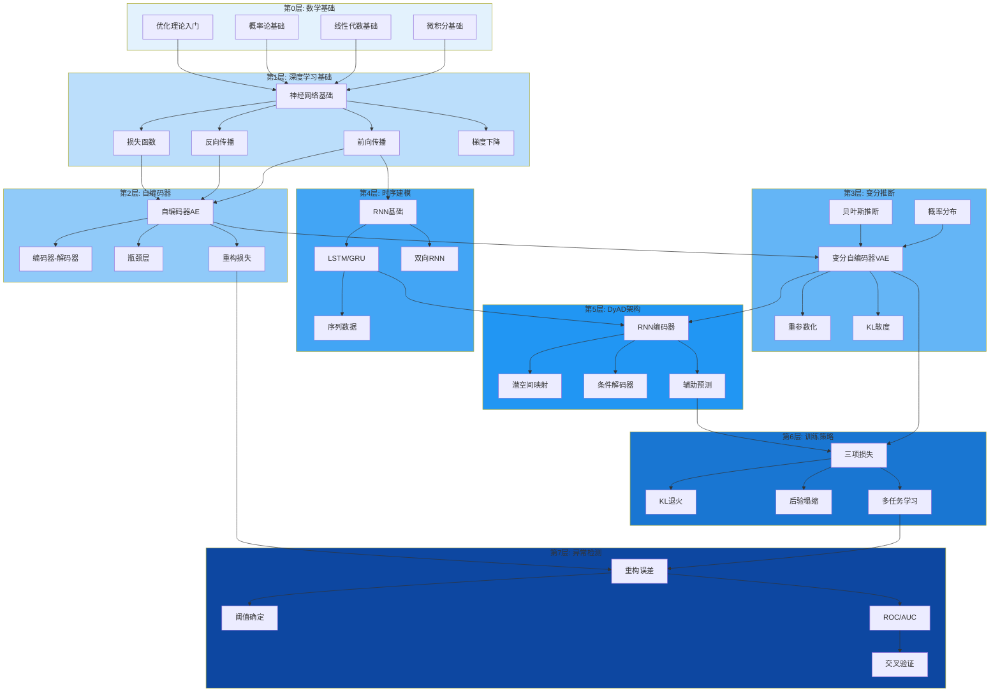
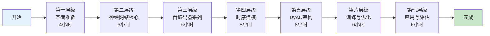
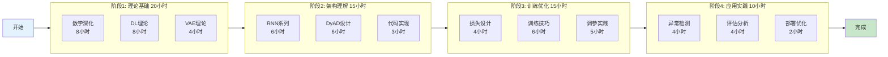

# DyAD 深度学习教程：渐进式教学路径设计

> **文档定位**: 为初学者设计的 DyAD (Dynamic Variational Autoencoder) 深度学习教程知识依赖图与教学路径规划
> **目标读者**: 教程创作者、内容开发者、技术培训师
> **创建日期**: 2025-02-12
> **版本**: 1.0

---

## 目录

- [1. 知识依赖关系图](#1-知识依赖关系图)
  - [1.1 核心概念依赖图](#11-核心概念依赖图)
  - [1.2 依赖关系矩阵](#12-依赖关系矩阵)
- [2. 知识点详细拆解](#2-知识点详细拆解)
  - [2.1 第一层级：基础准备](#21-第一层级基础准备)
  - [2.2 第二层级：神经网络核心](#22-第二层级神经网络核心)
  - [2.3 第三层级：自编码器系列](#23-第三层级自编码器系列)
  - [2.4 第四层级：时序建模](#24-第四层级时序建模)
  - [2.5 第五层级：DyAD 架构](#25-第五层级dyad-架构)
  - [2.6 第六层级：训练与优化](#26-第六层级训练与优化)
  - [2.7 第七层级：应用与评估](#27-第七层级应用与评估)
- [3. 推荐学习路径](#3-推荐学习路径)
- [4. 潜在陷阱与澄清策略](#4-潜在陷阱与澄清策略)
- [5. 教学建议](#5-教学建议)
- [6. 评估检查点](#6-评估检查点)

---

## 1. 知识依赖关系图

### 1.1 核心概念依赖图



### 1.2 依赖关系矩阵

| 知识点 | 前置知识1 | 前置知识2 | 前置知识3 | 可并行学习 |
|:------|:---------|:---------|:---------|:----------|
| **神经网络基础** | 微积分 | 线性代数 | 概率论 | 无 |
| **前向传播** | 神经网络基础 | | | 反向传播 |
| **反向传播** | 前向传播 | 链式法则 | | 前向传播 |
| **损失函数** | 前向传播 | 概率分布 | | 无 |
| **自编码器(AE)** | 神经网络基础 | 前向传播 | 损失函数 | 无 |
| **变分自编码器(VAE)** | 自编码器(AE) | 贝叶斯推断 | 概率分布 | 无 |
| **重参数化** | VAE基础 | 采样理论 | | KL散度 |
| **KL散度** | 概率分布 | 信息论基础 | | 重参数化 |
| **RNN基础** | 神经网络基础 | 前向传播 | | LSTM/GRU |
| **LSTM/GRU** | RNN基础 | 梯度消失概念 | | RNN基础 |
| **双向RNN** | LSTM/GRU | 序列数据 | | 时序注意力 |
| **DyAD架构** | VAE | LSTM/GRU | 双向RNN | 无 |
| **三项损失** | VAE损失 | 重构误差 | KL散度 | 无 |
| **KL退火** | KL散度 | 三项损失 | 训练策略 | 后验塌缩 |
| **后验塌缩** | VAE训练 | KL散度 | | KL退火 |
| **多任务学习** | 损失函数 | 辅助任务 | | 三项损失 |
| **重构误差检测** | 自编码器 | 损失函数 | | 阈值确定 |
| **阈值确定** | 重构误差 | 统计基础 | | ROC/AUC |
| **ROC/AUC** | 分类评估 | 混淆矩阵 | | PR曲线 |
| **交叉验证** | 训练/测试集 | 过拟合 | | 无 |

---

## 2. 知识点详细拆解

### 2.1 第一层级：基础准备

#### 知识点 1.1：微积分基础

| 属性 | 描述 |
|:-----|:-----|
| **预估学习时间** | 45分钟理解 |
| **难度等级** | ★★☆☆☆ |
| **前置知识要求** | 高中数学 |
| **学习目标** | 理解导数、偏导数、梯度的概念，能解释梯度下降原理 |
| **核心概念** | 导数、偏导数、梯度、链式法则 |
| **与DyAD关联** | 反向传播算法的数学基础，损失函数优化 |
| **可视化建议** | 3D曲面图展示梯度下降路径 |
| **类比建议** | 登山者下山：梯度相当于山坡最陡方向 |

#### 知识点 1.2：线性代数基础

| 属性 | 描述 |
|:-----|:-----|
| **预估学习时间** | 60分钟理解 |
| **难度等级** | ★★★☆☆ |
| **前置知识要求** | 基础代数 |
| **学习目标** | 理解矩阵乘法、向量运算、维度变换 |
| **核心概念** | 矩阵乘法、向量、张量、维度变换、线性变换 |
| **与DyAD关联** | 神经网络层运算、数据流维度追踪 |
| **可视化建议** | 矩阵乘法维度对应动画 |
| **类比建议** | 数据通过管道的变换过程 |

#### 知识点 1.3：概率论基础

| 属性 | 描述 |
|:-----|:-----|
| **预估学习时间** | 60分钟理解 |
| **难度等级** | ★★★☆☆ |
| **前置知识要求** | 基础统计 |
| **学习目标** | 理解概率分布、期望、方差、高斯分布 |
| **核心概念** | 概率分布、PDF/CDF、期望、方差、高斯分布、贝叶斯公式 |
| **与DyAD关联** | VAE的潜在空间建模、重参数化采样 |
| **可视化建议** | 不同参数的高斯分布曲线对比 |
| **类比建议** | 天气预报的概率表示 |

#### 知识点 1.4：优化理论入门

| 属性 | 描述 |
|:-----|:-----|
| **预估学习时间** | 45分钟理解 |
| **难度等级** | ★★☆☆☆ |
| **前置知识要求** | 微积分基础 |
| **学习目标** | 理解损失函数、极值问题、优化目标 |
| **核心概念** | 目标函数、约束优化、全局/局部最优 |
| **与DyAD关联** | 训练过程中的损失优化 |
| **可视化建议** | 损失曲面等高线图 |
| **类比建议** | 寻找山谷最低点 |

---

### 2.2 第二层级：神经网络核心

#### 知识点 2.1：神经网络基础

| 属性 | 描述 |
|:-----|:-----|
| **预估学习时间** | 90分钟理解 + 60分钟实践 |
| **难度等级** | ★★★☆☆ |
| **前置知识要求** | 微积分、线性代数、概率论 |
| **学习目标** | 理解神经元、层、激活函数、网络结构 |
| **核心概念** | 神经元、权重、偏置、激活函数(ReLU/Sigmoid)、前向传播 |
| **与DyAD关联** | DyAD的基础构建模块 |
| **可视化建议** | 神经网络结构图、激活函数对比图 |
| **类比建议** | 生物神经元的信息传递 |

#### 知识点 2.2：前向传播

| 属性 | 描述 |
|:-----|:-----|
| **预估学习时间** | 45分钟理解 + 30分钟实践 |
| **难度等级** | ★★★☆☆ |
| **前置知识要求** | 神经网络基础、矩阵乘法 |
| **学习目标** | 理解数据如何通过网络流动，计算输出 |
| **核心概念** | 线性变换、激活、层级计算、维度变换 |
| **与DyAD关联** | DyAD编码器和解码器的核心计算 |
| **可视化建议** | 数据流动追踪图，标注每一步维度 |
| **类比建议** | 工厂流水线，原材料逐步加工 |

#### 知识点 2.3：反向传播

| 属性 | 描述 |
|:-----|:-----|
| **预估学习时间** | 90分钟理解 + 60分钟实践 |
| **难度等级** | ★★★★☆ |
| **前置知识要求** | 前向传播、链式法则 |
| **学习目标** | 理解梯度如何反向流动，参数如何更新 |
| **核心概念** | 损失函数、梯度、链式法则、参数更新 |
| **与DyAD关联** | DyAD训练的核心算法 |
| **可视化建议** | 计算图梯度流动动画 |
| **类比建议** | 责任追溯：从错误源头向前查找责任人 |

#### 知识点 2.4：损失函数

| 属性 | 描述 |
|:-----|:-----|
| **预估学习时间** | 60分钟理解 |
| **难度等级** | ★★★☆☆ |
| **前置知识要求** | 概率论、前向传播 |
| **学习目标** | 理解不同损失函数的特点和适用场景 |
| **核心概念** | MSE、交叉熵、Huber Loss、负对数似然 |
| **与DyAD关联** | DyAD的三项损失函数基础 |
| **可视化建议** | 不同损失函数的误差-惩罚曲线对比 |
| **类比建议** | 评分标准：不同错误的扣分规则 |

---

### 2.3 第三层级：自编码器系列

#### 知识点 3.1：自编码器(AE)基础

| 属性 | 描述 |
|:-----|:-----|
| **预估学习时间** | 90分钟理解 + 90分钟实践 |
| **难度等级** | ★★★☆☆ |
| **前置知识要求** | 神经网络基础、前向/反向传播 |
| **学习目标** | 理解AE的架构、训练目标、应用场景 |
| **核心概念** | 编码器、解码器、瓶颈层、重构损失、无监督学习 |
| **与DyAD关联** | DyAD的直接前身，理解异常检测的基础 |
| **可视化建议** | AE架构图、输入-重构对比图 |
| **类比建议** | 压缩-解压缩：ZIP文件类比 |

#### 知识点 3.2：编码器-解码器架构

| 属性 | 描述 |
|:-----|:-----|
| **预估学习时间** | 60分钟理解 + 45分钟实践 |
| **难度等级** | ★★★☆☆ |
| **前置知识要求** | AE基础 |
| **学习目标** | 理解编码器和解码器的对称与非对称设计 |
| **核心概念** | 对称架构、信息瓶颈、表示学习、特征提取 |
| **与DyAD关联** | DyAD的基础架构模式 |
| **可视化建议** | 编码-解码过程示意图 |
| **类比建议** | 翻译过程：原文→编码→中间表示→解码→译文 |

#### 知识点 3.3：瓶颈层与表示学习

| 属性 | 描述 |
|:-----|:-----|
| **预估学习时间** | 60分钟理解 |
| **难度等级** | ★★★★☆ |
| **前置知识要求** | AE基础、编码器-解码器 |
| **学习目标** | 理解瓶颈层如何强制学习压缩表示 |
| **核心概念** | 信息瓶颈、维度压缩、特征提取、潜在空间 |
| **与DyAD关联** | DyAD潜在空间设计的基础 |
| **可视化建议** | 不同维度瓶颈的效果对比 |
| **类比建议** | 通过漏斗：强制信息浓缩 |

#### 知识点 3.4：重构损失

| 属性 | 描述 |
|:-----|:-----|
| **预估学习时间** | 45分钟理解 + 30分钟实践 |
| **难度等级** | ★★★☆☆ |
| **前置知识要求** | 损失函数、AE基础 |
| **学习目标** | 理解重构损失如何衡量信息保留程度 |
| **核心概念** | MSE重构损失、像素级误差、特征级误差 |
| **与DyAD关联** | DyAD重构项的基础 |
| **可视化建议** | 不同重构误差的输入-输出对比 |
| **类比建议** | 复原拼图：误差越小还原越好 |

---

### 2.4 第四层级：时序建模

#### 知识点 4.1：RNN基础

| 属性 | 描述 |
|:-----|:-----|
| **预估学习时间** | 90分钟理解 + 60分钟实践 |
| **难度等级** | ★★★★☆ |
| **前置知识要求** | 神经网络基础、序列数据概念 |
| **学习目标** | 理解RNN如何处理序列数据，隐藏状态的作用 |
| **核心概念** | 序列数据、隐藏状态、时间展开、梯度消失/爆炸 |
| **与DyAD关联** | DyAD编码器和解码器的基础 |
| **可视化建议** | RNN时间展开图、隐藏状态流动图 |
| **类比建议** | 阅读句子：记忆上下文的同时逐词阅读 |

#### 知识点 4.2：LSTM/GRU

| 属性 | 描述 |
|:-----|:-----|
| **预估学习时间** | 120分钟理解 + 90分钟实践 |
| **难度等级** | ★★★★★ |
| **前置知识要求** | RNN基础、梯度消失问题 |
| **学习目标** | 理解门控机制如何解决长程依赖问题 |
| **核心概念** | 遗忘门、输入门、输出门、细胞状态、门控机制 |
| **与DyAD关联** | DyAD中实际使用的RNN变体 |
| **可视化建议** | LSTM内部结构图、门控信息流动图 |
| **类比建议** | 图书馆管理：决定借阅、保留、归档哪些书籍 |

#### 知识点 4.3：序列数据处理

| 属性 | 描述 |
|:-----|:-----|
| **预估学习时间** | 60分钟理解 + 45分钟实践 |
| **难度等级** | ★★★☆☆ |
| **前置知识要求** | RNN基础 |
| **学习目标** | 理解序列数据的预处理、变长序列处理 |
| **核心概念** | 序列填充、序列打包、滑动窗口、时间步 |
| **与DyAD关联** | DyAD电池时序数据的处理方式 |
| **可视化建议** | 序列切分示意图、变长序列处理动画 |
| **类比建议** | 电影剪辑：将长视频切成合适片段 |

#### 知识点 4.4：双向RNN

| 属性 | 描述 |
|:-----|:-----|
| **预估学习时间** | 60分钟理解 + 45分钟实践 |
| **难度等级** | ★★★★☆ |
| **前置知识要求** | LSTM/GRU |
| **学习目标** | 理解双向信息整合的价值和实现方式 |
| **核心概念** | 前向/后向RNN、上下文聚合、双向隐藏状态拼接 |
| **与DyAD关联** | DyAD编码器可选配置 |
| **可视化建议** | 双向RNN信息流示意图 |
| **类比建议** | 阅读理解：从头看到尾再从尾看到头 |

---

### 2.5 第五层级：DyAD架构

#### 知识点 5.1：DyAD整体架构

| 属性 | 描述 |
|:-----|:-----|
| **预估学习时间** | 90分钟理解 + 60分钟实践 |
| **难度等级** | ★★★★★ |
| **前置知识要求** | VAE、LSTM/GRU、双向RNN |
| **学习目标** | 理解DyAD各组件的作用和数据流动 |
| **核心概念** | RNN编码器、潜空间映射、条件解码器、辅助预测器 |
| **与DyAD关联** | DyAD核心架构 |
| **可视化建议** | DyAD完整数据流图（带维度标注） |
| **类比建议** | 翻译+摘要：同时进行重构和预测 |

#### 知识点 5.2：双向RNN编码器

| 属性 | 描述 |
|:-----|:-----|
| **预估学习时间** | 60分钟理解 + 45分钟实践 |
| **难度等级** | ★★★★☆ |
| **前置知识要求** | 双向RNN、DyAD整体架构 |
| **学习目标** | 理解编码器如何将时序数据压缩为隐藏表示 |
| **核心概念** | 时序编码、上下文聚合、隐藏状态提取 |
| **与DyAD关联** | DyAD的第一阶段 |
| **可视化建议** | 编码器数据流动图（维度追踪） |
| **类比建议** | 阅读总结：提取文章核心要点 |

#### 知识点 5.3：潜空间映射

| 属性 | 描述 |
|:-----|:-----|
| **预估学习时间** | 90分钟理解 + 60分钟实践 |
| **难度等级** | ★★★★★ |
| **前置知识要求** | VAE潜空间、DyAD整体架构 |
| **学习目标** | 理解隐藏状态到潜在分布的映射过程 |
| **核心概念** | 均值映射、方差映射、概率分布参数化 |
| **与DyAD关联** | DyAD的核心创新点 |
| **可视化建议** | 隐藏状态→潜空间映射图、分布可视化 |
| **类比建议** | 语言翻译：将理解转换为可表达的中间语言 |

#### 知识点 5.4：条件解码器

| 属性 | 描述 |
|:-----|:-----|
| **预估学习时间** | 75分钟理解 + 60分钟实践 |
| **难度等级** | ★★★★☆ |
| **前置知识要求** | LSTM解码器、潜空间映射 |
| **学习目标** | 理解解码器如何从潜在变量恢复序列 |
| **核心概念** | 初始状态设置、条件生成、教师强制 |
| **与DyAD关联** | DyAD的生成阶段 |
| **可视化建议** | 解码器展开图、条件生成示意图 |
| **类比建议** | 根据大纲写文章：潜在变量作为大纲 |

#### 知识点 5.5：辅助预测器

| 属性 | 描述 |
|:-----|:-----|
| **预估学习时间** | 60分钟理解 + 45分钟实践 |
| **难度等级** | ★★★☆☆ |
| **前置知识要求** | 多任务学习基础、潜空间映射 |
| **学习目标** | 理解辅助任务如何引导潜在空间学习 |
| **核心概念** | 辅助监督、物理约束、多任务学习 |
| **与DyAD关联** | DyAD的半监督学习机制 |
| **可视化建议** | 辅助任务架构图、潜空间物理意义图 |
| **类比建议** | 学习语言同时学习文化：通过相关任务加深理解 |

---

### 2.6 第六层级：训练与优化

#### 知识点 6.1：三项损失函数

| 属性 | 描述 |
|:-----|:-----|
| **预估学习时间** | 90分钟理解 + 60分钟实践 |
| **难度等级** | ★★★★☆ |
| **前置知识要求** | VAE损失、重构损失、辅助预测 |
| **学习目标** | 理解三项损失的作用、平衡策略、优化目标 |
| **核心概念** | 重构损失、KL散度、标签损失、损失权重、多目标优化 |
| **与DyAD关联** | DyAD训练的核心机制 |
| **可视化建议** | 三项损失训练曲线图、损失权重影响对比图 |
| **类比建议** | 三项考核：学业、体育、品德都要平衡发展 |

#### 知识点 6.2：KL退火机制

| 属性 | 描述 |
|:-----|:-----|
| **预估学习时间** | 75分钟理解 + 60分钟实践 |
| **难度等级** | ★★★★★ |
| **前置知识要求** | KL散度、三项损失 |
| **学习目标** | 理解KL退火的原理、实现方式、调参策略 |
| **核心概念** | 后验塌缩、退火策略、Sigmoid权重、训练阶段 |
| **与DyAD关联** | DyAD训练成功的关键技巧 |
| **可视化建议** | KL权重曲线图、退火前后效果对比图 |
| **类比建议** | 逐步加压：先学基础再要求规范 |

#### 知识点 6.3：后验塌缩问题

| 属性 | 描述 |
|:-----|:-----|
| **预估学习时间** | 60分钟理解 |
| **难度等级** | ★★★★☆ |
| **前置知识要求** | VAE训练、KL散度 |
| **学习目标** | 理解后验塌缩的原因、表现、解决方案 |
| **核心概念** | 潜在变量失效、解码器过强、信息忽略 |
| **与DyAD关联** | DyAD训练的主要挑战 |
| **可视化建议** | 后验塌缩前后的潜空间分布对比 |
| **类比建议** | 翻译器忽略源语言：直接瞎猜而不翻译 |

#### 知识点 6.4：多任务学习策略

| 属性 | 描述 |
|:-----|:-----|
| **预估学习时间** | 75分钟理解 + 45分钟实践 |
| **难度等级** | ★★★☆☆ |
| **前置知识要求** | 三项损失、辅助预测器 |
| **学习目标** | 理解多任务学习的原理、优势、实现方式 |
| **核心概念** | 任务平衡、共享表示、正则化效果、迁移学习 |
| **与DyAD关联** | DyAD辅助任务的理论基础 |
| **可视化建议** | 多任务学习架构图、单任务vs多任务对比图 |
| **类比建议** | 综合训练：多项技能互相促进 |

---

### 2.7 第七层级：应用与评估

#### 知识点 7.1：重构误差异常检测

| 属性 | 描述 |
|:-----|:-----|
| **预估学习时间** | 75分钟理解 + 60分钟实践 |
| **难度等级** | ★★★☆☆ |
| **前置知识要求** | 自编码器、重构损失 |
| **学习目标** | 理解基于重构误差的异常检测原理和实现 |
| **核心概念** | 正常模式学习、异常敏感度、阈值设定、无监督检测 |
| **与DyAD关联** | DyAD的核心应用 |
| **可视化建议** | 重构误差分布图、正常vs异常对比图 |
| **类比建议** | 指纹识别：正常指纹能匹配，异常指纹不匹配 |

#### 知识点 7.2：阈值确定方法

| 属性 | 描述 |
|:-----|:-----|
| **预估学习时间** | 60分钟理解 + 45分钟实践 |
| **难度等级** | ★★★☆☆ |
| **前置知识要求** | 重构误差、统计基础 |
| **学习目标** | 理解不同阈值确定方法的优缺点和适用场景 |
| **核心概念** | 统计阈值、分位数法、最大化F1、ROC曲线 |
| **与DyAD关联** | DyAD异常检测的实际应用 |
| **可视化建议** | 不同阈值下的性能对比图、阈值-指标曲线图 |
| **类比建议** | 考试分数线：根据考生分布确定及格线 |

#### 知识点 7.3：ROC/AUC评估

| 属性 | 描述 |
|:-----|:-----|
| **预估学习时间** | 90分钟理解 + 60分钟实践 |
| **难度等级** | ★★★★☆ |
| **前置知识要求** | 分类评估基础、阈值确定 |
| **学习目标** | 理解ROC曲线、AUC的含义和计算方式 |
| **核心概念** | TPR/FPR、阈值遍历、ROC曲线、AUC、基线对比 |
| **与DyAD关联** | DyAD性能评估的标准方法 |
| **可视化建议** | ROC曲线图、不同模型ROC对比、AUC计算示意 |
| **类比建议** | 天气预报准确率：晴雨预报的权衡 |

#### 知识点 7.4：交叉验证策略

| 属性 | 描述 |
|:-----|:-----|
| **预估学习时间** | 75分钟理解 + 60分钟实践 |
| **难度等级** | ★★★☆☆ |
| **前置知识要求** | 训练/测试集划分、过拟合概念 |
| **学习目标** | 理解交叉验证的原理、五折验证在异常检测中的特殊性 |
| **核心概念** | K折交叉验证、数据划分、泛化评估、OOD处理 |
| **与DyAD关联** | DyAD评估的核心策略 |
| **可视化建议** | 五折数据划分图、交叉验证流程图 |
| **类比建议** | 多次考试：取平均成绩减少偶然性 |

---

## 3. 推荐学习路径

### 3.1 快速路径（15-20小时）

适合有一定深度学习基础的学习者，快速掌握DyAD核心：


### 3.2 标准路径（30-40小时）

适合初学者，系统学习所有前置知识：



### 3.3 深度路径（50-60小时）

适合研究者，深入理论并实践：



---

## 4. 潜在陷阱与澄清策略

### 4.1 常见混淆点

#### 混淆点1：AE vs VAE的区别

| 维度 | 普通自编码器(AE) | 变分自编码器(VAE) |
|:-----|:-----------------|:------------------|
| **潜在表示** | 确定性点z | 概率分布(μ, σ²) |
| **采样方式** | 直接输出 | 重参数化采样 |
| **损失函数** | 仅重构损失 | 重构+KL散度 |
| **生成能力** | 有限 | 强 |
| **训练稳定性** | 容易 | 需要技巧 |

**澄清策略**：
- 使用对比动画展示确定性vs随机性编码
- 用"地图定位"类比：AE给出固定坐标，VAE给出可能区域
- 代码对比：展示输出层的差异

#### 混淆点2：KL散度的方向

**常见错误**：混淆KL(q||p)和KL(p||q)

**澄清策略**：
- 明确公式：KL(q||p)衡量q偏离p的程度
- 类比：从北京到上海的距离 ≠ 从上海到北京的距离（在非对称度量下）
- 代码注释：明确哪个是近似分布(q)，哪个是先验分布(p)

#### 混淆点3：训练时vs推理时的采样

**常见错误**：不理解为什么训练时采样、推理时用均值

**澄清策略**：
- 展示两段代码对比：training vs eval模式
- 解释推理时用均值=期望值最优化
- 类比：训练时探索不同路径，推理时走最优路径

#### 混淆点4：重构损失与分类损失

**常见错误**：混淆异常检测的重构误差与分类的交叉熵

**澄清策略**：
- 对比表格展示两种任务的目标差异
- 可视化：重构误差vs分类边界的决策图
- 代码示例：两种损失的计算方式对比

#### 混淆点5：双向RNN与序列到序列

**常见错误**：混淆双向RNN编码与seq2seq解码

**澄清策略**：
- 架构图对比：双向用于编码，单向用于解码
- 应用场景：双向用于理解，单向用于生成
- 代码注释：明确bidirectional参数的作用范围

### 4.2 学习难点预警

#### 难点1：重参数化技巧的理解

**难度等级**：★★★★★

**突破策略**：
1. 先理解为什么需要（采样不可微）
2. 再看怎么做（数学推导）
3. 最后看代码（实现细节）
4. 动手实验：观察梯度的流动

**可视化建议**：
- 计算图对比：不可微 vs 可微版本
- 动画展示：随机性来源的转移

#### 难点2：KL散度的物理意义

**难度等级**：★★★★☆

**突破策略**：
1. 从信息论角度理解（额外信息量）
2. 从分布差异角度理解（形状差异）
3. 从优化目标角度理解（正则化作用）
4. 数值实验：观察不同分布的KL值

**类比建议**：
- 两个语言的"距离"：需要多少信息转换
- 两个城市的"差异"：文化和经济的差异程度

#### 难点3：后验塌缩的检测和解决

**难度等级**：★★★★★

**突破策略**：
1. 学习识别症状：KL→0，z与x无关
2. 理解根本原因：解码器过强
3. 掌握解决方案：KL退火
4. 实践验证：对比有/无退火的效果

**诊断检查表**：
- [ ] KL散度是否快速降到接近0？
- [ ] 潜在变量z的方差是否过小？
- [ ] 重构质量是否不依赖z？

#### 难点4：时序数据的维度追踪

**难度等级**：★★★☆☆

**突破策略**：
1. 建立维度记录习惯
2. 使用可视化工具追踪
3. 从简单例子开始（小batch，短序列）
4. 逐步增加复杂度

**维度追踪表模板**：
```python
# 示例
print(f"Input: {input.shape}")        # [64, 128, 4]
print(f"After RNN: {output.shape}")  # [64, 128, 64]
print(f"Hidden: {hidden.shape}")      # [64, 64]
# ... 每一步都打印
```

---

## 5. 教学建议

### 5.1 类比教学法

#### 核心概念类比库

| 概念 | 类比 | 使用场景 |
|:-----|:-----|:---------|
| **梯度下降** | 登山者下山 | 解释优化方向 |
| **神经网络** | 工厂流水线 | 解释层级处理 |
| **自编码器** | 压缩软件 | 解释信息瓶颈 |
| **VAE潜在空间** | 语言翻译的中间语言 | 解释分布表示 |
| **重参数化** | 把随机种子外包 | 解释可微分采样 |
| **KL散度** | 两个语言的差异程度 | 解释分布距离 |
| **RNN隐藏状态** | 阅读时的记忆 | 解释上下文保持 |
| **LSTM门控** | 图书馆管理员 | 解释信息筛选 |
| **后验塌缩** | 翻译器瞎猜不翻译 | 解释潜在变量失效 |
| **KL退火** | 循序渐进的教学 | 解释训练策略 |
| **交叉验证** | 多次考试取平均 | 解释泛化评估 |
| **异常检测** | 指纹不匹配 | 解释重构误差 |
| **ROC曲线** | 天气预报权衡 | 解释阈值选择 |

### 5.2 可视化教学策略

#### 必备可视化清单

**概念理解类**：
1. 神经网络结构图
2. AE架构图（对比VAE）
3. VAE重参数化示意图
4. RNN时间展开图
5. LSTM门控机制图
6. DyAD完整数据流图

**训练过程类**：
1. 损失曲线（三项损失分别展示）
2. KL权重退火曲线
3. 梯度流动可视化
4. 潜在空间演化动画

**结果评估类**：
1. 重构对比图（输入vs输出）
2. 潜在空间t-SNE图
3. 重构误差分布图
4. ROC曲线与AUC
5. 混淆矩阵热力图

**调试诊断类**：
1. 张量维度追踪图
2. 梯度范数监控图
3. 激活值分布直方图
4. 问题诊断决策树

### 5.3 渐进式复杂度设计

#### 第一轮：概念建立（简化版）

```
目标：建立直觉，忽略细节
特点：
- 最小化代码（20行以内）
- 固定参数（无需调参）
- 小数据集（立即可运行）
- 丰富注释（每行解释）
```

#### 第二轮：原理深入（标准版）

```
目标：理解机制，掌握核心
特点：
- 完整代码结构
- 可配置参数
- 标准数据集
- 算法详解
```

#### 第三轮：工程实践（完整版）

```
目标：实际应用，解决问题
特点：
- 工程级代码
- 超参数调优
- 真实数据集
- 性能优化
```

### 5.4 互动式学习设计

#### 编程练习序列

1. **填空式**：补全关键代码行
2. **改错式**：修复bug代码
3. **对比式**：两种实现对比
4. **扩展式**：基于模板添加功能
5. **创造式**：从零开始实现

#### 思考题设计

```
理解层：
- 为什么VAE需要重参数化？
- KL散度为什么能正则化？

应用层：
- 如果去掉辅助任务会怎样？
- 数据量增加时超参数如何调整？

创新层：
- 如何改进DyAD架构？
- 有其他异常检测思路吗？
```

---

## 6. 评估检查点

### 6.1 知识检查点

#### 检查点1：基础层完成后

- [ ] 能解释神经网络前向传播的计算过程
- [ ] 能手动计算简单网络的输出
- [ ] 理解损失函数的作用
- [ ] 能描述梯度下降的基本原理

#### 检查点2：AE/VAE层完成后

- [ ] 能画出AE和VAE的架构对比图
- [ ] 能解释VAE比AE的优势
- [ ] 能手动推导KL散度公式
- [ ] 能实现简单的VAE代码

#### 检查点3：时序建模层完成后

- [ ] 能解释RNN如何处理序列
- [ ] 能描述LSTM门控的作用
- [ ] 能处理变长序列数据
- [ ] 能实现双向RNN

#### 检查点4：DyAD架构层完成后

- [ ] 能画出DyAD完整数据流图
- [ ] 能追踪每一步的张量维度
- [ ] 能解释三项损失的作用
- [ ] 能实现简化版DyAD

#### 检查点5：训练优化层完成后

- [ ] 能诊断后验塌缩问题
- [ ] 能调整KL退火参数
- [ ] 能平衡多任务损失
- [ ] 能训练完整DyAD模型

#### 检查点6：应用评估层完成后

- [ ] 能计算重构误差异常分数
- [ ] 能绘制ROC曲线计算AUC
- [ ] 能实现五折交叉验证
- [ ] 能分析和解释实验结果

### 6.2 能力评估标准

| 能力等级 | 描述 | 检验方式 |
|:---------|:-----|:---------|
| **理解级** | 能解释概念，回答理论问题 | 笔试/口试 |
| **实现级** | 能编写代码实现基本功能 | 编程练习 |
| **应用级** | 能解决实际问题，调试优化 | 项目实战 |
| **创新级** | 能改进方法，提出新思路 | 研究项目 |

### 6.3 项目式评估

#### 项目1：简化VAE实现（基础级）

```
任务：实现MNIST手写数字VAE
要求：
- 完整的编码器-解码器
- 重参数化采样
- 基础训练循环
- 可视化生成样本

评估标准：
- 代码可运行
- 生成样本可识别
- 训练曲线合理
```

#### 项目2：时序VAE实现（进阶级）

```
任务：实现时序数据VAE
要求：
- LSTM编码器和解码器
- 变长序列处理
- KL退火机制
- 潜在空间可视化

评估标准：
- 能处理不同长度序列
- 重构质量良好
- 潜在空间有意义
```

#### 项目3：DyAD完整实现（高级）

```
任务：实现电池故障检测DyAD
要求：
- 双向RNN编码器
- 三项损失函数
- 五折交叉验证
- 完整评估报告

评估标准：
- AUC达到基线水平
- 训练稳定无塌缩
- 代码结构清晰
- 文档完整
```

---

## 附录A：时间估算表

| 知识模块 | 理论学习 | 编程实践 | 总计 |
|:---------|:---------|:---------|:-----|
| **数学基础** | 4小时 | 0小时 | 4小时 |
| **神经网络核心** | 4小时 | 4小时 | 8小时 |
| **自编码器系列** | 6小时 | 6小时 | 12小时 |
| **时序建模** | 8小时 | 8小时 | 16小时 |
| **DyAD架构** | 8小时 | 8小时 | 16小时 |
| **训练与优化** | 6小时 | 6小时 | 12小时 |
| **应用与评估** | 6小时 | 6小时 | 12小时 |
| **总计** | 42小时 | 38小时 | 80小时 |

---

## 附录B：工具与资源推荐

### 可视化工具

- **TensorBoard**: 训练监控
- **Matplotlib**: 基础绘图
- **Plotly**: 交互式图表
- **t-SNE/UMAP**: 降维可视化
- **Netron**: 网络结构可视化

### 开发环境

- **Jupyter Lab**: 交互式开发
- **Google Colab**: 免费GPU
- **PyCharm**: 专业IDE
- **VS Code**: 轻量编辑器

### 学习资源

- **论文**: VAE原始论文、DyAD相关论文
- **博客**: Jay Alammar的博客、Distill.pub
- **视频**: 3Blue1Brown数学可视化、斯坦福CS231n
- **代码**: PyTorch官方教程、GitHub优秀项目

---

## 结语

本教学设计文档提供了DyAD深度学习教程的完整知识框架和渐进式学习路径。关键设计原则包括：

1. **渐进式复杂度**：从基础到高级，平滑过渡
2. **螺旋式学习**：核心概念在不同层次反复深化
3. **多模态表达**：结合类比、可视化、代码、公式
4. **实践验证**：每个知识点都有对应的编程练习
5. **问题导向**：常见陷阱和诊断策略

建议教程创作者：
- 根据目标读者调整路径选择
- 提供丰富的可视化支持
- 设计充分的编程练习
- 建立清晰的检查点机制
- 收集学习者反馈持续优化

**版本历史**：
- v1.0 (2025-02-12): 初始版本，完整知识依赖图和教学路径
