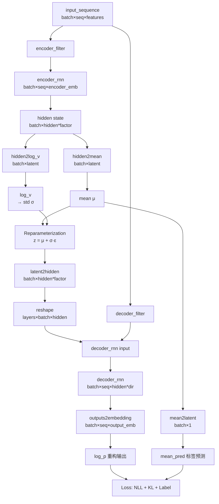
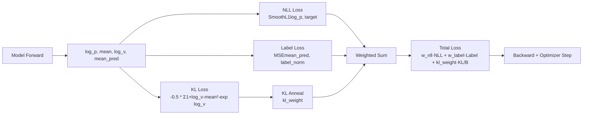

# DynamicVAE 深度解析

> 本文档详细解析 `DyAD/model/dynamic_vae.py` 中的 `DynamicVAE` 类，包括模块结构、数据流、损失计算及理论联系。

---

## 目录

1. [类结构概览](#1-类结构概览)
2. [模块详细解析](#2-模块详细解析)
3. [前向传播数据流](#3-前向传播数据流)
4. [损失函数计算](#4-损失函数计算)
5. [理论联系：DyAD 与动态系统建模](#5-理论联系dyad-与动态系统建模)
6. [关键等式汇总](#6-关键等式汇总)
7. [伪代码版本](#7-伪代码版本)
8. [数值稳定性问题与改进建议](#8-数值稳定性问题与改进建议)

---

## 1. 类结构概览

### 1.1 类定义

```python
class DynamicVAE(nn.Module):
    def __init__(self, rnn_type, hidden_size, latent_size, encoder_embedding_size, 
                 output_embedding_size, decoder_embedding_size, num_layers=1, 
                 bidirectional=False, variable_length=False, **params):
```

**位置**: [dynamic_vae.py:L8-L11](file:///Users/David/Desktop/github_repos/Battery_fault_detection_NC_github/DyAD/model/dynamic_vae.py#L8-L11)

### 1.2 核心组件

| 模块名称 | 类型 | 作用 | 输入维度 | 输出维度 |
|---------|------|------|---------|---------|
| `encoder_rnn` | RNN/LSTM/GRU | 编码时间序列 | `(batch, seq, encoder_emb)` | `(batch, seq, hidden)` + hidden state |
| `decoder_rnn` | RNN/LSTM/GRU | 重构时间序列 | `(batch, seq, decoder_emb)` | `(batch, seq, hidden)` |
| `hidden2mean` | Linear | 隐藏状态→潜在均值 | `(batch, hidden*factor)` | `(batch, latent_size)` |
| `hidden2log_v` | Linear | 隐藏状态→潜在对数方差 | `(batch, hidden*factor)` | `(batch, latent_size)` |
| `latent2hidden` | Linear | 潜在向量→解码器隐藏状态 | `(batch, latent_size)` | `(batch, hidden*factor)` |
| `outputs2embedding` | Linear | 解码器输出→重构嵌入 | `(batch, seq, hidden*dir)` | `(batch, seq, output_emb)` |
| `mean2latent` | Sequential | 潜在均值→标签预测 | `(batch, latent_size)` | `(batch, 1)` |

**注**：
- `factor = (2 if bidirectional else 1) * num_layers`，在 [L25](file:///Users/David/Desktop/github_repos/Battery_fault_detection_NC_github/DyAD/model/dynamic_vae.py#L25) 定义
- `dir = 2 if bidirectional else 1`，用于 `outputs2embedding`

---

## 2. 模块详细解析

### 2.1 Encoder RNN

**代码位置**: [L20-L21](file:///Users/David/Desktop/github_repos/Battery_fault_detection_NC_github/DyAD/model/dynamic_vae.py#L20-L21)

```python
self.encoder_rnn = rnn(encoder_embedding_size, hidden_size, num_layers=num_layers,
                       bidirectional=self.bidirectional, batch_first=True)
```

**功能**：
- 将输入时间序列映射到隐藏状态空间
- 支持变长序列（通过 `pack_padded_sequence`）

**维度变化**：
```
输入: (batch_size, seq_len, encoder_embedding_size)
  ↓ encoder_rnn
输出 output: (batch_size, seq_len, hidden_size * (2 if bidirectional else 1))
输出 hidden: (num_layers * (2 if bidirectional else 1), batch_size, hidden_size)
```

**张量重塑** ([L41-L44](file:///Users/David/Desktop/github_repos/Battery_fault_detection_NC_github/DyAD/model/dynamic_vae.py#L41-L44)):
```python
if self.bidirectional or self.num_layers > 1:
    hidden = hidden.view(batch_size, self.hidden_size * self.hidden_factor)
else:
    hidden = hidden.squeeze()
```
最终 `hidden` 维度：`(batch_size, hidden_size * hidden_factor)`

---

### 2.2 Variational Bottleneck（变分瓶颈）

#### 2.2.1 Mean & Log Variance Projection

**代码位置**: [L27-L28](file:///Users/David/Desktop/github_repos/Battery_fault_detection_NC_github/DyAD/model/dynamic_vae.py#L27-L28)

```python
self.hidden2mean = nn.Linear(hidden_size * self.hidden_factor, latent_size)
self.hidden2log_v = nn.Linear(hidden_size * self.hidden_factor, latent_size)
```

**维度变化**：
```
hidden: (batch, hidden*factor) 
  ↓ hidden2mean
mean: (batch, latent_size)

hidden: (batch, hidden*factor)
  ↓ hidden2log_v
log_v: (batch, latent_size)
```

**执行位置** ([L46-L48](file:///Users/David/Desktop/github_repos/Battery_fault_detection_NC_github/DyAD/model/dynamic_vae.py#L46-L48)):
```python
mean = self.hidden2mean(hidden)
log_v = self.hidden2log_v(hidden)
std = torch.exp(0.5 * log_v)
```

#### 2.2.2 Reparameterization Trick

**代码位置**: [L51-L55](file:///Users/David/Desktop/github_repos/Battery_fault_detection_NC_github/DyAD/model/dynamic_vae.py#L51-L55)

```python
z = to_var(torch.randn([batch_size, self.latent_size]))
if self.training:
    z = z * std * noise_scale + mean  # 训练时：μ + σ·ε
else:
    z = mean                          # 测试时：直接使用均值
```

**数学表达式**：
$$
z = \begin{cases}
\mu + \sigma \cdot \epsilon \cdot \text{noise\_scale}, & \text{训练时} \\
\mu, & \text{测试时}
\end{cases}
\quad \text{其中 } \epsilon \sim \mathcal{N}(0, I)
$$

**维度**：
```
z: (batch, latent_size)
```

---

### 2.3 Latent to Decoder Hidden

**代码位置**: [L29](file:///Users/David/Desktop/github_repos/Battery_fault_detection_NC_github/DyAD/model/dynamic_vae.py#L29), [L56-L61](file:///Users/David/Desktop/github_repos/Battery_fault_detection_NC_github/DyAD/model/dynamic_vae.py#L56-L61)

```python
self.latent2hidden = nn.Linear(latent_size, hidden_size * self.hidden_factor)

# 在 forward() 中：
hidden = self.latent2hidden(z)
if self.bidirectional or self.num_layers > 1:
    hidden = hidden.view(self.hidden_factor, batch_size, self.hidden_size)
else:
    hidden = hidden.unsqueeze(0)
```

**维度变化**：
```
z: (batch, latent_size)
  ↓ latent2hidden
hidden: (batch, hidden*factor)
  ↓ reshape
hidden: (num_layers*directions, batch, hidden_size)
```

---

### 2.4 Decoder RNN

**代码位置**: [L22-L23](file:///Users/David/Desktop/github_repos/Battery_fault_detection_NC_github/DyAD/model/dynamic_vae.py#L22-L23), [L63-L71](file:///Users/David/Desktop/github_repos/Battery_fault_detection_NC_github/DyAD/model/dynamic_vae.py#L63-L71)

```python
self.decoder_rnn = rnn(decoder_embedding_size, hidden_size, num_layers=num_layers,
                       bidirectional=self.bidirectional, batch_first=True)

# 在 forward() 中：
de_input_sequence = decoder_filter(input_sequence)  # 提取解码器输入特征
de_input_embedding = de_input_sequence.to(torch.float32)
if self.variable_length:
    de_input_embedding = pack_padded_sequence(de_input_embedding, seq_lengths, batch_first=True)
    outputs, _ = self.decoder_rnn(de_input_embedding, hidden)
    outputs, _ = pad_packed_sequence(outputs, batch_first=True)
else:
    outputs, _ = self.decoder_rnn(de_input_embedding, hidden)
```

**维度变化**：
```
de_input_embedding: (batch, seq, decoder_embedding_size)
  ↓ decoder_rnn (初始隐藏状态由 latent2hidden 提供)
outputs: (batch, seq, hidden_size * (2 if bidirectional else 1))
```

---

### 2.5 Output to Embedding

**代码位置**: [L30](file:///Users/David/Desktop/github_repos/Battery_fault_detection_NC_github/DyAD/model/dynamic_vae.py#L30), [L72](file:///Users/David/Desktop/github_repos/Battery_fault_detection_NC_github/DyAD/model/dynamic_vae.py#L72)

```python
self.outputs2embedding = nn.Linear(hidden_size * (2 if bidirectional else 1), output_embedding_size)

# 在 forward() 中：
log_p = self.outputs2embedding(outputs)
```

**维度变化**：
```
outputs: (batch, seq, hidden*directions)
  ↓ outputs2embedding
log_p: (batch, seq, output_embedding_size)
```

**作用**：将解码器的隐藏状态投影到输出空间（如原始特征维度），用于重构

---

### 2.6 Mean to Latent (Label Prediction)

**代码位置**: [L31-L32](file:///Users/David/Desktop/github_repos/Battery_fault_detection_NC_github/DyAD/model/dynamic_vae.py#L31-L32), [L49](file:///Users/David/Desktop/github_repos/Battery_fault_detection_NC_github/DyAD/model/dynamic_vae.py#L49)

```python
self.mean2latent = nn.Sequential(
    nn.Linear(latent_size, int(hidden_size / 2)), 
    nn.ReLU(),
    nn.Linear(int(hidden_size / 2), 1)
)

# 在 forward() 中：
mean_pred = self.mean2latent(mean)
```

**维度变化**：
```
mean: (batch, latent_size)
  ↓ Linear(latent_size → hidden/2) → ReLU → Linear(hidden/2 → 1)
mean_pred: (batch, 1)
```

**作用**：从潜在均值预测标签（如里程 mileage），实现监督学习的辅助目标

---

## 3. 前向传播数据流

### 3.1 完整流程图



### 3.2 逐行代码流程

**代码位置**: [forward() 方法 L34-L73](file:///Users/David/Desktop/github_repos/Battery_fault_detection_NC_github/DyAD/model/dynamic_vae.py#L34-L73)

```python
def forward(self, input_sequence, encoder_filter, decoder_filter, seq_lengths, noise_scale=1.0):
    # Step 1: 获取批次大小
    batch_size = input_sequence.size(0)  # L35
    
    # Step 2: Encoder 路径
    en_input_sequence = encoder_filter(input_sequence)  # L36 - 提取编码器特征
    en_input_embedding = en_input_sequence.to(torch.float32)  # L37
    if self.variable_length:
        en_input_embedding = pack_padded_sequence(en_input_embedding, seq_lengths, batch_first=True)  # L39
    output, hidden = self.encoder_rnn(en_input_embedding)  # L40 - RNN 编码
    
    # Step 3: 重塑隐藏状态
    if self.bidirectional or self.num_layers > 1:
        hidden = hidden.view(batch_size, self.hidden_size * self.hidden_factor)  # L42
    else:
        hidden = hidden.squeeze()  # L44
    
    # Step 4: 变分推断
    mean = self.hidden2mean(hidden)  # L46 - μ
    log_v = self.hidden2log_v(hidden)  # L47 - log(σ²)
    std = torch.exp(0.5 * log_v)  # L48 - σ = exp(0.5 * log(σ²))
    mean_pred = self.mean2latent(mean)  # L49 - 标签预测
    
    # Step 5: 重参数化采样
    z = to_var(torch.randn([batch_size, self.latent_size]))  # L51
    if self.training:
        z = z * std * noise_scale + mean  # L53
    else:
        z = mean  # L55
    
    # Step 6: 潜在向量到解码器隐藏状态
    hidden = self.latent2hidden(z)  # L56
    if self.bidirectional or self.num_layers > 1:
        hidden = hidden.view(self.hidden_factor, batch_size, self.hidden_size)  # L59
    else:
        hidden = hidden.unsqueeze(0)  # L61
    
    # Step 7: Decoder 路径
    de_input_sequence = decoder_filter(input_sequence)  # L63 - 提取解码器特征
    de_input_embedding = de_input_sequence.to(torch.float32)  # L64
    if self.variable_length:
        de_input_embedding = pack_padded_sequence(de_input_embedding, seq_lengths, batch_first=True)  # L66
        outputs, _ = self.decoder_rnn(de_input_embedding, hidden)  # L68
        outputs, _ = pad_packed_sequence(outputs, batch_first=True)  # L69
    else:
        outputs, _ = self.decoder_rnn(de_input_embedding, hidden)  # L71
    
    # Step 8: 输出投影
    log_p = self.outputs2embedding(outputs)  # L72 - 重构输出
    
    return log_p, mean, log_v, z, mean_pred  # L73
```

### 3.3 关键维度变化总结

| 阶段 | 变量名 | 维度 | 代码行 |
|-----|--------|------|--------|
| 输入 | `input_sequence` | `(B, T, F)` | L34 |
| 编码器输入 | `en_input_embedding` | `(B, T, E_enc)` | L37 |
| 编码器隐藏 | `hidden` (重塑后) | `(B, H*factor)` | L42/L44 |
| 潜在均值 | `mean` | `(B, L)` | L46 |
| 潜在对数方差 | `log_v` | `(B, L)` | L47 |
| 标准差 | `std` | `(B, L)` | L48 |
| 潜在向量 | `z` | `(B, L)` | L51-55 |
| 解码器初始隐藏 | `hidden` (重塑后) | `(factor, B, H)` | L59/L61 |
| 解码器输入 | `de_input_embedding` | `(B, T, E_dec)` | L64 |
| 解码器输出 | `outputs` | `(B, T, H*dir)` | L68/L71 |
| 重构输出 | `log_p` | `(B, T, O)` | L72 |
| 标签预测 | `mean_pred` | `(B, 1)` | L49 |

**符号说明**：
- `B` = batch_size
- `T` = sequence length
- `F` = 总特征数
- `E_enc` = encoder_embedding_size
- `E_dec` = decoder_embedding_size
- `H` = hidden_size
- `L` = latent_size
- `O` = output_embedding_size
- `factor` = `num_layers * (2 if bidirectional else 1)`
- `dir` = `2 if bidirectional else 1`

---

## 4. 损失函数计算

### 4.1 总损失构成

**代码位置**: [train.py:L136-L140](file:///Users/David/Desktop/github_repos/Battery_fault_detection_NC_github/DyAD/train.py#L136-L140)

```python
nll_loss, kl_loss, kl_weight = self.loss_fn(log_p, target, mean, log_v)  # L136
self.label_data = tasks.Label(column_name="mileage", training_set=train)  # L137
label_loss = self.label_data.loss(batch, mean_pred, is_mse=True)  # L138
loss = (self.args.nll_weight * nll_loss + 
        self.args.latent_label_weight * label_loss + 
        kl_weight * kl_loss / batch_.shape[0])  # L139-L140
```

**总损失公式**：
$$
\mathcal{L}_{\text{total}} = w_{\text{nll}} \cdot \mathcal{L}_{\text{NLL}} + w_{\text{label}} \cdot \mathcal{L}_{\text{label}} + w_{\text{kl}}(t) \cdot \frac{\mathcal{L}_{\text{KL}}}{B}
$$

其中：
- $w_{\text{nll}}$ = `args.nll_weight` (重构权重)
- $w_{\text{label}}$ = `args.latent_label_weight` (标签监督权重)
- $w_{\text{kl}}(t)$ = `kl_weight` (KL 退火权重，随训练步数变化)
- $B$ = `batch_size`

---

### 4.2 重构损失 (NLL Loss)

**代码位置**: [train.py:L203-L216](file:///Users/David/Desktop/github_repos/Battery_fault_detection_NC_github/DyAD/train.py#L203-L216)

```python
def loss_fn(self, log_p, target, mean, log_v):
    nll = torch.nn.SmoothL1Loss(reduction='mean')  # L212
    nll_loss = nll(log_p, target)  # L213
    # ...
    return nll_loss, kl_loss, kl_weight
```

**公式**：
$$
\mathcal{L}_{\text{NLL}} = \frac{1}{B \cdot T \cdot O} \sum_{i=1}^{B} \sum_{t=1}^{T} \sum_{o=1}^{O} \text{SmoothL1}(\hat{x}_{i,t,o}, x_{i,t,o})
$$

其中 SmoothL1 (Huber Loss)：
$$
\text{SmoothL1}(a, b) = \begin{cases}
0.5 \cdot (a - b)^2, & \text{if } |a - b| < 1 \\
|a - b| - 0.5, & \text{otherwise}
\end{cases}
$$

**输入**：
- `log_p`: 模型重构输出 `(B, T, O)`
- `target`: 目标序列 `(B, T, O)`，由 `data_task.target_filter(batch_)` 提取 ([train.py:L134](file:///Users/David/Desktop/github_repos/Battery_fault_detection_NC_github/DyAD/train.py#L134))

**作用**：衡量重构质量，驱动模型学习有效的编码-解码

---

### 4.3 KL 散度损失

**代码位置**: [train.py:L214-L216](file:///Users/David/Desktop/github_repos/Battery_fault_detection_NC_github/DyAD/train.py#L214-L216)

```python
def loss_fn(self, log_p, target, mean, log_v):
    # ...
    kl_loss = -0.5 * torch.sum(1 + log_v - mean.pow(2) - log_v.exp())  # L214
    kl_weight = self.kl_anneal_function()  # L215
    return nll_loss, kl_loss, kl_weight
```

**公式**：
$$
\mathcal{L}_{\text{KL}} = -\frac{1}{2} \sum_{i=1}^{B} \sum_{j=1}^{L} \left( 1 + \log(\sigma_{ij}^2) - \mu_{ij}^2 - \sigma_{ij}^2 \right)
$$

这是 KL 散度 $D_{\text{KL}}(q(z|x) \| p(z))$ 的解析形式，其中：
- $q(z|x) = \mathcal{N}(\mu, \text{diag}(\sigma^2))$ (编码器分布)
- $p(z) = \mathcal{N}(0, I)$ (标准正态先验)

**推导**：
$$
D_{\text{KL}}(q \| p) = \int q(z|x) \log \frac{q(z|x)}{p(z)} dz
$$
对于高斯分布，解析解为：
$$
= \frac{1}{2} \sum_{j=1}^{L} \left( \mu_j^2 + \sigma_j^2 - \log(\sigma_j^2) - 1 \right)
$$

代码中使用负号并减去常数项，保持数学一致性。

**KL 退火权重** ([train.py:L218-L227](file:///Users/David/Desktop/github_repos/Battery_fault_detection_NC_github/DyAD/train.py#L218-L227)):
```python
def kl_anneal_function(self):
    if self.args.anneal_function == 'logistic':
        return self.args.anneal0 * float(1 / (1 + np.exp(-self.args.k * (self.step - self.args.x0))))  # L223
    elif self.args.anneal_function == 'linear':
        return self.args.anneal0 * min(1, self.step / self.args.x0)  # L225
    else:
        return self.args.anneal0  # L227
```

**退火策略**：
- **Logistic**: $w_{\text{kl}}(t) = w_0 \cdot \frac{1}{1 + e^{-k(t - x_0)}}$
- **Linear**: $w_{\text{kl}}(t) = w_0 \cdot \min(1, \frac{t}{x_0})$
- **Constant**: $w_{\text{kl}}(t) = w_0$

**作用**：缓解"后验坍塌"问题，初期降低 KL 权重，让模型先学习重构，后期逐渐增强正则化

---

### 4.4 标签损失 (Label Loss)

**代码位置**: [tasks.py:L15-L27](file:///Users/David/Desktop/github_repos/Battery_fault_detection_NC_github/DyAD/model/tasks.py#L15-L27)

```python
def loss(self, batch, mean_pred, is_mse=True):
    label_data = []
    for i in batch[1][self.label]:  # L17
        norm_label = (i - self.min_mileage) / (self.max_mileage - self.min_mileage)  # L18
        label_data.append(norm_label)
    label = torch.tensor(label_data)  # L20
    x = mean_pred.squeeze().to("cuda")  # L21 - 预测值
    y = label.float().to("cuda")  # L22 - 真实值
    mse = torch.nn.MSELoss(reduction='mean')  # L23
    loss = 0
    if is_mse:
        loss = mse(x, y)  # L26
    return loss
```

**公式**：
$$
\mathcal{L}_{\text{label}} = \frac{1}{B} \sum_{i=1}^{B} \left( \text{mean\_pred}_i - y_i^{\text{norm}} \right)^2
$$

其中标签归一化：
$$
y_i^{\text{norm}} = \frac{y_i - y_{\min}}{y_{\max} - y_{\min}}
$$

**输入**：
- `mean_pred`: 从潜在均值预测的标签 `(B, 1)` ([dynamic_vae.py:L49](file:///Users/David/Desktop/github_repos/Battery_fault_detection_NC_github/DyAD/model/dynamic_vae.py#L49))
- `batch[1][self.label]`: 真实标签（如 mileage）

**作用**：监督学习辅助任务，确保潜在空间捕获与标签相关的语义信息（如里程、健康状态）

---

### 4.5 损失计算总流程



---

## 5. 理论联系：DyAD 与动态系统建模

### 5.1 DyAD 核心思想

根据 Nature Communications 论文中的描述，**DyAD (Dynamic Autoencoder for Anomaly Detection)** 旨在：
1. **动态系统建模**：使用 RNN/LSTM 捕获时间序列的时序依赖和演化规律
2. **潜在空间解耦**：通过 VAE 将观测映射到低维潜在空间，分离正常与异常模式
3. **社会/经济因素配置**：允许引入外部监督信号（如使用场景、环境因素、里程等），增强潜在空间的可解释性

### 5.2 代码实现的对应关系

#### 5.2.1 动态系统建模

**实现方式**：
- **Encoder RNN** ([L20-L21](file:///Users/David/Desktop/github_repos/Battery_fault_detection_NC_github/DyAD/model/dynamic_vae.py#L20-L21))：捕获时间序列的动态演化
- **Decoder RNN** ([L22-L23](file:///Users/David/Desktop/github_repos/Battery_fault_detection_NC_github/DyAD/model/dynamic_vae.py#L22-L23))：从潜在状态重构时间路径
- **变长序列支持** ([L38-L39](file:///Users/David/Desktop/github_repos/Battery_fault_detection_NC_github/DyAD/model/dynamic_vae.py#L38-L39), [L65-L69](file:///Users/David/Desktop/github_repos/Battery_fault_detection_NC_github/DyAD/model/dynamic_vae.py#L65-L69))：适应不同长度的电池充放电周期

**理论联系**：
$$
\text{State Evolution: } h_t = f(h_{t-1}, x_t; \theta_{\text{enc}})
$$
RNN 隐藏状态 $h_t$ 建模了系统在时刻 $t$ 的动态状态

#### 5.2.2 潜在空间的概率建模

**实现方式**：
- **变分推断** ([L46-L48](file:///Users/David/Desktop/github_repos/Battery_fault_detection_NC_github/DyAD/model/dynamic_vae.py#L46-L48))：估计潜在分布 $q_\phi(z|x) = \mathcal{N}(\mu, \sigma^2)$
- **重参数化** ([L51-L55](file:///Users/David/Desktop/github_repos/Battery_fault_detection_NC_github/DyAD/model/dynamic_vae.py#L51-L55))：允许反向传播
- **先验正则化** ([train.py:L214](file:///Users/David/Desktop/github_repos/Battery_fault_detection_NC_github/DyAD/train.py#L214))：KL 散度约束潜在空间结构

**理论联系**：VAE 框架使潜在空间具有连续性和可插值性，便于异常检测：
$$
\text{Anomaly Score: } \mathcal{L}_{\text{rec}}(x) + \beta \cdot D_{\text{KL}}(q_\phi(z|x) \| p(z))
$$

#### 5.2.3 社会/经济因素配置

**实现方式**：
- **`mean2latent` 模块** ([L31-L32](file:///Users/David/Desktop/github_repos/Battery_fault_detection_NC_github/DyAD/model/dynamic_vae.py#L31-L32), [L49](file:///Users/David/Desktop/github_repos/Battery_fault_detection_NC_github/DyAD/model/dynamic_vae.py#L49))：从潜在均值预测标签
- **Label Loss** ([train.py:L138](file:///Users/David/Desktop/github_repos/Battery_fault_detection_NC_github/DyAD/train.py#L138), [tasks.py:L15-L27](file:///Users/David/Desktop/github_repos/Battery_fault_detection_NC_github/DyAD/model/tasks.py#L15-L27))：监督学习里程 (mileage)
- **可扩展接口**：`tasks.Label` 支持通过 `column_name` 指定不同标签 ([tasks.py:L8-L9](file:///Users/David/Desktop/github_repos/Battery_fault_detection_NC_github/DyAD/model/tasks.py#L8-L9))

**代码中的参数/接口**：
1. **任务配置** ([train.py:L90-L91](file:///Users/David/Desktop/github_repos/Battery_fault_detection_NC_github/DyAD/train.py#L90-L91)):
   ```python
   self.args.columns = torch.load(os.path.join(os.path.dirname(self.args.train_path), "column.pkl"))
   self.data_task = tasks.Task(task_name=self.args.task, columns=self.args.columns)
   ```
   通过 `task_name` (如 'ev', 'batterybrandb') 选择不同特征配置

2. **标签列指定** ([train.py:L137](file:///Users/David/Desktop/github_repos/Battery_fault_detection_NC_github/DyAD/train.py#L137)):
   ```python
   self.label_data = tasks.Label(column_name="mileage", training_set=train)
   ```
   可替换为其他列（如温度、SOC、使用场景等）

3. **权重控制** ([train.py:L139](file:///Users/David/Desktop/github_repos/Battery_fault_detection_NC_github/DyAD/train.py#L139)):
   ```python
   loss = (self.args.nll_weight * nll_loss + 
           self.args.latent_label_weight * label_loss + ...)
   ```
   通过 `latent_label_weight` 调整监督强度

**理论联系**：
这种半监督学习策略确保潜在空间不仅捕获数据的内在结构，还对外部因素敏感，符合论文中"配置社会/经济因素"的思想。

### 5.3 DyAD 在电池故障检测中的应用

**数据流**：
1. 电池时间序列（SOC, 电流, 温度, 电压等）→ Encoder → 潜在表示
2. 潜在表示 → Decoder → 重构序列
3. 重构误差高 → 异常（故障前兆）

**监督信号**：
- **里程 (mileage)**：反映电池老化程度，指导潜在空间学习健康状态轴
- **（潜在扩展）使用场景/环境因素**：可通过修改 `Label` 引入（如快充频率、温度区间等）

---

## 6. 关键等式汇总

### 6.1 前向传播

| 步骤 | 等式 | 代码行 |
|-----|------|--------|
| 编码器 | $h = \text{RNN}_{\text{enc}}(x_{\text{enc}})$ | [L40](file:///Users/David/Desktop/github_repos/Battery_fault_detection_NC_github/DyAD/model/dynamic_vae.py#L40) |
| 潜在均值 | $\mu = W_\mu h + b_\mu$ | [L46](file:///Users/David/Desktop/github_repos/Battery_fault_detection_NC_github/DyAD/model/dynamic_vae.py#L46) |
| 潜在对数方差 | $\log \sigma^2 = W_{\log \sigma} h + b_{\log \sigma}$ | [L47](file:///Users/David/Desktop/github_repos/Battery_fault_detection_NC_github/DyAD/model/dynamic_vae.py#L47) |
| 标准差 | $\sigma = \exp(0.5 \cdot \log \sigma^2)$ | [L48](file:///Users/David/Desktop/github_repos/Battery_fault_detection_NC_github/DyAD/model/dynamic_vae.py#L48) |
| 重参数化 | $z = \mu + \sigma \cdot \epsilon, \quad \epsilon \sim \mathcal{N}(0, I)$ | [L53](file:///Users/David/Desktop/github_repos/Battery_fault_detection_NC_github/DyAD/model/dynamic_vae.py#L53) |
| 解码器初始状态 | $h_0^{\text{dec}} = W_z z + b_z$ | [L56](file:///Users/David/Desktop/github_repos/Battery_fault_detection_NC_github/DyAD/model/dynamic_vae.py#L56) |
| 解码器 | $o = \text{RNN}_{\text{dec}}(x_{\text{dec}}, h_0^{\text{dec}})$ | [L68/L71](file:///Users/David/Desktop/github_repos/Battery_fault_detection_NC_github/DyAD/model/dynamic_vae.py#L68-L71) |
| 重构输出 | $\hat{x} = W_o o + b_o$ | [L72](file:///Users/David/Desktop/github_repos/Battery_fault_detection_NC_github/DyAD/model/dynamic_vae.py#L72) |
| 标签预测 | $\hat{y} = \text{MLP}(\mu)$ | [L49](file:///Users/David/Desktop/github_repos/Battery_fault_detection_NC_github/DyAD/model/dynamic_vae.py#L49) |

### 6.2 损失函数

$$
\begin{aligned}
\mathcal{L}_{\text{NLL}} &= \frac{1}{B \cdot T \cdot O} \sum \text{SmoothL1}(\hat{x}, x) \\[10pt]
\mathcal{L}_{\text{KL}} &= -\frac{1}{2} \sum_{i,j} \left( 1 + \log \sigma_{ij}^2 - \mu_{ij}^2 - \sigma_{ij}^2 \right) \\[10pt]
\mathcal{L}_{\text{label}} &= \frac{1}{B} \sum_{i} \left( \hat{y}_i - y_i^{\text{norm}} \right)^2 \\[10pt]
\mathcal{L}_{\text{total}} &= w_{\text{nll}} \cdot \mathcal{L}_{\text{NLL}} + w_{\text{label}} \cdot \mathcal{L}_{\text{label}} + w_{\text{kl}}(t) \cdot \frac{\mathcal{L}_{\text{KL}}}{B}
\end{aligned}
$$

### 6.3 KL 退火

**Logistic**:
$$
w_{\text{kl}}(t) = w_0 \cdot \frac{1}{1 + \exp(-k(t - x_0))}
$$

**Linear**:
$$
w_{\text{kl}}(t) = w_0 \cdot \min\left(1, \frac{t}{x_0}\right)
$$

---

## 7. 伪代码版本

```pseudocode
# ============================================
#  DynamicVAE: 带监督学习的动态变分自编码器
# ============================================

INPUT: 
  - input_sequence: 时间序列 (batch, seq_len, features)
  - encoder_filter: 编码器特征选择函数
  - decoder_filter: 解码器特征选择函数
  - seq_lengths: 序列长度列表 (用于变长序列)
  - noise_scale: 噪声缩放因子 (默认 1.0)

OUTPUT:
  - log_p: 重构序列 (batch, seq_len, output_dim)
  - mean: 潜在均值 (batch, latent_size)
  - log_v: 潜在对数方差 (batch, latent_size)
  - z: 采样的潜在向量 (batch, latent_size)
  - mean_pred: 标签预测 (batch, 1)

# -------- ENCODER 阶段 --------
1. 提取编码器输入特征:
   en_input = encoder_filter(input_sequence)  # (batch, seq, encoder_emb)

2. 通过 Encoder RNN:
   IF variable_length:
       en_input = pack_padded_sequence(en_input, seq_lengths)
   output, hidden = encoder_rnn(en_input)
   
3. 重塑隐藏状态为 2D:
   IF bidirectional OR num_layers > 1:
       hidden = reshape(hidden, [batch, hidden_size * hidden_factor])
   ELSE:
       hidden = squeeze(hidden)

# -------- 变分推断阶段 --------
4. 计算潜在分布参数:
   mean = Linear_mean(hidden)           # (batch, latent_size)
   log_v = Linear_log_v(hidden)         # (batch, latent_size)
   std = exp(0.5 * log_v)

5. 标签预测:
   mean_pred = MLP(mean)                # (batch, 1)

6. 重参数化采样:
   epsilon ~ N(0, I)
   IF training:
       z = mean + std * epsilon * noise_scale
   ELSE:
       z = mean

# -------- DECODER 阶段 --------
7. 潜在向量到解码器初始隐藏状态:
   hidden_dec = Linear_latent(z)       # (batch, hidden*factor)
   IF bidirectional OR num_layers > 1:
       hidden_dec = reshape(hidden_dec, [hidden_factor, batch, hidden_size])
   ELSE:
       hidden_dec = unsqueeze(hidden_dec, dim=0)

8. 提取解码器输入特征:
   de_input = decoder_filter(input_sequence)  # (batch, seq, decoder_emb)

9. 通过 Decoder RNN:
   IF variable_length:
       de_input = pack_padded_sequence(de_input, seq_lengths)
       outputs, _ = decoder_rnn(de_input, hidden_dec)
       outputs = pad_packed_sequence(outputs)
   ELSE:
       outputs, _ = decoder_rnn(de_input, hidden_dec)

10. 输出投影:
    log_p = Linear_output(outputs)     # (batch, seq, output_dim)

RETURN log_p, mean, log_v, z, mean_pred


# ============================================
#  损失计算
# ============================================

GIVEN:
  - log_p: 重构输出 (batch, seq, output_dim)
  - target: 目标序列 (batch, seq, output_dim)
  - mean, log_v: 潜在分布参数 (batch, latent_size)
  - mean_pred: 标签预测 (batch, 1)
  - label: 真实标签 (batch,)

1. 重构损失:
   nll_loss = SmoothL1Loss(log_p, target)

2. KL 散度:
   kl_loss = -0.5 * SUM(1 + log_v - mean^2 - exp(log_v))
   kl_weight = anneal_function(step)  # 退火权重

3. 标签损失:
   label_norm = (label - label_min) / (label_max - label_min)
   label_loss = MSE(mean_pred.squeeze(), label_norm)

4. 总损失:
   total_loss = w_nll * nll_loss + w_label * label_loss + kl_weight * kl_loss / batch_size

UPDATE parameters via backpropagation
```

---

## 8. 数值稳定性问题与改进建议

### 8.1 潜在问题

#### 问题 1: 对数方差的数值不稳定

**位置**: [L48](file:///Users/David/Desktop/github_repos/Battery_fault_detection_NC_github/DyAD/model/dynamic_vae.py#L48)

```python
std = torch.exp(0.5 * log_v)
```

**风险**：
- 如果 `log_v` 过大（如 > 10），`exp(0.5 * log_v)` 会导致数值溢出
- 如果 `log_v` 过小（如 < -10），标准差接近 0，导致梯度消失

**改进建议**：
```python
# 方法 1: 裁剪对数方差
log_v = torch.clamp(log_v, min=-10, max=10)
std = torch.exp(0.5 * log_v)

# 方法 2: 直接预测标准差的对数
self.hidden2log_std = nn.Linear(...)  # 预测 log(σ) 而非 log(σ²)
log_std = self.hidden2log_std(hidden)
log_std = torch.clamp(log_std, min=-5, max=5)
std = torch.exp(log_std)
```

---

#### 问题 2: KL 散度计算的数值稳定性

**位置**: [train.py:L214](file:///Users/David/Desktop/github_repos/Battery_fault_detection_NC_github/DyAD/train.py#L214)

```python
kl_loss = -0.5 * torch.sum(1 + log_v - mean.pow(2) - log_v.exp())
```

**风险**：
- `log_v.exp()` 可能溢出
- `mean.pow(2)` 对于大均值会导致梯度爆炸

**改进建议**：
```python
# 逐元素裁剪，避免极端值
mean = torch.clamp(mean, min=-10, max=10)
log_v = torch.clamp(log_v, min=-10, max=10)
kl_loss = -0.5 * torch.sum(1 + log_v - mean.pow(2) - log_v.exp())

# 或使用 PyTorch 内置 KL 散度
from torch.distributions import Normal, kl_divergence
q_z = Normal(mean, torch.exp(0.5 * log_v))
p_z = Normal(torch.zeros_like(mean), torch.ones_like(mean))
kl_loss = kl_divergence(q_z, p_z).sum()
```

---

#### 问题 3: 重参数化时的噪声尺度

**位置**: [L51-L53](file:///Users/David/Desktop/github_repos/Battery_fault_detection_NC_github/DyAD/model/dynamic_vae.py#L51-L53)

```python
z = to_var(torch.randn([batch_size, self.latent_size]))
if self.training:
    z = z * std * noise_scale + mean
```

**风险**：
- 如果 `noise_scale` 设置不当，可能破坏训练稳定性
- 测试时直接使用 `mean` 可能导致分布偏移

**改进建议**：
```python
# 方法 1: 添加最小噪声，即使在测试时
if self.training:
    z = mean + std * torch.randn_like(std) * noise_scale
else:
    z = mean + std * torch.randn_like(std) * 0.1  # 小噪声保持生成多样性

# 方法 2: 使用 PyTorch 分布
from torch.distributions import Normal
q_z = Normal(mean, std * noise_scale if self.training else std * 0.1)
z = q_z.rsample()  # 可微采样
```

---

#### 问题 4: 变长序列的填充处理

**位置**: [L38-L39](file:///Users/David/Desktop/github_repos/Battery_fault_detection_NC_github/DyAD/model/dynamic_vae.py#L38-L39), [L65-L69](file:///Users/David/Desktop/github_repos/Battery_fault_detection_NC_github/DyAD/model/dynamic_vae.py#L65-L69)

**风险**：
- 填充位置的重构误差会贡献到损失中，污染梯度

**改进建议**：
```python
# 在计算损失时使用 mask
def loss_fn(self, log_p, target, mean, log_v, seq_lengths=None):
    if seq_lengths is not None:
        # 创建 mask
        max_len = log_p.size(1)
        mask = torch.arange(max_len).expand(len(seq_lengths), max_len) < seq_lengths.unsqueeze(1)
        mask = mask.unsqueeze(-1).to(log_p.device)
        
        # 仅计算有效位置的损失
        diff = (log_p - target) * mask
        nll_loss = F.smooth_l1_loss(diff, torch.zeros_like(diff), reduction='sum')
        nll_loss /= mask.sum()  # 归一化
    else:
        nll_loss = F.smooth_l1_loss(log_p, target, reduction='mean')
    
    kl_loss = -0.5 * torch.sum(1 + log_v - mean.pow(2) - log_v.exp())
    kl_weight = self.kl_anneal_function()
    return nll_loss, kl_loss, kl_weight
```

---

#### 问题 5: 标签归一化的稳定性

**位置**: [tasks.py:L18](file:///Users/David/Desktop/github_repos/Battery_fault_detection_NC_github/DyAD/model/tasks.py#L18)

```python
norm_label = (i - self.min_mileage) / (self.max_mileage - self.min_mileage)
```

**风险**：
- 如果 `max_mileage == min_mileage`，会导致除以零
- 归一化范围固定为 [0, 1]，可能不适合所有场景

**改进建议**：
```python
# 方法 1: 添加数值稳定项
norm_label = (i - self.min_mileage) / (self.max_mileage - self.min_mileage + 1e-8)

# 方法 2: 使用标准化（均值 0，方差 1）
self.mean_mileage = np.mean(self.sample_mileage)
self.std_mileage = np.std(self.sample_mileage) + 1e-8
norm_label = (i - self.mean_mileage) / self.std_mileage

# 方法 3: 使用鲁棒归一化（中位数 + IQR）
self.median_mileage = np.median(self.sample_mileage)
self.iqr_mileage = np.percentile(self.sample_mileage, 75) - np.percentile(self.sample_mileage, 25) + 1e-8
norm_label = (i - self.median_mileage) / self.iqr_mileage
```

---

### 8.2 训练稳定性改进

#### 建议 1: 梯度裁剪

```python
# 在 train.py 的优化器步骤前添加
torch.nn.utils.clip_grad_norm_(model.parameters(), max_norm=1.0)
optimizer.step()
```

#### 建议 2: 自适应 KL 退火

```python
def adaptive_kl_anneal(self, kl_value, target_kl=0.5):
    """根据 KL 散度值自适应调整权重"""
    if kl_value < target_kl * 0.8:
        self.kl_weight *= 1.05  # 增加权重
    elif kl_value > target_kl * 1.2:
        self.kl_weight *= 0.95  # 减少权重
    return self.kl_weight
```

#### 建议 3: 监控关键指标

在训练循环中添加：
```python
# 监控 KL 散度、重构误差、潜在空间统计
with torch.no_grad():
    mean_std = torch.mean(std).item()
    mean_kl = kl_loss.item() / batch_size
    if mean_std < 0.01:  # 后验坍塌
        print(f"Warning: Posterior collapse detected (std={mean_std:.4f})")
    if mean_kl > 50:  # KL 爆炸
        print(f"Warning: KL divergence too large (KL={mean_kl:.4f})")
```

#### 建议 4: 预热策略

```python
# 前 N 个 epoch 只训练重构，不使用 KL
if self.current_epoch <= self.args.warmup_epochs:
    kl_weight = 0.0
else:
    kl_weight = self.kl_anneal_function()
```

---

### 8.3 代码重构建议

#### 建议 1: 分离计算与控制流

将 `forward()` 中的条件判断封装：
```python
def _reshape_hidden_for_latent(self, hidden, batch_size):
    if self.bidirectional or self.num_layers > 1:
        return hidden.view(batch_size, self.hidden_size * self.hidden_factor)
    else:
        return hidden.squeeze()

def _reshape_hidden_for_decoder(self, hidden, batch_size):
    if self.bidirectional or self.num_layers > 1:
        return hidden.view(self.hidden_factor, batch_size, self.hidden_size)
    else:
        return hidden.unsqueeze(0)
```

#### 建议 2: 添加类型注解

```python
from typing import Tuple, Optional
import torch
from torch import Tensor

def forward(
    self, 
    input_sequence: Tensor,  # (B, T, F)
    encoder_filter: Callable[[Tensor], Tensor],
    decoder_filter: Callable[[Tensor], Tensor],
    seq_lengths: Optional[Tensor] = None,  # (B,)
    noise_scale: float = 1.0
) -> Tuple[Tensor, Tensor, Tensor, Tensor, Tensor]:
    """
    Returns:
        log_p: (B, T, O) - 重构输出
        mean: (B, L) - 潜在均值
        log_v: (B, L) - 潜在对数方差
        z: (B, L) - 采样的潜在向量
        mean_pred: (B, 1) - 标签预测
    """
    ...
```

#### 建议 3: 单元测试

```python
def test_dimension_consistency():
    model = DynamicVAE(
        rnn_type='lstm',
        hidden_size=128,
        latent_size=32,
        encoder_embedding_size=6,
        decoder_embedding_size=2,
        output_embedding_size=4
    )
    
    batch_size, seq_len = 16, 100
    x = torch.randn(batch_size, seq_len, 6)
    
    # Mock filters
    enc_filter = lambda x: x[:, :, :6]
    dec_filter = lambda x: x[:, :, :2]
    
    log_p, mean, log_v, z, mean_pred = model(x, enc_filter, dec_filter)
    
    assert log_p.shape == (batch_size, seq_len, 4)
    assert mean.shape == (batch_size, 32)
    assert log_v.shape == (batch_size, 32)
    assert z.shape == (batch_size, 32)
    assert mean_pred.shape == (batch_size, 1)
    print("✓ All dimension checks passed")
```

---

## 总结

### 核心设计亮点

1. **动态建模能力**：通过 RNN 捕获时间依赖，适合电池时间序列
2. **概率解耦**：VAE 将观测分离为确定性（mean）和随机性（std）
3. **监督增强**：`mean2latent` 引入标签，增强潜在空间的语义性
4. **灵活架构**：支持双向、多层、变长序列

### 改进优先级

| 优先级 | 改进项 | 影响 |
|--------|--------|------|
| 🔴 高 | 对数方差裁剪 ([8.1 问题1](#问题-1-对数方差的数值不稳定)) | 防止数值溢出 |
| 🔴 高 | 变长序列 mask ([8.1 问题4](#问题-4-变长序列的填充处理)) | 避免填充污染梯度 |
| 🟡 中 | 梯度裁剪 ([8.2 建议1](#建议-1-梯度裁剪)) | 提升训练稳定性 |
| 🟡 中 | 标签归一化稳定性 ([8.1 问题5](#问题-5-标签归一化的稳定性)) | 避免除零错误 |
| 🟢 低 | 类型注解 ([8.3 建议2](#建议-2-添加类型注解)) | 提升代码可读性 |

---

**文档生成时间**: 2025-11-24  
**对应代码版本**: 最新主分支  
**作者**: AI Code Analyst
