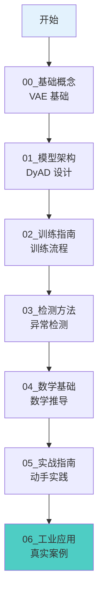

# Battery Fault Detection - 文档导航中心

> **项目文档总入口** | 最后更新: 2025-02-12

---

## 快速导航

### 按读者类型选择路径

| 读者类型 | 推荐路径 | 预计时间 |
|----------|----------|----------|
| **初学者** | [学习路径](#初学者路径) | 30-40 小时 |
| **开发者** | [开发路径](#开发者路径) | 5-10 小时 |
| **研究人员** | [研究路径](#研究路径) | 10-15 小时 |
| **快速上手** | [快速开始](QUICKSTART.md) | 30 分钟 |

---

## 初学者路径

**目标**: 从零开始学习 DyAD 模型和电池故障检测



### 学习资源

| 文档 | 描述 | 位置 |
|------|------|------|
| **教程系列** | 从基础到应用的完整教程 | [tutorials/](tutorials/) |
| **架构参考** | DyAD 模型架构详解 | [reference/Architecture_Reference.md](reference/Architecture_Reference.md) |
| **领域知识** | 电池故障预测领域知识 | [domain/Battery_Knowledge.md](domain/Battery_Knowledge.md) |

---

## 开发者路径

**目标**: 快速理解代码库并开始开发

### 核心文档

1. **[QUICKSTART.md](QUICKSTART.md)** - 项目概述 + 快速开始
2. **[reference/Architecture_Reference.md](reference/Architecture_Reference.md)** - 模型架构
3. **[reference/Training_and_Evaluation.md](reference/Training_and_Evaluation.md)** - 训练评估
4. **[reference/Setup_and_Installation.md](reference/Setup_and_Installation.md)** - 环境配置

### 代码结构

```
DyAD/
├── main_five_fold.py          # 五折训练主入口
├── train.py                   # 训练模块
├── extract.py                 # 特征提取
├── evaluate.py                # 评估模块
├── model/
│   ├── dynamic_vae.py         # VAE 模型
│   ├── dataset.py             # 数据加载
│   └── tasks.py              # 特征选择
└── model_params_*.json        # 配置文件
```

---

## 研究人员路径

**目标**: 深入理解方法论和实验设计

### 核心文档

1. **[reference/Architecture_Reference.md](reference/Architecture_Reference.md)** - 架构创新点
2. **[reference/Training_and_Evaluation.md](reference/Training_and_Evaluation.md)** - 实验设置
3. **[technical/Mathematical_Derivations.md](technical/Mathematical_Derivations.md)** - 数学推导
4. **[domain/Battery_Knowledge.md](domain/Battery_Knowledge.md)** - 领域知识

### 关键方法

| 方法 | 优势 | DyAD 实现 |
|------|------|-----------|
| **VAE** | 概率潜空间，生成能力 | 变分推断 + 重参数化 |
| **双向RNN** | 捕获时序上下文 | 编码器双向，解码器单向 |
| **条件生成** | 利用控制变量 | SOC + Current 作为条件 |
| **多任务学习** | 正则化 + 辅助信息 | 重构 + 里程预测 |

---

## 文档目录

### 参考文档 (Reference/)

| 文档 | 描述 |
|------|------|
| [Architecture_Reference.md](reference/Architecture_Reference.md) | DyAD 模型架构单一来源 |
| [Setup_and_Installation.md](reference/Setup_and_Installation.md) | 环境配置与安装指南 |
| [Training_and_Evaluation.md](reference/Training_and_Evaluation.md) | 训练流程与评估指标 |

### 技术文档 (Technical/)

| 文档 | 描述 |
|------|------|
| [DynamicVAE_Code_Analysis.md](technical/DynamicVAE_Code_Analysis.md) | 代码级深度分析 |
| [Mathematical_Derivations.md](technical/Mathematical_Derivations.md) | 数学公式推导 |

### 教程系列 (Tutorials/)

| 章节 | 描述 | 预计时间 |
|------|------|----------|
| [00_基础概念.md](tutorials/00_基础概念.md) | 神经网络与 VAE 基础 | 4-6 小时 |
| [01_模型架构.md](tutorials/01_模型架构.md) | DyAD 架构详解 | 2-3 小时 |
| [02_训练指南.md](tutorials/02_训练指南.md) | 训练流程与策略 | 2-3 小时 |
| [03_检测方法.md](tutorials/03_检测方法.md) | 异常检测方法 | 2-3 小时 |
| [04_数学基础.md](tutorials/04_数学基础.md) | 数学原理推导 | 3-4 小时 |
| [05_实战指南.md](tutorials/05_实战指南.md) | 动手实践练习 | 4-6 小时 |
| [06_工业应用.md](tutorials/06_工业应用.md) | 真实应用案例 | 2-3 小时 |
| [附录_参数调优.md](tutorials/附录_参数调优.md) | 超参数调优实践 | 1-2 小时 |

### 领域知识 (Domain/)

| 文档 | 描述 |
|------|------|
| [Battery_Knowledge.md](domain/Battery_Knowledge.md) | 电池故障预测领域知识 |

---

## 常见问题

### 如何运行训练？

```bash
cd DyAD
python main_five_fold.py --config_path model_params_battery_brand1.json --fold_num 0
```

详见 [Setup_and_Installation.md](reference/Setup_and_Installation.md)

### 如何调整超参数？

编辑 `model_params_battery_brand*.json` 文件，详见 [Training_and_Evaluation.md](reference/Training_and_Evaluation.md#5-超参数配置)

### 数据格式是什么？

每个 PKL 文件包含 `(tensor, metadata)` 元组，详见 [Setup_and_Installation.md](reference/Setup_and_Installation.md#23-数据格式)

---

## 文档版本

**当前版本**: v2.0
**更新日期**: 2025-02-12
**主要变更**:
- 新增 reference/ 单一来源参考文档
- 重组 tutorials/ 目录结构
- 整合技术文档到 technical/
