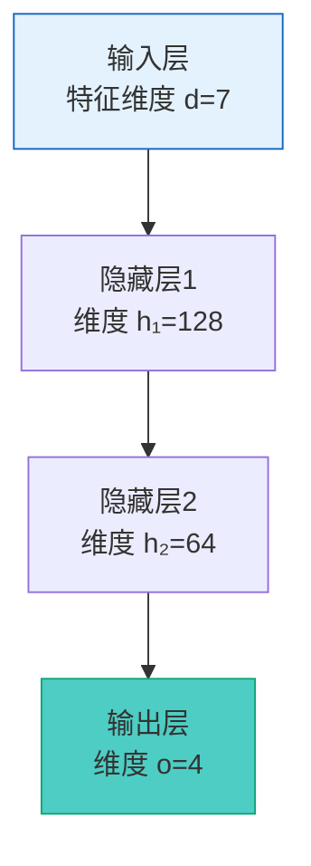
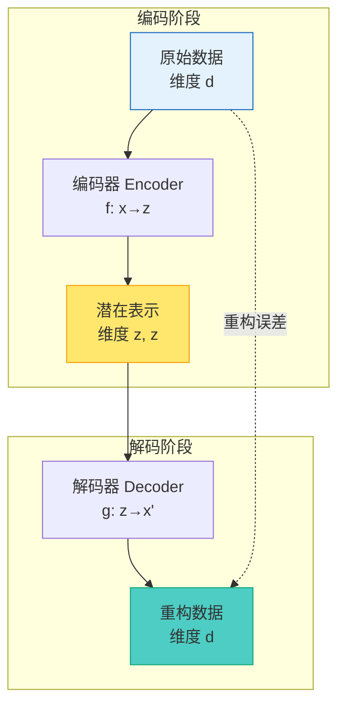
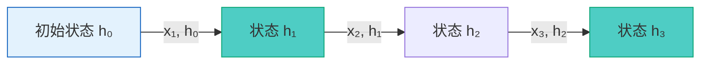
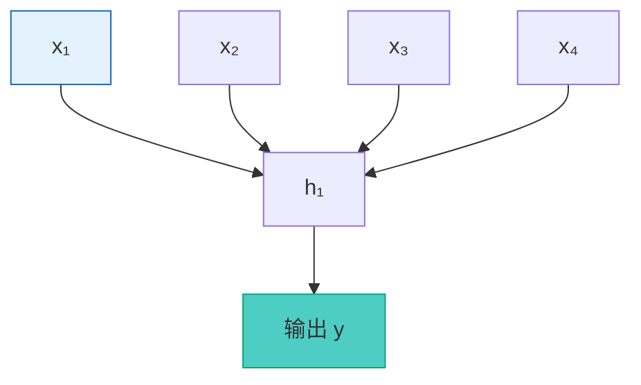

# 第0章：前置知识 (Prerequisite Knowledge)

> **章节定位**: 为理解 DyAD 模型，必须掌握的深度学习基础概念
>
> **预计学习时间**: 4-6 小时（根据个人基础）
>
> **难度等级**: ★★☆☆☆ (初学者友好)

---

## 目录 (Table of Contents)

- [1.1 神经网络基础](#11-神经网络基础)
  - [1.1.1 神经元与感知机](#111-神经元与感知机)
  - [1.1.2 前向传播](#112-前向传播)
  - [1.1.3 损失函数](#113-损失函数)
  - [1.1.4 反向传播](#114-反向传播)
  - [1.1.5 梯度下降](#115-梯度下降)

- [1.2 自编码器基础](#12-自编码器基础)
  - [1.2.1 编码器-解码器架构](#121-编码器-解码器架构)
  - [1.2.2 瓶颈层的作用](#122-瓶颈层的作用)
  - [1.2.3 重构任务](#123-重构任务)

- [1.3 变分自编码器 (VAE)](#13-变分自编码器-vae)
  - [1.3.1 什么是"变分"](#131-什么是变分)
  - [1.3.2 概率潜空间](#132-概率潜空间)
  - [1.3.3 重参数化技巧](#133-重参数化技巧)
  - [1.3.4 KL散度](#134-kl散度)

- [1.4 时序建模基础](#14-时序建模基础)
  - [1.4.1 RNN 基础原理](#141-rnn-基础原理)
  - [1.4.2 LSTM vs GRU](#142-lstm-vs-gru)
  - [1.4.3 双向 RNN](#143-双向-rnn)

- [1.5 本章小结与自测](#15-本章小结与自测)

---

## 1.1 神经网络基础

> **为什么需要这个知识**: DyAD 是基于神经网络的深度学习模型，理解神经元、前向/反向传播是基础。

### 1.1.1 神经元与感知机 (Neuron and Perceptron)

#### 基本概念

**神经元 (Neuron)**: 神经网络的基本计算单元


**数学表示**:

$$
y = f\left(\sum_{i=1}^n w_i x_i + b\right)
$$

| 组件 | 符号 | 含义 | DyAD 中的对应 |
|:-----|:-----|------|-------------------|
| 输入 | $x_i$ | 数据特征 | SOC, Current, Temperature 等 |
| 权重 | $w_i$ | 可学习参数 | RNN 中的所有权重矩阵 |
| 偏置 | $b$ | 平移项 | Linear 层的 bias |
| 激活函数 | $f(\cdot)$ | 非线性变换 | ReLU, Tanh, Sigmoid |

#### 常用激活函数

| 激活函数 | 公式 | 范围 | 特点 | 应用场景 |
|---------|------|------|--------|---------|
| **ReLU** | $\max(0, x)$ | $[0, +\infty)$ | 简单，缓解梯度消失 | 隐藏层常用 |
| **Tanh** | $\frac{e^x - e^{-x}}{e^x + e^{-x}}$ | $(-1, 1)$ | 零中心，平滑 | RNN 门控 |
| **Sigmoid** | $\frac{1}{1+e^{-x}}$ | $(0, 1)$ | 概率输出 | 输出层（概率）|
| **Softmax** | $\frac{e^{x_i}}{\sum_j e^{x_j}}$ | $(0, 1)$，和为1 | 多分类归一化 | 分类任务 |

**★ Insight ─────────────────────────────────────────**
- 激活函数是神经网络"学习非线性特征"的核心
- DyAD 中主要使用 ReLU（隐藏层）和 Sigmoid（概率输出）
- 选择激活函数需要考虑：梯度稳定性、计算效率、数值范围
────────────────────────────────────────────────

### 1.1.2 前向传播 (Forward Propagation)

#### 层次结构

神经网络由多层组成，数据逐层流动：



#### 维度追踪示例

以 DyAD 的编码器为例：

```python
# 输入: [batch_size=32, seq_len=128, features=7]
# 形状: torch.Size([32, 128, 7])

# 通过 Linear(7, 128): 输入维度变换为隐藏维度
# 输出: [32, 128, 128]

# 通过 RNN: 处理序列
# 输出: [32, 128, 128]  # 每个时间步的隐藏状态
```

**关键理解**: 前向传播就是数据通过一系列可学习的线性变换和非线性激活，逐层流动的过程。

### 1.1.3 损失函数 (Loss Function)

#### 什么是损失函数？

损失函数衡量模型预测与真实标签之间的"距离"，指导模型学习。

$$
\mathcal{L}(\theta) = \frac{1}{N}\sum_{i=1}^N \ell(f(x_i; \theta), y_i)
$$

其中：
- $\theta$: 模型参数
- $f(x_i; \theta)$: 模型预测
- $y_i$: 真实标签
- $\ell(\cdot, \cdot)$: 单个样本的损失

#### DyAD 中使用的损失函数

| 损失类型 | 公式 | 用途 | 在 DyAD 中的角色 |
|---------|------|------|-------------------|
| **MSE** | $\frac{1}{n}\sum(y_i - \hat{y}_i)^2$ | 回归任务 | 标签预测损失 |
| **Smooth L1** | $\frac{1}{n}\sum\|y_i - \hat{y}_i\|$ | 重构任务 | NLL 重构损失 |
| **KL 散度** | 见下节 | 正则化 | VAE 正则项 |

**水塔类比**: 损失函数就像"水箱水位误差"，越小表示模型预测越准确。

### 1.1.4 反向传播 (Backpropagation)

#### 核心思想

通过链式法则，将损失对参数的梯度从输出层反向传播到输入层：

$$
\frac{\partial \mathcal{L}}{\partial w^{(l)}} = \frac{\partial \mathcal{L}}{\partial a^{(L)}} \cdot \frac{\partial a^{(L)}}{\partial w^{(l)}}
$$

**计算图示**:

```mermaid
graph LR
    Loss[损失 $\mathcal{L}$] -->|∂L/∂a| A[输出层梯度]
    A -->|∂a/∂w| B[隐藏层梯度]
    B -->|∂w/∂x| C[输入层梯度]

    C -->|更新权重| D[参数更新]

    style Loss fill:#ff6b6b,stroke:#c92a2a
    style D fill:#4ecdc4,stroke:#0ca678
```

**★ Insight ─────────────────────────────────────────**
- 反向传播是训练神经网络的核心算法
- 计算图使我们可以高效计算所有参数的梯度
- PyTorch 的 `loss.backward()` 自动完成这一过程
────────────────────────────────────────────────

### 1.1.5 梯度下降 (Gradient Descent)

#### 更新规则

$$
w_{new} = w_{old} - \eta \cdot \frac{\partial \mathcal{L}}{\partial w}
$$

其中 $\eta$ 是学习率 (Learning Rate)。

#### 学习率选择策略

| 学习率 | 值 | 优点 | 缺点 | 适用场景 |
|--------|-----|------|--------|---------|
| **过大** | > 0.01 | 收敛快 | 可能震荡、发散 | 初期探索 |
| **适中** | 0.001 - 0.01 | 稳定收敛 | 较慢 | 大多数情况 |
| **过小** | < 0.0001 | 稳定 | 收敛极慢 | 精细调优 |

**水塔类比**: 学习率就像下山的步长，太大可能跨过山谷，太小则下山太慢。

---

## 1.2 自编码器基础 (Autoencoder Basics)

> **为什么需要这个知识**: DyAD 是自编码器的变体，理解 AE 是理解 VAE 的基础。

### 1.2.1 编码器-解码器架构

#### 完整架构



#### 信息流

1. **编码 (Encoding)**: 压缩数据到低维表示
   $$z = f_{encoder}(x)$$

2. **解码 (Decoding)**: 从低维表示恢复数据
   $$x' = f_{decoder}(z)$$

3. **损失**: 衡量重构质量
   $$\mathcal{L} = \|x - x'\|^2$$

### 1.2.2 瓶颈层的作用 (Bottleneck Layer)

#### 为什么需要瓶颈？

瓶颈层强制网络学习数据的"压缩表示"，而非简单记忆输入。

| 瓶颈大小 | 效果 | 类比 |
|----------|------|------|
| **太大** | 接近恒等映射，学不到压缩 | 像复制粘贴 |
| **合适** | 学习到关键特征，丢弃冗余 | 像写摘要 |
| **太小** | 信息丢失，重构模糊 | 信息压缩过度 |

**水塔类比**:
- 输入数据 = 原始水箱（大容量）
- 瓶颈 = 窄管（限制流量）
- 潜在表示 = 通过窄管的水量（少但精炼）

### 1.2.3 重构任务 (Reconstruction Task)

#### 目标

自编码器的目标是让输出 $x'$ 尽可能接近输入 $x$：

$$
\min_{\theta} \mathbb{E}_{x \sim p_{data}}[\|x - f_\theta(g(f_\theta(x)))\|^2]
$$

#### 评估指标

| 指标 | 公式 | 含义 |
|------|------|------|
| **MSE** | $\frac{1}{n}\sum(x_i - x'_i)^2$ | 均方误差 |
| **PSNR** | $10 \cdot \log_{10}(\frac{MAX^2}{MSE})$ | 峰信噪比 |
| **SSIM** | 结构相似性指标 | 视觉质量 |

**★ Insight ─────────────────────────────────────────**
- 重构任务是无监督学习，不需要标签
- DyAD 的创新在于：通过重构误差检测异常
- 异常数据的重构误差显著大于正常数据
────────────────────────────────────────────────

---

## 1.3 变分自编码器 (VAE)

> **为什么需要这个知识**: VAE 是 DyAD 的理论基础，理解变分推断、重参数化、KL散度是关键。

### 1.3.1 什么是"变分" (Variational)

#### 贝叶斯推断框架

VAE 源自贝叶斯推断：

$$
p(z|x) \approx q_\phi(z|x)
$$

| 符号 | 含义 |
|:-----|------|
| $p(z\|x)$ | 真实的后验分布（未知，难以计算）|
| $q_\phi(z|x)$ | 近似后验分布（神经网络学习）|
| $\phi$ | 近似分布的参数 |

#### 变分下界 (ELBO)

通过最大化证据下界 (ELBO) 来学习参数：

$$
\log p_\theta(x) \geq \mathbb{E}_{q_\phi(z|x)}[\log p_\theta(x|z)] - D_{KL}(q_\phi(z|x) \| p(z))
$$

**ELBO = 重构项 - KL 散度项**

### 1.3.2 概率潜空间 (Probabilistic Latent Space)

#### VAE vs AE

| 特性 | 自编码器 (AE) | 变分自编码器 (VAE) |
|------|----------------|---------------------|
| **潜在表示** | 确定性值 $z$ | 概率分布 $q(z|x) = \mathcal{N}(\mu, \sigma^2)$ |
| **采样方式** | 直接输出 | 从分布采样 $z \sim q(z\|x)$ |
| **损失函数** | 仅重构损失 $\|x-x'\|^2$ | 重构损失 + KL 散度 |
| **生成能力** | 有限（只能插值）| 强（可以生成新样本）|

#### 潜在空间分布

$$
q(z|x) = \mathcal{N}(z; \mu, \text{diag}(\sigma^2))
$$

- $\mu \in \mathbb{R}^d$: 均值向量
- $\sigma^2 \in \mathbb{R}_+^d$: 对角方差矩阵

**水塔类比**: VAE 不给出精确的水位，而是给出可能的"水位范围"（均值 ± 标准差）。

### 1.3.3 重参数化技巧 (Reparameterization Trick)

#### 问题背景

从分布 $q(z|x)$ 直接采样不可微分，梯度无法回传。

$$
z = \text{sample from } \mathcal{N}(\mu, \sigma^2) \quad \text{不可微!}
$$

#### 解决方案

引入随机噪声 $\varepsilon \sim \mathcal{N}(0, I)$：

$$
z = \mu + \sigma \odot \varepsilon \quad \text{可微!}
$$

其中 $\odot$ 是逐元素乘法。

#### 梯度流动

```mermaid
graph LR
    E[噪声 ε] -->|乘以 σ| Z[潜在变量 z<br/>z = μ + σε]
    Z -->|解码器| Dec[解码器]
    Dec --> Loss[损失 $\mathcal{L}$]

    Loss -->|∂L/∂z| G[梯度到 z]
    G -->|∂z/∂μ| H[梯度到 μ]
    G -->|∂z/∂σ| I[梯度到 σ]

    style E fill:#e3f2fd,stroke:#1565c0
    style Loss fill:#ff6b6b,stroke:#c92a2a
```

**关键**: 梯度现在可以通过 $\mu$ 和 $\sigma$ 回传，即使 $z$ 是随机的！

### 1.3.4 KL 散度 (KL Divergence)

#### 定义

衡量两个概率分布之间的"距离"：

$$
D_{KL}(q \| p) = \sum_z q(z) \log \frac{q(z)}{p(z)}
$$

#### 高斯分布的 KL 散度

当 $q = \mathcal{N}(\mu_q, \sigma_q^2)$, $p = \mathcal{N}(0, 1)$ 时：

$$
D_{KL}(q \| p) = -\frac{1}{2}\sum_{j=1}^d \left(1 + \log(\sigma_q^2) - \mu_q^2 - \sigma_q^2\right)
$$

**性质**:
1. **非负性**: $D_{KL} \geq 0$
2. **不对称性**: $D_{KL}(q\|p) \neq D_{KL}(p\|q)$

**水塔类比**: KL 散度衡量两个水箱的水位分布差异程度。

---

## 1.4 时序建模基础 (Time Series Modeling)

> **为什么需要这个知识**: DyAD 处理电池时序数据，理解 RNN、LSTM/GRU 是关键。

### 1.4.1 RNN 基础原理 (RNN Fundamentals)

#### 循环连接



#### 更新公式

$$
h_t = \tanh(W_{xh} x_t + W_{hh} h_{t-1} + b_h)
$$

| 参数 | 形状 | 含义 |
|------|------|------|
| $x_t$ | $[batch, input\_dim]$ | 当前输入 |
| $h_{t-1}$ | $[batch, hidden\_dim]$ | 前一时刻隐藏状态 |
| $W_{xh}$ | $[hidden\_dim, input\_dim]$ | 输入到隐藏的权重 |
| $W_{hh}$ | $[hidden\_dim, hidden\_dim]$ | 隐藏到隐藏的权重 |
| $b_h$ | $[hidden\_dim]$ | 隐藏层偏置 |

#### 时间展开

将循环网络在时间上展开：



### 1.4.2 LSTM vs GRU

#### LSTM (Long Short-Term Memory)

**核心创新**: 引入细胞状态 $c_t$ 和三个门控：

```mermaid
graph TD
    A[输入 xₜ, hₜ₋₁, cₜ₋₁] --> B{遗忘门 fₜ<br/>决定保留什么}
    A --> C{输入门 iₜ<br/>决定添加什么}
    A --> D{输出门 oₜ<br/>决定输出什么}

    B --> E[候选状态 \tilde{c}ₜ]
    C --> E
    D --> E
    E --> F[细胞状态 cₜ = fₜ ⊙ cₜ₋₁ + iₜ ⊙ \tilde{c}ₜ]
    F --> G[隐藏状态 hₜ = oₜ ⊙ tanh(cₜ)]

    style B fill:#ff6b6b,stroke:#c92a2a
    style C fill:#4ecdc4,stroke:#0ca678
    style D fill:#ffe66d,stroke:#f59f00
```

**门控公式**:

$$
\begin{aligned}
f_t &= \sigma(W_f [h_{t-1}, x_t] + b_f) & \text{遗忘门} \\
i_t &= \sigma(W_i [h_{t-1}, x_t] + b_i) & \text{输入门} \\
o_t &= \sigma(W_o [h_{t-1}, x_t] + b_o) & \text{输出门} \\
\tilde{c}_t &= \tanh(W_c [h_{t-1}, x_t] + b_c) & \text{候选细胞} \\
c_t &= f_t \odot c_{t-1} + i_t \odot \tilde{c}_t & \text{细胞状态} \\
h_t &= o_t \odot \tanh(c_t) & \text{隐藏状态}
\end{aligned}
$$

#### GRU (Gated Recurrent Unit)

**简化**: 只有两个门，计算更高效：

$$
\begin{aligned}
r_t &= \sigma(W_r [h_{t-1}, x_t] & \text{重置门} \\
z_t &= \sigma(W_z [h_{t-1}, x_t] & \text{更新门} \\
\tilde{h}_t &= \tanh(W x_t + r_t \odot h_{t-1}) & \text{候选隐藏} \\
h_t &= (1 - z_t) \odot \tilde{h}_t + z_t \odot h_{t-1} & \text{最终隐藏}
\end{aligned}
$$

| 对比 | LSTM | GRU |
|------|------|------|
| **门数** | 3 个 | 2 个 |
| **参数量** | 更多 | 更少 |
| **计算** | 较慢 | 较快 |
| **表达能力** | 更强 | 略弱 |

**DyAD 使用**: GRU（默认配置），参数少、训练快。

### 1.4.3 双向 RNN (Bidirectional RNN)

#### 工作原理

同时从前向和后向两个方向处理序列：

```mermaid
graph TD
    X[x₁, x₂, x₃, ..., xₜ] --> Forward[前向 RNN<br/>hₜ→]
    X --> Backward[后向 RNN<br/>hₜ←]

    Forward --> Concat[拼接:<br/>hₜ = [hₜ→; hₜ←]]
    Backward --> Concat

    Concat --> Output[使用完整上下文]

    style Forward fill:#4ecdc4,stroke:#0ca678
    style Backward fill:#ff6b6b,stroke:#c92a2a
    style Output fill:#ffe66d,stroke:#f59f00
```

#### 隐藏状态拼接

$$
h_t^{bidirectional} = [h_t^{forward} \| h_t^{backward}]
$$

**水塔类比**: 就像同时向前看和向后看，理解更全面。

---

## 1.5 本章小结与自测

### 知识检查清单

学习完本章后，您应该能够：

- [ ] 解释神经元的基本计算过程
- [ ] 理解前向传播的数据流动
- [ ] 描述反向传播的梯度计算
- [ ] 说明损失函数的作用
- [ ] 区分 AE 和 VAE 的核心差异
- [ ] 理解重参数化技巧的必要性
- [ ] 计算 KL 散度
- [ ] 描述 RNN、LSTM、GRU 的工作原理
- [ ] 理解双向 RNN 的优势

### 自测题

#### Q1: 为什么 VAE 需要重参数化技巧？

<details>
<summary>点击查看答案</summary>

**答案**: 因为直接从分布采样不可微分，重参数化将随机性分离到噪声变量，使梯度能够回传到分布参数。

</details>

#### Q2: KL 散度的物理意义是什么？

<details>
<summary>点击查看答案</summary>

**答案**: KL 散度衡量两个概率分布的差异程度。在 VAE 中，它约束学到的近似分布接近标准正态分布，起到正则化作用。

</details>

#### Q3: 双向 RNN 比单向 RNN 的优势是什么？

<details>
<summary>点击查看答案</summary>

**答案**: 双向 RNN 可以同时看到过去和未来的上下文信息，在时序建模任务中通常表现更好。

</details>

### 编程练习

#### 练习 1: 实现简单神经元

```python
import torch
import torch.nn as nn

# TODO: 实现 ReLU 激活函数
def relu(x):
    """
    ReLU 激活函数
    公式: max(0, x)
    """
    # YOUR CODE HERE
    pass

# 测试
x = torch.tensor([-1, 0, 1, -2])
print("Input:", x)
print("Output:", relu(x))
# 预期输出: [0, 0, 1, 0]
```

#### 练习 2: 实现 KL 散度计算

```python
import torch

def kl_divergence(mu, log_var):
    """
    计算与标准正态分布的 KL 散度

    参数:
        mu: [batch, latent_dim] 均值
        log_var: [batch, latent_dim] 对数方差

    返回:
        kl: [batch] KL 散度值
    """
    # TODO: 实现 KL 散度公式
    # 提示: -0.5 * torch.sum(1 + log_var - mu.pow(2) - log_var.exp())
    pass

# 测试
mu = torch.zeros(1, 2)  # 均值为0
log_var = torch.zeros(1, 2)  # 方差为1（标准正态）
kl = kl_divergence(mu, log_var)
print("KL Divergence:", kl.item())
# 预期输出: 接近 0
```

---

**下一步**: 学习完前置知识后，请继续阅读 [`01_模型架构.md`](./01_模型架构.md) 了解 DyAD 的完整架构设计。

---

**章节版本**: v1.0
**最后更新**: 2025-02-12
