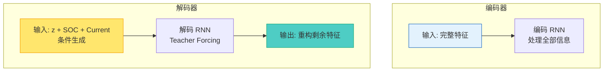
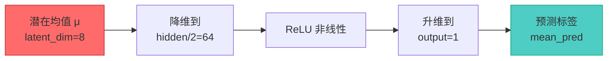

# 第1章：DyAD 模型架构深度解析

> **章节定位**: 详细解析 DyAD (Dynamic Variational Autoencoder) 的完整架构设计
>
> **预计学习时间**: 2-3 小时
>
> **难度等级**: ★★★☆☆ (需要第0章作为基础)

---

## 目录 (Table of Contents)

- [1.1 DyAD 概览](#11-dyad-概览)
- [1.2 编码器设计](#12-编码器设计)
- [1.3 变分潜空间](#13-变分潜空间)
- [1.4 解码器设计](#14-解码器设计)
- [1.5 辅助预测器](#15-辅助预测器)
- [1.6 完整数据流](#16-完整数据流)
- [1.7 架构创新点](#17-架构创新点)

---

## 1.1 DyAD 概览

### 整体架构图

```mermaid
graph TB
    subgraph 输入层
        A[输入时序<br/>X: batch×seq×7]
    end

    subgraph 编码器
        A --> E1[特征选择<br/>Encoder Filter]
        E1 --> E2[双向RNN编码器<br/>Bi-RNN Encoder]
        E2 --> E3[隐藏状态提取<br/>Hidden States]
    end

    subgraph 潜在空间
        E3 --> L1[均值映射<br/>μ = Linear(h)]
        E3 --> L2[对数方差映射<br/>logσ² = Linear(h)]
        L1 --> L3[重参数化采样<br/>z = μ + σ·ε]
        L2 --> L3
    end

    subgraph 解码器
        L3 --> D1[初始隐藏映射<br/>h₀ = Linear(z)]
        D1 --> D2[单向RNN解码器<br/>RNN Decoder]
        D2 --> D3[特征选择<br/>Decoder Filter]
        D3 --> D4[输出投影<br/>Output Projection]
    end

    subgraph 输出
        D4 --> O1[重构序列<br/>log_p: batch×seq×4]
        L1 --> O2[辅助预测<br/>mean_pred: batch×1]
    end

    style A fill:#e3f2fd,stroke:#1565c0
    style L3 fill:#ff6b6b,stroke:#c92a2a
    style O2 fill:#4ecdc4,stroke:#0ca678
```

### 核心组件表

| 组件 | 输入 | 输出 | 作用 | 代码位置 |
|------|------|------|------|----------|
| **编码器RNN** | encoder_features | hidden states | 时序编码 | `encoder_rnn` |
| **均值映射** | hidden states | μ (latent_dim) | 潜在分布中心 | `hidden2mean` |
| **方差映射** | hidden states | logσ² (latent_dim) | 潜在分布方差 | `hidden2log_v` |
| **初始隐藏映射** | z (latent_dim) | hidden states | 解码器初始化 | `latent2hidden` |
| **解码器RNN** | decoder_features, hidden | outputs | 时序解码 | `decoder_rnn` |
| **输出投影** | RNN outputs | log_p | 重构输出 | `outputs2embedding` |
| **辅助预测器** | μ (latent_dim) | mean_pred | 标签预测 | `mean2latent` |

---

## 1.2 编码器设计 (Encoder Design)

### 双向RNN编码器

#### 架构细节

```python
# 代码位置: dynamic_vae.py 第 84-85 行
self.encoder_rnn = rnn(
    encoder_embedding_size,      # 输入特征维度 (EV任务=7)
    hidden_size,                # 隐藏状态维度 (默认=128)
    num_layers=num_layers,       # 层数 (默认=1)
    bidirectional=self.bidirectional,  # 是否双向
    batch_first=True             # 输入格式 [batch, seq, features]
)
```

#### 双向的优势

```mermaid
graph TD
    X[x₁, x₂, x₃, x₄, x₅] --> F[前向 RNN<br/>h₁, h₂, h₃...]
    X --> B[后向 RNN<br/>h₁', h₂', h₃'...]

    F --> C[拼接:<br/>hₜ = [hₜ→; hₜ←]]
    B --> C

    C --> D[双向隐藏状态<br/>完整上下文]

    style F fill:#4ecdc4,stroke:#0ca678
    style B fill:#ff6b6b,stroke:#c92a2a
    style D fill:#ffe66d,stroke:#f59f00
```

**为什么双向？**
- **前向**: 看到 $x_1, x_2, \ldots$ 的信息
- **后向**: 看到 $x_t, x_{t+1}, \ldots$ 的信息
- **拼接**: 融合两个方向的信息，形成完整上下文

#### 隐藏状态处理

```mermaid
graph LR
    H[RNN输出<br/>shape:[batch, directions, layers, hidden]]
        -->|view| H1[重塑<br/>shape:[batch*layers*directions, hidden]]
    H1 -->|hidden_factor| H2[计算因子<br/>directions × layers]
    H2 --> H3[最终隐藏状态<br/>shape:[batch, hidden×factor]]

    style H fill:#e3f2fd,stroke:#1565c0
    style H3 fill:#4ecdc4,stroke:#0ca678
```

**维度变化示例** (bidirectional=True, num_layers=1, hidden_size=128):

```
原始输出: [32, 128, 2]    # batch=32, directions=2, hidden=128
重塑后:   [32, 256]         # batch=32, hidden×2=256
```

---

## 1.3 变分潜空间 (Variational Latent Space)

### 分布映射

```python
# 均值映射 (第 95-96 行)
self.hidden2mean = nn.Linear(hidden_size * hidden_factor, latent_size)
# 输入: [batch, hidden_size × hidden_factor]
# 输出: [batch, latent_size]  # μ 向量

# 对数方差映射 (第 97-98 行)
self.hidden2log_v = nn.Linear(hidden_size * hidden_factor, latent_size)
# 输入: [batch, hidden_size × hidden_factor]
# 输出: [batch, latent_size]  # log(σ²) 向量
```

### 重参数化采样

这是 VAE 的核心创新点：

```python
# 代码位置: dynamic_vae.py 第 278-282 行

# 第 51 行: 生成标准正态噪声
z_noise = to_var(torch.randn([batch_size, self.latent_size]))

# 第 279-280 行: 训练时的采样
if self.training:
    z = z_noise * std * noise_scale + mean
    # 公式: z = μ + σ × ε
    # 其中 ε ~ N(0, 1), noise_scale 控制噪声强度
else:
    z = mean  # 推理时直接使用均值
```

**为什么分训练/推理模式？**

| 模式 | z 的计算 | 原因 |
|--------|---------|------|
| **训练** | $z = \mu + \sigma \odot \varepsilon$ | 探索整个潜在空间，学习完整分布 |
| **推理** | $z = \mu$ | 使用最可能的值（均值），输出稳定 |

**★ Insight ─────────────────────────────────────────**
- 重参数化使梯度能通过 $\mu$ 和 $\sigma$ 回传
- 训练时的随机性帮助模型学习平滑的潜在空间
- 推理时用均值等价于无限次采样的平均
────────────────────────────────────────────────

### 潜在空间的作用

$$
q(z|x) = \mathcal{N}(z; \mu(x), \text{diag}(\sigma^2(x)))
$$

| 潜在维度 | 效果 | DyAD 典型值 |
|----------|------|-------------|
| **太小 (如 4)** | 压缩过度，信息丢失 | - |
| **适中 (如 8-16)** | 平衡压缩与表达 | ✅ DyAD 默认 |
| **太大 (如 64+)** | 欠约束，可能欠拟合 | - |

---

## 1.4 解码器设计 (Decoder Design)

### 条件解码器

解码器与编码器的关键差异：



**条件解码** vs **无条件解码**：

| 类型 | 输入 | 生成能力 | DyAD 用法 |
|------|------|----------|----------|
| **无条件** | 仅 z | 可以生成任意样本 | 图像生成 VAE |
| **条件** | z + 条件 (SOC, Current) | 受条件约束 | ✅ DyAD (电池时序) |

### Teacher Forcing

```python
# 代码位置: dynamic_vae.py 第 291-296 行
de_input_sequence = decoder_filter(input_sequence)
# decoder_filter 选择 SOC 和 Current 作为条件
# 在训练时，使用真实的 SOC 和 Current 引导解码

outputs, _ = self.decoder_rnn(de_input_embedding, hidden)
# decoder_rnn 的输入包含真实的 SOC 和 Current
```

**为什么 Teacher Forcing？**
- 训练时: 使用真实值，稳定训练
- 推理时: 可以使用预测值，自回归生成

---

## 1.5 辅助预测器 (Auxiliary Predictor)

### 架构

```python
# 代码位置: dynamic_vae.py 第 104-108 行
self.mean2latent = nn.Sequential(
    nn.Linear(latent_size, int(hidden_size / 2)),  # 降维
    nn.ReLU(),                                      # 非线性
    nn.Linear(int(hidden_size / 2), 1)              # 输出标量
)
```

### 作用机制



**为什么需要辅助任务？**

1. **约束潜空间**: 强制潜在变量编码有意义的信息（如里程）
2. **正则化效果**: 防止后验塌缩（Posterior Collapse）
3. **多任务学习**: 同时优化主任务和辅助任务，提升泛化

**水塔类比**: 就像要求翻译不仅要通顺（重构），还要保留关键信息（里程）。

---

## 1.6 完整数据流 (Complete Data Flow)

### 前向传播的四个阶段

```mermaid
stateDiagram-v2
    [*] --> Encoding: 编码阶段
        Encoding --> Variational: 变分推断阶段
        Variational --> Sampling: 重参数化采样阶段
        Sampling --> Decoding: 解码阶段

    note right of Sampling
        z = μ + σ·ε (训练)
        z = μ (推理)

    Decoding --> [*]
```

### 维度追踪完整示例

假设配置：
- `batch_size = 32`
- `seq_len = 128`
- `hidden_size = 128`
- `latent_size = 8`
- `bidirectional = True`

```mermaid
graph TD
    A[输入<br/>[32, 128, 7]] --> B[编码器RNN<br/>输出:[32, 128, 256]]
    B --> C[隐藏状态<br/>[32, 256]]
    C --> D1[均值 μ<br/>[32, 8]]
    C --> D2[方差 logσ²<br/>[32, 8]]
    D1 --> E[采样 z<br/>[32, 8]]
    E --> F[解码器初始h<br/>[32, 128]]
    F --> G[解码器RNN<br/>输出:[32, 128, 128]]
    G --> H[重构输出<br/>[32, 128, 4]]

    style A fill:#e3f2fd,stroke:#1565c0
    style H fill:#ff6b6b,stroke:#c92a2a
    style E fill:#4ecdc4,stroke:#0ca678
```

---

## 1.7 架构创新点 (Architectural Innovations)

### DyAD vs 传统 VAE

| 特性 | 传统 VAE | DyAD | 优势 |
|------|----------|------|------|
| **序列建模** | 无 RNN 或 MLP | 双向 RNN | 捕获时序依赖 |
| **条件解码** | 无条件或简单条件 | SOC+Current 条件 | 利用控制变量 |
| **辅助任务** | 无 | 标签预测 | 约束潜空间 |
| **变长处理** | 固定长度 | pack_padded_sequence | 处理真实序列 |

### 关键创新总结

1. **动态编码器**: 双向 RNN 捕获时序上下文
2. **变分推断**: 概率潜空间 + 重参数化
3. **条件生成**: SOC 和 Current 作为解码器条件
4. **多任务学习**: 重构 + 辅助预测联合优化
5. **灵活架构**: 支持变长序列、双向/单向可配置

---

## 本章小结

学习完本章后，您应该能够：

- [ ] 描述 DyAD 的完整架构和数据流
- [ ] 解释编码器如何将时序数据压缩为潜在表示
- [ ] 理解重参数化技巧的作用和实现
- [ ] 说明解码器如何从潜在变量重构序列
- [ ] 理解辅助预测器如何帮助模型学习
- [ ] 追踪前向传播过程中的张量维度变化

### 自测题

#### Q1: 为什么 DyAD 使用双向 RNN 编码但单向 RNN 解码？

<details>
<summary>点击查看答案</summary>

**答案**: 编码器需要同时看到过去和未来的上下文来理解序列；解码器是条件生成过程，只需要从前向逐步生成，使用单向即可。

</details>

#### Q2: 训练和推理时 z 的计算有何不同？

<details>
<summary>点击查看答案</summary>

**答案**: 训练时 $z = \mu + \sigma \cdot \varepsilon$（随机采样），探索潜在空间；推理时 $z = \mu$（使用均值），输出确定性结果。

</details>

### 编程练习

#### 练习: 实现 DyAD 的简化前向传播

```python
import torch
import torch.nn as nn

class SimpleDyAD(nn.Module):
    def __init__(self, input_dim=7, hidden_dim=64, latent_dim=8):
        super().__init__()
        # TODO: 实现简化的 DyAD 前向传播
        # 1. 编码器: Linear(input_dim, hidden_dim) + ReLU
        # 2. 均值和方差: Linear(hidden_dim, latent_dim)
        # 3. 重参数化采样
        # 4. 解码器: Linear(latent_dim, hidden_dim) + ReLU
        # 5. 输出: Linear(hidden_dim, input_dim)

    def forward(self, x):
        # TODO: 实现 forward 方法
        # 返回: 重构输出, 均值, 方差, 潜在变量
        pass

# 测试
model = SimpleDyAD()
x = torch.randn(10, 32, 7)  # [batch, seq, features]
rec, mean, log_var, z = model(x)
print(f"输入: {x.shape}")
print(f"潜在 z: {z.shape}")
print(f"重构: {rec.shape}")
```

---

**下一步**: 学习完 DyAD 架构后，请继续阅读 [`02_训练流程.md`](./02_训练流程.md) 了解模型如何训练和优化。

---

**章节版本**: v1.0
**最后更新**: 2025-02-12
