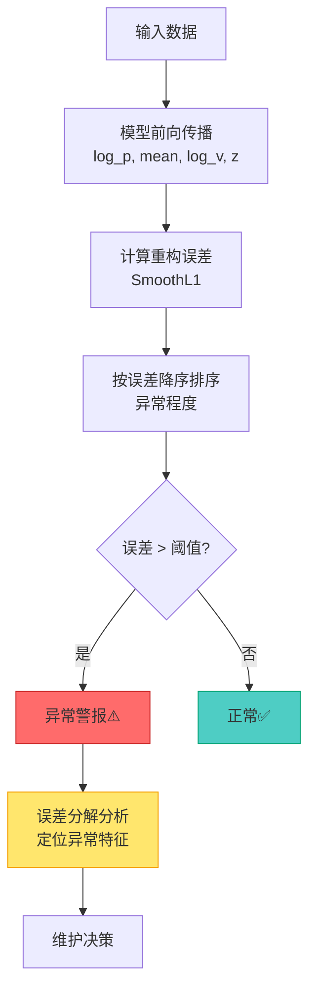

# 第3章：推理与异常检测

> **章节定位**: DyAD 模型如何进行推理和异常检测
>
> **预计学习时间**: 1-2 小时
>
> **难度等级**: ★★★☆☆

---

## 目录

- [3.1 重构误差计算](#31-重构误差计算)
- [3.2 阈值确定策略](#32-阈值确定策略)
- [3.3 异常检测流程](#33-异常检测流程)
- [3.4 性能评估指标](#34-性能评估指标)

---

## 3.1 重构误差计算

### 推理模式切换

```python
# 训练模式
model.train()  # self.training = True, 使用随机采样 z = μ + σε

# 推理模式
model.eval()   # self.training = False, 直接使用 z = μ
```

### 重构误差公式

$$
\text{RecError}(x) = \|\hat{x} - x\|_1
$$

在 DyAD 中的具体实现：

```python
# Smooth L1 损失
rec_error = torch.sum(torch.abs(log_p - targets))
# 累加所有时间步和特征的绝对误差
```

### 误差分解

可以分解到各特征：

```python
def decompose_error(log_p, targets, feature_names):
    """
    将总重构误差分解到各特征

    返回: dict {feature_name: error_value}
    """
    per_feature = torch.abs(log_p - targets).mean(dim=[0, 2])  # 对时间步和特征求平均
    return dict(zip(feature_names, per_feature))

# 示例输出
# {
#     'max_temp': 0.15,      # 温度重构误差最大
#     'max_single_volt': 0.08,  # 电压重构误差次之
#     'min_temp': 0.12,
#     'min_single_volt': 0.20,
#     'volt': 0.10
# }
```

---

## 3.2 阈值确定策略

### 方法对比

| 方法 | 描述 | 优点 | 缺点 |
|------|------|------|------|
| **百分位法** | `np.percentile(val_errors, 95)` | 简单 | 需要验证集 |
| **Top-N 比例** | 前 N% 中故障比例 | 无需额外数据 | DyAD 使用 |
| **3σ 原则** | `mean + 3*std` | 统计稳健 | 可能不适合长尾分布 |

### DyAD 使用的 Top-N 策略

```python
# evaluate.py 的阈值确定

for n in range(1, 100):
    head_n = n / 1000  # 获取前 n‰ 的样本

    # 计算前 n‰ 中故障样本的比例
    count_dist = Counter(results.head(head_n)['label'])
    percent_faulty = count_dist['1'] / (count_dist['0'] + count_dist['1'])

    # 选择使故障比例接近某个目标值的 n
    if abs(percent_faulty - target) < 0.01:
        optimal_n = n
        break
```

---

## 3.3 异常检测流程



---

## 3.4 性能评估指标

### ROC 曲线和 AUC

```mermaid
graph LR
    TPR[真阳性率<br/>TPR = TP/(TP+FN)] --> Plot[ROC 曲线]
    FPR[假阳性率<br/>FPR = FP/(FP+TN)] --> Plot

    Plot --> Area[AUC<br/>曲线下面积]

    Area --> Result[性能评估]

    style Plot fill:#e3f2fd,stroke:#1565c0
```

### 评估指标表

| 指标 | 公式 | 含义 | DyAD 目标 |
|------|------|------|----------|
| **AUC** | ROC 曲线下面积 | 整体性能 | > 0.80 |
| **Recall** | TP/(TP+FN) | 检出异常的比例 | > 0.90 |
| **FAR** | FP/(FP+TN) | 误报率 | < 0.05 |
| **F1-Score** | 2×Precision×Recall/(Precision+Recall) | 综合指标 | > 0.85 |

---

## 本章小结

学习完本章后，您应该能够：

- [ ] 理解 DyAD 的推理模式和训练模式的区别
- [ ] 计算和分解重构误差
- [ ] 描述不同的阈值确定策略
- [ ] 理解 ROC/AUC 等评估指标
- [ ] 能够解释异常检测的完整流程

### 自测题

#### Q1: 为什么推理时使用 z = μ 而不是随机采样？

<details>
<summary>点击查看答案</summary>

**答案**: 推理时需要确定性输出。使用均值（最大后验概率点）等价于无限次采样的平均，能产生最稳定和最优的重构结果。

</details>

---

**下一步**: 学习完推理检测后，请继续阅读 [`05_数学原理.md`](./05_数学原理.md) 深入理解 VAE 的数学推导。

**章节版本**: v1.0
**最后更新**: 2025-02-12
