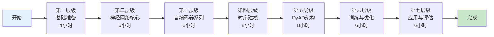
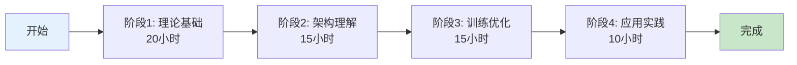

# DyAD 深度学习教程

> 为初学者设计的 DyAD (Dynamic Variational Autoencoder for Anomaly Detection) 深度学习模型完整教程

## 教程简介 (Tutorial Introduction)

本教程专为**深度学习初学者**设计，系统讲解 DyAD 模型的原理、实现和应用。教程采用渐进式教学法，从基础概念开始，逐步深入到 DyAD 的完整架构。

**学习目标**: 完全理解 DyAD 模型的工作原理，能够看懂核心代码并知道如何修改运行

**预计时间**: 标准路径 30-40 小时

**前置要求**: 基础 Python 编程能力，高中数学水平

## 文档导航 (Document Navigation)

```
docs/dyad_tutorial/
├── README.md              # 本文件 - 教程入口和导航
├── 00_前置知识.md         # 必备的深度学习基础概念
├── 01_模型架构.md         # DyAD 完整架构详解
├── 02_训练流程.md         # 训练策略和损失函数
├── 03_推理与检测.md       # 异常检测逻辑
├── 04_代码详解.md         # 核心代码逐行注释
├── 05_数学原理.md         # VAE 数学推导
└── 06_实战指南.md         # 运行和调试指南
```

## 推荐学习路径 (Recommended Learning Paths)

### 路径 1: 快速上手 (Quick Start - 15-20h)

适合有一定基础的学员，快速掌握核心：


### 路径 2: 标准学习 (Standard Path - 30-40h)

适合初学者，系统学习所有前置知识：



### 路径 3: 深度研究 (Research Path - 50-60h)

适合研究者，深入理论并实践：



## 教学特色 (Teaching Features)

### 1. 渐进式复杂度 (Progressive Complexity)

教程采用三轮螺旋上升设计：

- **第一轮**: 概念建立（简化版）- 最小化代码，固定参数
- **第二轮**: 原理深入（标准版）- 完整代码结构，可配置参数
- **第三轮**: 工程实践（完整版）- 工程级代码，超参数调优

### 2. 多模态表达 (Multimodal Learning)

每个概念配合：
- **文字讲解** (Text): 清晰的定义和解释
- **代码示例** (Code): 可运行的 PyTorch 代码
- **数学公式** (Math): LaTeX 格式的公式推导
- **可视化图示** (Visualization): Mermaid 流程图和架构图
- **类比说明** (Analogy): 帮助理解的通俗比喻

### 3. 互动式学习 (Interactive Learning)

每章包含：
- **思考题** (Reflection Questions): 测试理解深度
- **自测题** (Self-Check): 验证学习效果
- **编程练习** (Coding Exercises): 动手实践机会

## 常见问题 (FAQ)

### Q1: 我需要多少数学基础？

**A**: 高中数学水平即可，教程会覆盖：
- 微积分基础（导数、偏导数）
- 线性代数基础（矩阵乘法、向量）
- 概率论基础（分布、期望、方差）

### Q2: 需要什么编程经验？

**A**: 基础 Python 即可，教程会讲解：
- PyTorch 张量操作
- 神经网络模块 (torch.nn)
- 训练循环编写

### Q3: 教程代码可以运行吗？

**A**: 可以，所有代码示例都基于 DyAD 项目结构，您需要：
1. 克隆仓库: `Battery_fault_detection_NC_github`
2. 安装依赖: `pip install torch numpy pandas`
3. 运行代码: 参考 `06_实战指南.md`

## 如何使用本教程 (How to Use This Tutorial)

### 学习前准备

1. **克隆 DyAD 项目**
```bash
cd /path/to/your/workspace
git clone <repository-url>
cd Battery_fault_detection_NC_github/DyAD
```

2. **安装依赖**
```bash
pip install torch torchvision numpy pandas matplotlib seaborn
pip install jupyter  # 可选，用于运行 notebook
```

3. **准备数据**
确保 DyAD 数据集已正确放置在项目目录中

### 学习建议

1. **按顺序学习**: 不要跳过前置知识章节
2. **动手实践**: 每学完一个概念，运行对应代码
3. **记录笔记**: 在代码旁写注释，加深理解
4. **定期复习**: VAE 概念较抽象，需要多次回顾

### 遇到问题时

1. **查阅对应章节**: 本教程每个概念都有详细解释
2. **参考代码解读**: 可参考 `DyAD_CODE_ANALYSIS.md` 了解代码细节
3. **参考数学推导**: `05_数学原理.md` 有完整数学推导
4. **查看实战指南**: `06_实战指南.md` 有常见问题解答

## 关联资源 (Related Resources)

### 项目核心文件

| 文件 | 作用 | 教程关联 |
|-----|------|----------|
| `DyAD/model/dynamic_vae.py` | 核心模型定义 | 01, 04, 05 |
| `DyAD/train.py` | 训练主逻辑 | 02, 04 |
| `DyAD/evaluate.py` | 异常检测逻辑 | 03, 04 |
| `DyAD/model/dataset.py` | 数据加载 | 02, 04 |
| `DyAD/model/tasks.py` | 特征定义 | 01, 02 |
| `DyAD/model_params_*.json` | 超参数配置 | 01, 02, 06 |

### 参考文档

- `[电池知识.md](../../battery_knowlegde/电池知识.md)`: 电池领域知识
- `[DyAD_Teaching_Design.md](../../docs/DyAD_Teaching_Design.md)`: 教学设计参考
- `[DyAD_CODE_ANALYSIS.md](../../DyAD_CODE_ANALYSIS.md)`: 代码深度解读

---

**版本**: v1.1
**创建日期**: 2024-02-12
**维护者**: Battery Fault Detection Project Team
**反馈**: 如有问题或建议，请提交 Issue
