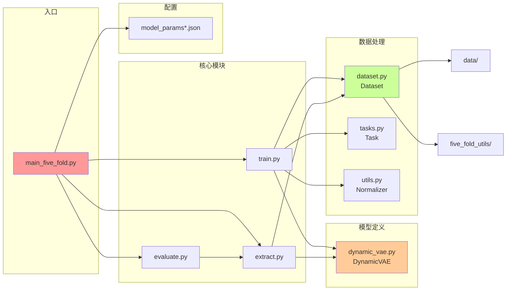

# DyAD 模型架构参考文档

> **单一来源的架构技术参考** | 整合自多个文档
>
> **最后更新**: 2025-02-12

---

## 目录

- [1. 架构概览](#1-架构概览)
- [2. 核心组件](#2-核心组件)
- [3. 完整数据流](#3-完整数据流)
- [4. 模块依赖关系](#4-模块依赖关系)
- [5. 代码位置映射](#5-代码位置映射)

---

## 1. 架构概览

### 1.1 整体架构图

```mermaid
graph TB
    subgraph 输入层
        A[输入时序<br/>X: batch x seq x 7]
    end

    subgraph 编码器
        A --> E1[特征选择<br/>Encoder Filter]
        E1 --> E2[双向RNN编码器<br/>Bi-RNN Encoder]
        E2 --> E3[隐藏状态提取<br/>Hidden States]
    end

    subgraph 潜在空间
        E3 --> L1[均值映射<br/>mu = Linear(h)]
        E3 --> L2[对数方差映射<br/>log_sigma^2 = Linear(h)]
        L1 --> L3[重参数化采样<br/>z = mu + sigma * epsilon]
        L2 --> L3
    end

    subgraph 解码器
        L3 --> D1[初始隐藏映射<br/>h0 = Linear(z)]
        D1 --> D2[单向RNN解码器<br/>RNN Decoder]
        D2 --> D3[特征选择<br/>Decoder Filter]
        D3 --> D4[输出投影<br/>Output Projection]
    end

    subgraph 输出
        D4 --> O1[重构序列<br/>log_p: batch x seq x 5]
        L1 --> O2[辅助预测<br/>mean_pred: batch x 1]
    end

    style A fill:#e3f2fd,stroke:#1565c0
    style L3 fill:#ff6b6b,stroke:#c92a2a
    style O2 fill:#4ecdc4,stroke:#0ca678
```

### 1.2 核心组件表

| 组件 | 输入 | 输出 | 作用 | 代码位置 |
|------|------|------|------|----------|
| **编码器RNN** | encoder_features (7维) | hidden states | 时序编码 | `dynamic_vae.py:encoder_rnn` |
| **均值映射** | hidden states | μ (latent_dim) | 潜在分布中心 | `dynamic_vae.py:hidden2mean` |
| **方差映射** | hidden states | logσ² (latent_dim) | 潜在分布方差 | `dynamic_vae.py:hidden2log_v` |
| **初始隐藏映射** | z (latent_dim) | hidden states | 解码器初始化 | `dynamic_vae.py:latent2hidden` |
| **解码器RNN** | decoder_features (2维), hidden | outputs | 时序解码 | `dynamic_vae.py:decoder_rnn` |
| **输出投影** | RNN outputs | log_p (5维) | 重构输出 | `dynamic_vae.py:outputs2embedding` |
| **辅助预测器** | μ (latent_dim) | mean_pred | 标签预测 | `dynamic_vae.py:mean2latent` |

---

## 2. 核心组件

### 2.1 编码器设计 (Encoder)

#### 双向RNN架构

```python
# 代码位置: DyAD/model/dynamic_vae.py 第 84-85 行
self.encoder_rnn = rnn(
    encoder_embedding_size,      # 输入特征维度 (EV任务=7)
    hidden_size,                # 隐藏状态维度 (默认=128)
    num_layers=num_layers,       # 层数 (默认=2)
    bidirectional=True,          # 双向RNN
    batch_first=True             # 输入格式 [batch, seq, features]
)
```

**双向的优势**：
- **前向**: 捕获 $x_1, x_2, \ldots, x_t$ 的信息
- **后向**: 捕获 $x_t, x_{t+1}, \ldots, x_T$ 的信息
- **拼接**: 融合两个方向的完整上下文

#### 隐藏状态处理

```python
# 维度变化 (bidirectional=True, num_layers=2, hidden_size=128)
# 原始输出: [batch, seq, directions*layers, hidden]
# 重塑后:   [batch, hidden*directions*layers]
hidden_factor = 2 if bidirectional else 1
final_hidden = hidden.view(batch_size, hidden_size * num_layers * hidden_factor)
```

### 2.2 变分潜空间 (Variational Latent Space)

#### 分布参数映射

```python
# 均值映射
self.hidden2mean = nn.Linear(hidden_size * hidden_factor, latent_size)
# 输入: [batch, hidden_size × hidden_factor]
# 输出: [batch, latent_size]  # μ 向量

# 对数方差映射
self.hidden2log_v = nn.Linear(hidden_size * hidden_factor, latent_size)
# 输入: [batch, hidden_size × hidden_factor]
# 输出: [batch, latent_size]  # log(σ²) 向量
```

#### 重参数化采样

```python
# 代码位置: dynamic_vae.py 第 278-282 行

# 生成标准正态噪声
z_noise = to_var(torch.randn([batch_size, self.latent_size]))

# 训练时的采样
if self.training:
    z = z_noise * std * noise_scale + mean
    # 公式: z = μ + σ × ε
else:
    z = mean  # 推理时直接使用均值
```

| 模式 | z 的计算 | 原因 |
|--------|---------|------|
| **训练** | $z = \mu + \sigma \odot \varepsilon$ | 探索潜在空间，学习完整分布 |
| **推理** | $z = \mu$ | 使用最可能的值，输出稳定 |

### 2.3 解码器设计 (Decoder)

#### 条件解码

```python
# 代码位置: dynamic_vae.py 第 91-94 行
self.decoder_rnn = rnn(
    decoder_embedding_size,      # 条件特征维度 (SOC + Current = 2)
    hidden_size,
    num_layers=num_layers,
    bidirectional=False,         # 单向RNN
    batch_first=True
)
```

**条件解码 vs 无条件解码**：

| 类型 | 输入 | 生成能力 | DyAD 用法 |
|------|------|----------|----------|
| **无条件** | 仅 z | 可以生成任意样本 | 图像生成 VAE |
| **条件** | z + 条件 (SOC, Current) | 受条件约束 | ✅ DyAD (电池时序) |

#### Teacher Forcing

训练时使用真实的 SOC 和 Current 引导解码：
```python
# decoder_filter 选择 SOC 和 Current 作为条件
de_input_sequence = decoder_filter(input_sequence)
outputs, _ = self.decoder_rnn(de_input_embedding, hidden)
```

### 2.4 辅助预测器 (Auxiliary Predictor)

```python
# 代码位置: dynamic_vae.py 第 104-108 行
self.mean2latent = nn.Sequential(
    nn.Linear(latent_size, int(hidden_size / 2)),  # 降维
    nn.ReLU(),                                      # 非线性
    nn.Linear(int(hidden_size / 2), 1)              # 输出标量
)
```

**辅助任务的作用**：
1. **约束潜空间**: 强制潜在变量编码有意义的信息（如里程）
2. **正则化效果**: 防止后验塌缩（Posterior Collapse）
3. **多任务学习**: 同时优化主任务和辅助任务，提升泛化

---

## 3. 完整数据流

### 3.1 前向传播流程

```mermaid
stateDiagram-v2
    [*] --> Encoding: 编码阶段
    Encoding --> Variational: 变分推断阶段
    Variational --> Sampling: 重参数化采样阶段
    Sampling --> Decoding: 解码阶段
    Decoding --> [*]

    note right of Sampling
        z = μ + σ·ε (训练)
        z = μ (推理)
```

### 3.2 维度追踪示例

假设配置：
- `batch_size = 32`
- `seq_len = 128`
- `hidden_size = 128`
- `latent_size = 8`
- `bidirectional = True`

```mermaid
graph TD
    A[输入<br/>[32, 128, 7]] --> B[编码器RNN<br/>输出:[32, 128, 256]]
    B --> C[隐藏状态<br/>[32, 256]]
    C --> D1[均值 mu<br/>[32, 8]]
    C --> D2[方差 log_sigma^2<br/>[32, 8]]
    D1 --> E[采样 z<br/>[32, 8]]
    D2 --> E
    E --> F[解码器初始h<br/>[32, 128]]
    F --> G[解码器RNN<br/>输出:[32, 128, 128]]
    G --> H[重构输出<br/>[32, 128, 5]]

    style A fill:#e3f2fd,stroke:#1565c0
    style H fill:#ff6b6b,stroke:#c92a2a
    style E fill:#4ecdc4,stroke:#0ca678
```

### 3.3 数据流关键步骤

| 步骤 | 描述 | 输入 | 输出 |
|------|------|------|------|
| **1. 特征选择** | 根据任务筛选特征 | [B, T, F] | encoder: [B, T, 7]<br>decoder: [B, T, 2] |
| **2. 编码** | 双向RNN编码 | [B, T, 7] | hidden: [B, H×factor] |
| **3. 分布推断** | 映射到潜空间分布 | hidden | μ, logσ²: [B, Z] |
| **4. 重参数化** | 采样潜在变量 | μ, logσ² | z: [B, Z] |
| **5. 解码** | 条件生成重构 | z, conditions | 重构: [B, T, 5] |

---

## 4. 模块依赖关系

### 4.1 文件依赖图



### 4.2 核心类依赖

| 调用者 | 被调用者 | 函数/类 | 作用 |
|-------------------|----------------------|-------------------------------|------------------|
| `main_five_fold.py` | `train.py` | `Train_fivefold.main()` | 训练模型 |
| `main_five_fold.py` | `extract.py` | `Extraction.main()` | 提取特征 |
| `main_five_fold.py` | `evaluate.py` | `Evaluate.main()` | 异常评分 |
| `train.py` | `dynamic_vae.py` | `DynamicVAE.forward()` | 前向传播 |
| `train.py` | `dataset.py` | `Dataset.__getitem__()` | 数据加载 |
| `train.py` | `tasks.py` | `Task.encoder_filter()` | 特征筛选 |
| `train.py` | `utils.py` | `Normalizer.norm_func()` | 数据归一化 |

---

## 5. 代码位置映射

### 5.1 核心文件结构

```
DyAD/
├── main_five_fold.py          # 五折训练主入口
├── train.py                   # 训练模块
├── extract.py                 # 特征提取模块
├── evaluate.py                # 异常检测评分模块
├── utils.py                   # 工具函数
├── model/
│   ├── dynamic_vae.py         # VAE 模型定义
│   ├── dataset.py             # 数据加载器
│   └── tasks.py               # 特征选择器
├── model_params_battery_brand1.json   # 品牌1配置
├── model_params_battery_brand2.json   # 品牌2配置
└── model_params_battery_brand3.json   # 品牌3配置
```

### 5.2 关键代码位置

| 功能 | 文件 | 行号 | 说明 |
|------|------|------|------|
| **模型初始化** | `dynamic_vae.py` | 34-73 | 构建编码器、解码器、预测器 |
| **前向传播** | `dynamic_vae.py` | 75-130 | 完整的encode-sample-decode流程 |
| **损失函数** | `train.py` | 203-216 | NLL + KL + label_loss |
| **数据加载** | `dataset.py` | 13-42 | 五折数据划分逻辑 |
| **特征筛选** | `tasks.py` | 55-67 | 编码器/解码器特征选择 |
| **KL退火** | `train.py` | 218-227 | 线性和logistic退火函数 |

---

## 架构创新点总结

| 特性 | 传统 VAE | DyAD | 优势 |
|------|----------|------|------|
| **序列建模** | 无 RNN 或 MLP | 双向 RNN | 捕获时序依赖 |
| **条件解码** | 无条件或简单条件 | SOC+Current 条件 | 利用控制变量 |
| **辅助任务** | 无 | 标签预测 | 约束潜空间 |
| **变长处理** | 固定长度 | pack_padded_sequence | 处理真实序列 |

---

**文档版本**: v1.0
**整合来源**: Engineering_Overview.md, codebase_analysis.md, 01_模型架构.md, DyAD_CODE_ANALYSIS.md, DyAD_Analysis.md
