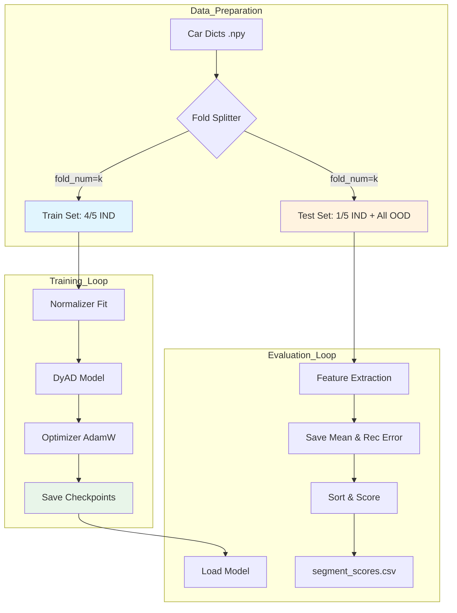

# 训练与评估参考文档

> **单一来源的训练评估参考** | 整合自多个文档
>
> **最后更新**: 2025-02-12

---

## 目录

- [1. 五折交叉验证](#1-五折交叉验证)
- [2. 训练流程](#2-训练流程)
- [3. 损失函数](#3-损失函数)
- [4. 评估指标](#4-评估指标)
- [5. 超参数配置](#5-超参数配置)

---

## 1. 五折交叉验证

### 1.1 数据拆分逻辑

五折交叉验证确保所有正常样本都曾作为测试集的一部分被评估过。

**拆分策略**：
- **正常样本 (IND)**: 被切分为 5 份
  - **训练集**: 取 4/5 的 IND 车辆
  - **测试集**: 取剩余 1/5 的 IND 车辆
- **异常样本 (OOD)**: **全部**放入测试集

### 1.2 Fold 划分表

| fold_num | 训练集（正常车辆） | 测试集（正常车辆） | 测试集（异常车辆） |
|----------|------------------|------------------|------------------|
| 0 | 第1~4折 | 第0折 | 全部异常车辆 |
| 1 | 第0,2~4折 | 第1折 | 全部异常车辆 |
| 2 | 第0~1,3~4折 | 第2折 | 全部异常车辆 |
| 3 | 第0~2,4折 | 第3折 | 全部异常车辆 |
| 4 | 第0~3折 | 第4折 | 全部异常车辆 |

### 1.3 流程图



### 1.4 完整五折实验

```bash
# 对每个 fold 执行
for fold in {0..4}; do
    python main_five_fold.py --config_path model_params_battery_brand1.json --fold_num $fold
done
```

---

## 2. 训练流程

### 2.1 主入口

```bash
cd DyAD
python main_five_fold.py --config_path model_params_battery_brand1.json --fold_num 0
```

### 2.2 执行流程

```python
# 1. 训练阶段
tr = train.Train_fivefold(args, fold_num=args.fold_num)
tr.main()
modelparams_path = tr.getmodelparams()

# 2. 特征提取阶段（测试集）
ext = extract.Extraction(args, fold_num=args.fold_num)
ext.main()

# 3. 异常检测评分
ev = evaluate.Evaluate(args)
ev.main()
```

### 2.3 输出目录结构

```text
dyad_vae_save/YYYY-MM-DD-HH-MM-SS_fold0/
├── model/          # 模型权重 (model.torch) 和参数 (model_params.json)
├── feature/        # 训练集提取的特征
├── mean/           # 测试集提取的特征
├── loss/           # 训练过程损失曲线图
└── result/         # 最终评估结果 CSV
```

---

## 3. 损失函数

### 3.1 三项损失

$$
\mathcal{L} = \mathcal{L}_{\text{NLL}} + \beta \cdot \mathcal{L}_{\text{KL}} + \mathcal{L}_{\text{Label}}
$$

| 损失项 | 公式 | 权重参数 | 作用 |
|------|------|----------|------|
| **NLL** | $\frac{1}{N} \sum \| \mathbf{x} - \hat{\mathbf{x}} \|^2$ | `nll_weight=10` | 重构精度 |
| **KL** | $-\frac{1}{2} \sum (1 + \log\sigma^2 - \mu^2 - \sigma^2)$ | `kl_weight` (动态) | 潜空间正则化 |
| **Label** | $\| \text{mean\_pred} - \text{mileage} \|^2$ | `latent_label_weight=0.001` | 辅助任务 |

### 3.2 KL 散度退火

**为什么需要退火**：VAE 训练初期，如果 KL loss 权重过大，会导致后验分布过早收敛到先验分布（标准正态分布），潜在变量失去意义。

**退火函数**：

| 类型 | 公式 | 参数 |
|------|------|------|
| **linear** | `kl_weight = anneal0 * min(1, step / x0)` | `anneal0=0.01`, `x0=500` |
| **logistic** | `kl_weight = anneal0 / (1 + exp(-k*(step - x0)))` | `anneal0=0.01`, `x0=500`, `k=0.0025` |

**代码位置**: `train.py:L218-L227`

---

## 4. 评估指标

### 4.1 异常评分逻辑

DyAD 主要使用 **重构误差 (Reconstruction Error)** 作为异常分数。

```python
# 计算重构误差
mse = torch.nn.MSELoss(reduction='mean')
rec_error = mse(log_p[i], target[i])
```

- **判定**: 误差越大，越可能是异常

### 4.2 评估指标

| 指标 | 说明 | 计算方式 |
|------|------|----------|
| **AUROC** | ROC曲线下面积 | 衡量正负样本排序能力 |
| **PR-AUC** | PR曲线下面积 | 适用于不平衡数据集 |
| **F1-Score** | 精确率和召回率的调和平均 | `2*P*R/(P+R)` |

### 4.3 评分汇总

- **当前逻辑**: 代码直接输出包含 `rec_error` 的 CSV 文件
- **片段级评分**: 每个 charge segment 一个分数
- **车级评分**: 通常取该车所有片段分数的最大值或平均值

---

## 5. 超参数配置

### 5.1 模型架构参数

| 参数名 | 默认值 | 含义 | 调参建议 |
|-------|--------|------|---------|
| `latent_size` | 8 | 潜在空间维度 | 越大模型容量越强，但可能过拟合 |
| `hidden_size` | 128 | RNN隐藏层维度 | 决定模型记忆能力 |
| `num_layers` | 2 | RNN层数 | 更深的网络可以捕捉更复杂的时序依赖 |
| `bidirectional` | true | 是否双向RNN | 双向可以同时利用前后文信息 |
| `rnn_type` | "gru" | RNN类型 | `gru`: 训练快；`lstm`: 长序列记忆更好 |

### 5.2 训练超参数

| 参数名 | 默认值 | 含义 | 调参建议 |
|-------|--------|------|---------|
| `epochs` | 3 | 训练轮数 | 3轮适合快速实验，生产环境建议10-20轮 |
| `batch_size` | 128 | 批次大小 | 32-256 之间根据显存调整 |
| `learning_rate` | 0.005 | 初始学习率 | AdamW 推荐 1e-3 ~ 1e-2 |
| `noise_scale` | 1.0 | 潜在变量采样噪声强度 | 训练时加噪声防止过拟合 |

### 5.3 损失函数权重

| 参数名 | 默认值 | 含义 | 调参建议 |
|-------|--------|------|---------|
| `nll_weight` | 10 | 重构损失权重 | **最重要**：增大使模型更专注于重构精度 |
| `anneal0` | 0.01 | KL散度损失的最大权重 | 太大会导致 posterior collapse |
| `latent_label_weight` | 0.001 | 里程数预测损失权重 | 辅助任务，帮助潜在空间学习有意义表示 |

### 5.4 配置文件示例

```json
{
    "latent_size": 8,
    "hidden_size": 128,
    "num_layers": 2,
    "bidirectional": true,
    "rnn_type": "gru",
    "epochs": 3,
    "batch_size": 128,
    "learning_rate": 0.005,
    "nll_weight": 10,
    "anneal0": 0.01,
    "latent_label_weight": 0.001,
    "train_path": "../data/battery_brand1/train",
    "test_path": "../data/battery_brand1/test",
    "evaluation_path": "../data/battery_brand1/label",
    "save_model_path": "./dyad_vae_save"
}
```

---

## 调优建议

### 快速验证
1. 先用小 `epochs`（如3）+ 少量数据验证流程
2. 确认 loss 曲线正常下降

### 正式训练
1. `epochs`: 30-100
2. `latent_size`: 尝试 [4, 8, 16, 32]
3. `nll_weight`: 如果重构误差过大，增加到 20-50
4. `anneal_function`: 如果训练早期KL塌缩，改用 `logistic`

### 异常检测性能
- 如果误报率高 → 增大 `nll_weight`，降低重构容忍度
- 如果漏报率高 → 检查特征选择，考虑增加模型容量

---

**文档版本**: v1.0
**整合来源**: Engineering_Overview.md, codebase_analysis.md, DyAD_Five_Fold_Training_Evaluation.md, DyAD_Visualization_Roadmap.md
