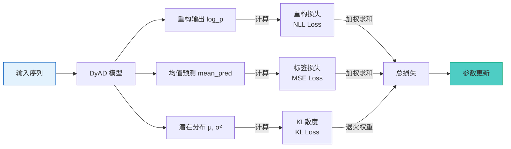
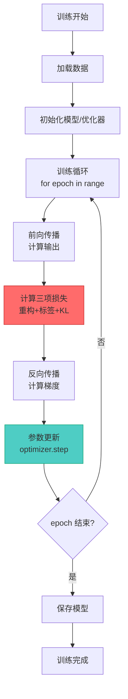
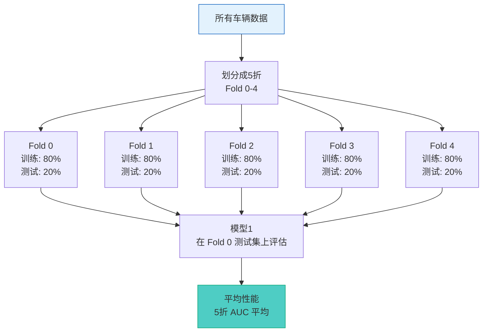

# 第2章：训练流程详解

> **章节定位**: DyAD 模型的训练策略、损失函数设计和优化技巧
>
> **预计学习时间**: 2-3 小时
>
> **难度等级**: ★★★☆☆ (需要理解第1章)

---

## 目录

- [2.1 DyAD 的三项损失函数](#21-dyad-的三项损失函数)
- [2.2 KL 退火策略](#22-kl-退火策略)
- [2.3 训练循环详解](#23-训练循环详解)
- [2.4 五折交叉验证](#24-五折交叉验证)

---

## 2.1 DyAD 的三项损失函数

### 总损失公式

$$
\mathcal{L}_{total} = w_{nll} \cdot \mathcal{L}_{recon} + w_{label} \cdot \mathcal{L}_{label} + w_{KL}(t) \cdot \frac{\mathcal{L}_{KL}}{B}
$$

### 三项损失详解

| 损失项 | 公式 | 权重 | 作用 |
|---------|------|------|------|
| **重构损失 (NLL)** | SmoothL1(log_p, target) | w_nll = 10 | 重构质量 |
| **标签损失** | MSE(mean_pred, label) | w_label = 0.001 | 辅助约束 |
| **KL 散度** | 见下节 | w_KL(t) | 分布正则化 |



### 权重设计原理

| 权重 | 典型值 | 设计考虑 | 影响 |
|------|--------|----------|------|
| **w_nll** | 10 | 重构是主任务 | 确保重构质量优先 |
| **w_label** | 0.001 | 辅助任务 | 轻微约束，不干扰主任务 |
| **w_KL** | 0.1 × anneal | 动态调整 | 防止后验塌缩 |

---

## 2.2 KL 退火策略 (KL Annealing)

### 为什么需要 KL 退火？

**后验塌缩问题**:
- 如果 KL 权重太大，模型会忽略潜空间
- z 与 x 解耦，重构只依赖解码器

### 退火策略

```mermaid
graph LR
    Step[训练步数 t] --> Function[退火函数]

    Function -->|linear| Linear[线性退火<br/>w = min(1, t/x0) * w0]
    Function -->|sigmoid| Sigmoid[平滑退火<br/>w = w0/(1+exp(-k(x-x0)))]

    Linear --> Weight[动态权重 w_t]
    Sigmoid --> Weight

    Weight --> KL[应用于 KL 散度]

    style Step fill:#e3f2fd,stroke:#1565c0
    style KL fill:#ff6b6b,stroke:#c92a2a
```

### 代码实现

```python
# 代码位置: train.py

def compute_kl_weight(step, x0, anneal0, anneal_function='linear'):
    """
    计算 KL 退火权重

    参数:
        step: 当前训练步数
        x0: 退火总步数 (如 10000)
        anneal0: 最终权重 (如 0.001)
        anneal_function: 'linear' 或 'sigmoid'
    """
    if anneal_function == 'linear':
        return anneal0 * min(1, step / x0)
    elif anneal_function == 'sigmoid':
        k = 5 / x0  # 斜率
        return anneal0 / (1 + np.exp(-k * (step - x0)))
    else:
        return anneal0  # 无退火
```

---

## 2.3 训练循环详解

### 完整训练流程



### 关键代码片段

```python
# train.py 核心训练循环

for epoch in range(num_epochs):
    for batch in train_loader:
        # 前向传播
        log_p, mean, log_v, z, mean_pred = model(
            soc, current, features, seq_lengths
        )

        # 计算三项损失
        nll_loss = nll_criterion(log_p, targets)
        label_loss = label_criterion(mean_pred, labels)
        kl_loss = -0.5 * torch.sum(1 + log_v - mean.pow(2) - log_v.exp())

        # KL 退火
        kl_weight = compute_kl_weight(global_step, x0, anneal0)

        # 总损失
        loss = (nll_weight * nll_loss +
                label_weight * label_loss +
                kl_weight * kl_loss / batch_size)

        # 反向传播
        optimizer.zero_grad()
        loss.backward()
        optimizer.step()
```

---

## 2.4 五折交叉验证

### 数据划分策略



### Ind/OOD 划分

| 数据集 | 作用 | 车辆类型 |
|--------|------|----------|
| **Ind (In-distribution)** | 训练集 | 正常车辆 |
| **OOD (Out-of-distribution)** | 测试集 | 异常车辆 |

**设计思想**: 训练只看正常数据 → 模型学习"正常模式"

---

## 本章小结

学习完本章后，您应该能够：

- [ ] 解释 DyAD 三项损失函数的作用
- [ ] 理解 KL 退火策略的必要性
- [ ] 描述完整的训练循环
- [ ] 理解五折交叉验证在 DyAD 中的应用
- [ ] 能够调整损失权重平衡三项损失

### 自测题

#### Q1: 为什么需要 KL 退火？

<details>
<summary>点击查看答案</summary>

**答案**: 防止后验塌缩。如果一开始 KL 权重太大，模型会忽略潜空间；退火让模型先学会重构，再逐渐加入 KL 约束。

</details>

#### Q2: 为什么 DyAD 使用 Ind/OOD 划分而不是随机划分？

<details>
<summary>点击查看答案</summary>

**答案**: 因为 DyAD 是异常检测模型，训练集应该只包含正常数据（Ind），测试集包含异常数据（OOD），这样才能评估模型区分正常和异常的能力。

</details>

---

**下一步**: 学习完训练流程后，请继续阅读 [`03_推理与检测.md`](./03_推理与检测.md) 了解 DyAD 如何进行异常检测。

**章节版本**: v1.0
**最后更新**: 2025-02-12
