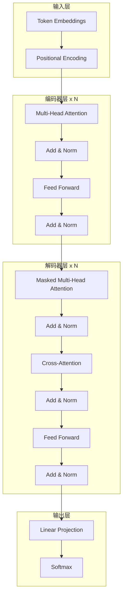
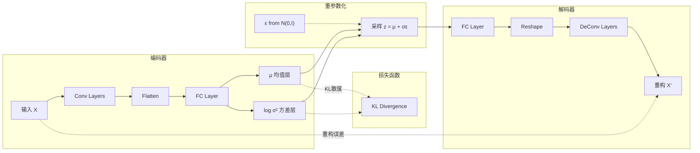
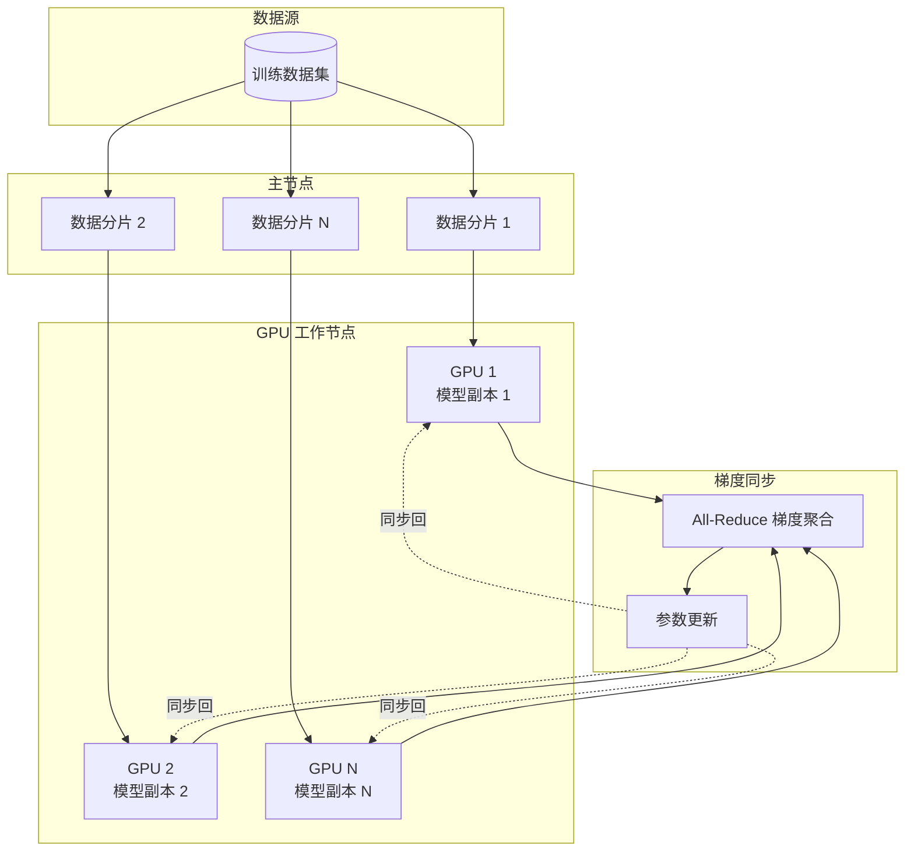
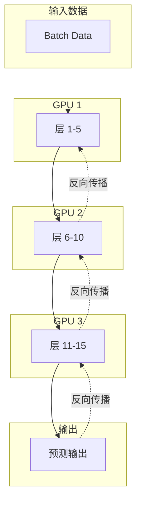
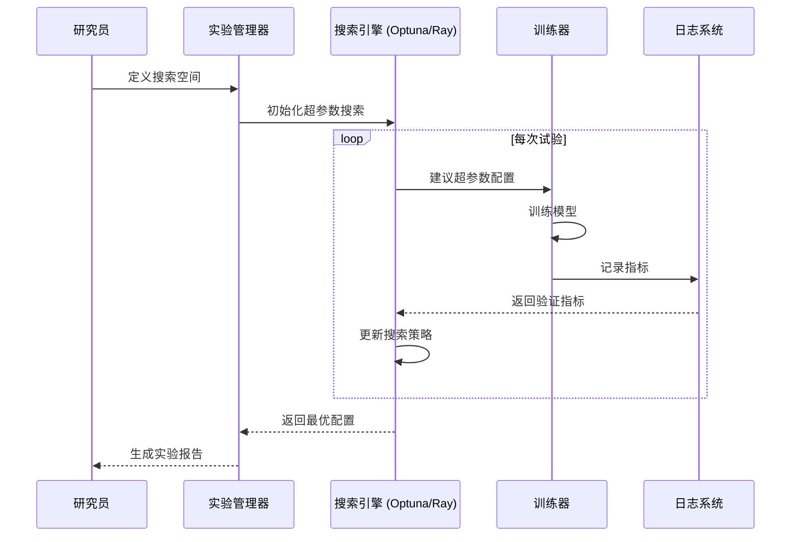
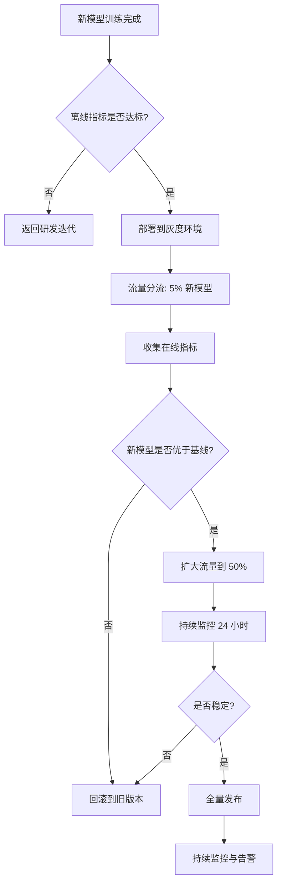
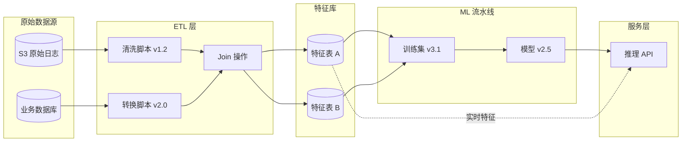
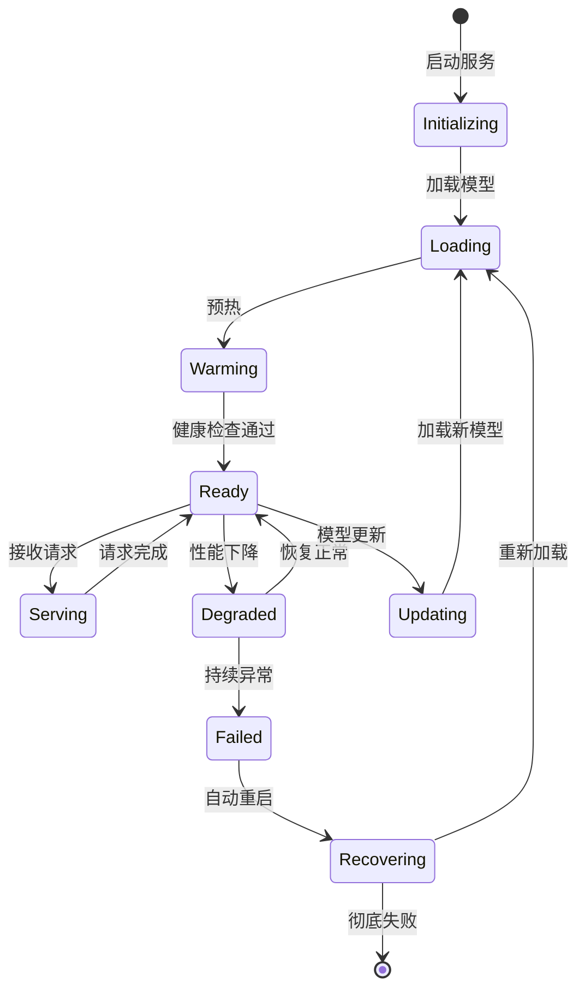
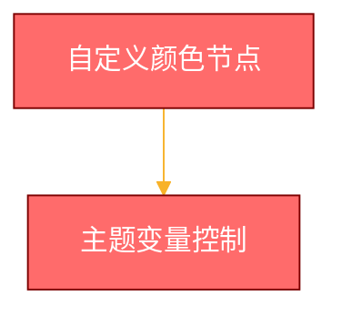
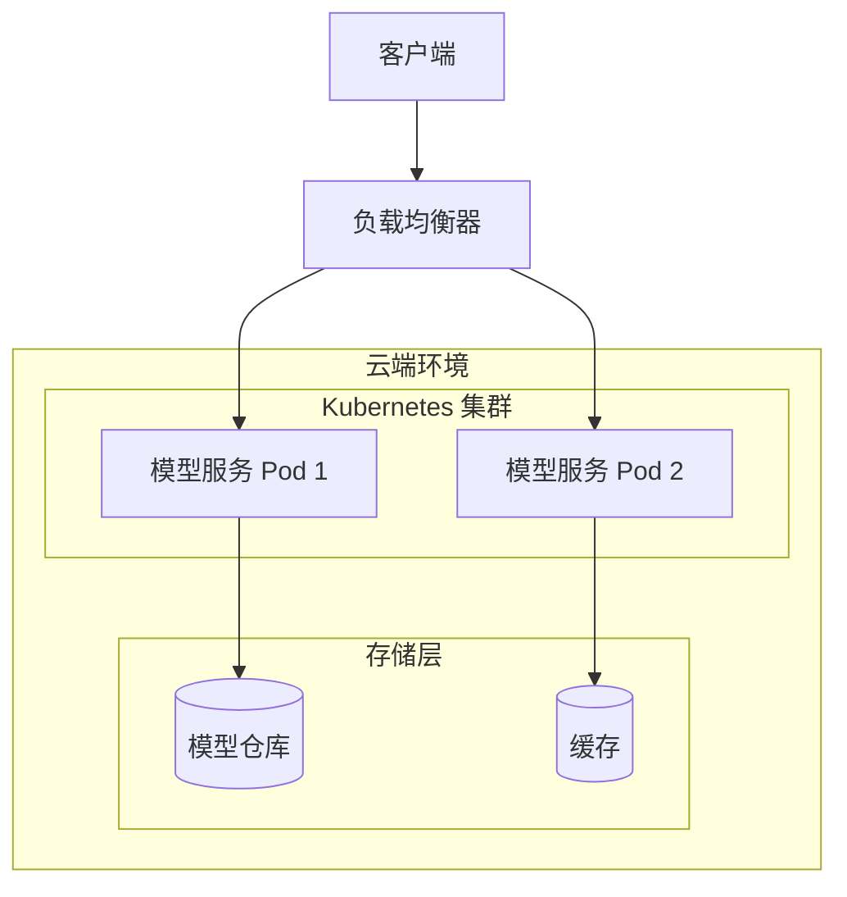

# 程序图表与机器学习系统设计：补充文档

## 一、当前笔记内容总结

### 已涵盖的核心内容

**基础知识部分**：
- ✅ 5种核心图表类型（流程图、序列图、类图、甘特图、架构图）
- ✅ ML系统生命周期与图表的对应关系
- ✅ Mermaid 与 UML 的对比
- ✅ 每种图表的基本示例

**进阶内容部分**：
- ✅ 敏捷 ML 开发路线图（并行流）
- ✅ 系统架构图示例
- ✅ 深度复盘问题与苏格拉底式追问

---

## 二、缺失内容分析

### 1. **实战维度缺失**

现有笔记偏重理论与概念，缺少：
- ❌ 真实项目的完整图表集（端到端案例）
- ❌ 如何从需求文档生成图表的 workflow
- ❌ 图表的版本控制与协作实践
- ❌ 常见错误与反模式（Anti-patterns）

### 2. **工具链缺失**

- ❌ Mermaid 高级语法（主题定制、交互元素、图表嵌套）
- ❌ PlantUML 的深入对比与使用场景
- ❌ 图表导出与集成工具（VSCode、Notion、Confluence、GitHub）
- ❌ AI 辅助绘图的 Prompt 工程模板

### 3. **ML 特定场景缺失**

- ❌ 深度学习模型架构图（CNN、Transformer、VAE 等）
- ❌ 分布式训练架构图（多 GPU、多节点）
- ❌ 实验管理流程图（A/B 测试、超参数搜索）
- ❌ 数据血缘图（Data Lineage）
- ❌ 模型监控与漂移检测流程

### 4. **高级图表类型缺失**

- ❌ 状态图（State Diagram）：描述模型/服务状态机
- ❌ 实体关系图（ER Diagram）：数据库 schema 设计
- ❌ 组件图（Component Diagram）：微服务架构
- ❌ 部署图（Deployment Diagram）：云端基础设施
- ❌ 网络拓扑图（Network Diagram）：分布式系统

### 5. **文档化实践缺失**

- ❌ 如何在技术文档中有效组织多图表
- ❌ 图表的命名规范与文件管理
- ❌ 如何为不同受众（技术/非技术）调整图表复杂度
- ❌ 图表的可访问性（accessibility）最佳实践

---

## 三、补充内容：实战篇

### 1. 深度学习模型架构图

#### 1.1 Transformer 架构（Mermaid）



#### 1.2 VAE 架构（含重参数化技巧）



### 2. 分布式训练架构图

#### 2.1 数据并行（Data Parallelism）



#### 2.2 模型并行（Model Parallelism）



### 3. 实验管理流程

#### 3.1 超参数调优序列图



#### 3.2 A/B 测试流程图



### 4. 数据血缘图（Data Lineage）



### 5. 状态图：模型服务生命周期



---

## 四、工具链进阶

### 1. Mermaid 高级特性

#### 1.1 自定义主题



#### 1.2 子图嵌套



### 2. AI 辅助绘图 Prompt 模板

#### 模板 1：从需求生成架构图

```
你是一位资深的 ML 系统架构师。请根据以下需求生成 Mermaid 架构图：

【需求描述】
- 系统名称：<系统名>
- 核心功能：<功能列表>
- 关键组件：<组件 1, 组件 2...>
- 数据流向：<输入 → 处理 → 输出>

【输出要求】
1. 使用 Mermaid graph 语法
2. 明确标注数据流方向
3. 用 subgraph 区分不同层次（数据层、计算层、服务层）
4. 添加关键组件的简要说明
```

#### 模板 2：从代码生成序列图

```
请分析以下代码，生成 Mermaid 序列图，展示函数/方法之间的调用关系：

【代码片段】
<粘贴代码>

【输出要求】
1. 识别主要参与者（类/模块）
2. 按时间顺序列出方法调用
3. 标注关键参数传递
4. 高亮异步调用或回调
```

---

## 五、实战 Workflow：从需求到图表

### Step 1：需求分析

```
输入：产品需求文档 (PRD)
输出：关键功能列表 + 系统边界定义
工具：思维导图
```

### Step 2：架构设计

```
输入：功能列表
输出：系统架构图（Mermaid graph）
关键点：
- 识别数据流、计算流、控制流
- 定义模块边界
- 标注技术栈
```

### Step 3：细化流程

```
输入：架构图中的关键模块
输出：每个模块的流程图
示例：数据预处理模块 → 流程图展示清洗步骤
```

### Step 4：接口设计

```
输入：模块间交互关系
输出：序列图（模块通信）+ 类图（接口定义）
关键点：
- 明确请求-响应模式
- 定义数据契约
```

### Step 5：项目规划

```
输入：任务拆解表
输出：甘特图
关键点：
- 识别关键路径
- 标注里程碑
- 预留缓冲时间
```

### Step 6：文档整合

```
输入：所有图表
输出：技术设计文档
结构建议：
1. 概述 + 架构图
2. 核心流程 + 流程图/序列图
3. 数据模型 + ER 图/类图
4. 部署方案 + 部署图
5. 项目计划 + 甘特图
```

---

## 六、常见错误与反模式

### ❌ 反模式 1：过度复杂的流程图

**问题**：一张图包含 50+ 步骤，难以阅读

**解决方案**：
- 拆分为多级流程图（高层概览 + 详细子图）
- 使用子图（subgraph）分组

### ❌ 反模式 2：缺少图例

**问题**：箭头含义不明确（实线 vs 虚线？）

**解决方案**：
- 在图表底部添加图例
- 使用标准 UML 符号

### ❌ 反模式 3：不一致的抽象层级

**问题**：同一张图混合高层架构和具体实现细节

**解决方案**：
- 明确图表目标受众
- 技术图 vs 业务图分开绘制

### ❌ 反模式 4：静态图表无法更新

**问题**：PPT/图片格式的图表难以维护

**解决方案**：
- 使用文本格式图表（Mermaid、PlantUML）
- 图表代码纳入版本控制

---

## 七、协作实践

### 1. 图表版本控制策略

```bash
# 推荐目录结构
docs/
├── diagrams/
│   ├── architecture/
│   │   ├── system_overview.mmd
│   │   └── data_pipeline.mmd
│   ├── sequences/
│   │   ├── training_flow.mmd
│   │   └── inference_api.mmd
│   └── classes/
│       └── model_structure.mmd
└── README.md  # 图表索引

# Git commit message 规范
docs(diagrams): update system architecture for v2.0
```

### 2. 图表 Review Checklist

- [ ] 图表目标明确（解释什么问题？）
- [ ] 抽象层级一致
- [ ] 标注清晰（箭头、连接线有含义说明）
- [ ] 使用标准符号
- [ ] 字体大小适中（可读性）
- [ ] 包含图例（如有必要）
- [ ] 文件命名规范
- [ ] 更新日期记录

---

## 八、针对不同受众的图表策略

| 受众           | 图表选择                   | 复杂度 | 示例场景                         |
| -------------- | -------------------------- | ------ | -------------------------------- |
| **高管/产品**  | 架构图、甘特图             | 低     | 展示系统全景与上线计划           |
| **项目经理**   | 甘特图、流程图             | 中     | 任务进度与流程管控               |
| **数据科学家** | 流程图、架构图、模型架构图 | 中-高  | 数据处理、模型设计、实验管理     |
| **ML 工程师**  | 序列图、类图、部署图       | 高     | 系统实现细节、接口设计、基础设施 |
| **SRE/运维**   | 部署图、状态图、网络拓扑图 | 高     | 服务部署、监控告警、故障恢复     |
| **外部合作方** | 简化架构图、API 序列图     | 低-中  | 系统集成点、数据交换格式         |

---

## 九、扩展学习资源

### 推荐工具

1. **图表工具**
   - Mermaid Live Editor: https://mermaid.live/
   - PlantUML Online: http://www.plantuml.com/plantuml/
   - Draw.io (Diagrams.net): https://app.diagrams.net/

2. **浏览器插件**
   - Mermaid Diagrams (Chrome)
   - PlantUML Viewer (VSCode)

3. **文档集成**
   - GitHub: 原生支持 Mermaid
   - Notion: 支持嵌入
   - Confluence: 需插件

### 学习路径

1. **基础阶段**（1-2 周）
   - 掌握 Mermaid 基本语法
   - 绘制 5 种核心图表各 3 个示例

2. **进阶阶段**（2-4 周）
   - 分析开源 ML 项目的架构图
   - 为自己的项目绘制完整文档

3. **专家阶段**（持续）
   - 建立团队图表规范
   - 探索高级工具（C4 Model、ArchiMate）

---

## 十、行动清单

基于当前笔记，建议你接下来：

- [ ] **实战练习**：为 Battery_fault_detection_NC_github 项目绘制完整图表集
  - [ ] 系统架构图
  - [ ] 数据处理流程图
  - [ ] DyAD 模型架构图
  - [ ] 五折训练序列图
  - [ ] 项目开发甘特图

- [ ] **工具熟练**：每种图表类型至少绘制 5 个变体
  - [ ] 流程图（数据、训练、推理、监控）
  - [ ] 序列图（训练交互、API 调用）
  - [ ] 类图（模型结构）
  - [ ] 状态图（服务生命周期）

- [ ] **文档整合**：建立个人图表库
  - [ ] 创建 `diagrams/` 目录
  - [ ] 为每张图编写用途说明
  - [ ] 建立图表索引文档

- [ ] **AI 辅助**：设计专属 Prompt 模板
  - [ ] 架构图生成 Prompt
  - [ ] 代码转序列图 Prompt
  - [ ] 需求转流程图 Prompt

---

## 总结

本补充文档重点填补了原笔记在以下方面的空白：

1. ✅ **深度学习模型架构图**（Transformer、VAE）
2. ✅ **分布式训练架构**（数据并行、模型并行）
3. ✅ **实验管理流程**（超参数调优、A/B 测试）
4. ✅ **数据血缘与状态图**
5. ✅ **Mermaid 高级特性**（主题、子图嵌套）
6. ✅ **AI 辅助绘图 Prompt 模板**
7. ✅ **从需求到图表的完整 Workflow**
8. ✅ **常见反模式与协作实践**
9. ✅ **针对不同受众的图表策略**

结合原有笔记的理论基础与本补充文档的实战指导，你将具备完整的 ML 系统图表设计能力。
