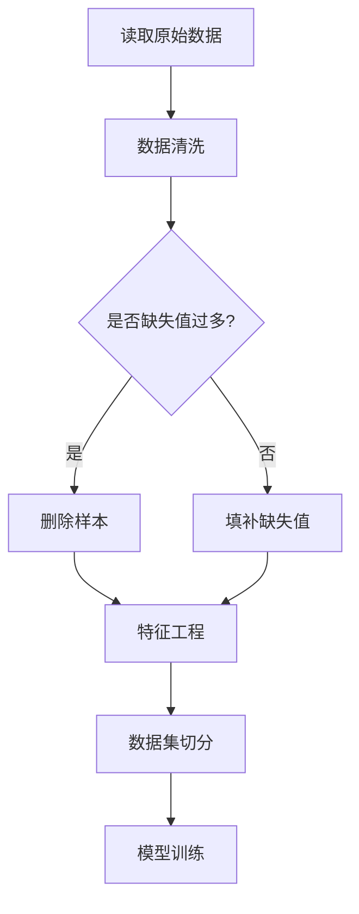
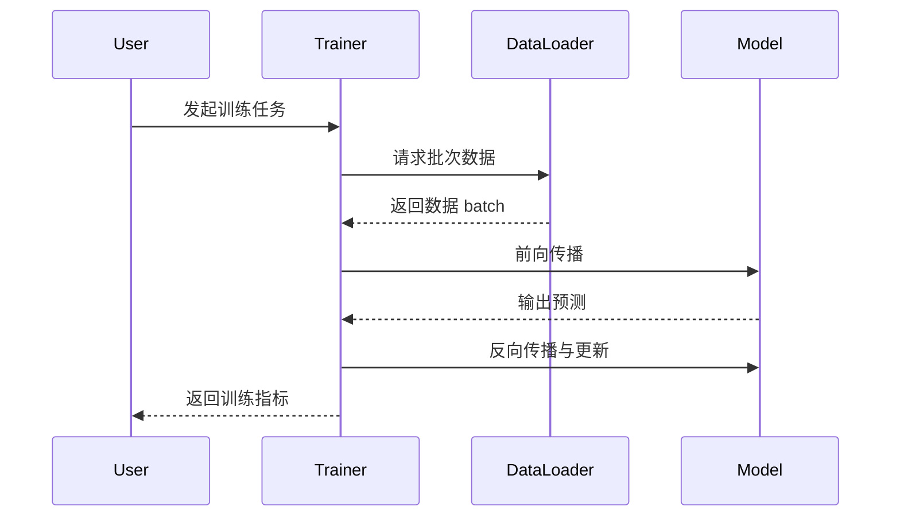
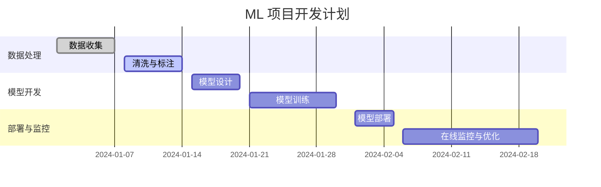
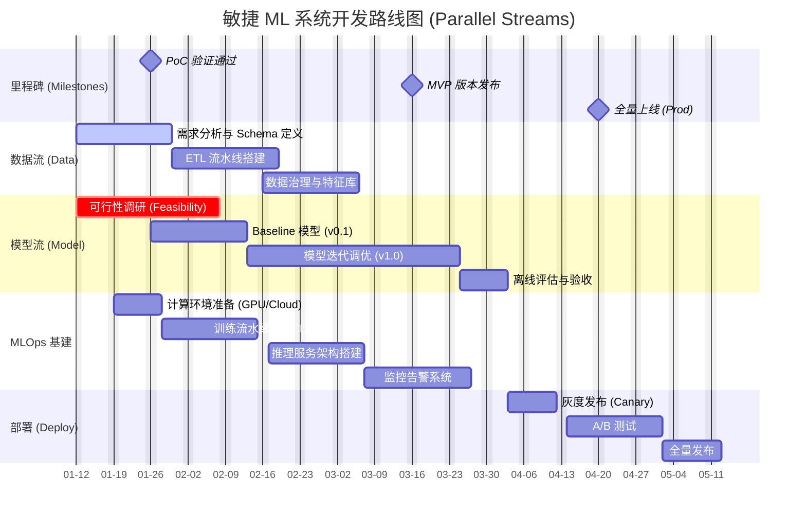
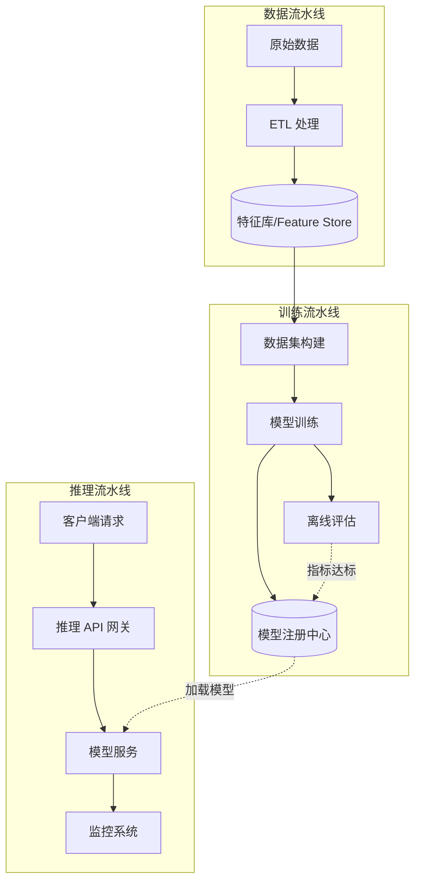
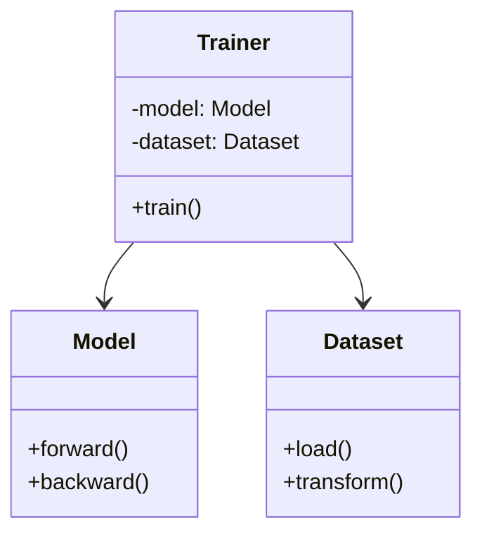
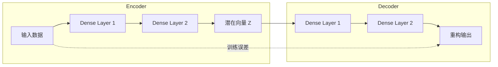

# 程序图表与机器学习系统设计：系统化学习笔记

## 一、学习目标

* 掌握机器学习系统中常用的图表类型（流程图、序列图、类图、甘特图等）
* 理解不同图表在表达系统结构、流程和时间关系中的作用
* 学会使用 Mermaid 与 UML（PlantUML）绘制标准化图表
* 掌握在 ML 系统中如何用图表表达数据流程、模型结构、训练机制等核心概念

---

## 二、知识体系大纲

### 1. 核心概念

* **流程结构（Flow Structure）**：描述系统中的步骤、决策与分支逻辑。
* **时序交互（Sequence Interaction）**：呈现组件之间的时间顺序关系。
* **结构建模（Structural Modeling）**：展示模块、类、组件的组织方式。
* **进度规划（Project Scheduling）**：描述任务时间安排与依赖关系。
* **ML 系统典型模块**：数据处理、特征工程、模型定义、训练与推理、监控与反馈。

### 2. 图表类型

* **流程图（Flow Chart）**：强调步骤逻辑
* **序列图（Sequence Diagram）**：强调对象/模块的时间交互
* **类图（Class Diagram）**：强调结构与关系
* **甘特图（Gantt Chart）**：强调项目进度
* **架构图（Architecture Diagram）**：强调系统模块及数据流

### 3. 应用场景（按 ML/DL 系统生命周期 + Prompt 设计）

机器学习/深度学习系统通常经历以下生命周期：需求定义 → 数据 → 模型 → 训练 → 部署 → 监控 → 反馈。每一阶段对应适合的图表类型。

| 生命周期阶段   | 场景与任务                              | 推荐图表         | 示例用途（结合 Prompt 设计）                                    |
| -------------- | --------------------------------------- | ---------------- | --------------------------------------------------------------- |
| **需求定义**   | 明确系统目标、输入输出、业务约束        | 架构图、流程图   | 用 Prompt 描述“用户目标→系统响应”流程，并生成初步架构草图       |
| **数据阶段**   | 数据收集、清洗、标注、特征工程          | 流程图           | 用 Prompt 自动生成数据处理流程图（如缺失值处理、特征构造）      |
| **模型设计**   | 选择模型结构（如 AE、CNN、Transformer） | UML 类图、架构图 | 用 Prompt 描述模型组件，自动生成类图或架构图                    |
| **训练流程**   | 前向、反向、梯度更新，训练交互          | 序列图           | 用 Prompt 填写“Trainer、Model、DataLoader 的交互步骤”生成序列图 |
| **项目管理**   | 训练、调参、部署周期                    | 甘特图           | 用 Prompt 生成项目排期，如“30 天内完成训练与部署”               |
| **部署阶段**   | 模型上线、API 结构                      | 架构图、流程图   | 用 Prompt 描述“请求 → 推理服务 → 缓存 → 日志”结构               |
| **监控与反馈** | 模型 drift 监控、再训练                 | 流程图、架构图   | Prompt 描述“监控指标 → 告警 → 自动再训练”逻辑                   |
| **全链路文档** | ML 系统设计文档                         | Mermaid 综合图集 | 用 Prompt 一键生成多图组合文档                                  |

> **示例 Prompt：**
> 「基于数据 → 特征工程 → 模型训练 → 部署 → 监控的 ML 生命周期，生成适合的流程图、序列图、类图，并说明每张图的意图。」

---

## 三、图表类型详解与示例

### 1. **Mermaid 流程图**（数据处理流程）

### 2. **Mermaid 序列图**（训练过程交互）

### 3. **Mermaid 甘特图**（项目计划）

### 3 (进阶版). **Mermaid 甘特图 — 敏捷 ML 系统开发路线图（Stream-based）**

> **设计理念（Data Scientist 视角）**：
> 传统的瀑布流（Waterfall）不适合 ML 项目。此图采用 **"多流并行（Parallel Streams）"** 模式：
> *   **Milestones（里程碑）**：明确 PoC、MVP 和 Prod 的关键节点。
> *   **Parallelism（并行）**：数据、模型与基建（Infra）通常是并行推进的，而非串行。
> *   **Iteration（迭代）**：模型开发强调 "Baseline -> Optimization" 的迭代过程。

> 说明：
>
> * 上述甘特图为详细的「机器学习系统架构设计」时间表示例，按阶段拆分了需求、数据、模型、基础设施、部署、监控与合规等模块。
> * 你可以通过 Prompt 调整每一任务的起止日期、负责人和优先级；也可把每个任务拆成更细的子任务（例如：在“数据接入”下增加“API 规范”、“接入测试”）。

### 4. **系统架构图 (System Architecture)**

> **设计理念**：
> 展示数据流、模型训练流与在线推理流的整体架构。

### 5. **UML 类图**（模型结构）

### 6. **Dynamic Autoencoder 架构图（Mermaid）**

---

## 四、对比表：Flow Chart vs Mermaid vs UML

| 特性         | Flow Chart   | Mermaid                | UML                  |
| ------------ | ------------ | ---------------------- | -------------------- |
| **主要用途** | 流程表达     | 多种图表统一语法       | 系统结构建模         |
| **表达能力** | 强调流程     | 强，支持时序/甘特/架构 | 非常强，侧重类与关系 |
| **学习成本** | 低           | 低-中                  | 中-高                |
| **适用场景** | 数据处理流程 | ML 项目全流程          | 模型结构设计         |
| **生态**     | 单一         | Web/文档友好           | 软件工程主流         |

---

## 五、复盘问题（含苏格拉底式追问、深入回答与追问回复）

以下为对原有的五组复盘题进行全面扩展，包括：

* 更详细的主回答
* 对追问的深入回复
* 进一步的反思点（帮助你继续深挖）

---

### 1. 流程图最适合表达哪类信息？为什么？

**详细回答：**
流程图最适合表达“具有明显起点—终点、步骤按顺序执行、并包含明确判断分支”的流程。它的优势在于：

* **清晰呈现步骤逻辑**（适合数据预处理、训练流程等）
* **可视化分支条件**（如缺失值处理、业务逻辑判断）
* **适合初学者和跨部门沟通**（非技术人员也能阅读）

**追问：若流程中存在并行步骤，流程图仍是最优选择吗？为什么？**

**追问回复：**
不一定。

* 并行步骤可以用流程图表达，但流程图在呈现“并行度、同步点、竞争条件”时并不直观。
* 若流程包含大量并行任务，更适用：

  * **活动图（Activity Diagram）**：可清晰表示 Fork/Join
  * **BPMN**：业务流程的行业标准，并行支持强
  * **时序图**：当涉及并行交互

**进一步反思：**
并行的本质是时间关系而非步骤逻辑，你会如何选择一个既能体现时间又能表达流程的混合图？

---

### 2. 序列图与流程图的最大差异是什么？

**详细回答：**

* **流程图** 描述的是“任务的执行顺序”，强调系统如何从开始走到结束。
* **序列图** 描述“多个对象之间的消息交互”，强调时间轴上的通信动作。

例如：

* 训练流程步骤 = 流程图
* Trainer ↔ DataLoader ↔ Model 之间的交互 = 序列图

**追问：一个系统同时包含复杂流程＋多模块交互时，你会选择怎样组合图表？**

**追问回复：**
常见最佳实践是：

1. **用流程图描述全局流程**（Data → Train → Evaluate → Deploy）
2. **在关键节点用序列图放大局部交互**（如“训练步骤内部的对象交互”）
3. **再配合类图展示对象的结构关系**

**进一步反思：**
如果某个部分既有复杂逻辑又有复杂交互，你如何避免图表冗余？是否可以模块化拆图？

---

### 3. 类图如何帮助理解 ML 系统？

**详细回答：**
类图通过展示类与类之间的组成关系、依赖关系、继承关系，可以帮助理解 ML 系统的结构：

* Dataset、FeatureSet、Model、Trainer 的职责边界
* 模型组件（Encoder、Decoder、Optimizer）的组织方式
* 系统的可复用性、扩展性、接口清晰度

**追问：类图能否反映动态行为？若不能，应补充哪类图？**

**追问回复：**
类图不反映动态行为，只展示“结构”。
要表达行为，应补充：

* **序列图**（时序交互）
* **活动图**（执行逻辑）
* **状态图**（模型/服务状态变迁，如 warmup → ready → error）

**进一步反思：**
如果一个模型有“训练态”与“推理态”，你会如何结合类图 + 状态图来表达完整系统？

---

### 4. 甘特图在 ML 项目管理中的价值是什么？

**详细回答：**
甘特图主要解决“项目节奏管理”的问题：

* 明确每个阶段的时间跨度
* 呈现任务之间的依赖关系
* 同步团队节奏（数据工程、ML 工程、SRE、产品）
* 配合里程碑清晰展示项目版图

在 ML 项目中尤其有用，因为 ML 项目常有“不可控性与不确定性”（如训练时间不可预测、数据波动等）。

**追问：若项目迭代频繁，甘特图如何调整？**

**追问回复：**
三个策略：

1. **采用滚动甘特（Rolling Gantt）**：每两周更新未来 4–6 周计划
2. **采用里程碑甘特**：固定节奏的里程碑 + 灵活调整的任务
3. **用依赖关系最小化的微任务**：任务粒度变小，使更新成本下降

**进一步反思：**
在 ML 这种“研究 + 工程”的混合项目中，你会如何在甘特图中体现“试验性工作”？是否需要添加“Spike Task”？

---

### 5. Autoencoder 架构图帮助理解哪些结构特性？

**详细回答：**
Autoencoder（AE）架构图揭示三项核心结构：

* **Encoder**：将输入压缩到潜在空间
* **Latent Space Z**：关键表示空间
* **Decoder**：从潜在空间重构原数据

这让你更容易理解：

* AE 如何学习压缩表示（Representation Learning）
* 如何进行异常检测、降维、数据生成等应用

**追问：若潜在维度变化，会如何影响架构？**

**追问回复：**
潜在维度变化会影响：

* **模型容量**（维度越大，表达能力越强）
* **压缩比**（维度越小，压缩更强但信息损失风险更大）
* **训练难度**（维度越大，需要更多数据和正则化）

架构上：

* Encoder 输出层与 Decoder 输入层的维度必须随之调整
* 可能需要修改中间层大小、激活函数或正则化强度

**进一步反思：**
如果潜在空间变大，你如何确保模型不会过拟合？是否需要加入变分结构（VAE）或 KL 正则项？

##
