# 程序架构设计与可视化：通用架构模式学习指南

## 一、学习目标

* 掌握软件架构的核心设计原则与常见模式（分层、模块化、设计模式等）
* 理解不同图表类型在表达架构设计、系统结构、组件交互中的作用
* 学会使用 Mermaid 与 UML 图表绘制标准化的程序架构
* 掌握在软件开发生命周期中如何用图表表达系统设计、模块结构、依赖关系等核心概念
* 建立从需求到代码的架构可视化完整工作流

---

## 二、核心概念

### 1. 架构的本质

**程序架构（Software Architecture）** 是系统的结构性设计，包含三个维度：

* **结构维度**：模块/组件如何组织（分层、分布、微服务等）
* **交互维度**：模块之间如何通信（调用、消息、事件等）
* **演化维度**：系统如何扩展和维护（接口设计、可复用性等）

### 2. 核心设计原则

* **分层架构（Layered Architecture）**：按职责划分层次（表现层、业务逻辑层、数据访问层等）
* **模块化（Modularity）**：将系统分解为松耦合、高内聚的独立模块
* **关注点分离（Separation of Concerns）**：每个模块只负责一个明确的职责
* **单一职责原则（SRP）**：一个类/模块只有一个改变的理由
* **依赖倒置原则（DIP）**：依赖抽象而非具体实现

### 3. 常见架构模式

* **MVC（Model-View-Controller）**：适合传统 Web 应用
* **Repository 模式**：隔离数据访问逻辑
* **Dependency Injection**：降低组件耦合
* **Factory Pattern**：统一对象创建
* **Observer Pattern**：事件驱动架构
* **Strategy Pattern**：算法切换灵活性

### 4. 图表在架构设计中的作用

* **架构图（Architecture Diagram）**：展示系统整体结构和模块关系
* **流程图（Flow Chart）**：描述控制流和业务逻辑
* **序列图（Sequence Diagram）**：呈现组件间的时间顺序交互
* **类图（Class Diagram）**：表示类与接口的组织方式
* **组件图（Component Diagram）**：展示系统模块的组成与依赖
* **部署图（Deployment Diagram）**：描述系统在运行环境中的部署

---

## 三、架构生命周期与图表应用

程序架构设计通常经历以下阶段：需求分析 → 架构设计 → 详细设计 → 实现 → 测试 → 部署 → 维护。每个阶段对应不同的图表类型和设计关注点。

| 生命周期阶段 | 核心任务 | 推荐图表 | 设计重点 |
|-------------|---------|--------|--------|
| **需求分析** | 确定功能需求、非功能需求、系统边界 | 架构图、用例图 | 系统 scope、用户角色、关键功能 |
| **架构设计** | 选择架构模式、定义模块边界、规划数据流 | 架构图、数据流图、组件图 | 分层结构、模块职责、通信协议 |
| **详细设计** | 设计类结构、接口规范、算法逻辑 | 类图、序列图、流程图 | 类与接口设计、调用关系、业务流程 |
| **实现阶段** | 代码编写、单元测试、代码审查 | 类图、序列图 | 确保代码与设计一致 |
| **测试阶段** | 功能测试、集成测试、性能测试 | 流程图、状态图 | 测试场景覆盖、状态转移 |
| **部署阶段** | 环境配置、发布计划、监控告警 | 部署图、甘特图、状态图 | 多环境部署、灰度发布、故障恢复 |
| **维护阶段** | 性能监控、问题诊断、迭代优化 | 架构图（更新）、数据流图 | 瓶颈识别、优化策略、重构计划 |

---

## 四、通用架构模式详解与示例

### 1. 分层架构（Layered Architecture）

#### 1.1 概念

分层架构将系统按照职责水平划分为多个层，每层只依赖其下层，形成"竖直化"的依赖关系。

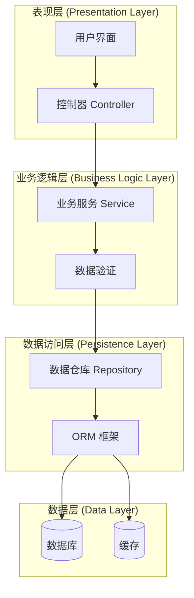

#### 1.2 优点与缺点

**优点**：
- ✅ 结构清晰，易于理解和维护
- ✅ 职责明确，便于团队协作
- ✅ 易于单元测试

**缺点**：
- ❌ 性能开销大（多层调用）
- ❌ 不适合微服务场景
- ❌ 跨层通信复杂

#### 1.3 类图示例

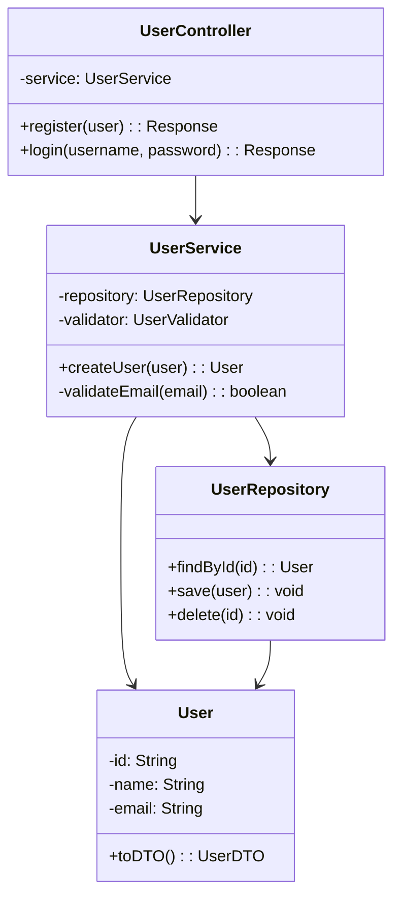

---

### 2. 模块化架构（Modular Architecture）

#### 2.1 概念

模块化架构通过清晰的模块边界和接口规范，使系统能够独立演化。每个模块内部高内聚，模块间低耦合。

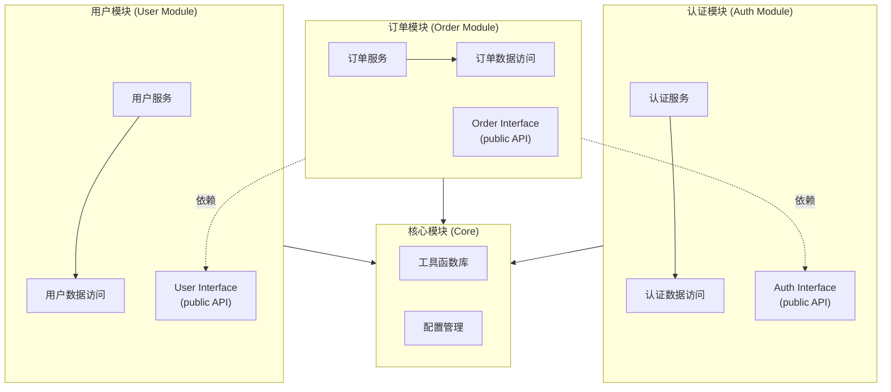

#### 2.2 模块间通信模式

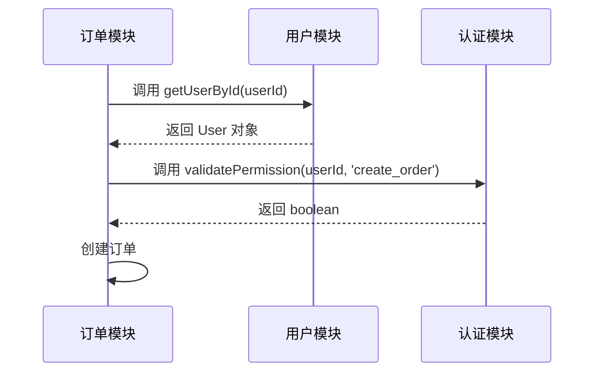

---

### 3. 微服务架构（Microservices Architecture）

#### 3.1 概念

微服务架构将系统分解为一组松耦合、独立部署的小服务，每个服务专注于一个业务能力，通过网络通信（REST、gRPC、消息队列）进行协作。

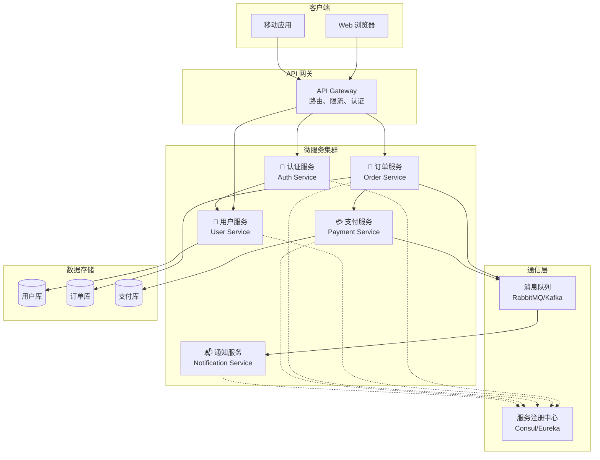

#### 3.2 服务交互时序图

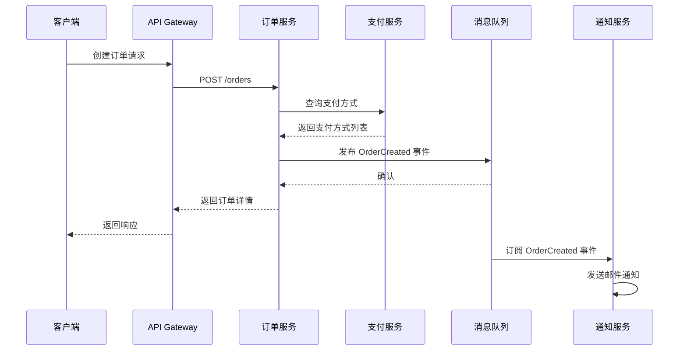

---

### 4. 事件驱动架构（Event-Driven Architecture）

#### 4.1 概念

事件驱动架构将系统中的重要状态变化建模为事件，组件通过发布-订阅机制实现解耦通信。

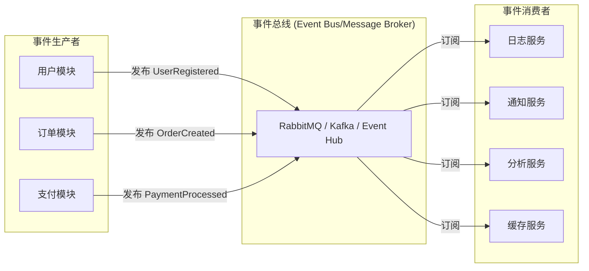

#### 4.2 事件处理流程图

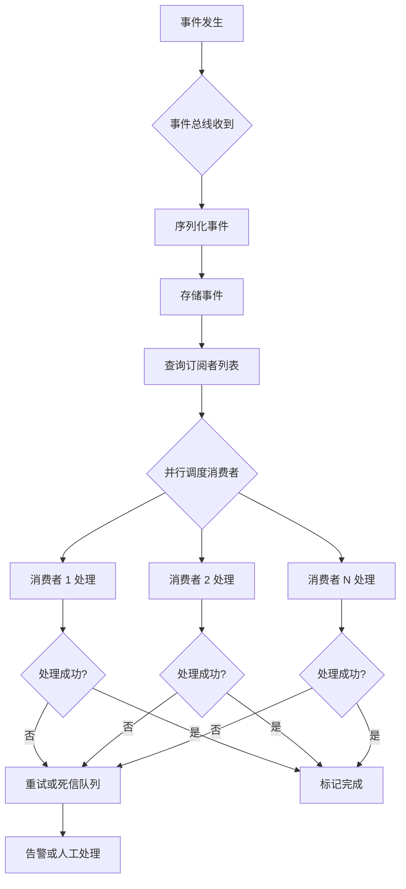

---

### 5. 仓库模式（Repository Pattern）

#### 5.1 概念

仓库模式将数据访问逻辑集中在 Repository 类中，业务逻辑层通过 Repository 接口与数据源交互，实现业务与数据访问的分离。

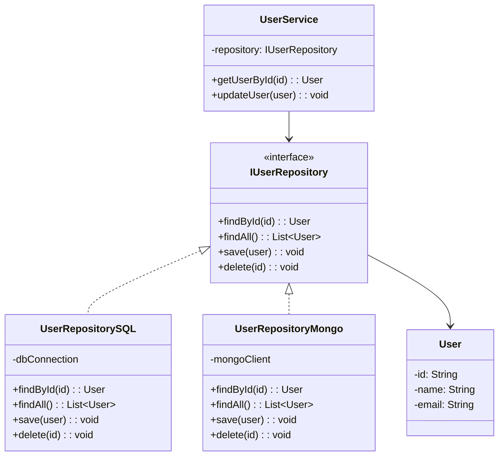

#### 5.2 优势

- ✅ 数据源独立：切换数据库实现不需要修改业务逻辑
- ✅ 易于测试：可用 Mock Repository 进行单元测试
- ✅ 职责分离：业务逻辑与数据访问明确分开

---

### 6. 依赖注入（Dependency Injection）

#### 6.1 概念

依赖注入是一种设计模式，通过在外部创建对象的依赖，然后将其"注入"到对象中，而不是在对象内部创建依赖。

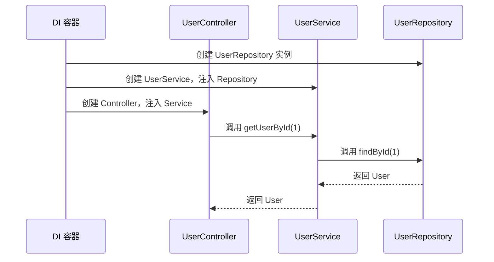

#### 6.2 配置示例（伪代码）

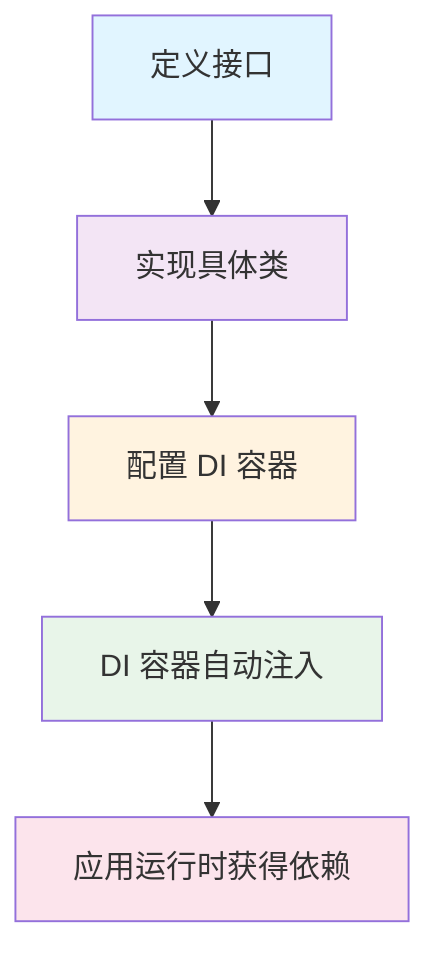

---

## 五、跨层级的完整架构设计案例

以一个简单的"用户管理系统"为例，展示如何从需求到代码的架构设计全流程。

### 5.1 需求概述

- 用户注册、登录、获取用户信息
- 支持邮箱和手机号验证
- 记录操作日志
- 支持多数据源（SQL + NoSQL）

### 5.2 整体架构图

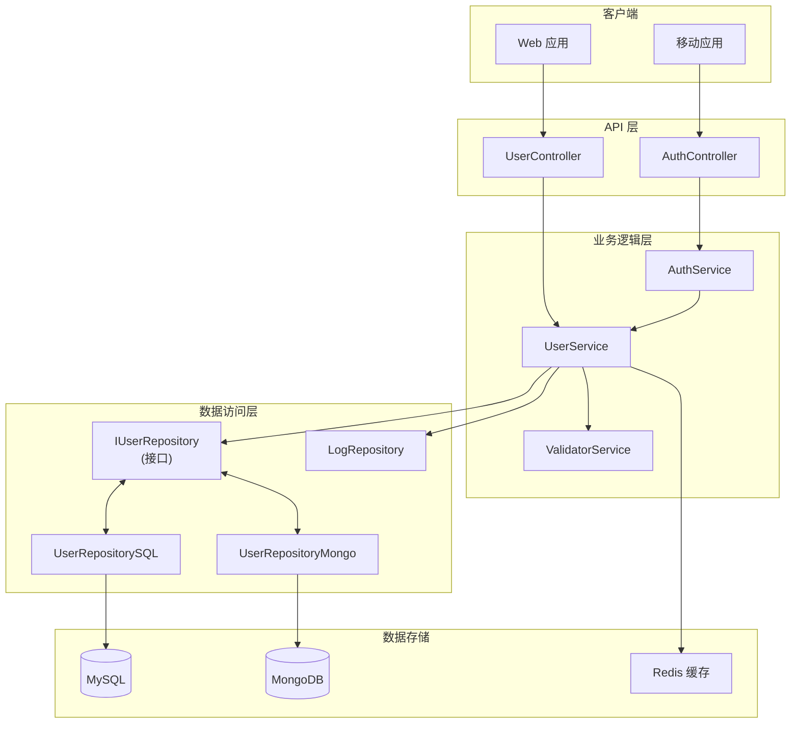

### 5.3 用户注册流程图

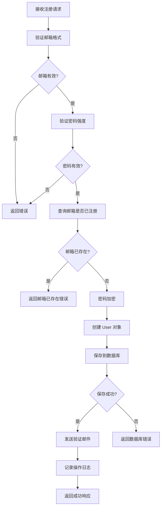

### 5.4 组件交互序列图

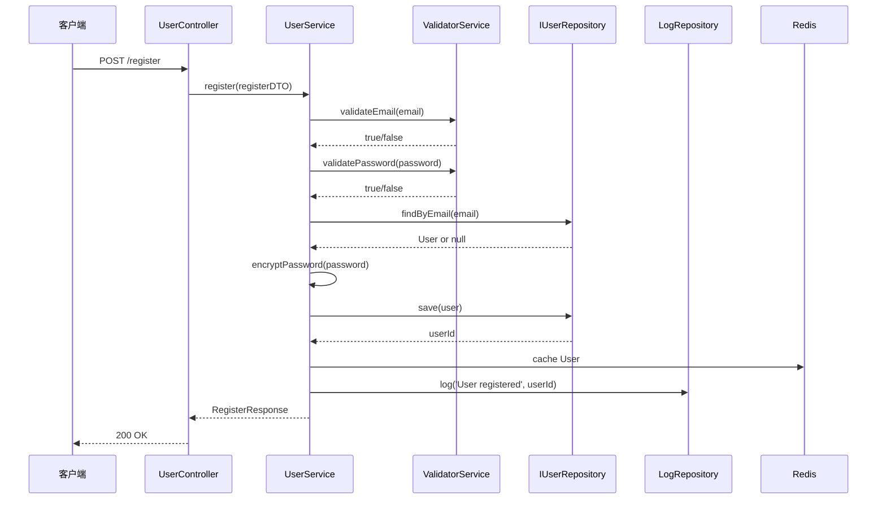

### 5.5 类设计（类图）

```mermaid
classDiagram
    class UserController {
        -userService: UserService
        +register(dto): Response
        +login(dto): Response
        +getUserInfo(id): Response
    }
    
    class UserService {
        -userRepository: IUserRepository
        -validatorService: ValidatorService
        -logRepository: LogRepository
        -cache: CacheService
        +register(dto): User
        +login(username, password): Token
        +getUserById(id): User
        -validateInput(dto): boolean
    }
    
    class ValidatorService {
        +validateEmail(email): boolean
        +validatePassword(password): boolean
        +validatePhoneNumber(phone): boolean
    }
    
    class IUserRepository {
        <<interface>>
        +findById(id): User
        +findByEmail(email): User
        +save(user): void
        +delete(id): void
    }
    
    class User {
        -id: String
        -email: String
        -password: String
        -phoneNumber: String
        -createdAt: DateTime
        +toDTO(): UserDTO
    }
    
    class UserDTO {
        -email: String
        -password: String
        -phoneNumber: String
    }
    
    UserController --> UserService
    UserService --> ValidatorService
    UserService --> IUserRepository
    UserService --> User
    UserService -.->|使用| User
    UserDTO --> User
```

---

## 六、架构设计决策矩阵

在实际项目中，需要根据系统的特性选择合适的架构模式。以下矩阵展示不同场景下的推荐选择：

| 场景特征 | 系统规模 | 团队规模 | 推荐架构 | 理由 |
|---------|--------|--------|--------|------|
| **简单业务逻辑，快速迭代** | 小 | 1-3人 | 分层架构 | 结构简单，学习成本低，足以支撑小型系统 |
| **中等规模，多功能模块** | 中 | 5-20人 | 模块化架构 | 模块独立演化，便于团队并行开发 |
| **高并发，高可用需求** | 大 | 10-50人 | 微服务架构 | 服务独立部署扩容，故障隔离 |
| **实时数据处理，解耦要求高** | 中-大 | 5-20人 | 事件驱动架构 | 异步解耦，高吞吐量，易扩展 |
| **复杂业务，多系统集成** | 大 | 20+人 | 混合架构 | 结合多种模式的优势 |

---

## 七、常见架构反模式与解决方案

### ❌ 反模式 1：大泥球（Big Ball of Mud）

**问题**：代码无清晰结构，模块边界不明确，高度耦合

**症状**：
- 修改一个功能影响多个模块
- 难以定位 bug
- 新功能开发困难且易引入问题

**解决方案**：
- 制定架构规范，明确模块职责
- 使用分层或模块化架构
- 定期重构，逐步拆分耦合代码

---

### ❌ 反模式 2：架构腐烂（Architecture Decay）

**问题**：架构设计与实际代码不符，设计逐渐被侵蚀

**症状**：
- 代码不按架构设计编写
- 依赖关系混乱（循环依赖）
- 文档过时，与代码不一致

**解决方案**：
- 定期代码审查，检查架构一致性
- 使用工具检测循环依赖、架构违规
- 及时更新架构文档
- 建立团队规范与守则

---

### ❌ 反模式 3：微服务陷阱（Microservices Misconception）

**问题**：盲目拆分为微服务，反而增加复杂度

**症状**：
- 网络延迟与故障增多
- 分布式事务困难
- 运维成本爆增
- 数据一致性难以保障

**解决方案**：
- 充分评估是否真正需要微服务
- 先做好模块化，后做微服务化
- 合理定义服务边界（按业务能力而非技术层）
- 做好容错、监控、日志聚合

---

### ❌ 反模式 4：技术债累积（Technical Debt）

**问题**：为了快速交付，留下大量"临时"代码，永不回头

**症状**：
- "临时方案"成为永久代码
- 代码难以理解与维护
- bug 频繁出现
- 新功能开发越来越慢

**解决方案**：
- 定期度量技术债（复杂度、重复代码等）
- 制定偿还计划（每个迭代预留 20-30% 时间）
- 建立代码质量标准与自动化检测
- 优先清理影响开发效率的债务

---

## 八、架构图表绘制最佳实践

### 8.1 清晰性原则

```
原则：一张图解决一个问题
```

**做法**：
- ✅ 明确图表的目标受众（高管/开发/架构师）
- ✅ 选择合适的抽象层级（避免过度细节或过度简化）
- ✅ 添加清晰的标题和图例
- ✅ 使用一致的符号与颜色

**反例**：
```
❌ 一张图展示所有类的所有方法（过度细节）
❌ 一张图混合业务流程与技术细节（层级不一致）
❌ 使用自定义符号，没有图例（难以理解）
```

### 8.2 一致性原则

**做法**：
- ✅ 建立团队的图表规范（符号、颜色、命名）
- ✅ 维护图表与代码的同步
- ✅ 使用版本控制管理图表文件
- ✅ 定期审查，及时更新过时信息

### 8.3 演进性原则

**做法**：
- ✅ 从高层架构图开始，逐步细化
- ✅ 保留多个抽象层级的图表（概览图 → 模块图 → 类图）
- ✅ 建立图表之间的导航关系
- ✅ 定期回顾与优化

---

## 九、工具与实战工作流

### 9.1 推荐工具

| 工具 | 用途 | 优势 | 劣势 |
|------|------|------|------|
| **Mermaid** | 流程图、架构图、类图 | 文本格式，易于版本控制，Web原生 | 高级定制能力有限 |
| **PlantUML** | 类图、序列图、组件图、部署图 | 功能强大，UML标准，成熟生态 | 学习曲线陡峭 |
| **Draw.io** | 通用绘图 | 所见即所得，模板丰富，易上手 | 难以版本控制，协作繁琐 |
| **Lucidchart** | 企业架构、流程图 | 功能强大，模板优秀，团队协作 | 付费，学习成本较高 |

### 9.2 从需求到代码的完整工作流

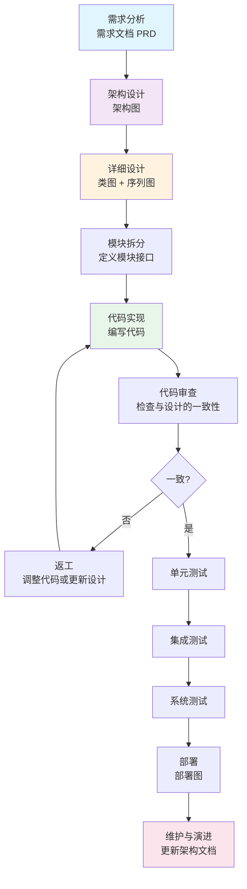

### 9.3 架构设计 Prompt 模板

#### 模板 1：从需求生成架构图

```
你是一位资深的软件架构师。请根据以下需求设计系统架构。

【系统需求】
- 功能：<列出核心功能>
- 用户量：<预期日活/月活>
- 性能要求：<响应时间、吞吐量>
- 可靠性：<可用性目标>
- 扩展性：<预期的扩展方向>

【输出要求】
1. 给出推荐的架构模式及理由
2. 绘制 Mermaid 架构图，包含：
   - 客户端层
   - API 网关层
   - 业务逻辑层（模块划分）
   - 数据层
   - 缓存与消息队列（如需要）
3. 说明关键设计决策
4. 列出潜在的风险与应对方案
```

#### 模板 2：从代码生成架构图

```
请分析以下代码结构，生成系统的类图和模块交互图：

【代码结构】
<粘贴目录树或类列表>

【输出要求】
1. 识别核心类与接口
2. 绘制类之间的继承、实现、依赖关系（类图）
3. 绘制模块间的调用关系
4. 指出是否违反了 SOLID 原则
5. 提出架构改进建议
```

---

## 十、学习路线与行动清单

### 10.1 学习阶段

**第 1 阶段：基础理论（1-2 周）**
- [ ] 理解架构设计的核心原则（SRP、DIP、关注点分离等）
- [ ] 掌握 5 种基本架构模式（分层、模块化、微服务、事件驱动、仓库）
- [ ] 学习基本图表（架构图、类图、流程图）绘制

**第 2 阶段：实战练习（2-4 周）**
- [ ] 为一个现有项目补充架构图
- [ ] 重构一个有问题的模块，用图表记录设计过程
- [ ] 分析 3 个开源项目的架构，总结经验

**第 3 阶段：设计能力（持续）**
- [ ] 参与团队的架构设计决策
- [ ] 建立团队的架构规范与图表库
- [ ] 定期进行架构审查与优化

### 10.2 行动清单

- [ ] **学习工具**
  - [ ] Mermaid 基础语法（Graph、Flowchart、Sequence、Class）
  - [ ] PlantUML 基础用法
  - [ ] 在 VSCode 或 IDE 中配置图表环境

- [ ] **绘制练习**
  - [ ] 为 3 个小项目设计分层架构
  - [ ] 绘制模块化架构案例
  - [ ] 设计一个微服务系统架构
  - [ ] 绘制事件驱动系统的架构与流程

- [ ] **文档完善**
  - [ ] 建立 `docs/architecture/` 目录
  - [ ] 编写架构设计文档（包含 3-5 张关键图表）
  - [ ] 创建架构决策记录（ADR）

- [ ] **团队规范**
  - [ ] 制定团队的图表规范
  - [ ] 建立架构审查 Checklist
  - [ ] 定期进行架构同步会议

---

## 十一、常见问题与答案

### Q1：什么时候应该选择微服务架构？

**A：** 当满足以下条件时考虑微服务：
- 团队规模足够大（能独立维护多个服务）
- 业务模块边界清晰，可独立演化
- 对扩展性和高可用性有明确需求
- 有足够的运维支撑（容器化、监控、日志聚合）

**反面情况**：小团队、简单业务、快速迭代初期不建议用微服务。

---

### Q2：如何避免架构腐烂？

**A：** 关键实践：
1. **定期代码审查**：检查代码是否遵守架构设计
2. **自动化检测**：用工具检测循环依赖、违反规则的导入
3. **文档同步**：设计文档与代码同步演进
4. **架构治理**：定期架构评审，权衡技术债

---

### Q3：如何在快速迭代中保持架构质量？

**A：** 平衡策略：
- 每个迭代预留 20-30% 时间进行重构与技术债偿还
- 用 Definition of Done 约束代码质量
- 建立自动化测试和 CI/CD，快速反馈
- 优先解决影响开发效率的问题

---

## 总结

本文档系统介绍了程序架构的核心概念、常见模式、设计决策与可视化方法，是一份通用的架构设计学习指南。

**关键收获**：
1. ✅ 理解架构设计的三个维度：结构、交互、演化
2. ✅ 掌握 6 种常见架构模式及其适用场景
3. ✅ 学会用图表清晰地表达架构设计
4. ✅ 建立架构思维，避免常见反模式
5. ✅ 建立实战工作流，从需求到代码

通过反复学习与实践，你将能够：
- 设计清晰、可维护的系统架构
- 有效沟通与协作
- 做出合理的技术决策
- 主动识别与解决架构问题
